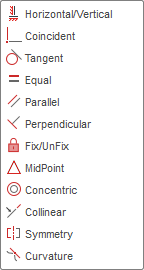
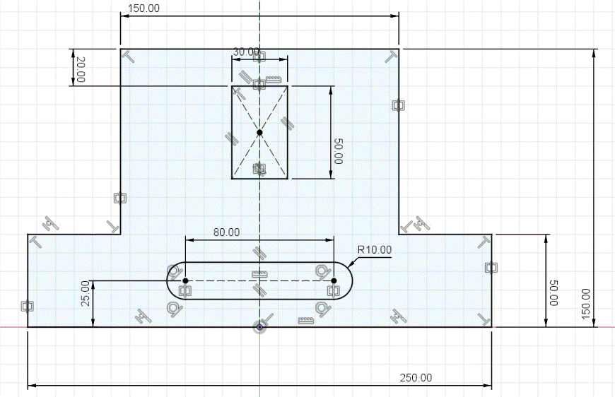

#2D constraints

Fusion360特色：

- 特徵編輯性，更接近**數學幾何**的邏輯
- 與AutoCAD和Rhino等不同，這些軟件用**座標系統**做編輯
- 例如：用AutoCAD/Rhino畫相切兩個圓的線，紀錄線段的頭尾兩點的座標，**但圓的尺寸和位置改變時，切線不會跟著變**
- 特徵編輯軟件紀錄線的幾何特性，例如相切，**即使圓的尺寸和座標變動，線段也會相切兩個圓**

[TOC]

##2D constraints(約束)

以下是fusion360的2D約束:

### Horizontal/Vertical(水準/垂直)

顧名思義就是將點選的物件保持水準或垂直，物件可以是直線或兩個點。

###Coincident(重合)

將兩個點約束在一起，或將點約束到曲線上。

### Tangent(相切)

將與圓形或弧形將接的線，移動到切於圓形或弧形的位置。

### Equal(相等)

- 使用equal約束調整兩條直線(或圓形、弧形)的長度或半徑大小，使之相等
- equal約束可以方便調整螺絲孔的大小
	- 例如：由M3螺絲轉成M2螺絲，只需改變一個參數即可

###Parallel(平行)

使所旗的線彼此互相平行。

### Perpendicular(垂直)

使所選的線互相垂直。

### Fix/Unfix(固定/取消固定)

將點、直線或曲線鎖定要固定點或位置，或鎖定其長度。

❗***<u>盡量避免使用這個功能</u>***

### MidPoint(中點)

約束兩條(或以上)線段的中點位置。

### Concentric(同心)

約束兩個圓形、橢圓或弧線的圓心在同一點上。

### Collinear(共線)

使兩條或以上的線段位於同一條線(或延伸線)上。

### Symmetry(對稱)

約束所選的圖元，使其在旗取的一條線兩邊互相對稱。

💡  此功能跟`mirror`功能是一樣的，分別在於這功能是所劃好兩邊的圖形再提定對稱

### Curvature(平滑)

約束一條曲線，使其與另一條曲線、直線、圓弧相接並保持連續性。

💡 *此功能適用於貝茲曲線*

## 練習

### 練習1

1. 首先跟據其大約外型, 用hotkey `L`, 劃出大約的型狀

2. 用`Horizontal/Vertical(水準/垂直)`或者`Perpendicular(垂直)`工具, 確保所有線都是垂直或水平的

3. 用`Collinear(共線)`工具, 將"腳"設定成同一水平

4. 用`Equal(相等)`工具將"腳"的寬度設定成相等

5. 用hotkey `D`, 設定左下角的水平線為`20`
6. 之後設定左下角的小垂直線為`25`高

7. 其他尺寸跟據下圖標示, 記得確認一下全部線都變成黑色

8. 用hotkey `C`劃兩個圓形
9. 用`Horizontal/Vertical(水準/垂直)`工具點選兩個圓心, 令圓形水平
10. 用`Equal(相等)`工具將兩個圓的尺寸設定成相等

11. 最後設定圓形的尺寸和位置

12. 最後，用`s`搜尋`extrude`，或者直接用hotkey `e`或者`q`來叫出擠出命令，擠出10mm厚。

### 練習2

1. 用hotkey `L`和用hotkey `S`搜尋`3 point arc`, 劃出大概形狀(可以用mouse右鍵招出快速指令重覆上一次的指令)

2. 之後用`L`劃一條中心線, 用hotkey `X`將其變成作圖線
3. 用`Tangent(相切)`工具令所有圓都相切(如果左手邊的圓跟我的不同, 未有相切, 都要選擇令其相切)

4. 用`Coincident(重合)`工具令右下的圓形圓心跟橫線重合
5. 用`Symmetry(對稱)`工具, 先分別點選要對稱物件, 最後點選對稱線, 令整個圖形完全對稱

6. 用hotkey `C`劃兩個圓形, 用`Concentric(同心)`工具令圓形跟左右兩隻"耳仔"同心(或者你可以一開始就點選兩隻耳仔的圓心作為圓心)
7. 用`Equal(相等)`工具將兩個圓形限制成同一尺寸

8. 最後就可以用hotkey `D`標示全部尺寸，確保每一條線都是黑色

9. 最後用`extrude`擠出`10mm`

	

### 練習3

1. 由於圖形是對稱的, 所以跟之前一樣, 以原點為起點, 大約劃一下圖形的外形

2. 如果有些線沒有水平/垂直, 可以用`Horizontal/Vertical(水準/垂直) `或`Perpendicular(垂直)`工具令其水平/垂直(我的圖除了最後一條線外都是水平/垂直的)
3. 最後一條線, 可以用`Perpendicular(垂直)`工具垂直最左手邊的垂直線或用`Horizontal/Vertical(水準/垂直) `工具強制其水平, 或像我的方法用`Collinear(共線)`工具
4. 劃一條穿過原點的中心線, 用hotkey `X`將其變成作圖線

5. 用`Symmetry(對稱)`工具令所有垂直線對稱
6. 用`Collinear(共線)`工具將水平線變成同一水平

7. 之後就可以用hotkey `D`標示全部尺寸, 今次部分尺寸要選點到點之間的距離標示

	

8. 之後用hotkey `S`搜尋`center rectangle`劃一個30x50的長方形, 長方形頂部距離最高點為20

9. 最後, 用`center to center slot`指令劃槽, 一般機械部件, 這種兩頭圓形中間長形的形狀稱為`slot`, 常見的機械部件軟件都會有這個指令
10. 之後就可以用對稱工具令slot對稱，最後標示尺寸

11. 接著就可以擠出`10mm`

### 練習4 

以下3題用到, `Tangent(相切)`限制, `3-point arc`, `line`, `circle`

###練習5

###練習6

### 練習7

以下3題用到 `Symmetry(對稱)`限制, `Tangent(相切)`限制, `center rectangle`, `3-point arc`, `line`, `circle`

### 練習8

首先全部用`center rectangle`去劃，再去擠出，不要刪掉本身的輔助線，否則所有關係就會切斷。

### 練習9

這一條可以在2d sketch就已經劃`R10`的四分一圓，或者擠出後再用`fillet`指令修圓角

### 練習10

以下幾題如有需要，可以先劃圓和線，不需要在2d sketch中做trim和fillet，在立體中做，可大幅減少錯誤

### 練習11

==不要在2D sketch中用fillet去修圓角，否則所有的黑線會變回藍線==

###練習12

==不要在2D sketch中用trim，否則黑色的關係線會掉失==

###練習13

- 你可以在2D sketch中用`3 point arc`來繪制4個弧去擠出
- 或者像我一樣，首先不理會4個弧，擠出後再用`fillet`去補。

###練習14

**Harder problem**. 這兩題在立體再fillet會容易後多。

###練習15

