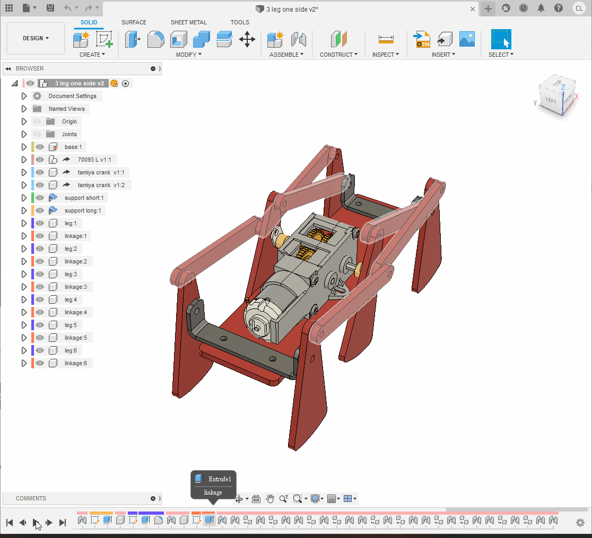
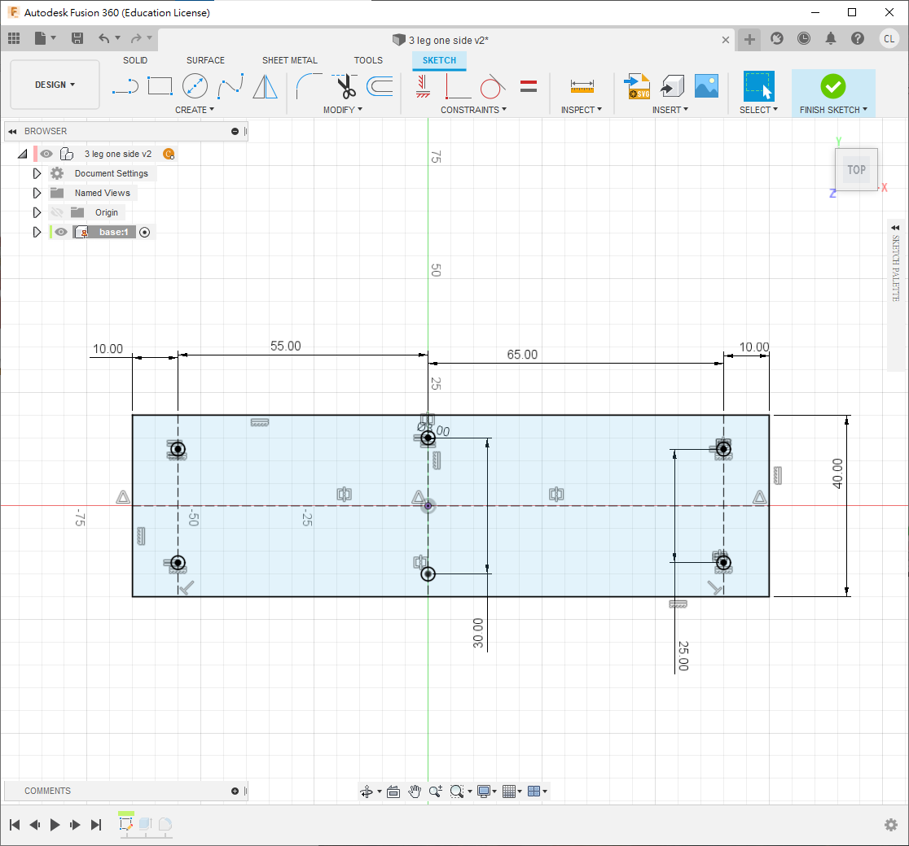
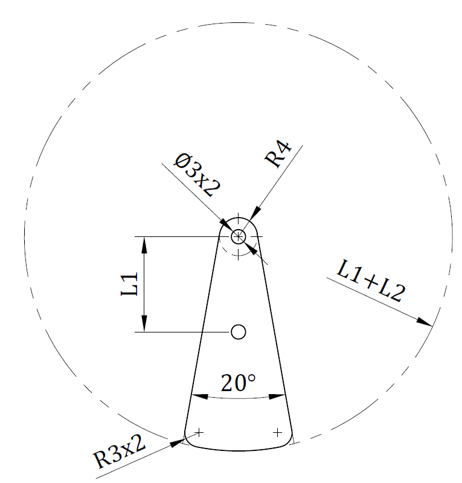

#6 legs walking linkage robot

今次繪製的，進階版的四足連杆機械人，目的是希望大家熟習做用fusion360的joint功能

<iframe width="50%" height="500" src="https://www.youtube.com/embed/tlfoqOfY8zQ" title="YouTube video player" frameborder="0" allow="accelerometer; autoplay; clipboard-write; encrypted-media; gyroscope; picture-in-picture" allowfullscreen></iframe>

##Step 1

1. 💡*首先開一個新檔, 只繪製一邊, 另一邊之後可以再開另一個檔, 用insert derive, 可避免分層後joint消失的問題*

##Step 2

1. 開一個新的component叫`base`
2. 記得小黑點按了進了activate
3. 開一個`new sketch`
4. 如圖尺寸繪製
5. 用`s`搜尋"`change parameter`， 開一個新的variable叫`thickness`，內容為3mm
6. 將sketch用`e`擠出thickness厚度, 之後四邊fillet 3mm

## Step 3

1. 下一步用"`insert derive`", derive一個70093 gearbox的step檔
2. 在70093按右鍵, 找到rigid group
3. 今次不是選擇全部, 按住ctrl鍵, 選擇除最長軸外的全部齒輪, 馬達與外殼
4. 剩下的長軸則用revolving joint, 組合到外殼中
5. 最後將長軸兩邊用`e`增長/縮短至距離外殼10.5mm(兩邊都是10.5mm)

## Step 4

1. 用`insert derive` derive一個tamiya crank的檔
2. 在曲柄表面上開一個new sketch, 尺寸如下圖
3. 用`e`將多餘部分刪走並fillet 3 mm
4. 用`j`將曲柄組合到齒輪箱,今次使用rigid joint, 並在最外層component複製貼上組合多一份如圖
5. 在component `base`按mouse右鍵, 選擇`ground`將其釘住
6. 測試一下兩個曲柄是否同時轉動

##Step 5

1. 開一個新的sheet metal component叫`support short`(或其他你喜歡的名字)
2. 在base的表面開一個新的sketch
3. 用`p`投影齒輪箱後方的孔投影, 並劃一條中線, 劃一個10mm寬的長方形如下圖
4. 到sheet metal頁面，找到`flange` icon, 或直接用`s`搜尋
5. 將長方形用`flange`變成2mm厚鋁板(如果事前沒有選擇材料為2mm鋁板, 可以搜尋`sheet metal rules`更改)

1. 繼續用`flange`將鋁板兩邊摺高16mm, 選用`outer faces`和`inside bend position`
2. 在摺高的鋁板開一個new sketch, 劃一個3mm圓, 高度與齒輪箱的軸齊高
3. 用`e`將兩邊穿孔
4. 最後fillet 4個角(2mm或3mm皆可)

## Step 6

1. 下一步, 開另一個新的sheet metal component叫`support long`
2. 在`base`的表面開一個new sketch
3. 這次的長方形要加長8mm, 寬一樣是10mm
4. 跟著與step 5一樣, 用flange將長方形變成2mm厚鋁板
5. 鋁板兩邊摺高16mm
6. 在摺高的鋁板上繪畫一個3mm孔, 與齒輪箱的軸同高
7. 兩邊穿孔再將4角fillet 3mm

## Step 7

1. 用`s`搜尋"`change parameter`", 開幾個新的variable如圖
2. 在最上層開一個新的standard component叫`leg`
3. 暫時隱藏其他component, 在xz平面(或者你機械人的側面)開一個new sketch
4. 跟據下圖尺寸繪劃
5. 之後用`e`擠出`thickness`的厚度, 腳的角位用`f` fillet 3mm

## Step 8

1. 將小黑點褪回最上層, 將其他隱藏的component重新顯示出來
2. 用"j"將腳joint到曲柄的第2個孔
3. offset z為1mm
4. 選用revolve joint

> 💡今次不用像上次的walking linkage robot一樣開一個component去裝起全部的腳和連杆, 因為今次想做到
>
> 1. 左右對稱, 左右都會動
> 2. 之後另一邊會再derive去一個新的檔案, 所有joint會自動複製
> 3. 想大家做多幾次joint去熟習
>

1. 小黑點褪回最上層, 開一個new component
2. 在xz平面(或機械人的側面)開一個new sketch
3. 跟據下圖, 繪,劃一條linkage並用"e"擠出`thickness`厚度

1. 將linkage的一邊用"j" 組合到腳的後方
2. 間距為1mm
3. 類型選用revolve joint

1. 接著將linkage的另一邊組合到鋁架的孔上
2. 今次不用offset也可以
3. 因為會選用cylindrical joint

> 💡記著四連杆組合的秘決為: 3個joints 中, 2個revolve joints 1個cylindrical joint, 次序可以隨意, 這樣就不用計算offset的距離和thickness的厚度
>

## Step 9

1. 確保小黑點退回最上層, 將leg和linkage複製一份, 依貼上面2個revolve joints + 1個cylindrical joint的做法, 將其組合成兩足連杆
2. 記得每個連杆和腳之間要間隔1mm
3. 嘗試一下轉動腳, 看看是否能模擬連杆行動
4. 如果有"反臂"的情況如下圖, 貼可以用joint limit來解決(見下)

### "反臂"解決方法:

1. 由於較難用文字去描述, 我直接用影片去示範
2. 值得注意, 影片中的角度不一定是絕對, 視乎你joint的時候零件先後可能會不同, 可以將joint顯示出來, 先觀察一下轉動時它的範圍

<iframe width=50% height="500" src="https://www.youtube.com/embed/tlfoqOfY8zQ?start=1265" title="YouTube video player" frameborder="0" allow="accelerometer; autoplay; clipboard-write; encrypted-media; gyroscope; picture-in-picture" allowfullscreen></iframe>

## Step 10

1. 跟著的步驟都是重覆上述

> 💡記著四連杆組合的秘決為: 3個joints 中, 2個revolve joints 1個cylindrical joint, 次序可以隨意, 這樣就不用計算offset的距離和thickness的厚度
>

## Step 11

1. 接著是做另外半邊的腳
2. 之前已說過, 由於今次希望大家熟習用joint, 又因為要力求對稱, 所以今次要求大家右半邊都要joint一次'
3. 跟之前一樣, 如果出現"反臂"的情況. 可以先將歷史褪行一步, 先調整一下joint的角度, 又或者直接用joint limits
4. 完成後可以儲存

## Step 12

1. 開一個新的檔案, 名字可以隨意, 或跟隨用我的檔名都可以
2. 用"insert derive" derive之前所劃的半邊機械人的檔案
3. 將"base"先ground
4. 這時你會發現所有的joint都會保留下來
5. 將整個derive複製多一份, 用rigid joint將底板組合, 相距水平40mm
(如果真正製作機械人, 則需要加膠板或鋁板將其連接)

<h2>完成!!!!!!</h2>
