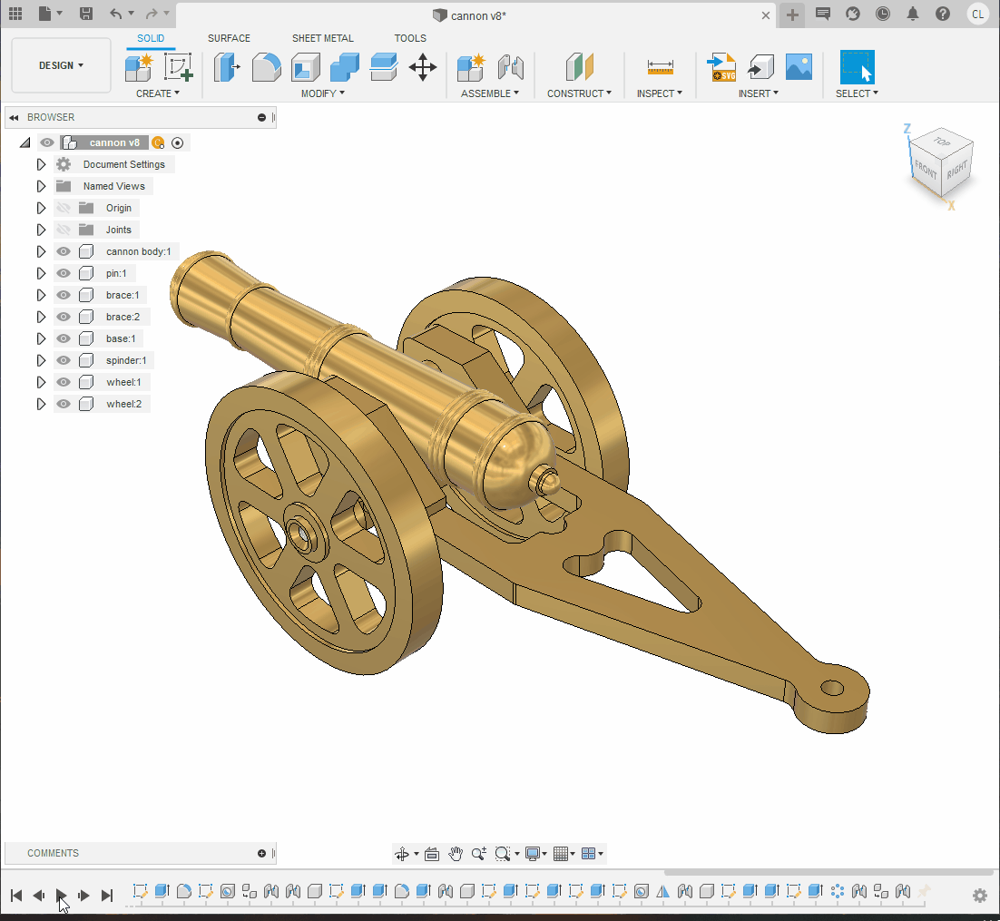
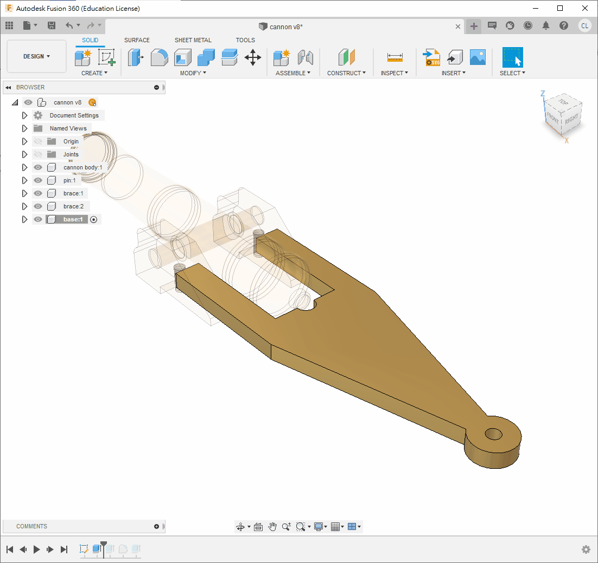

# Brass Canon

本節要繪製的是傳統的大炮，雖然由於課程時間和機器限制，無法像以往一樣使用車床和銑床製作此大炮。但我們將教大家如何繪製此大炮，不僅是為了傳承這種情懷，同時也讓同學們日後能夠運用 CNC 機器製作此大炮。

**[brass cannon Drawing v52.pdf](brass_cannon_Drawing_v52.pdf)**

<iframe width=50% height="500" src="https://www.youtube.com/embed/Udv2dhx0yJI" title="YouTube video player" frameborder="0" allow="accelerometer; autoplay; clipboard-write; encrypted-media; gyroscope; picture-in-picture" allowfullscreen></iframe>

## Step 1

- 首先在首頁利用指令`new component`開一個新的組件，名為 `cannon body`

- 確保啟用此 component，**<u>小黑點在旁邊</u>**
- 用指令`new sketch`開啟一個新的草圖，根據圖形前半部分繪製三個長方形和一個圓形
- 使用快捷鍵`s` 搜尋 `Change Parameter`，創建一個新的變數，名為 `stepSize`，內容為 `1.5mm`，以便後續修改
- 使用快捷鍵`s` 搜尋 `Revolve`，**選擇上半部分**，使用 X 軸旋轉 360 度

❗ **<u>Fusion 360 等特徵編輯軟件並不擅長處理 2D 圖形。如果同一個 2D 圖形內容太多，關係式太多，因尺寸和關係互相依賴，會令電腦極慢甚至死機。</u>**

💡 *你也可以不完全按照我的步驟，一次性繪製多個圖形，但請記得不要太多。*

  

 

- 下一步，進入 `cannon body`"這個 component，用指令`new sketch`開啟一個新的草圖
- 使用 快捷鍵`P` 投影之前的 body 到此草圖中，根據圖形尺寸繼續繪製
- 使用 `Revolve`，選擇 X 軸旋轉 360 度

 

- 使用快捷鍵`s` 搜尋 `Change Parameter`，創建一個新的變數，名為 `cannonBodyHole`，內容為 8mm

 
 

- 繼續根據 PDF 的尺寸繪製。
- 弧可以使用指令 `3 Point Arc` 來繪製，只需要指定起始點、終點和半徑即可

 

 

## Step 2

- 開啟一個新的 component，名為 `pin`，並確保啟用此 component(**<u>小黑點在旁邊</u>**)
- 用指令`new sketch`開啟一個新的草圖
	- 按一下前一個component`cannon body`旁的三角形
	- 按一下`sketch`旁的眼睛圖示，將隱藏的草圖顯示出來
	- 按一下`body`旁的眼睛圖示，將大炮暫時隱藏起來
	- 使用快捷鍵 `P` 投影之前大炮身草圖的圓，如下圖3所示
	- **<u>*記得要投影原始的草圖，投影 body 的話是沒有中心點的*</u>**
- 用`change parameter`創建一個新的參數，名為 `baseWidth`，內容為 `21mm`
- 使用快捷鍵 `e` 擠出，**`direction`選擇`symmetric`**，長度為 `baseWidth`

- 用`change parameter`創建一個新的參數，名為 `braceHole`，內容為 `6mm`
- 在圓形的一側開啟一個新的草圖，繪製一個圓形
- 用快捷鍵`e`擠出長度 `8.5mm`
- 使用鏡像功能(`mirror`)鏡像剛才擠出的特徵，鏡像平面為世界 XZ 平面，見下圖3。
- 最後，使用快捷鍵`j`聯接將 `pin`和 `cannon body`組合起來，類形使用`revoling joint`

## Step 3

- 用快捷鍵`s`搜尋`new component`開啟一個新的component，名為 `brace`
- 確**<u>保小黑點在旁邊</u>**已經啟用此 component
- 在 `pin` 的最邊緣，用快捷鍵`s`搜尋`new sketch`開啟一個新的草圖，見下圖
- 投影圓形，並根據圖則繪製整個固定架

- 使用快捷鍵`e` 擠出 `8mm`
- 使用快捷鍵`f`  修整圓角
- 在底部根據圖則繪製一個點，距離邊緣 20mm，見下圖2
- 使用快捷鍵`s`搜尋 `Hole`，根據圖則選擇孔的類型為非沉孔，孔的螺紋為有螺紋，其他選項見下圖3
- 孔的深度和直徑在 Fusion 360 中也是十分清楚地標明的，選擇深度為 8mm，寬度為 M4 螺絲，如下圖3

- 之後就可以**<u>將小黑點移回到最上層</u>**，用`Ctrl+C`/`Ctrl+V`複製貼上多一個 `brace`
- 使用快捷鍵`j`將其與 `pin` 進行聯接，在`motion`頁面選擇`revolving joint`
	- `Brace`的厚度為8mm，而`pin`凸出為8.5mm，故有0.5mm凸出來是正常的

## Step 4

- 下一步是繪製大炮的底座
- **<u>將小黑點移回到最上層</u>**，開啟一個新的 component，名為 `base`
- **<u>確保小黑點在`base`旁</u>**，在 XY 平面或者 `brace`component 的底部添加一個新草圖，見下圖2
- 根據圖則繪製，圓角可以暫時不用劃，但因為中間的半徑為 4.5mm 的圓與上下偏移 8mm 的線形成不到單一直線，不能使用`fillet`功能，因此需要在 2D 草圖中使用 TTR 完成，見圖2

- 跟著依次擠出和修圓便完成了
- 完成後，使用快捷鍵`j`將底座和其中一個 `brace`"進行聯接，`motion`頁面使用`rigid joint`

## Step 5

- **<u>將小黑點移回到最上層</u>**，用快捷鍵`s`開啟一個新的 component，名為 `spinder`
- 在 XY 平面或者 `base` component 的底部添加一個新草圖
- 快捷鍵`p`投影兩個 `4mm `孔，並繪製一個對稱的 `40mm x 7.8mm` 方形，如下圖1所示
- 使用對稱擠出` 7.8mm`，如下圖3
	- 如果使用對稱方式，之後繪製旁邊的圓形會較容易
- 之後就可以繪製和擠出 `12.5mm` 和 `7.8mm` 的圓形，如下圖4和5

- 快捷鍵`s`搜尋 `new sketch` 指令，在最外的平面開啟一個新草圖
- 只需要投影或者繪製一個點就可以，如圖2所示
- 用快捷鍵`s`搜尋 `Hole` 指令，增加一個沉孔螺紋的鑽孔，如圖3所示
- 將幾個擠出和鑽孔特徵使用鏡像功能鏡像，鏡像面為世界 XZ 平面，如圖4所示
- 完成後，就可以使用快捷鍵`j`連接到之前繪製的零件上，如下圖5
	- `motion`頁面使用`rigid joint`

## Step 6

- **<u>將小黑點移回到最上層</u>**，開啟一個新的 component，名為 `wheel`。
- **<u>確保小黑點在這個 `wheel` 的 component旁</u>**
- 開啟一個新的草圖，並投影 `spinder` component 的中點，如圖2
- 在中點上繪製 `8mm`、`13mm`、`54mm `和 `64mm `四個圓形
	- 不*要直接投影 `spinder`"的圓形，因為它的尺寸是 `7.8mm `而不是 `8mm`*

- 如 PDF 圖則所示，擠出 `8mm `和 `6mm`
	- *在擠出時，`direction`選擇`Symmetric`，如下圖1、圖2所示，方便之後操作*

- 如 PDF 圖則所示，在輪子上繪製單一份的挖孔，如圖1
- 擠出之後，就可以使用快捷鍵`s`搜尋指令`Circular Pattern`進行旋轉陣列，如圖2

- 後一個步驟是將輪子複製貼上，並使用指令`joint`組合在一起
	- `motion`使用`revolving joint` 

<h2>完成!!!!!</h2>

