# Introduction of CNC

CNC代表計算機數控（Computer Numerical Control），它是一種自動化技術，用於控制機械工具和機器的操作。CNC技術通過使用電腦程序和數字指令，使機械工具能夠自動執行特定的操作和運動。這些指令告訴機械工具如何移動、切削和加工工件。

在CNC系統中，操作者使用電腦軟件來編寫和編程指令，然後將這些指令上傳到CNC機床。機床根據指令自動控制刀具的運動、轉速和進給速度(Feed Rate)，從而實現高精度和高效率的加工操作。

CNC技術廣泛應用於製造業，特別是在數控機床領域。它可以用於製造各種零件和產品，如金屬零件、塑料零件、木材零件等。CNC技術的優勢包括高精度、重複性好、生產效率高以及能夠實現複雜形狀和結構的加工。

CNC技術的應用還延伸到其他領域，如3D打印、雷射切割、電火花加工等。它在現代製造業中扮演著重要的角色，幫助企業提高生產效率和產品質量。

[toc]

## 1. 製造方法

工業製造方法分為加法製造和減法製造。加法製造是逐層堆積材料建立物體的方法，常見於3D打印技術；減法製造是通過切削、鏟除或移除材料來形成所需形狀的方法，例如銑削、車削等。兩者各有優點和適用場景。

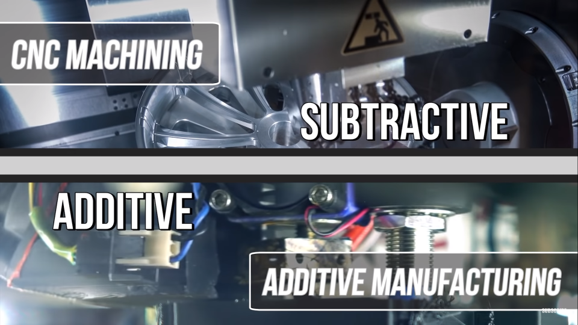

### 2D: CNC 線切割機

CNC線切割機是一種使用電腦數控技術的機械設備，通過控制金屬線的運動進行高精度的切割和加工。它使用電火花來融化工件，並藉助線的運動進行切割。CNC線切割機適用於金屬加工、模具製造等領域，能夠實現複雜形狀和高精度的切割操作。它具有高效率、重複性好和優秀的表面質量。

CNC線切割機的好處是可以切割很厚的金屬，沒有厚度限制；壞處是只能切割外圈，如果要切割內圈的話，就需要先為工件鑽孔，斷開金屬切割線再穿上。

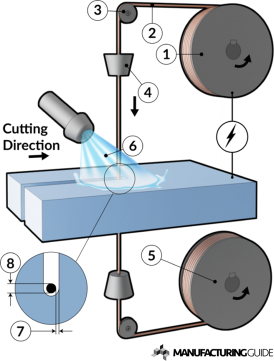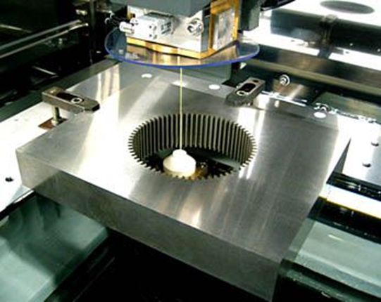

### 2D: CNC 車床

CNC車床，也被稱為數控車床，是一種使用電腦控制的車床。它是一種集機械、電氣、液壓、氣動、微電子和信息等多項技術為一體的機電一體化產品。在CNC車床加工的過程中，加工刀具會固定在車床上面，高速旋轉來削減原料，直到完成加工。

CNC車床主要是兩軸控制，通常是X和Z軸，專門用來製作軸、套、盤類的零件。由於它只能控制兩個方向的運動，所以它的加工範圍相對有限。對於更複雜的3D零件，可能需要使用更複雜的CNC機器，如CNC銑床或CNC加工中心。

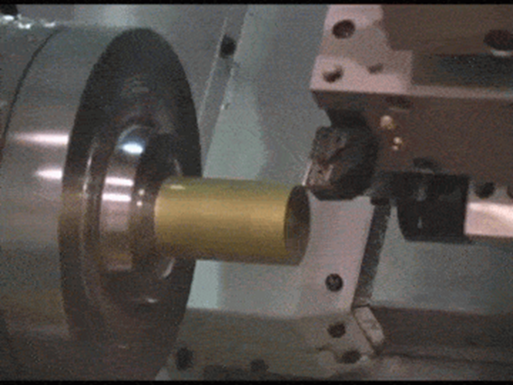

### 2.5D: water jet水切割

水切割使用高壓水流混和沙粒來進行材料切割。水切割是一種冷切割過程，幾乎消除了二次加工，並提供了平滑的邊緣質量。其主要優點是能切割所有類型的材料，包括金屬、玻璃、石材、塑料等。

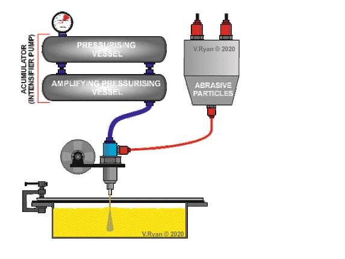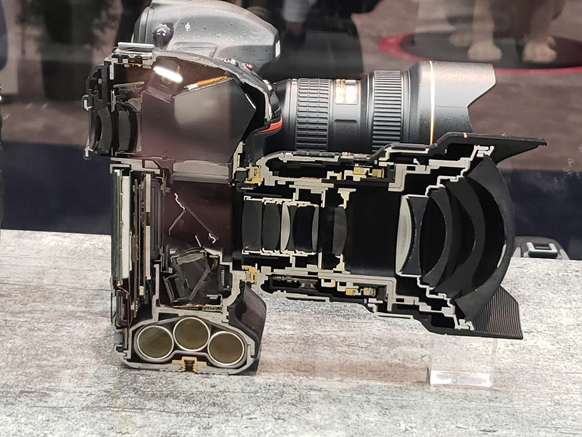

### 2.5D: laser cutting 鐳射切割機

對於鐳射切割機，同學應該不陌生。鐳射切割機跟水切割有點像，都是控制鐳射頭的XY方向移動來切割。鐳射束可以精確地切割各種材料，包括金屬、塑料、玻璃等。CNC鐳射切割機的主要優點包括高精度、高速度、無材料污染和無限的2D複雜性。

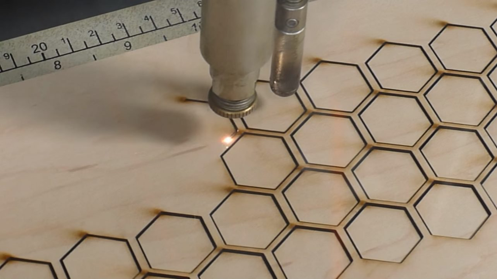

鐳射切割機的鐳射核心，主要分為玻璃管、金屬管和晶體管。

1. **玻璃管和金屬管**：這兩種類型的鐳射管都使用二氧化碳作為鐳射介質，並且通常用於CO2鐳射切割機。他們的主要區別在於壽命和切割效果。一般來說，金屬管的壽命較長，切割效果也較好，但價格較高。
2. **晶體管**：晶體管鐳射切割機的鐳射核心體積較小，可以直接放在XY軸上帶動，不需要反射鏡。這使得它們在某些應用中具有優勢，例如在需要高精度和高速度的應用中。然而，由於它們的功率較低，所以他們可能不適合所有的切割應用。

### 2.5D: Vinyl Cutter割字機

Vinyl切割機是一種由電腦控制的切割設備，它使用一個刀片從塑膠片（例如自黏塑膠）中切割出形狀和字母。這種設備在製作廣告、標誌、T恤印花等領域中非常常見。

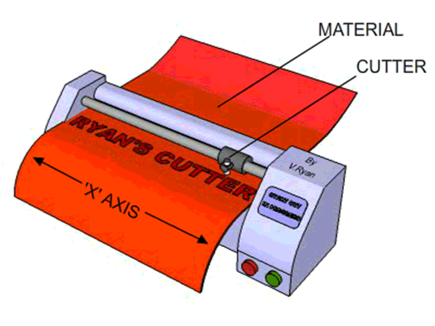

### 3D、4D、5D: CNC銑床

三軸CNC銑床：這種銑床有三個運動軸，通常是X、Y和Z軸。這意味著刀具可以在三個方向（前後、左右和上下）上移動，從而在三個空間維度中創造複雜的形狀。

四軸CNC銑床：這種銑床在3D的基礎上增加了一個旋轉軸，通常是A軸。這使得刀具可以在四個方向（前後、左右、上下和旋轉）上移動，從而創造更複雜的形狀。

五軸CNC銑床：這種銑床在4D的基礎上增加了第二個旋轉軸，通常是B軸。這使得刀具可以在五個方向（前後、左右、上下和兩個旋轉軸）上移動，從而創造最複雜的形狀。

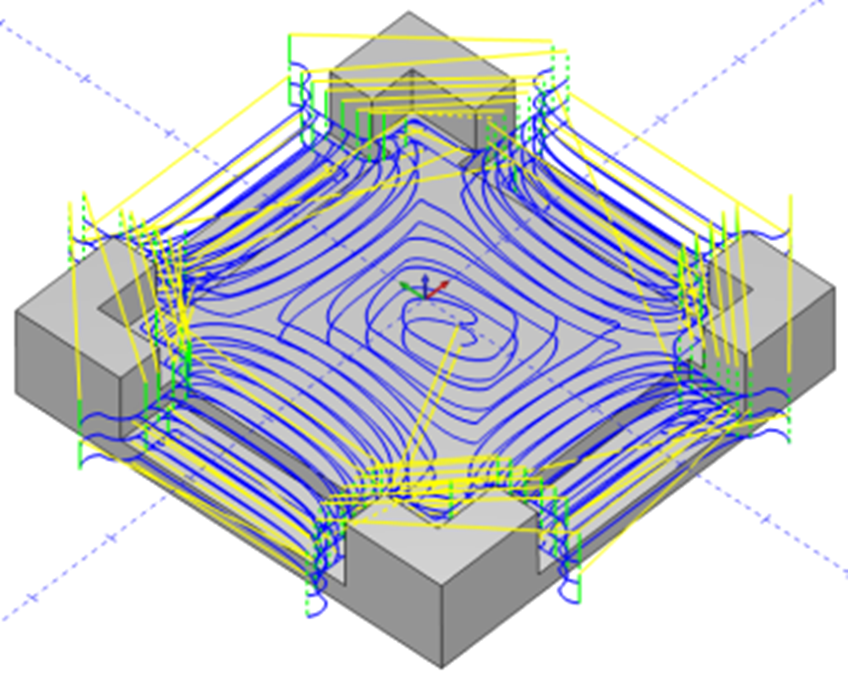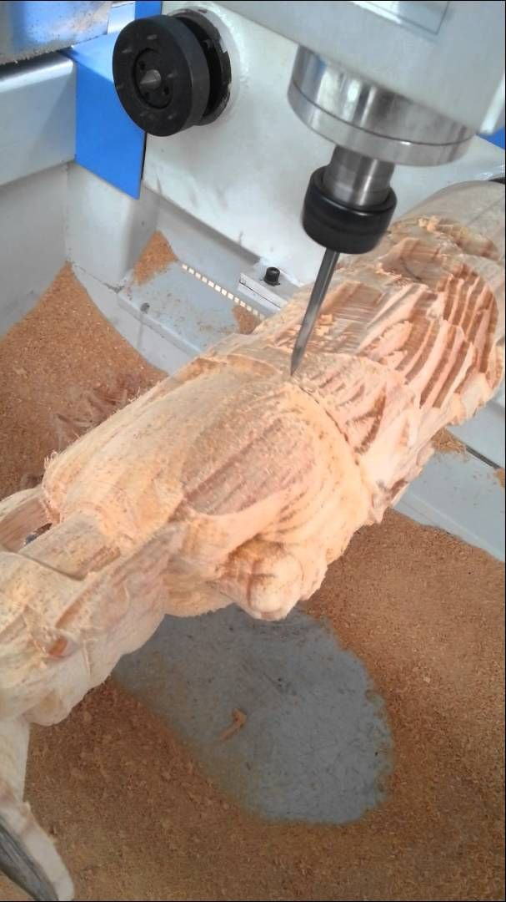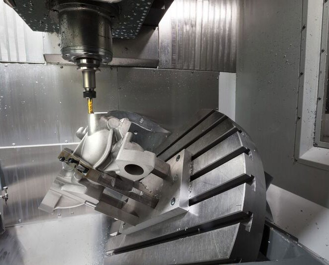

## 2. G-code

G-code，也被稱為RS-274，是最廣泛使用的電腦數字控制（CNC）和3D列印編程語言。它主要用於電腦輔助製造，以控制自動化機床，以及3D列印切片應用。"G"代表幾何。G-code有許多變體。

G-code命令和參數用於控制您的3D打印機或CNC機床。例如，G0-G1用於線性移動，G2-G3用於弧形或圓形移動，G10用於回縮，G29用於床平衡，M0-M1用於無條件停止，M3用於主軸順時針/雷射開啟，M4用於主軸逆時針/雷射開啟，M5用於主軸/雷射關閉等。

例如以下為一段G-code：

```GCODE
%   (開始程序)
O0001 (程序號碼)
T1 M06 (選擇工具1並進行刀具更換)
G90 G00 X0 Y0 Z0 (設定絕對座標系統並將刀具移動到原點)
S1000 M03 (設定主軸轉速(Spindle Speed)為1000 RPM並開始順時針旋轉)
G01 Z-1 F100 (以100mm/min的進給速度(Feed Rate)將刀具沿Z軸向下移動1mm)
X20 (將刀具沿X軸移動到20mm的位置)
Y20 (將刀具沿Y軸移動到20mm的位置)
Z0 (將刀具沿Z軸移動到0mm的位置)
M05 (停止主軸旋轉)
M30 (程序結束)
%   (結束程序)
```

這個G-code程序將會創造一個`」`的形狀。首先，刀具從原點$(0,0)$開始，然後向下移動1mm（Z=-1）。接著，刀具沿X軸移動到20mm的位置（X=20）$(20,0)$，然後沿Y軸移動到20mm的位置（Y=20）$(20,20)$。最後，刀具沿Z軸移動回到0mm的位置（Z=0）。所以，這個G-code程序將會創造一個底邊和高為20mm，沒有斜邊的直角三角形。


##3. 主軸轉速(Spindle Speed)、進給(Feed)與刀具(Cutting tools)

### 3.1 主軸轉速(Spindle Speed)

主軸速度(Spindle Speed)是切割工具的旋轉速度，通常以每分鐘轉數（RPM）來衡量。

主軸速度決定了切割工具的切割邊緣與工件接觸的速度，以及施加在材料上的力量。

###3.2 進給速度(Feed Rate)

進給速度(Feed Rate)是刀具相對於工件的移動速度。進給速度(Feed Rate)通常以每分鐘的英寸（IPM）或每分鐘的毫米（mm/min）來表示。

#### 主軸轉速(Spindle Speed) vs. 進給速度(Feed Rate)

|                           | 優點                                                   | 缺點                                                   |
| ------------------------- | ------------------------------------------------------ | ------------------------------------------------------ |
| 高主軸轉速(Spindle Speed) | - 每分鐘切割更多<br />- 速度更快                       | - 振動和噪音更多<br />- 可能影響精度和表面質量         |
| 低主軸轉速(Spindle Speed) | - 減少振動和噪音<br />- 可以提高精度和表面質量         | - 每分鐘切割較少<br />- 速度較慢                       |
| 高進給速度(Feed Rate)     | - 材料去除速度更快                                     | - 產生更多的熱和摩擦<br />- 可能降低工具壽命和表面質量 |
| 低進給速度(Feed Rate)     | - 產生較少的熱和摩擦<br />- 可以提高工具壽命和表面質量 | - 材料去除速度較慢                                     |

#### 材料特性

最適的進給速度和主軸速度取決於工件和刀具的材料特性。不同的材料有不同的硬度、強度、延展性和熱傳導性，這些會影響它們對切割力和熱量的反應。

| 材料     | 例子       | 主軸轉速(Spindle Speed) | 進給速度(Feed Rate) |
| -------- | ---------- | ----------------------- | ------------------- |
| 硬質材料 | 金屬       | 高                      | 低                  |
| 軟質材料 | 木材、塑膠 | 低                      | 高                  |

#### 刀具特性

| 刀具直徑 | 主軸轉速(Spindle Speed) | 進給速度(Feed Rate) |
| -------- | ----------------------- | ------------------- |
| 細直徑   | 高                      | 低                  |
| 大直徑   | 低                      | 高                  |

### 3.3 銑刀

#### 刀刃(Tool Flute)

刀刃(Tool Flute )設計決定了你可以切割哪些材料。最常見的選擇是2、3或4刀刃(**Tool Flute** )。

一般來說，刀刃(**Tool Flute** )越少意味著更好的切屑，但是表面粗糙度會變差刀刃(**Tool Flute** )越多可以得到更好的表面粗糙度，但是切屑會變差。

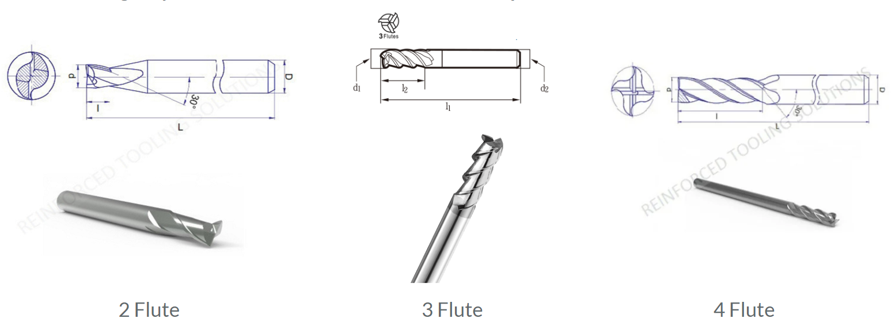

####  球頭銑刀(Ball end)與平頭銑刀(Flat end tool)

球頭銑刀有半球形的刀尖，用於鑽淺孔或製作模具的多維度輪廓。平頭銑刀則有平底，適用於需要全刀刃接觸的情況，如鑽半孔。選擇球頭還是平頭銑刀，取決於具體需求。

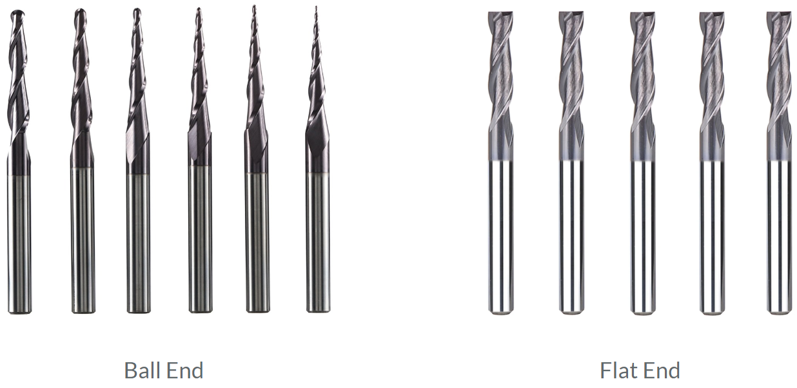

#### 雕刻刀

CNC雕刻刀具的角度、直徑和尖頭直徑是根據加工需求和材料類型來選擇的：

1. **刀具角度**：市面上常用的雕刻刀的刀角為30度、45度、60度等3種。

2. **刀具直徑**：CNC雕刻加工的刀具直徑為0.2-3毫米。

3. **尖頭直徑**：平底尖刀是一種常見的CNC雕刻刀具，其尖頭直徑為0.1毫米。

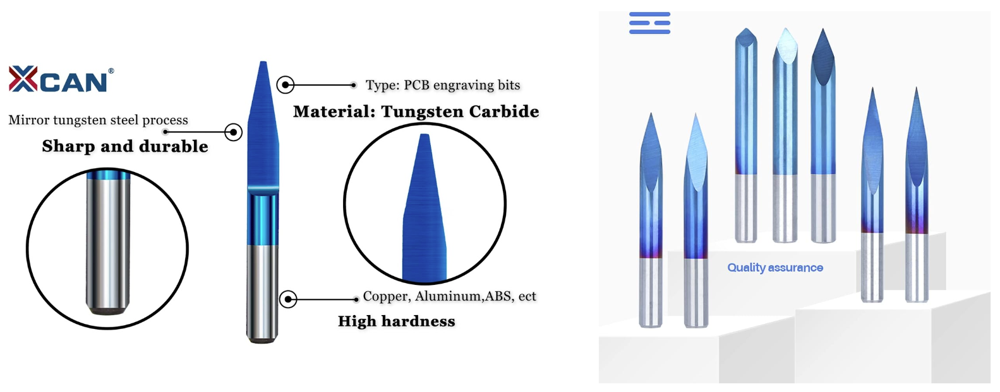

### 3.4 表面粗糙度(Surface Finish)和尺寸精度(Dimensional accuracy)

這些因素對CNC機械加工部件的表面粗糙度(Surface Finish)和尺寸精度(Dimensional accuracy)有很大影響：

1. **進給速度和主軸轉速(Feed rate and spindle speed)**：這兩者決定了刀具每次過刀去除的材料量。進給速度或主軸轉速越高，去除的材料量越多，但可能導致表面粗糙度增加。
2. **刀具磨損(Tool wear)**：刀具使用時間越長，磨損越嚴重，這可能會導致表面粗糙度增加和尺寸精度降低。
3. **冷卻液(Coolant)**：冷卻液可以降低刀具和工件的溫度，減少磨損，從而改善表面粗糙度和尺寸精度。
4. **夾具(Clamping)**：如果工件沒有被正確地固定，則可能會在加工過程中移動，這會導致尺寸精度降低。
5. **機床剛性(Machine Rigidity)**：機床剛性越好，振動越小，這有助於提高表面粗糙度和尺寸精度。

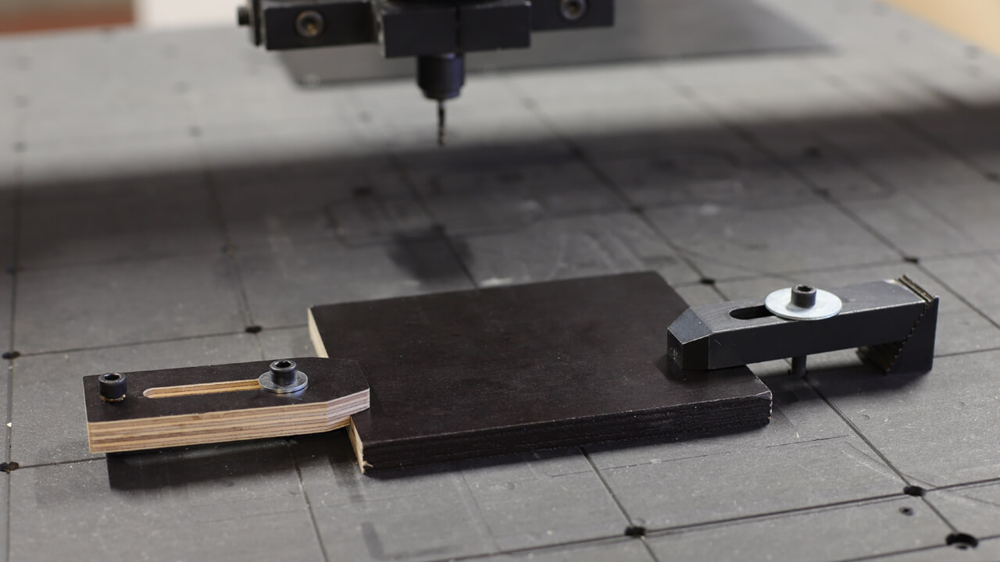

## 4. CAD & CAM

### 4.1 甚麼是CAM?

CAM，全稱為**電腦輔助製造 (Computer-aided Manufacturing)**，是一種利用**電腦**來進行生產設備管理**控制和操作**的過程。CAM軟體可以為各種CNC機床生成程序，如銑削和車削機床，也適用於3D打印機器。

在CAM軟體中，我們需要針對實際的加工參數進行設置。例如，在3D打印上，就有溫度、速度、層厚、填充、壁厚等等非常多的參數設置。CAM軟體會讀取CAD軟體所設計的模型，然後生成刀具加工時的運動軌跡訊息，也就是所謂的***刀路***。這些刀路訊息會被轉換成G代碼（G-code），然後由CNC機床進行讀取和執行。

CAM是一個與加工工藝參數密切相關的部分，它將設計師的設計想法轉化為機床可以理解和執行的指令，從而實現從設計到製造的過程。

### 4.2 CAM與CAD有甚麼關係?

CAD和CAM之間是相輔相成的，它們一般一起使用，**用CAD設計，然後利用CAM進行製造加工**。CAD創建的設計，可以通過數據交換，將數據以非常方便的方式輸入CAM軟體系統，從而進行加工。

### 4.3 CAM軟件的角色

平常我們在CAD軟件中劃好立體圖，再匯出為STL檔，放到PrusaSlicer中切片輸出，放到3D打印機中打印，這個過程中，PrusaSlicer其實就是CAM軟件。

但正如3D打印需要考慮打印的方向、支撐結構、層厚和材料等因素，利用CAM軟件輸出CNC的G代碼（G-code）時，也要考慮刀具樣式、直徑、刀具路徑、過程先後、切割深度和進給速度等因素，有時生產複雜的幾何形狀和零件，甚至需要用到4軸和5軸的加工能力。CNC發展得比較早，早期這些CAM軟件沒有開源社區支持，大多為付費軟件，而且價錢不菲，這對於許多小型企業和個人用戶來說，可能是一個相當大的投資。

現在，隨著開源社區的發展，有越來越多的免費或低成本的CAM軟件可供選擇，這對於CNC加工行業的發展是一個好消息。
