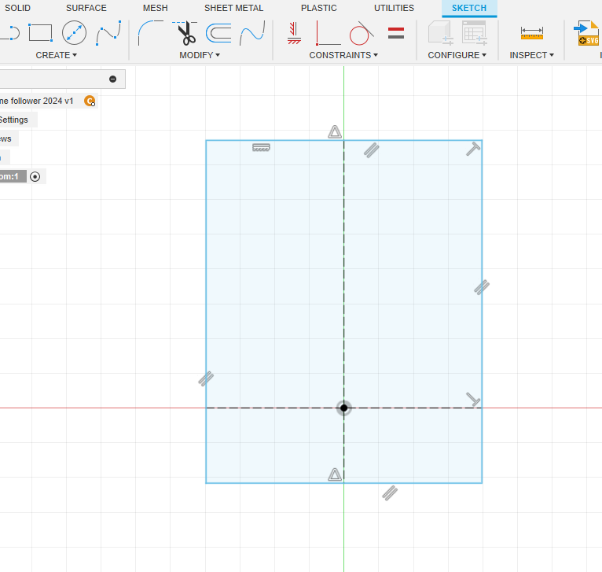

# Line Following Robot CAD

[TOC]

## Step 1: 準備工作/檔案

- 下載本次所用到的零件zip檔
- ***解壓縮***
- 於Fusion左邊欄點擊`upload`鍵
- 將解壓後的檔案拖動到`Drag and Drop Here`，或按`Select Files`找到路徑上傳

## Step 2: 建立小車底盤

### 繪製底盤

- 開始一個新的設計
- 開一個new component
- 名字叫`bottom`

- 確保小黑點在bottom這個component旁邊
- 開一個`new sketch`

- 用快捷鍵`s`，搜尋`change parameter`

	- 分別新增4個變數`robotWidth`，`sensor_distance`，`sensor_width`，`thickness`，如圖所示

		

	