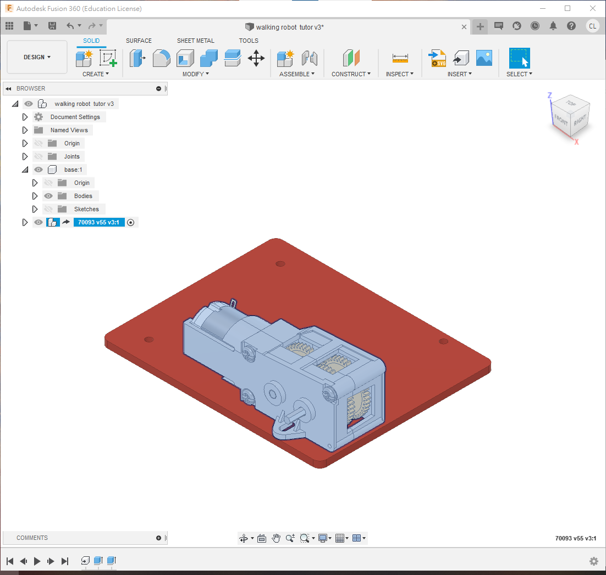
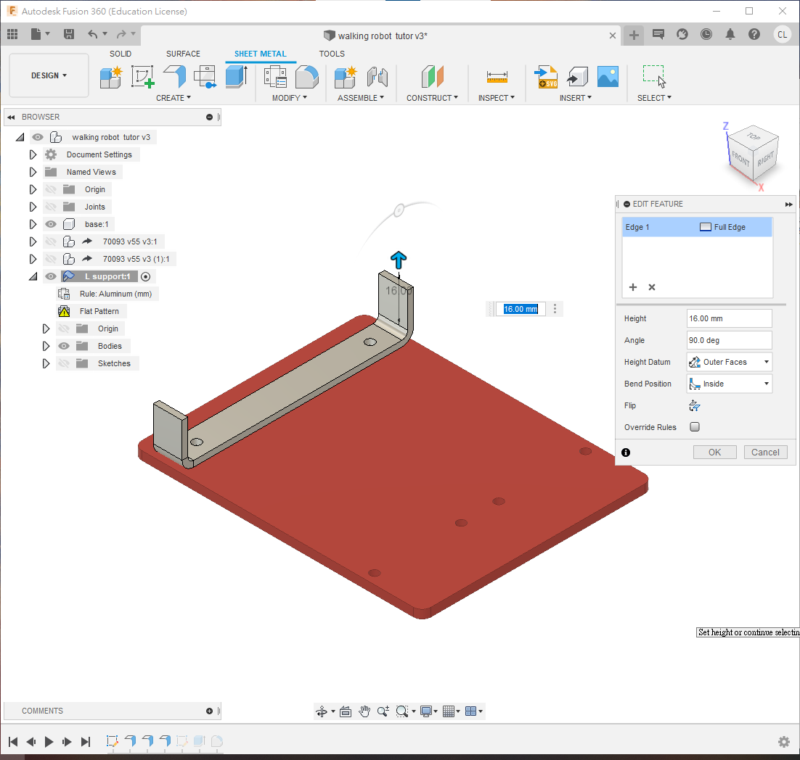
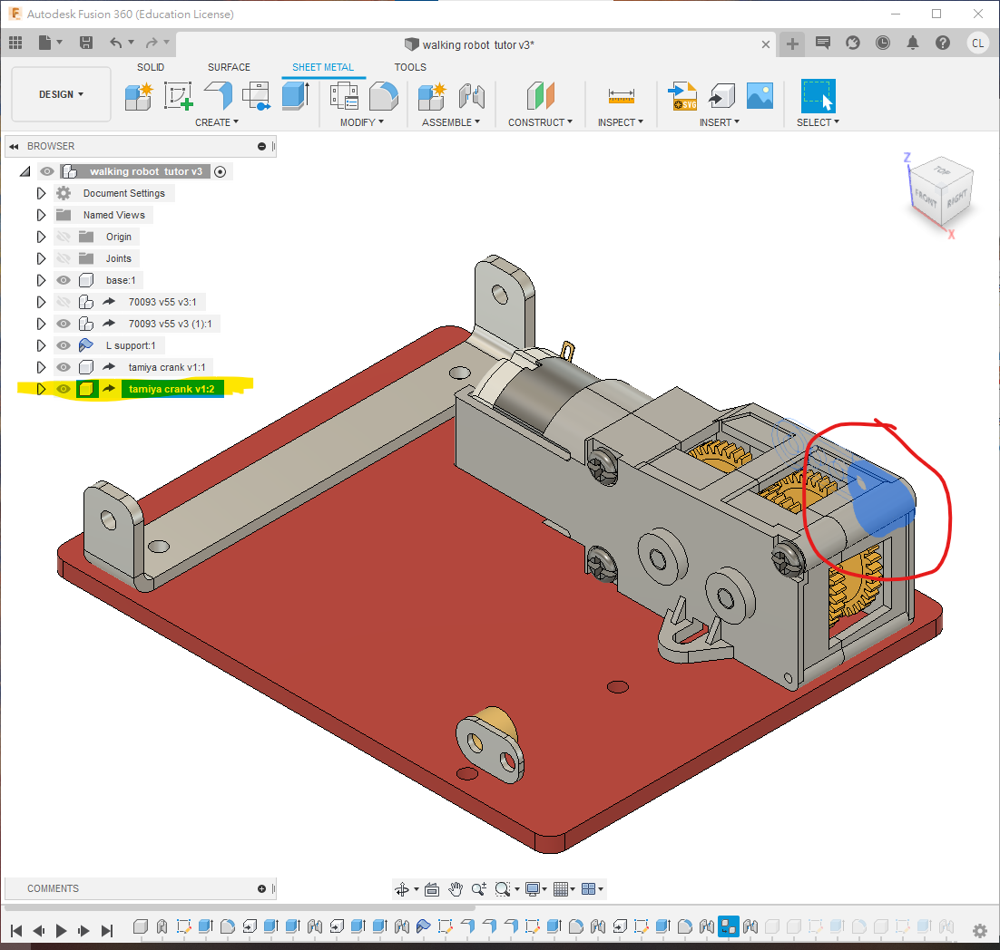
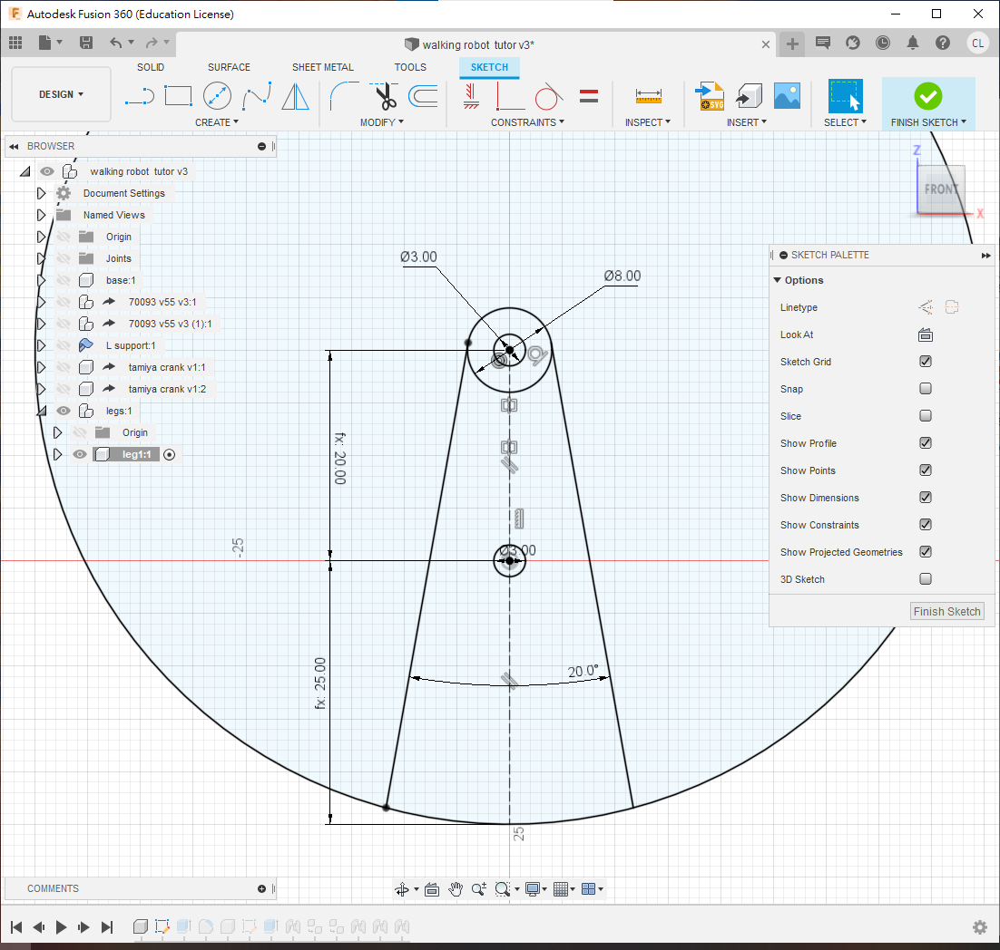
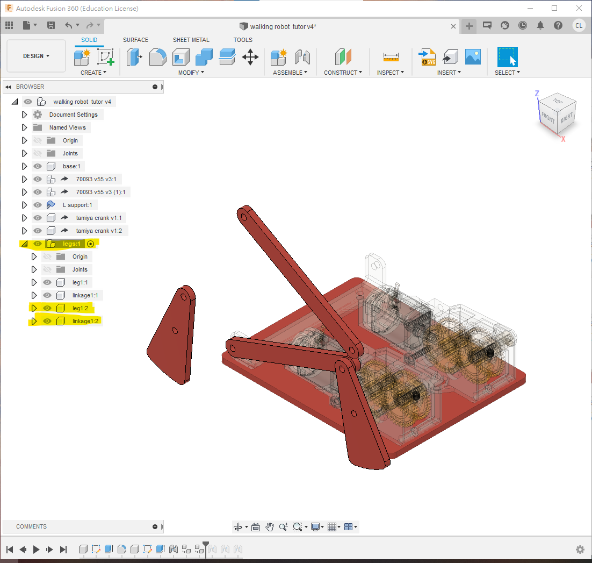

#Walking linkage robot

本節要繪製的，是下圖這一部四足連杆機械人。本節主要學習應用fusion360中的joint功能，應用不同的joint去模擬連杆機械人的效果。

**[walking robot  tutor Drawing v4.pdf](walking_robot__tutor_Drawing_v4.pdf)**

<iframe width=50% height="500" src="https://www.youtube.com/embed/MEb5YBgFR4s" title="YouTube video player" frameborder="0" allow="accelerometer; autoplay; clipboard-write; encrypted-media; gyroscope; picture-in-picture" allowfullscreen></iframe>

##檔案

==今次用到的70093L和70093R你應該已經上載了，這步驟可以省去==

本次會應用到的檔案(以下為step檔)，下載**解壓**後，在fusion左邊欄尋找"upload"鍵，就能上載到fuison中應用

[useful robotics component step.zip](useful_robotics_component_step.zip)

或者你可以在grabcad.com直接下載fusion360檔案(需要注冊登入)

[https://grabcad.com/library/tamiya-70093-3-speed-crank-axle-gearbox-kit-1](https://grabcad.com/library/tamiya-70093-3-speed-crank-axle-gearbox-kit-1)

[https://grabcad.com/library/tamiya-crank-1](https://grabcad.com/library/tamiya-crank-1)

##STEP 1

- 開啟新的 component，命名為 `base`
- 確保旁邊有一個黑色小點，表示激活狀態
- 這是為了製作底板，請跟隨以下步驟：
	1. 用快捷鍵`s`搜尋 `new component`
	2. 開啟新的 component
	3. 命名為 "base"
	4. **確保旁邊有黑色小點表示激活狀態**

- 接著在xy平面(或水平面)， 開一個新的sketch，繪制如下:

 

- 使用 `s` 搜尋 `change parameter`
- 開啟參數列表
- 定義一個新的參數，名為 `thickness`，值為 `3mm`
- 使用 `e` 指令，擠出 `thickness` 參數的厚度

##STEP 2

- 使用快捷鍵 `s` 指令搜尋 `insert derive` 功能
- 將 70093L gearbox 插入衍生到此檔案中

- 選擇 70093L 的 component

- 按右鍵，在選單中選擇 `rigid group`

❗**<u>記得要用insert derive功能, 不要直接拖拉gearbox入去, 否則是不能修改的</u>**

 

- 確保小黑點在這個70093L gearbox旁。

- 用`e`將齒輪箱的軸適當地修短(或增長, 如果有需要)

- 再用快捷鍵`j`把齒輪箱組合到底板

 

- 再次使用快捷鍵`s` 指令搜尋 `insert derive` 功能

- 將另一個 70093 gearbox 插入衍生到此檔案中，**確保小黑點在新派入的 70093 旁邊**

- 使用 快捷鍵`e`擠出 指令，適當修剪齒輪箱的長軸

- 使用快捷鍵 `j` 指令，將齒輪箱組合到底板上

❗️**<u>記得要用derive功能來插入衍生，不要用copy & paste，否則修改齒輪箱時，左右兩邊會同步喔!!!!</u>**

##STEP 3

- **<u>將小黑點移回最上層</u>**

- 開啟一個新的 sheet metal component，命名為 `L support`，選擇一個材料和厚度

	- 開啟`new component`時有選項是`standard`或`Sheet Metal`

	- 確認 sheet metal component 的圖示與普通 component 不同

- **<u>確保旁邊有一個小黑點，表示激活狀態</u>**

- 在底板上方使用快捷鍵`s` 搜尋`new sketch` ，在底板表面創建一個新的草圖

- 為洞的中心點繪製中心線

- 繪製一個寬度為 10mm 的長方形

- 使用中點或對稱約束，確保正方形相對於中心線對稱

	💡*提示: 可以點擊 component 左側的眼睛圖示，隱藏 component 以方便操作*

 

- 在 sheet metal 頁面中，點擊 `edit rule"`圖示，在所選材料旁邊會出現一支筆的圖示，點擊進去即可修改屬性，例如厚度、摺疊時預留的延伸長度等等
- 在 sheet metal 頁面中，點擊 `Flange` 圖示，或使用快捷鍵 `s`搜尋 `Flange`
- 選擇剛才繪製的方形，製作一個厚度為 2mm 的金屬薄片

❗️**<u>請注意，製作金屬薄片時需要使用 `Flange`指令，請勿使用 `e` extrude 指令</u>**

 

 

- 使用 `Flange`指令，點擊金屬片的邊緣，即可自動出現 `bending `功能
	- Bending 的高度和位置(`Bend Position`)可以分別設定為 `inside`、`outside` 和 `center` 三種，決定高度和摺疊位置的計算方式不同，可以嘗試看看有什麼不同
- 設定凸出高度`Height Datum`為 `16mm`，`Bend Position`為 `inside` 內側計起
- 重複以上步驟，製作另一側高度也為 `16mm` 的鋁片(如下圖)

 

- **保旁`L support`邊有一個小黑點，表示激活狀態**
- 使用 快捷鍵`s` 搜尋指令 `new sketch`，在凸起的鋁板表面開一個新的草圖(如下圖)
- 將其中一個齒輪箱顯示出來
- 使用快捷鍵 `p` 投影長軸的圓
	- 這一步是為了確保開出來的孔跟長軸同一個高度
- 在鋁板上劃一條中線和一個直徑為 3mm 的圓形
- 使用 `constraints `中的第一個圖示 `horizontal and vertical`，確保 3mm 圓形的高度與長軸同高

 

- 使用 快捷鍵`e`使用 `extrude `指令，選擇剛才所劃 3mm 圓形，到 `extent type` 使用 `to object`，將圓孔穿透到鋁板的另一面
- 最後使用快捷鍵`f` 使用`fillet `指令，修剪圓角，半徑選擇3mm 即可

 

- **<u>將小黑點移回最外層</u>**
- 使用快捷鍵 `j`使用`joint` 指令，將鋁板組合到底板上

##STEP 4

- **<u>確保小黑點在最外層</u>**
- 使用快捷鍵 `s` 指令搜尋 `insert derive`，插入 `tamiya crank` 曲柄的 step 檔或 f3d 檔
- 插入後，將**<u>小黑點移動到曲柄的旁邊，並激活它</u>**
- 在曲柄表面使用 `new sketch`創建一個新的草圖
- 投影並繪製一條線，如下圖所示

💡*提示: 可以使用 component 旁的小眼睛圖示，適當地顯示和隱藏 component，方便操作*

 

- **<u>確保小黑點在 `tamiya crank`曲柄的旁邊</u>**
- 使用快捷鍵 `e` `extrude` 指令，將多餘的曲柄部分剪除，只留下最近的一個孔
- **<u>將小黑點移回最外層</u>**
- 使用快捷鍵 `j` `joint`指令，將曲柄組合到齒輪箱的長軸上

❗<i><b>如果使用的是 f3d Fusion 360 檔案，由於齒輪箱內部可以旋轉，因此可以使用 "rigid" 聯結方式</b></i>

❗<i><b>如果使用的是 step 檔案，聯結時需要到 "motion" 頁面，選擇旋轉聯結的類型為 revolving joint</b></i>

 

##STEP 5

- **<u>確保小黑點在最上層</u>**

- 使用 `Ctrl-C`/`Ctrl-V` 指令，將 `tamiya crank`複製一份

- 使用快捷鍵 `j` `joint`指令，將複製的曲柄組合到另一邊的齒輪箱長軸上

- 記得方向要與另一邊相差 180 度，如果左邊是向後，這邊則要向前方

	&#128161;<i>*如果零件完全相同，可直接複製/貼上；如果零件相似但需要獨立修改，則需使用衍派(`insert derive`)功能*</i>

	&#128161;<i>*同樣地，如果使用的是 step 檔案的 70093 齒輪箱，joint的類型應為 revolving joint*</i>

##STEP 6

- **<u>確保小黑點在最上層</u>**
- 使用 `new component` 指令，創建一個名為 `legs"`的新組件，用於裝配左半邊的所有腳和連桿
- **<u>確保小黑點在 `legs` 旁邊</u>**，再次使用 `new component`指令，創建一個名為 `leg1` 的新組件

***❗接下來所有的腳和連桿，都必須確保位於 `legs"`組件的下方，否則在複製時，所有聯結的關係都會散開，需要重新組合***

 

##STEP 7

- 確保小黑點在`leg1`旁邊
- 先隱藏除`leg1`外的**所有**組件
- 使用快捷鍵`s` ，尋找 `new sketch`指令，在原點的 XZ 平面上創建一個新的草圖
- 根據下圖所示的尺寸繪製草圖
- 在繪製時，可以使用快捷鍵 `s` 尋找指令 `change parameter`，將連桿的尺寸設置為變數，之後只需修改該變數即可更新所有相關尺寸

 

- 使用快捷鍵`e` `extrude`指令，擠出 "thickness" 的厚度
- 再使用 快捷鍵`f` `fillet` 指令，添加圓角，半徑約`3mm`

 

##STEP 8

- 接下來，**<u>褪回小黑點在`legs`的旁邊</u>**
- 使用 快捷鍵`s` 搜尋 `new component`，創建一個名為 `linkage1` 的新組件
- 先隱藏除`linkage1`外的**所有**組件
- **<u>確保小黑點在`linkage1`旁邊</u>**，並在 XZ 平面上創建一個新的草圖
- 繪製一個連桿，使用 `change parameter`指令設置一個名為 `L3` 的變數來定義長度，設置值為 `72mm`
	- 如果上一步已一次過設定好，這一步可以省卻
- 最後使用 快捷鍵`e` `extrude`指令擠出 `thickness`"的厚度

 

##STEP 9

接下來開始複製和組裝左腳：

- 首先將所有零件顯示出來，方便操作。

- 使用快捷鍵`j` `joint` 指令，將 `linkage1` 組件組裝到鋁片上。

	- 兩個 joint 的接口保留 `1mm `的距離，如果是實物裝配時，可以使用 1mm 的鐵墊片將其隔開，確保可以旋轉。

	- 大約將接口的角度旋轉 25 度，方便後續操作。

	- 前往 `motion`頁面，選擇 `revolving joint` 作為聯結的類型。

- 完成後，可以發現這個 joint 的符號會出現在最上層。

	- 即使在啟用 `legs`組件時（小黑點在旁邊），這個 joint 也會在 `legs`之外，因此在複製 `legs`時不會跟著複製。

 

##STEP 10

- 使用快捷鍵`j`  將 `leg1` 組件組裝到曲柄上
	- 偏移 4mm
	- 這個偏移量不一定需要是 4mm，因為之後需要在 `motion`頁面進行設置
- 在 `motion`頁面，選擇 `cylindrical joint`
	- 這種 joint 有兩個自由度，一個是旋轉，另一個是沿著旋轉軸移動，因此上面選擇的 4mm 偏移量只是參考，沒有實際限制
- 跟上面的 `revolving joint` 一樣，即使在啟用 `legs` 組件時，這個 joint 也不會在 `legs` 底下，因為曲柄不在 `legs`底下。

 

##STEP 11

- **<u>確保小黑點在 `legs` 組件旁邊</u>**
- 使用快捷鍵`j` `joint `將 `leg1` 組件組合到 `linkage1`"上
	1. joint 接觸面距離為 1mm，跟之前一樣，如果在實際組裝時，可以使用 1mm 的墊片隔離
	2. 在 `motion` 頁面上選擇 `revolving joint`
- 完成後，確認這個 joint 在 `legs`組件之下，這樣在複製時才會跟著被複製

&#128161; <i>記住四連桿組裝的秘訣是：在三個 joint 中，有 2 個 revolving joint 和 1 個 cylindrical joint，次序可以隨意，這樣就不用計算偏移量和厚度。</i>

 

##STEP 12

- **<u>確保小黑點繼續在 `legs` 組件旁邊</u>**
- 使用 `Ctrl+C`/`Ctrl+V `將 `leg1` 和 `linkage1` 複製一份，複製成 `leg1:2` 和 `linkage1:2`，如下圖所示
- 確保兩隻腳和兩條連桿都在同一個 `legs` 組件之下

##STEP 13

圖1:

- **<u>確保小黑點在 `legs` 旁邊</u>**

- 使用 joint 將 `leg1:2` 組件組合到 `linkage1` 上，偏移` 1mm`

- 在 `motion` 頁面上選擇 `revolving joint`

同樣地，圖2：

- 將 `linkage1:2` 組件連接到 `leg1:2` 上

- 在 `motion` 頁面上選擇 `revolving joint`，偏移 `1mm`

最後，圖3：

- 將 `linkage1:2`的另一端連接到 `leg1` 上

- 在 `motion`頁面上選擇 `cylindrical joint`

- 這次可以不用偏移，因為使用 `cylindrical joint` 會自動調整間隔，以適應前面兩個偏移量

 

##STEP 14

好的，左腳部分完成了。

- 請試著轉動齒輪箱，看看腳是否跟著動

- 試著調整 `leg` 和 `linkage `的偏移量，由 `1mm` 改為 `0.5mm`（或任何數值），看看修改後是否會出現錯誤警告
	- 如果按照步驟進行，調整參數應該不會出現錯誤

##STEP 15

- **<u>將小黑點移回最上層</u>**
- 使用 `Ctrl+C`/`Ctrl+V` 將整個 `legs`組件（即左腳）複製一份，複製成 `legs1:2`
- 可以將複製的組件移開一點，以方便操作

❗ **Fusion 360 的鏡像功能無法複製 joint，因此如果要完全左右對稱，則需要重新建立所有的 joint**

##STEP 16

- 使用 快捷鍵`j` 將最靠近右側 Tamiya 曲柄的 `linkage1:1` 組件組合到曲柄孔上
- 在 `motion`頁面上選擇 `revolving joint`
- 偏移 `1mm`

##STEP 17

- 最後將右側的 `leg1:1`和剩下的鋁支架 `L support` 的孔組合
- 在 `motion`"頁面上選擇 `cylindrical joint`
- 這次可以不用偏移，因為使用 `cylindrical joint `會自動調整間隔，以適應前面兩個偏移量。

##完成

完成之後，

- 請模擬一下，試著轉動右側的腳，看看是否可以模擬真實機械連桿轉動。

- 試著修改一下偏移量的數值，看看是否會出現錯誤。

- PDF 文件包含 Phase 1 和 Phase 2 的尺寸，請使用 `Change Parameter` 更改一下參數尺寸，看看整個設計是否會立即修改

