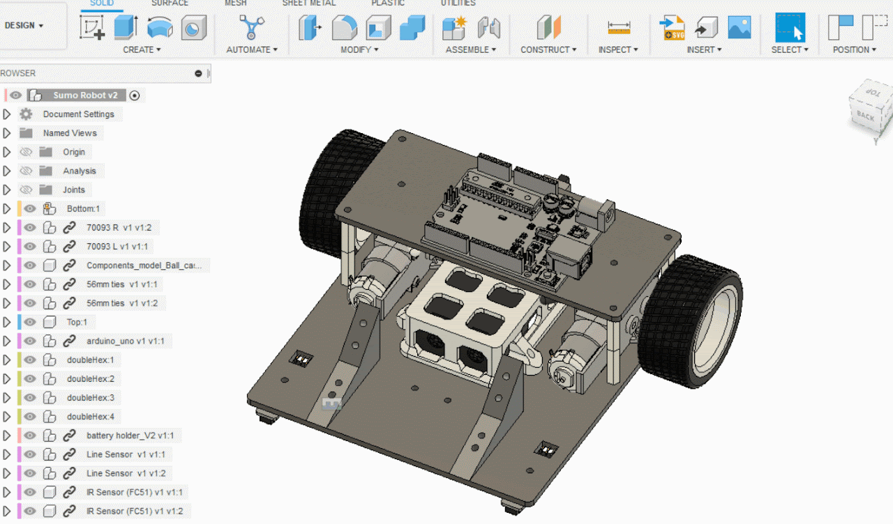
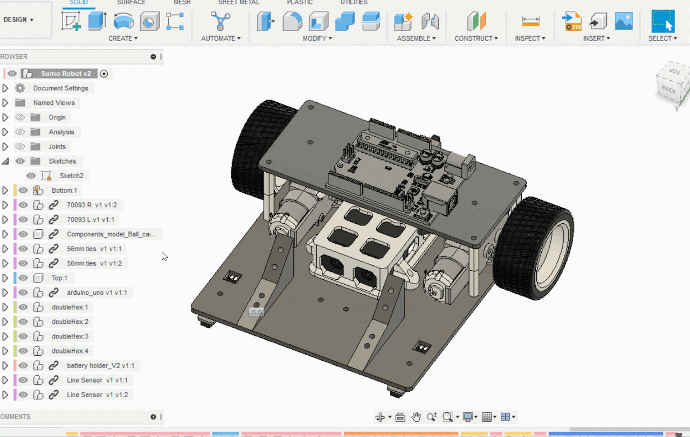
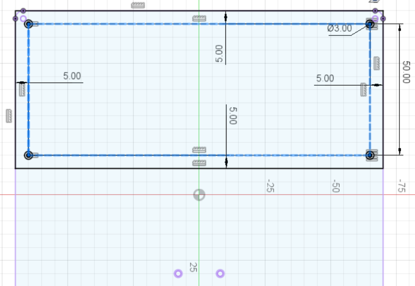
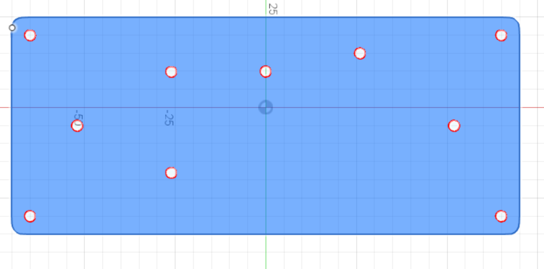
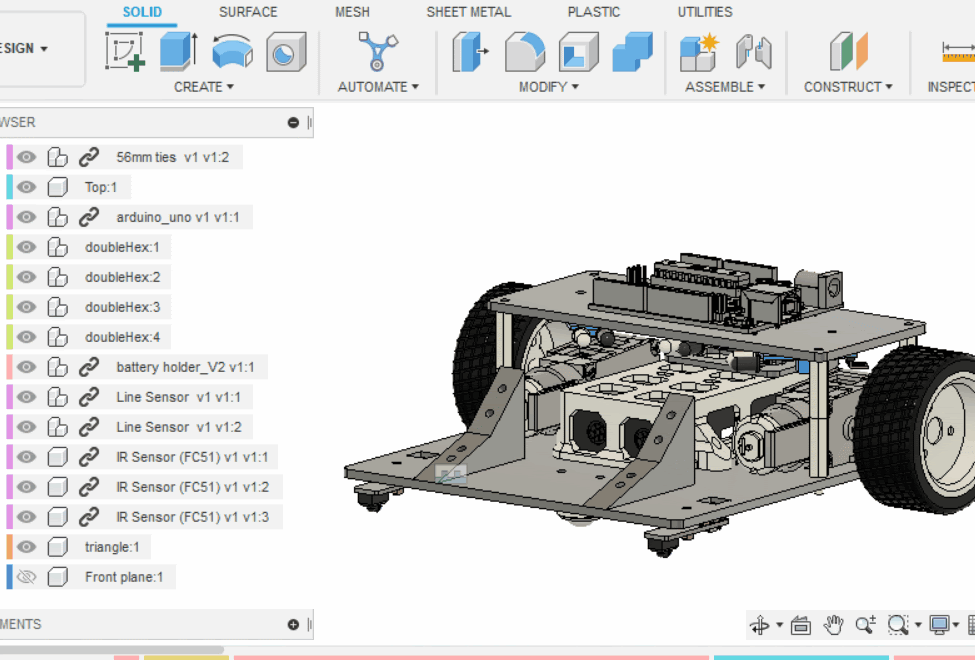
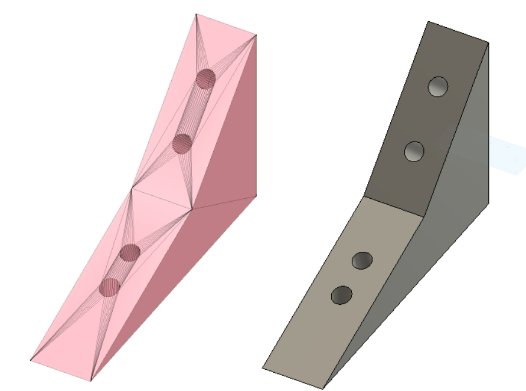

# 附錄: 匯出DXF/STL/3MF

[TOC]

要把電腦的3D立體檔製作成實體，我們需要把相應的檔案匯出成DXF或STL格式

- DXF檔包括了向量線、圖形等資訊，適合用於像**==鐳射機==**等在**==2D平面==**上加工的機器，也適合在不同的CAD軟件之間交互編輯
- STL或3MF檔包括了三維模型的資訊，是**==3D打印==**中常見的檔案格式。由於其原理是用一堆三角形網格模擬原本的立體檔，所以STL檔**==不適合放回==**CAD軟件內編輯

## 匯出DXF

### Step 1

1. 確保==小黑點==在最上
2. 確保要匯出的平面上，==沒有其他Sketch==，如果有的話，用滑鼠左鍵點一下Sketch，再用快捷鍵`h`將sketch隱藏
3. 點選要匯出的面、按下p鍵(project)、再按下Finish Sketch
4. ==完成後左方會多了一個Sketch==

### Step 2

點選左方剛新增的sketch，**==按滑鼠右鍵==**->**==Save as dxf==** 完成儲存

### 注意：❌容易犯錯的誤區

- 雖然我們也可以用中間作畫過程的Sketch匯出DXF檔(例如頂板這步驟)

- 但會把**作圖線(藍色虛線)**以及**投影線(紫色實綫)**也一併匯出，==可能導致鐳射機把不必要切斷的部份也切斷！==

### ✔️正確的例子

- 和上方比較可以看到有些孔是在其他Sketch中後加的
- 所以我們應該在==全部設計都完成後==，再用上面Step1的方法投影一個==新==的面來儲存DXF

## 匯出STL/3MF

- STL/3MF的匯出比DXF簡單，只要找到該物件的body，然後==**按右鍵**->**Save as** **mesh**==就完成了。

- 注意一份STL/3MF檔只能有一個body，**==不能==**把多個body一起匯出成一份STL/3MF

> 特別鳴謝: 陳朗維老師https://sites.google.com/ism.edu.mo/f4dat/topic-5-fusion360/4-%E5%8C%AF%E5%87%BAdxfstl