# 行星齒輪

行星齒輪是齒輪結構的一種，通常由一個或者多個外部齒輪圍繞著一個中心齒輪旋轉，就像行星繞著太陽公轉一樣，因而得名。

行星齒輪的優點在於承載能力大，體積小，純扭矩傳動，工作平穩。而且可以多個行星齒輪互相搭配作用。由於行星齒輪是純扭矩傳動，其有著出色的傳動效率。每一級齒輪傳動之間的效率損失只有3%。基於如此高的傳動效率，行星齒輪能夠保證相當高的動力輸出/輸入比。由於行星齒輪中每個外部齒輪分配到的動力是相等的，所以行星齒輪的動力輸出非常平穩，也常用於各種大型機械和車輛的變速箱中。

以下內容是基於[howtomechatronics.com](https://howtomechatronics.com/how-it-works/how-planetary-gears-work-3d-printed-planetary-gearbox-design-and-test/)對行星齒輪的介紹，原連結有十分詳細的講解和影片，有興趣的同學可到原網址進一步閱讀。

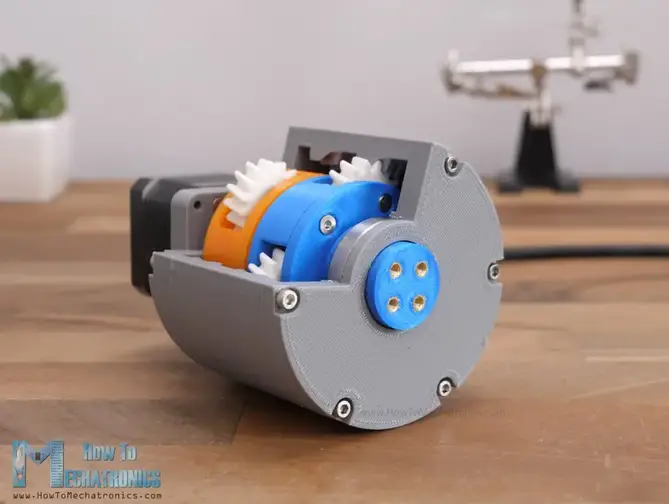

[toc]

## 1. 結構

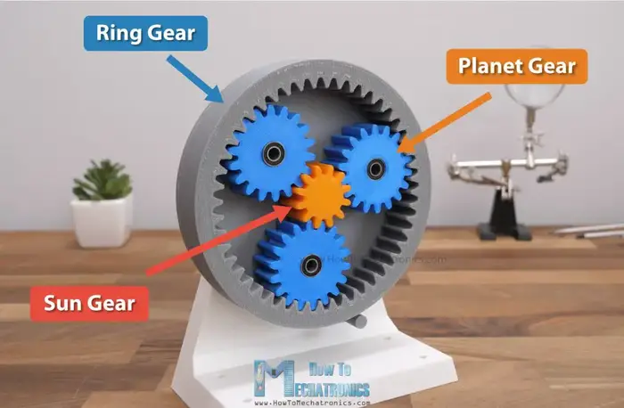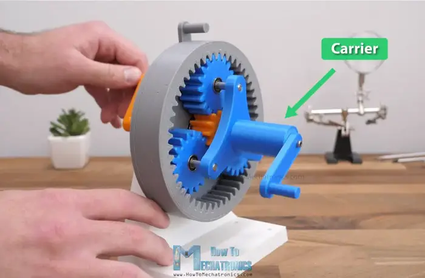

**行星齒輪**由太陽齒輪(Sun Gear)、行星齒輪(Planet Gear)、外齒圈(Ring Gear)和行星架(Carrier)所組成。一般來說，通常是太陽齒輪(Sun Gear)作為輸入、外齒圈(Ring Gear)保持不動，帶動行星齒輪繞著太陽齒輪旋轉，從而帶動行星架(Carrier)旋轉作為輸出。

太陽齒輪、行星齒輪和外齒圈只要有一項保持不動，另兩項都可以組成不同的齒輪比，這個特性有時會用於自動變速箱中。這裡只介紹最常見的一種，另外的齒輪比可參考上述連結。

##2. 設計

我們的目標，是要設計一個3D打印的人字齒輪小玩具，行星齒輪數量$4-5$個。

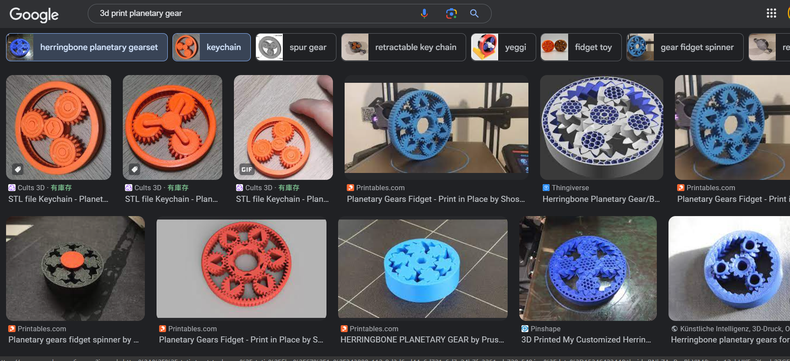

要設計行星齒輪，要設定幾樣條件：

1. **齒輪比**：跟一般齒輪的比例計算不同，行星齒輪的齒輪比如下：
	$$
	\text{Gear Ratio}=1+\frac{z_{ring}}{z_{sun}}
	$$
	這裡的$z_{ring}$是外齒圈的齒數，而$Z_{sun}$則是太陽齒輪的齒數。

	所以，要設計行星齒輪，首先第一步是要根據目標齒輪比，選定太陽齒輪和外齒圈的齒數。

	我們選外齒圈齒數為36齒，如果$3:1$的話，太陽齒輪就是18齒；如果是$4:1$的話，太陽齒輪就是12齒。

2. **行星齒輪**：行星齒輪(Planet Gear)要滿足以下條件：

$$
\begin{align}
z_{ring}   &= z_{sun}+2 \times z_{planet} \\
z_{planet} &= \frac{z_{ring}  - z_{sun}}{2},   \{ z_{planet}  \in  \mathbb{N} : z_{planet} > 0 \}
\end{align}
$$

​	行星齒輪的齒數，跟太陽齒輪和外齒圈的齒數有關，而且計算出來必須是**正整數**。

​	所以上面的齒輪箱，$3:1$的話，行星齒輪齒數為9齒；$4:1$齒輪箱的話，行星齒輪齒數為12齒。

3. **行星齒輪數量**：太陽齒輪齒數加上行星齒輪齒數，必須能夠整除行星齒輪數量
	$$
	(z_{sun}+z_{planet})\mod N_p = 0
	$$
	其中$N_p$是行星齒輪的數量。
	
	上面的設計中，3倍和4倍齒輪箱，兩齒輪齒數相加分別是27和24，$27$最大因數是$9$，而$24$最大因數是$6$。

由於行星齒輪需要達到的條件多，設計時不易滿足，可使用以下網站幫忙計算：

<a scr='https://planetarygenerator.mateuszdrwal.com/'>
			Planetary Gear Generator
        </a> </strong>

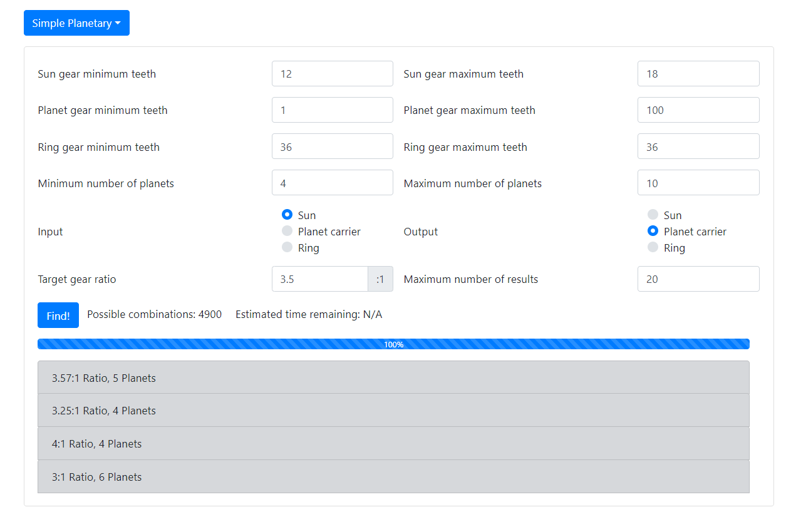

以我的為例，先固定**外齒圈為36齒**，剛剛初步計算$3-4$倍齒輪比的話，**太陽齒輪介乎$12-18$齒**，行星齒輪齒數我選$1-100$，讓程式幫我選擇，行星齒輪數量我選$4-10$，希望越多越好，目標齒輪比介乎$3-4$倍，所以我選擇了$3.5$。

之後就可以到以下網站：

<a scr='https://geargenerator.com/beta/'>
			Gear Generator
        </a> </strong>

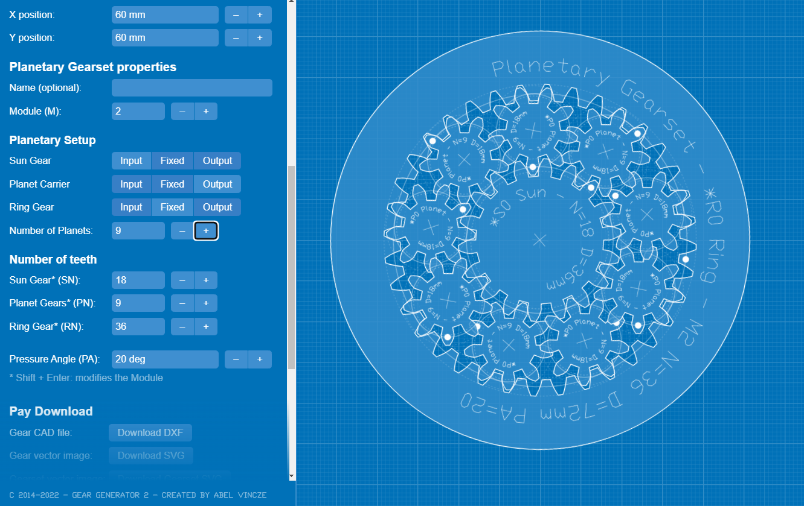

之前我們計算時，$3:1$​的齒輪比，理論上可以做到9個行星齒輪，但用網站計算時則沒有，只要用[Gear Generator](https://geargenerator.com/beta/)將資料輸入，就能十分形象化地看到出來的效果，9個行星齒輪的話，行星齒輪塞不下。

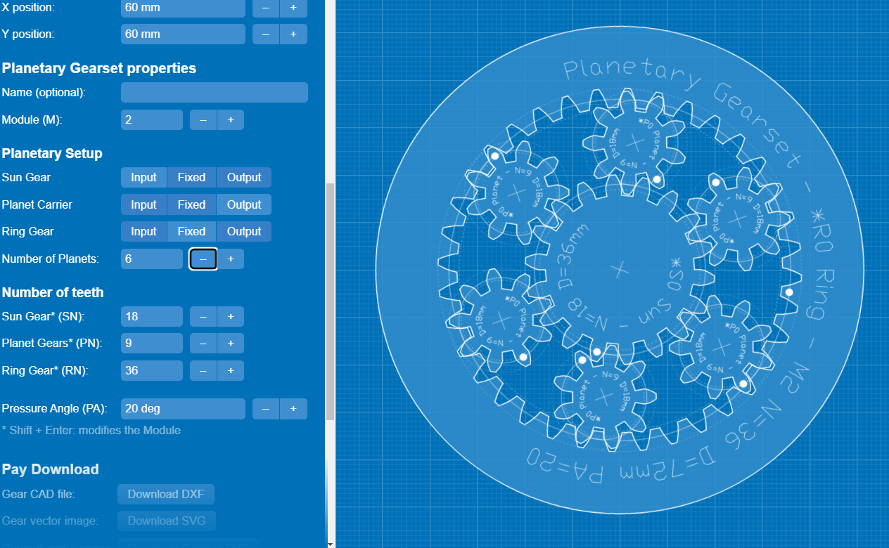

於是我們選擇[Planetary Gear Generator](https://planetarygenerator.mateuszdrwal.com/)計算結果中最多行星齒輪的結果，效果不錯，就選擇這個吧。*[Gear Generator](https://geargenerator.com/beta/)也可以匯出平面DXF檔直接用鐳射機生產，或匯入到Fusion 360。(注意：這個生成器沒有計算行星齒輪數目的功能，如果條件不允許，出來的行星齒輪角度並非等份)*

## 3. 繪圖

這一節是基於上一節齒輪教程的延伸，所以只會給簡單的大方向，讓同學可以自行熟習怎樣繪制齒輪。

### 3.1 繪劃草圖

我們選用`1.5mm`模數來製作，所以上面的齒輪齒數，全部乘以`1.5`倍，就是齒距圖直徑。

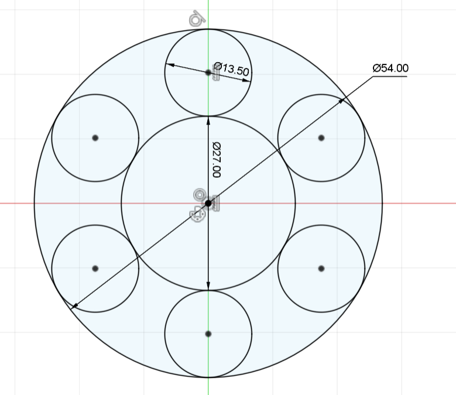

### 3.2 製作外齒圈

- 我們希望太陽齒輪、行星齒輪和外齒圈的螺旋角，分別是`+30°`、`-30°`和`+30°`，才能互相囓合；

- 但由於外齒圈是內齒輪，所以要跟`-30°`的行星齒輪囓合，就同樣要輸入`-30°`
- 另外，由於希望旋轉較暢順，壓力角設定大一點變成`30°`

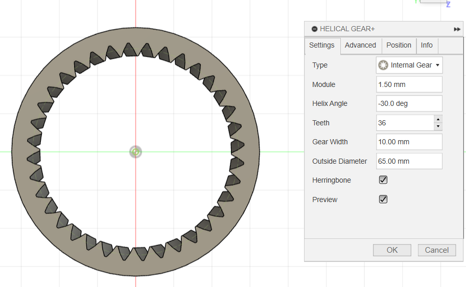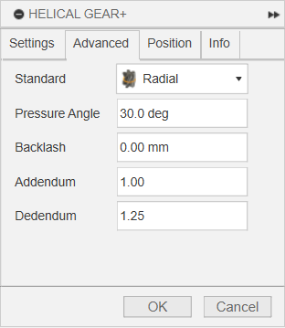

- 記得將齒輪加入`offset face`，加入`0.15mm`間隙

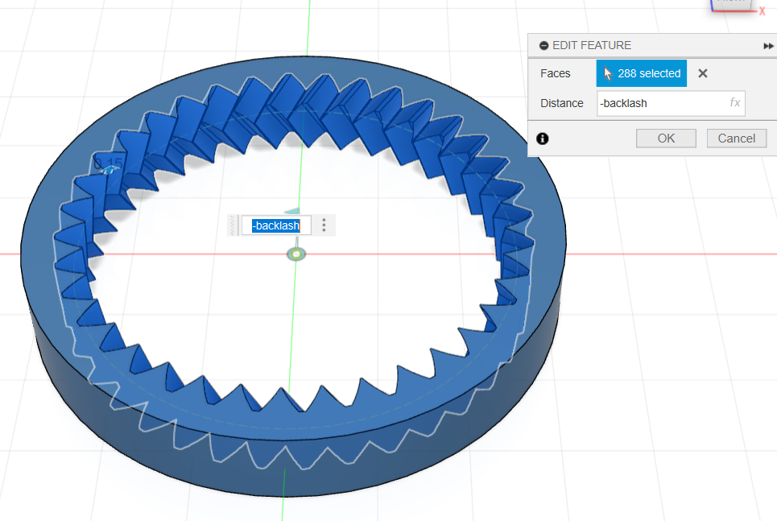

### 3.3 製作其餘的齒輪

- 其餘的齒輪步驟一樣，就不再重覆了；
- 但記得，如果想3D打印能一體成型打印出來的話，行星齒輪要記得對齊和囓合外齒圈和太陽齒輪

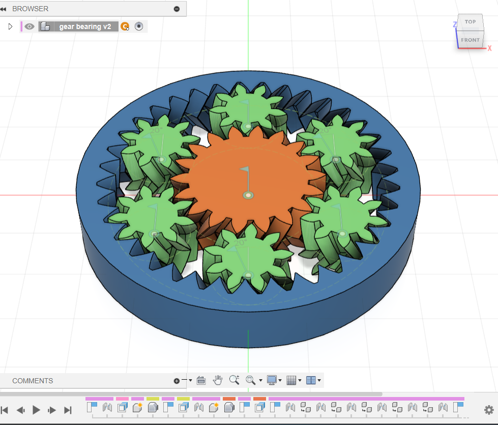