# 雕刻名牌

作為熱身，今章我們會先教大家最基本的CNC機操作，和教大家如何用Fusion 360，簡單雕刻文字，製作適用於CNC機能讀取的G-Code檔案。

> Fusion 360是一款強大的CAD/CAM軟件，它集成了設計、工程和製造功能於一體。在這個教程中，我們將使用Fusion 360的CAM功能來生成G-Code檔案。

[toc]

## 1. 製作CAD

### 1.1 建立木牌

1. 首先，在Fusion360中，開啟一個新的零件，可以命名為`Name Tap`。

2. 點選`new sketch`，點選頂視圖。


1. 在頂視圖中，按快捷鍵`S`，搜尋`center rectangle`，劃一個`50mmx25mm`的長方形。
2. 按快捷鍵`E`，擠出剛才的方形`5mm`。


(選做，不做也沒關係)用快捷鍵`A`，找到喜歡的木顏色，將顏色標示拖到長方體中，即可為其上色。


### 1.2 建立和擠出文字

1. 用快捷鍵`s`搜尋`new sketch`，或直接在工具列中找到按下。
2. **隨意**框上文字方框並輸入文字，我就使用會袓鮑思高神父的`Bosco`。
3. 適當設定字體、文字大小，`Alignment`項，置直和水平都選擇置中對齊。
4. ***不是所有字體都可以擠出，而且太幼的字體，CNC的精度也未必能雕刻，選擇時請留意。***

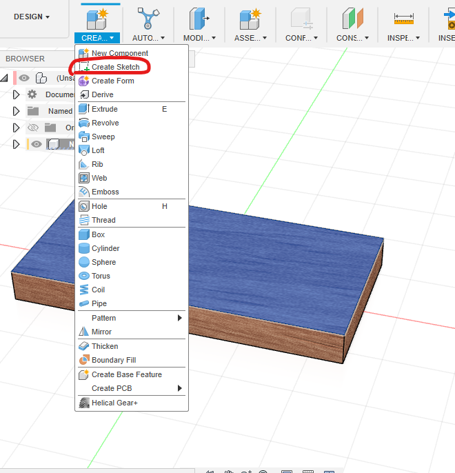


1. 在`Constraint`幾何約束中，找到第二個`Coincident(重合)`
2. 分別點選文字框的左上角和木牌的左上角，文字框就能跟木牌重合，右下角也一樣。
3. 按快捷鍵`E`，向後擠出`-0.5mm`，`Operation`就會自動選擇`Cut`，就能削去文字部分。

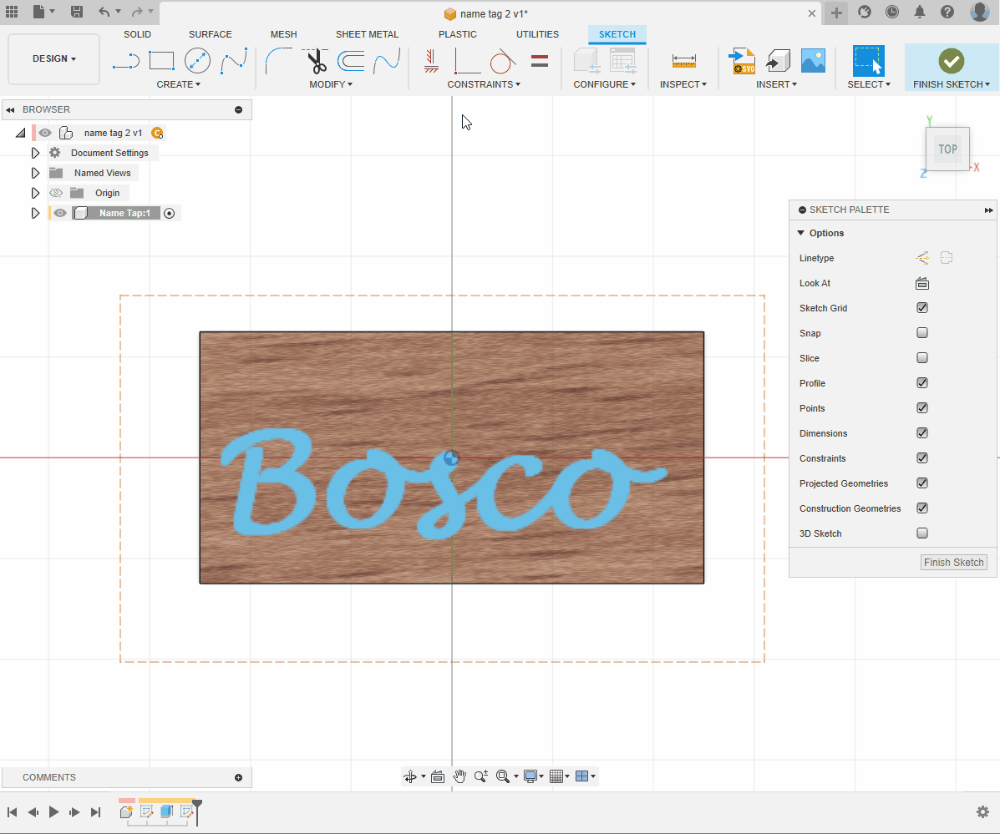


製作好後如下圖：

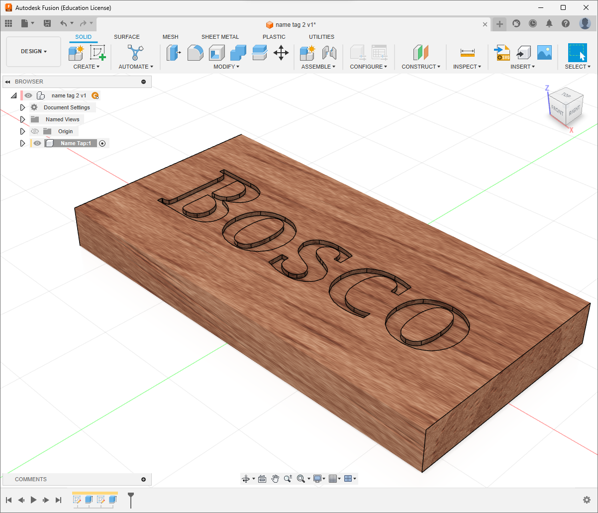

##2. 生成刀路

### 2.1 基本設定

> Fusion 360已經內置了CAM的功能，而且是免費的，這對於初學者和預算有限的用戶來說是一個巨大的福音。它提供了一個直觀的界面和強大的工具集，使得從設計到生產的過程變得無縫且高效。

在左上方的下拉欄中，選擇`MANUFACTURE`，就會進入到生產界面。

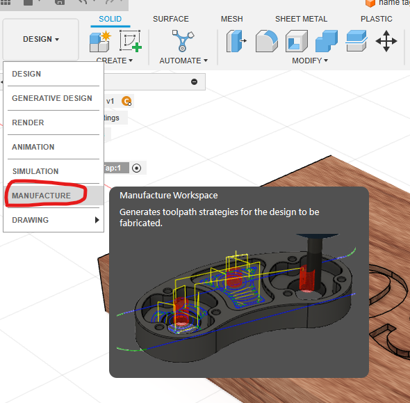


界面亦相當直觀，首先找到最左面的`SETUP`。按下，就會出現一個`SETUP`的介面。

第一步是要設定你的機器，在`Machine`按下`Select`。

<div style = "text-align: CENTER"></div>


在`Fusion Library`裡，我們要找到`Autodesk Generic 3-axis`的模型，這裡總共有三種選擇。而我們的機器是`Y axis on the Table and XZ axis on the Head`。選好後，Fusion360將會下載機器的模型，以便進行模擬。稍等片刻，就可以開始了。

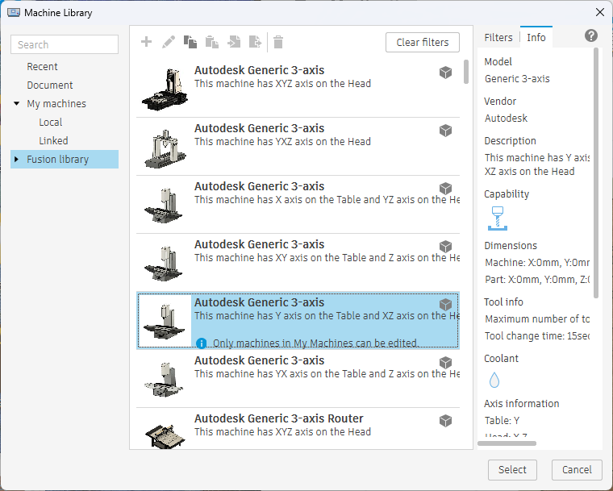


1. 在`Operation Type`的選項中，預設選擇為`Milling`，也就是銑床操作。

	> 除此之外，該軟件還提供了一系列的刀路生成選項，包括結合銑床和車床的操作、單獨的車床操作、鐳射/水切割，以及3D打印。更進一步地，如果您的項目需要更複雜的加工，該軟件還以相對實惠的價格提供4軸和5軸銑床的刀路生成功能。
2. 在`Work Corrdinate System`中的`Origin`，選擇`Model box point`，就會有下圖中的24個小白點，**選擇木牌頂部的中間點為原點**，==留意一下XYZ軸的方向是否跟我的一樣==，如果不一樣，需要先在`Orientation`中設定。
3. 在`Model`選項，點選你的木牌就可以了
4. 最後一個選項`Fixture`是指機械虎鉗，Fusion360可以提供精確的模擬，確保在雕銑過程中不會撞到虎鉗而斷刀。這裡我們留空就可以了。

<div style = "text-align: CENTER">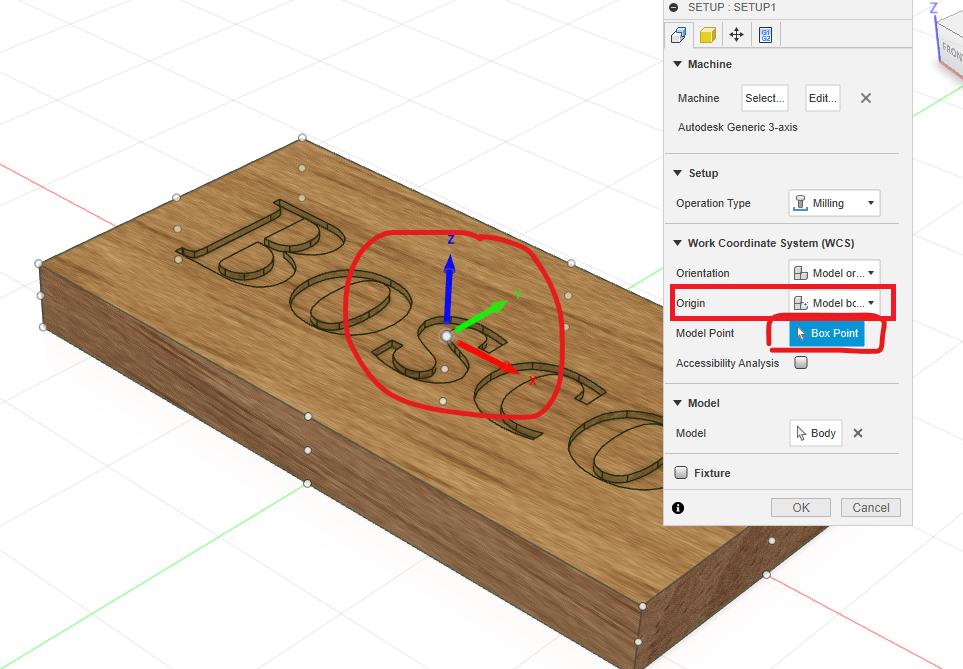</div>


在第二版的`Stock`選項，`Mode`選擇`Relative size box`，`Stock Offset Mode`中，選`No additional stock`。

Stock是指原始未加工的材料，也就是材料塊。CNC加工為減法製造，要得到我們需要的特定形狀和尺寸，通常要準備一塊比這個尺寸更大的材料塊，所以這裡的Stock預設是比我們最後工件的尺寸為大，但我們今次練習只雕刻中間的名字，所以不要外加尺寸。

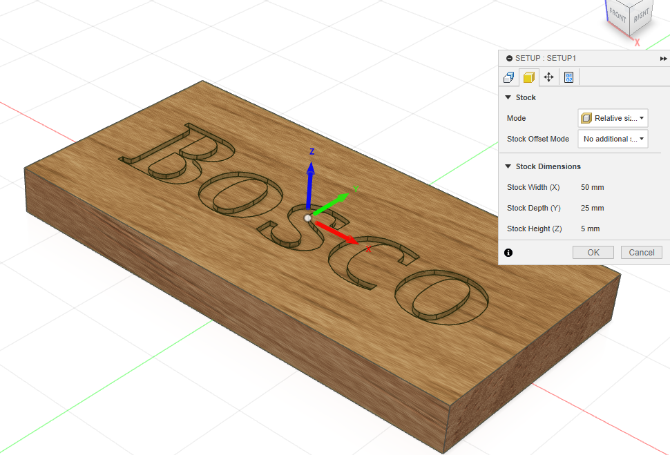

### 2.2 設定刀具

第一次使用時，需要先設定刀具，下一次再使用同一把銑刀，就不需要再設定。

在上方的`Manage`中找到`Tool library`的圖示，或直接用快捷鍵`s`搜尋`Tool library`。


Fusion360中本身就有一些刀具，但都是些工業級比較大的銑刀，我們的雕刻刀也是要自己設定的。我們今次用的刀，是下方這一款30度，尖端直徑為0.1mm的雕刻刀。


按下「+」符號新增一把刀。但在選擇刀的種類時，**我們不使用`Engrave/Chamfer mill`雕刻刀，而是使用`Flat end mill`**。這是因為使用`Engrave/Chamfer mill`雕刻刀沒有多階段的功能，只能一刀到底，容易斷刀。

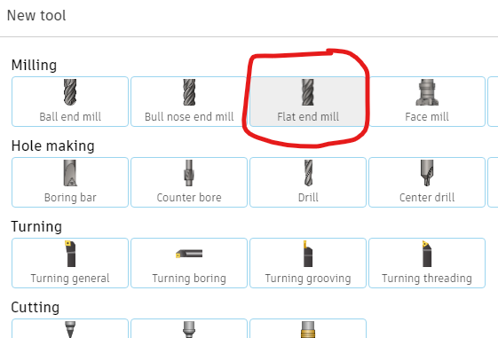


1. 第一版是該刀的名字和廠家等資訊，我們在`Description`輸入`Fake 1/8" Engrave mill`。
2. 第二版的內容：
	1. `Diameter`為刀的直徑，我們輸入雕刻刀的刀尖直徑`0.1mm`
	2. `Shaft diameter`即刀柄直徑，輸係1/8英寸，即`3.175mm`
	3. `Overall length`輸入`28mm`
	4. `Length below holder`很視乎我們夾刀時的高度，不過這個參數只對模擬時會有影響，不影響正常操作，我的話輸入`19mm`
	5. `Shoulder length`也不影響刀路，我輸入`15mm`
	6. 最後，`Flute length`(刃長)輸入`6.5mm`

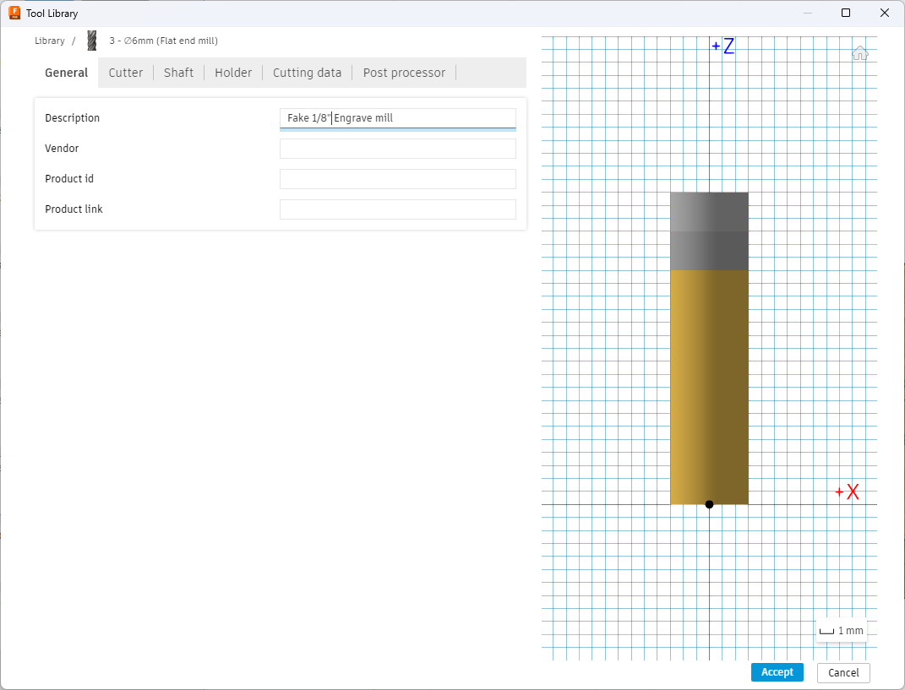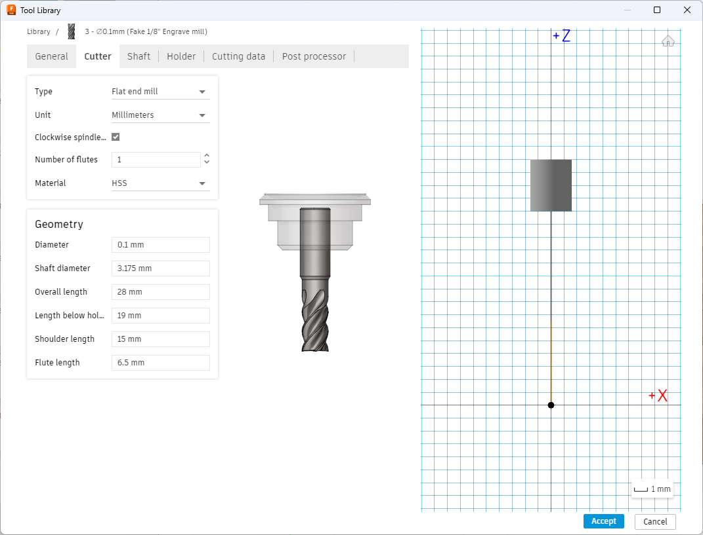


第三版和第四版的`Shaft`和`Holder`，只會對高級CNC機和模擬產生影響，所以可以跳過。

跳到第五版`Cutting data`，

1. `Spindle Speed`是主軸轉速，我們的CNC機大約`10000rpm`
2. `Cutting feedrate`(進刀速率)即切削進行的速度，它會影響切削量和速度。在這裡，我們輸入`500mm/min`。

	> 刀具類型、材料、切削深度以及被切割的材料都會對進刀速率產生影響。我們可以使用一些網上軟件來計算，或者參考網上有[YouTuber](https://youtu.be/B79OkSwSyxM?si=vkPThG7m5ROE1ayC)對我們的CNC機進行測試，比較不同轉速和進給速率對切削的影響。
3. 在`Passes and linking`欄，剔選`Use stepdown`，`Stepdown`設定為`0.25mm`。這個意思是：例如我們要切割1mm深度的話，Fusion360在生成刀路時就知道需要切割4次，每刀深0.25mm
4. `Coolant`為冷卻方法，我們雕刻沒有冷卻，所以選`Disable`
5. 其餘的部分按預設就可以，並按下`Accept`


### 2.3 生成刀路

在`2D`中，找到`2D Pocket`。

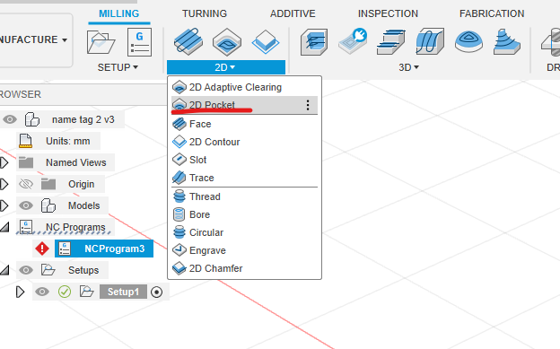


第一版的`tool`，按`select`，選擇我們剛剛新增的銑刀，`Feed & Speed`如果之前已設定好，就不用再調。


第二版的`Geometry`中，點選5個文字的面

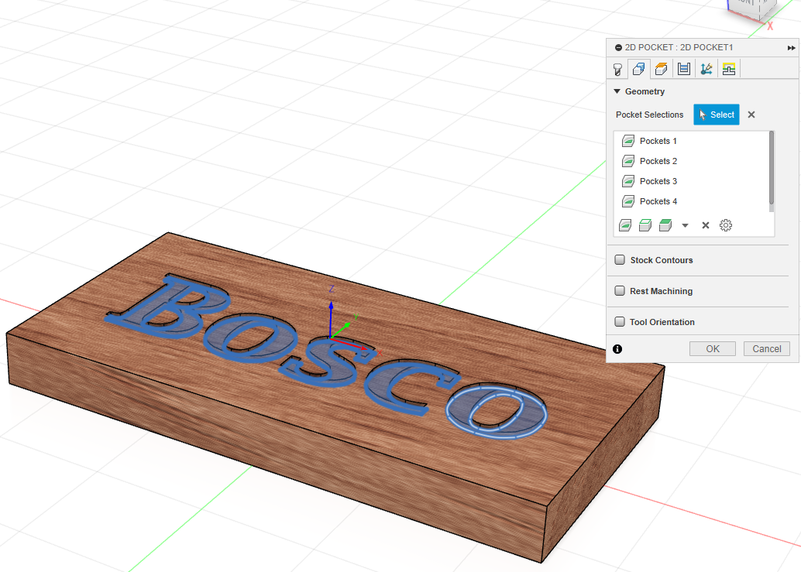


第三版是決定CNC的過程中，每刀完成前後Z軸升起多少才移到另一點，全部都全留預設就可以
==要檢查確保一下，`Top Height`是位於木牌的表面==


第四版的`passes`，點選`Multiple Depths`，之前設定刀具時已預設`0.25mm`一刀，檢查一下是否正確，如果有需要，也可以每刀深一點或淺一點。

接著將`Stock to Leave`取消選擇，`Stock to Leave`的意思是要留一點邊緣。

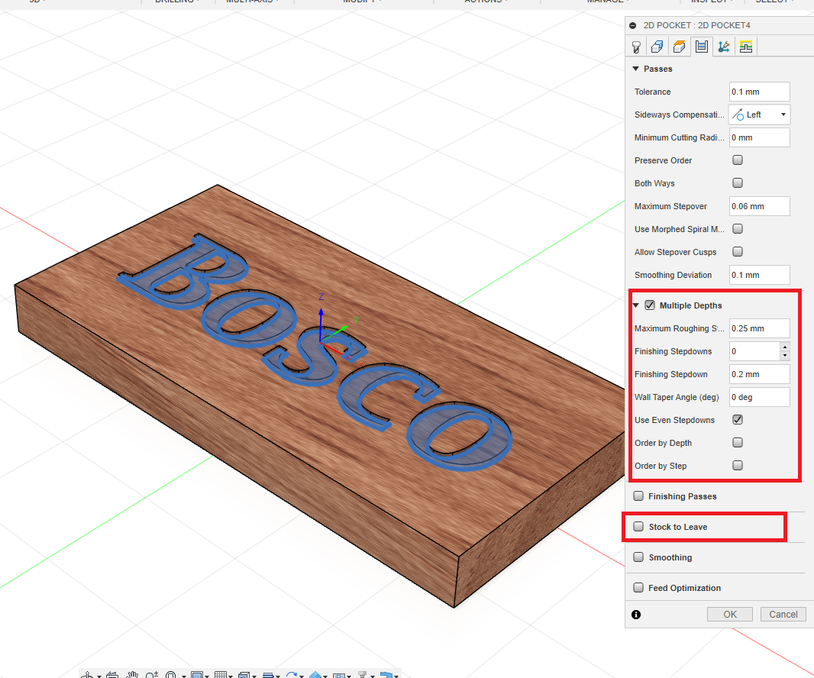


跳到最後一版，將`Ramp`中的`Ramp Type`，設定為`Plunge`，其他使用預設則可。按下`OK`就會生成刀路。

> 在CNC加工中，"Ramp"通常指的是刀具同時進行徑向和軸向運動，形成一個角度的刀具路徑。
>
> 這種方法通常用在刀具上有較少的徑向接觸，切割力分佈在三個不同的軸上。這是推薦的方法，因為它確保了最長的刀具壽命。


每個生產程序通常都會有幾個步驟，每個步驟都會有一條刀路，這些刀路都是放在左方的零件樹上，確保是一個綠色的剔。工件表面藍色和黃色的，就是刀路。


### 2.4 輸出刀路

在`Actions`工具列中，找到`Simulate with Machine`的圖示，或直接用快捷鍵`s`搜尋`Simulate with Machine`。**模擬器可以看到雕銑的次序和效果，觀察一下確認沒有問題。**

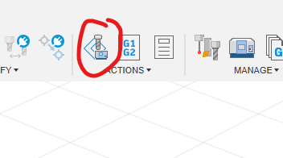


在`Actions`工具列中，找到`Post Process`的圖示。首先要設定機器和Post。

> 機器是加工的工具，而Post你可以理解成CNC的韌體(firmware)，就好像電腦廠商製作電腦，但不會自己研發操作系統，CNC機也一樣，除非是出名的大廠家，否則都只生產機械，再使用第三方的韌體。而其中，**GRBL**就是很出名的免費開源CNC韌體。

在`Post`中，按資料夾圖示開啟library。

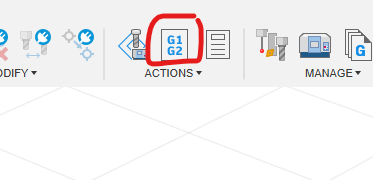


搜尋`grbl`，就會找到3個`grbl`，我們選用`grbl - Grbl`。按下`Select`就會複製到你的電腦上。

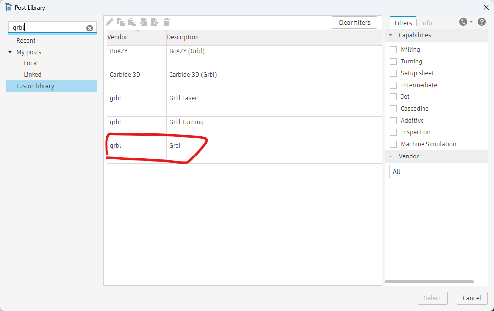


1. `Name/number`: 通常製作一件工件，都會涉及到多條刀路，有時甚至要換刀，這裡的`Name/number`是用來給你定義每個步驟的名字或數字
2. `File Name`: 就是你項目的名稱，你可以用你的名字+工件來命名，方便管理
3. `Output folder`: 如題，你可以選擇桌面或下載
4. `Split file`: 今次的測試我們不會換刀，==但下次需要換刀的話，因我們的CNC機沒有自動對刀功能，要手動再調高，記得要在`Split file`選擇`Split by tool`==
5. 按下`Post`就會得出一個(或多個)*.nc檔案。


用Notepad或其他文字工具打開，你會發現，用於控制CNC機器的G-Code其實就是座標指令。

已經生成的刀路實際上儲存在零件樹中。如果工件的尺寸有變化，在Fusion360中完成修改後，只需再次生成刀路即可，不用再重新設定。


## 3. 生產製作

###3.1 開機和控制機器

1. 開機**<u>前</u>**：
	1. ==**確保紅色的`E-stop`緊急掣<u>已按下</u>**==
	2. ==**確保`Spindel Speed`調到<u>最少</u>**==
2. 開關位置在機箱後方，電源線上方

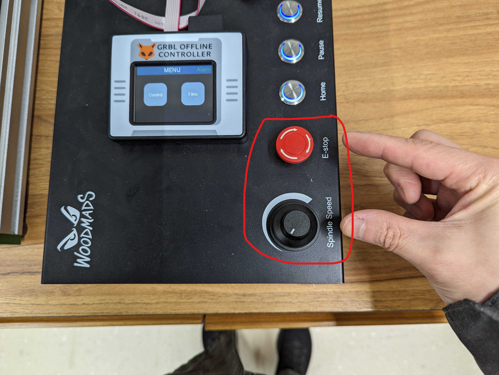


1. 開機後，OFFLINE CONTROLLER的界面右上角會顯示`Alarm`，機器是不能操控的，要先按下`Home`鍵讓機器返回原點。
2. ==Home的方向是向左下角，先**<u>不要安裝左下角的夾具</u>**，待機器歸零後再安裝==。

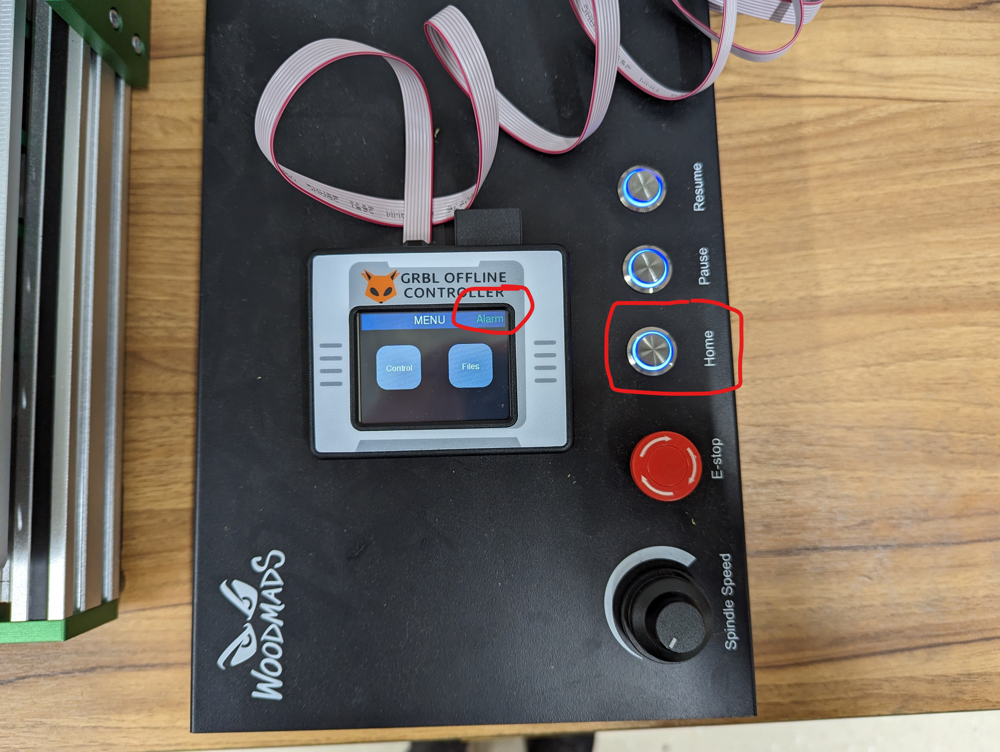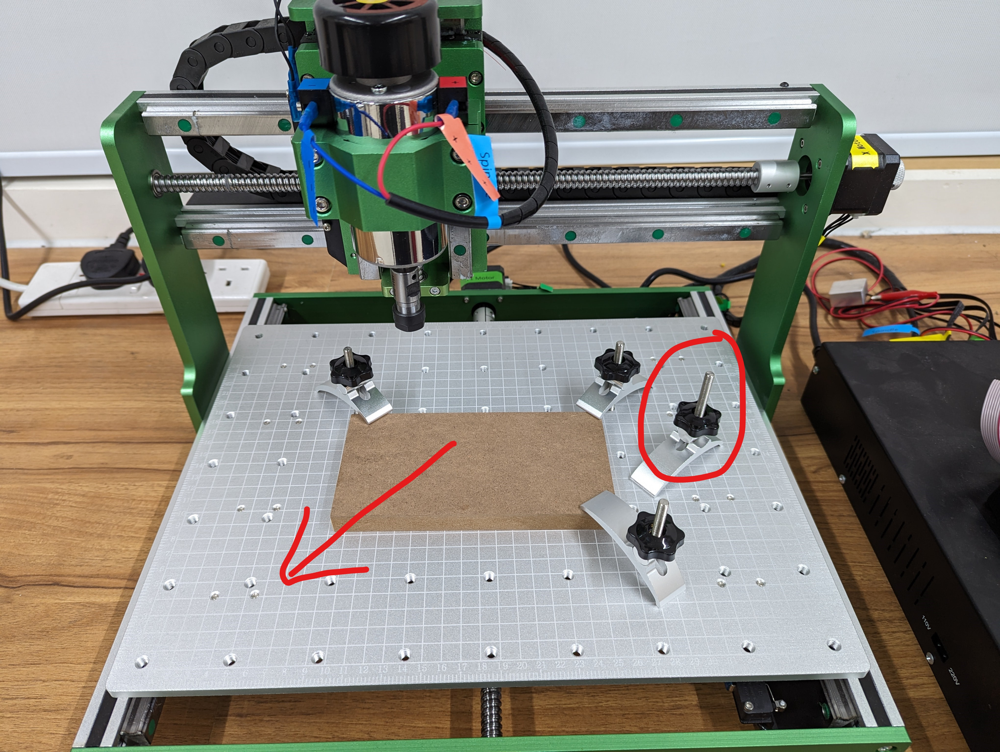


1. 歸零後，機械右上角會變成`Idle`待機。按下左方的`Control`，就會進到控制界面。
2. 按下`Move`就能控制機器。


1. XYZ的正負對應控制三軸的方向
2. 中間的`Step`可以控制移動的幅度：
	1. `Step`：XYZ的正負可長按，機器會快速移動。
	2. 按下`Step`鍵會切換到`0.05`、`0.1`、`1`和`10`，幫忙機器精準定位


### 3.2 對刀

C對刀的意思，是要確立工件的實際位置。就像3D打印機在打印開始前需要校準打印床，確保打印頭在正確的位置開始打印。這兩種情況都需要精確的定位，以確保最終產品的精度和質量。


#### 3.2.1 方法一

1. 將刀的Z軸高度，移近工作物的表面。==(注意：距離接近時，記得將`Step`轉用`0.05mm/步`，否則刀尖會直插入工作物)==
2. 用一般60磅A4紙，隔在工作物和刀之間，將刀用`0.05mm/步`一步一步接近，每下一步時輕輕移動A4紙，直到A4紙==剛好不能動==。

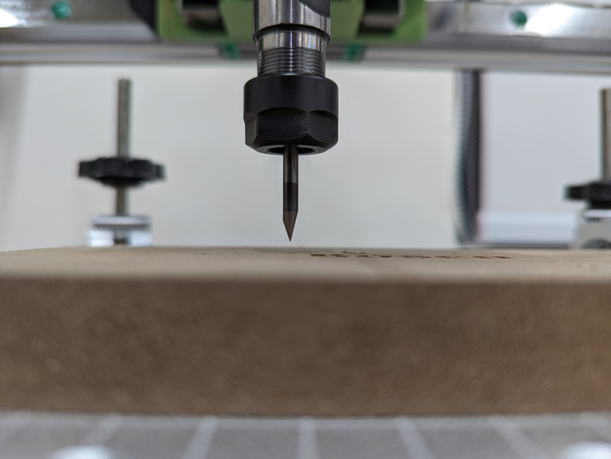


3. 返回主控制界面，按下`Zero XYZ`。
4. 就會跳到歸零的界面，按下`Set XYZ`就會同時將XYZ三軸歸零。
5. ==歸零後記得將Z軸提高==，否則一開機主軸未開始旋轉，刀路就開始走。

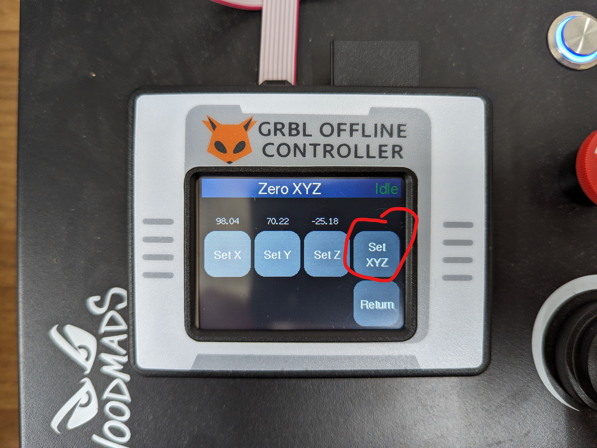


#### 3.2.2方法二

1. 對刀前，==**確保`Spindel Speed`調到<u>最少</u>**==，將機器的對刀器放在刀與工作物之間，==將鱷魚夾夾在刀上==，兩者導電就能歸零。


下載以下檔案，或者直接複雜下面代碼，用Notepad儲存另存新檔，儲存時將副檔名設為*.nc。

----------->  [z probe Z15.nc](z probe Z15.nc) <--------------

```gcode
G21 G91 G38.2 Z-30 F80 		;G21單位為mm，G91使用相對位置模式，G38.2進行探測，Z軸向下移動30mm，以80mm/min的速度進行
G0 Z1 						;第一次探到後，快速移動，Z軸向上移動1mm
G38.2 Z-2 F10 				;進行第二次探測，Z軸向下移動2單位，以10mm/min的速度進行
G92 Z15 					;設置當前位置Z軸的位置設置為15
G0 Z5 						;快速移動，Z軸向上移動5單位
```

1. 上面的這幾行代碼，在進行刀具對刀操作。首先，它將刀具向下移動進行探測，然後稍微提升刀具，再次進行精確探測，最後設置這點的Z高度為15mm(因為對刀器的厚度是15mm)，並將刀具提升。
2. 將上面的代碼存入SD卡中，在主界面點選`Files`，就能找到上面的代碼，按`send`就會開始自動對刀。
3. 上面的代碼==**<u>只會重設Z的高度</u>**==，你還要是移動XY軸到適當位置，然後在`Zero XYZ`介面，**<u>==手動重設X和Y軸的零點==</u>**。


### 3.3 加工生產

完成對刀後，

1. 將Fusion360生成的G-Code抄到SD卡中，例如我的例子是`F5BChanTinMan.nc`
2. 接著回到機器，==**<u>*先將`Spindle Speed`調到最大*</u>**==
3. 在主界面點選`Files`，就能找到你的檔案，按`send`就會開始加工
4. 以我的檔案為例，加工過程大約16分鐘，==**<u>*在機械加工時不要走開，時刻留意，有意外的話立刻按下紅色的`E-Stop`掣*</u>**==


