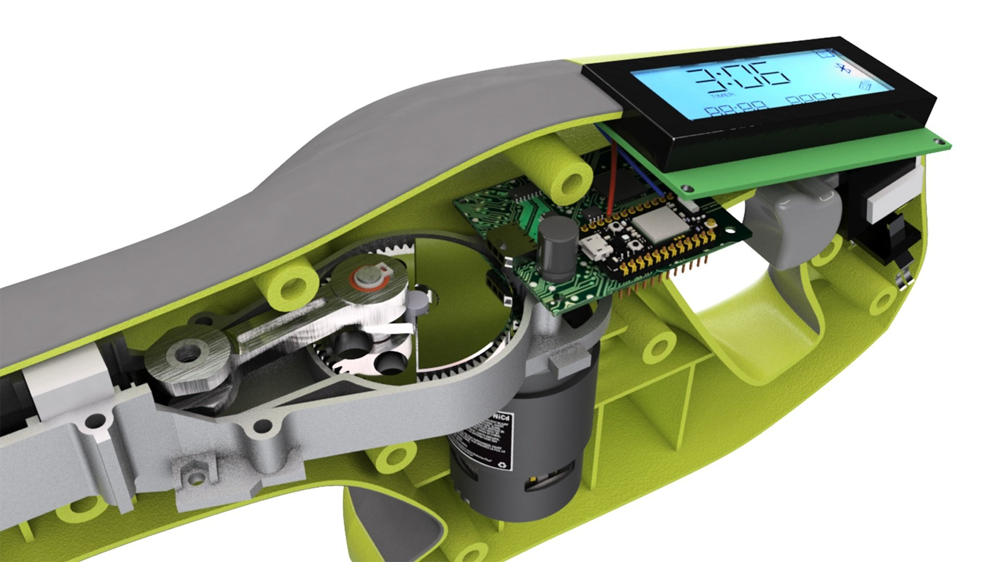

# 0. Preparation

[TOC]

## Fusion360簡介

Fusion360為Autodesk公司所推出的3D特徵編輯軟件。

跟其下的autoCAD和inventor作為區分，autoCAD是最經典的2d繪圖軟件, 在各個工程層面都有十分廣泛的應用，但，autoCAD雖然有3d功能，但並非用特徵編輯，如果3d模型較為複雜，部件較多或經常修改，用非特徵編輯的軟件會十分吃力。

Inventor是autodesk公司早期就推出的特徵編輯軟件，是針對機械工程師設計，目標市場的競爭對手有十分出名的solidwork和solidedge等。此類特徵編輯軟件在繪製三維零件時，在概念上與編程類似，都是設定變量，一步一步執行，例如2d sketch-->擠出-->2d sketch-->削減等等，類似編程編碼由上而下去執行。而Fusion360軟件，就是一個輕量版/web base的Invertor軟件，由於剛開始推出時有一年的免費試用，之後個人版也不收費(現在只有一個月試用，之後個人版也不收費，不過限制增多了)，一推出就受到廣大maker所喜愛。而後來fusion360更加整合了autodesk其下另一款pcb編程軟件eagle的功能，今到Invertor和fusion360的用戶目標區分出來，Invertor比較適合機械工程的深度用家，而fusion360除了比較適合初學者外，**也因為整合了pcb功能，變得十分適合機電整合的項目製作**。

##注冊教育版

自從fusion360的個人版限制增多後，申請教育版就變得十分重要，是故，十分鼓勵同學申請教育版，不要浪費教學資源。

申請教育版的流程，以往十分簡單，只要有@edu尾的電郵去注冊就可以，但現在收緊了很多，以下是截至2021年9月的申請流程，如果之後再有更新，以下方法未必合用。

💡***<u>以下注冊的資料請不要亂填，因autodesk公司的審查越來越嚴格，如果最後一步的上載資料與所填資料不符，可能導致不能注冊成功</u>***

### Step 1

1. 到google直接搜尋`fusion 360 education`
2. 找到`Fusion 360 | Free Software for Students and Educators..`的網頁
3. 你也可能找到下圖的一個影片，是一個香港導師所拍攝的粵語注冊教學

### Step 2

1. 進入網站後，會找到一個醒目的`GET STARTED`按鍵
2. 按下開始注冊

### Step 3

1. 在Country中嘗試找`Macau`，如果沒有的話則選`China`
2. 在Educational role中，選擇你的身分`Student`
3. 在Institution Type中，選擇``High School/Secondary`
4. 出生日期則根據自己的出生日期填寫，之後忘記密碼有可能會驗證生日，所以不要亂填

**<u>❗Fusion教育版需要年滿14歲才能注冊，所以如果你未滿14歲的話, 在年份上修改一下到足夠14歲</u>**

### Step 4

1. 在資料注冊頁面填入以下資料
2. First name是名字，Last Name 是你的姓，請用英文，根據你在本校和教青局注冊的資料填寫
	***<u>❗此名稱用於之後核對你上傳的資料，所以請勿亂填，資料要對得上</u>***

3. 填上email ***<u>❗記得要使用@ism.edu.mo的電郵來注冊</u>***
4. 最後填上password和checkbox就可以

之後就會收要求確認電郵地址

### Step 5

1. 去到你的eclass電郵帳號下，等待收取確認郵件, 並在郵件中的連結按下確認。

### Step 6

1. 確認完郵件之後， autodesk會要求你確認所在學校
2. 在學校中"Name of educational institution"，用繁體中文打上`澳門慈幼中學`，一般打到第3或第4個字已經會有提示讓你選擇
3. "Enrolled from date"和"Expected graduation date"為入讀和預計畢業日期，如實填寫自己form1入學的年份， 月份為9月和預計form6畢業的年份，月份為7月

### Step 7

1. 之後就會進入產品下載的頁面。
2. 在第一個fusion360的"get started"按下就會叫你再確認一下個人資料, 如無更改可按下"confirm"。
3. 最後一步，在下載之前，autodesk會要求你出示在這間學校就讀的證明並人工驗證。
4. 你可以上載:
	1. **成績表: 如果你不介意的話，而且也是最方便的辦法，用手機拍下上載即可。**
	2. 學校發出的在學證明: 此辦法比較麻煩。
	3. 學生證: 由於教青局的學生證上是沒有任何資料的，你需要下載教青局的手機app，之後掃瞄學生證上的qr code，就會得到下面的學生資料，但此資料又沒有學生的姓名，**所以你需要cap下手機的畫面，同時也要將學生證拍照同時上傳**
5. 如果資料正確，大概一日之後就會驗證成功。成功了的話就會發現登入fusion360後title會多了一個教育版的字樣。
6. 等待驗證的日子內，請經常檢看驗證的email, 如果不能成功驗證的話, 會電郵告訴你缺了甚麼。

##Useful Robotics parts 

我們做機械人，做設計，常用到一些實物的零部件，現整理一下方便大家下載使用。

最update版本請在[grabCAD](https://grabcad.com/library/useful-robotics-parts-1)下載。如果嫌grabCAD需要注冊麻煩，也可在按[這裡](./useful robotics parts.zip)。

下載完成後可以到project頁面開一個新的folder, 例如叫tools, 將解壓後的零件到*.step檔*)拖放入去再按**<u>上載</u>**即可。

