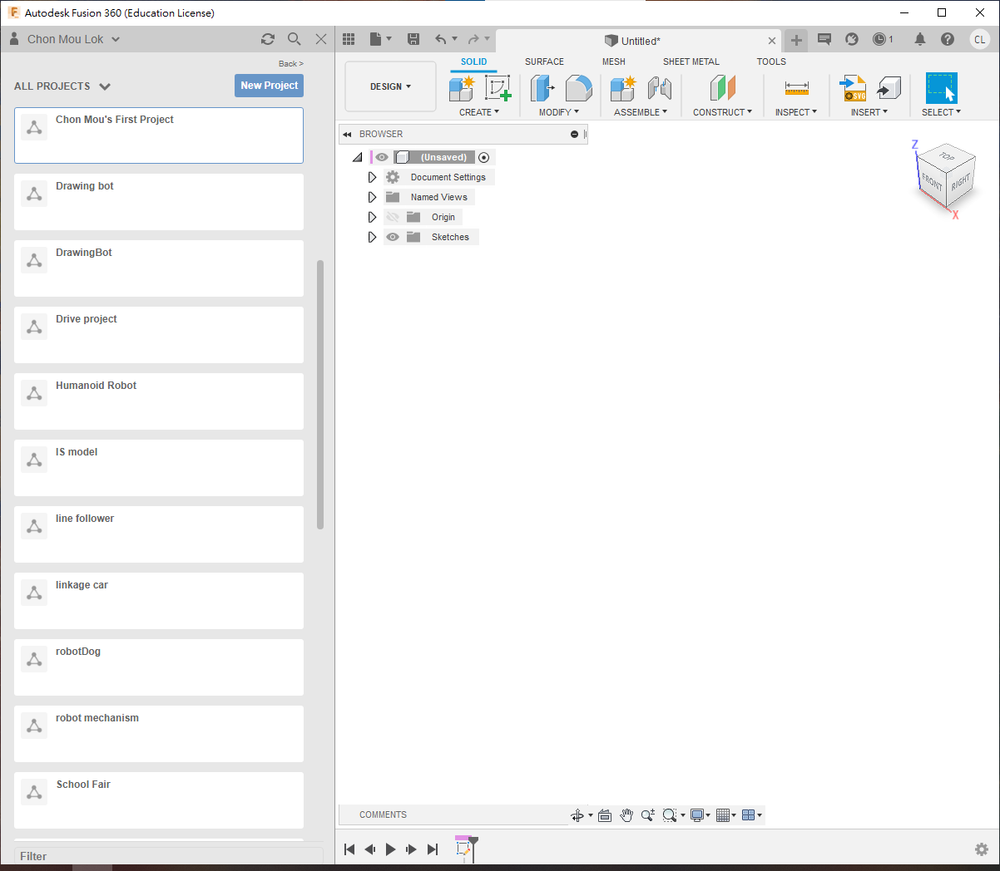
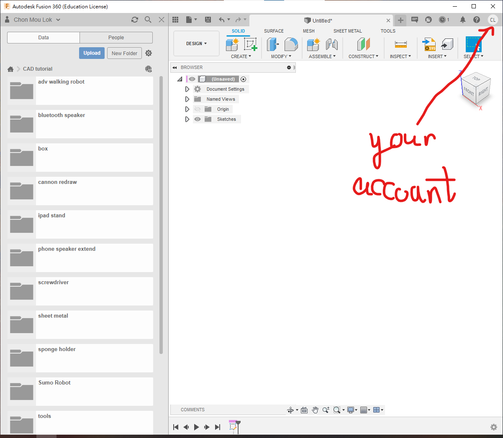
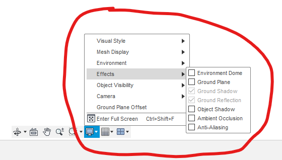
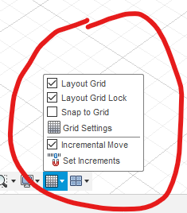
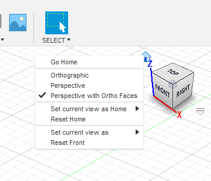
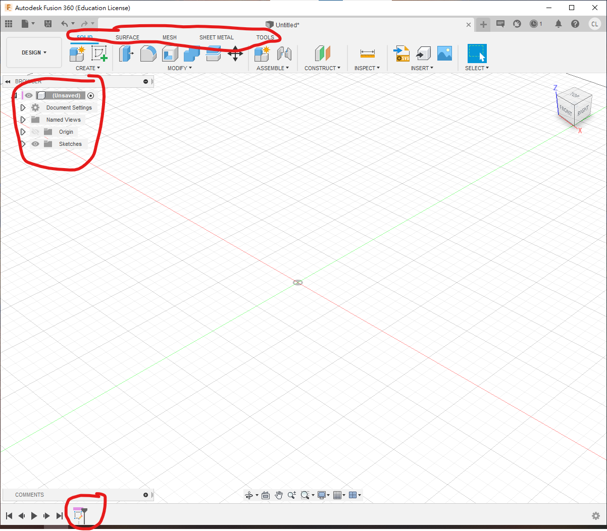

#1.1 Fusion360基本設定

本章將會介紹fusion360的基本設定和用法。

[TOC]

##Step 1 如何存/讀檔

- 進入到fusion360之後，會見到左手邊會有一個9小格組成的符號，打開後會見到你所有的project。
	- 例如現在你需要設計一部相撲機械人，那你的機械人可能牽涉到很多的零部件，那麼，開一個新的project就可以方便管理。

- [ ] 進入Fusion360，點開左手邊的符號，看到project列表
- [ ] 點選`New Project`，名為`first project`或`XXX's first project`

- 進入project後，可以開許多不同的folders，用來分別管理不同的cad圖檔，例如螺絲、絲母、馬達和齒輪等等
- 所有的Fusion360檔案都存在自己的account下，可以下載`*.f3d`檔來保存。如果圖檔包含其他很多零部件組合成的話，下載的則會是`*.f3z`檔

- **由於fusion是網上作業的，所以記得每次都要確定使的account是否自己的**

## Step 2 設定環境

- **❗  介面記得要用英文版，如果是中文版的話，之後做快速搜尋時就要全部用中文搜尋，會比較麻煩**
- [ ] **💡  轉英文版可以在右上角按下你的名字，選擇preferences，第一個選項就是語言**
- 請記得以上提醒，並使用英文版介面，以方便使用Fusion360

------

- [ ] 去到畫圖中下方，點選瑩幕般的符號

- [ ] 出現effects的選項，將所有effects關掉，電腦會更快
	- 如果有獨立顯卡或高階電腦，可以試著開幾個effects，視覺效果更好

- [ ] 按下旁邊的小格icon，可以開啟或關閉ground上的比例格

- [ ] 在畫面右上角，對著小屋的icon，按下**mouse右鍵**
- [ ] 設定視角模式，我個人喜歡使用最下面的`perspective with ortho faces`
	- 這樣平時是透視圖，近的物體比較大，遠的物體比較小；但當需要正、頂、側視圖時，會變回平行投影，方便查看尺寸

##Step 3 認識介面

- Fusion360介面分為上、左、下三部分

- 上介面包括：

	- 不同的工作頁和不同的tag，點擊design按鍵可切換到Design、Rendering、Drawing、Simulation等工作頁面

	- Design頁面中有不同的tag，常用的有solid、sheet metal和tools，其他surface和mech比較少用

- 左介面包含你在此設計中的所有零部件，每個零部件和2D sketch都可設定主從關係，常見的問題是忘記設定立體件(body)屬於哪個零部件

- 下面是建圖歷史區，Fusion360是特徵編輯軟件，會記錄所有編輯紀錄，可在歷史中找到該編輯動作進行修改，對3D打印等尤為有幫助

