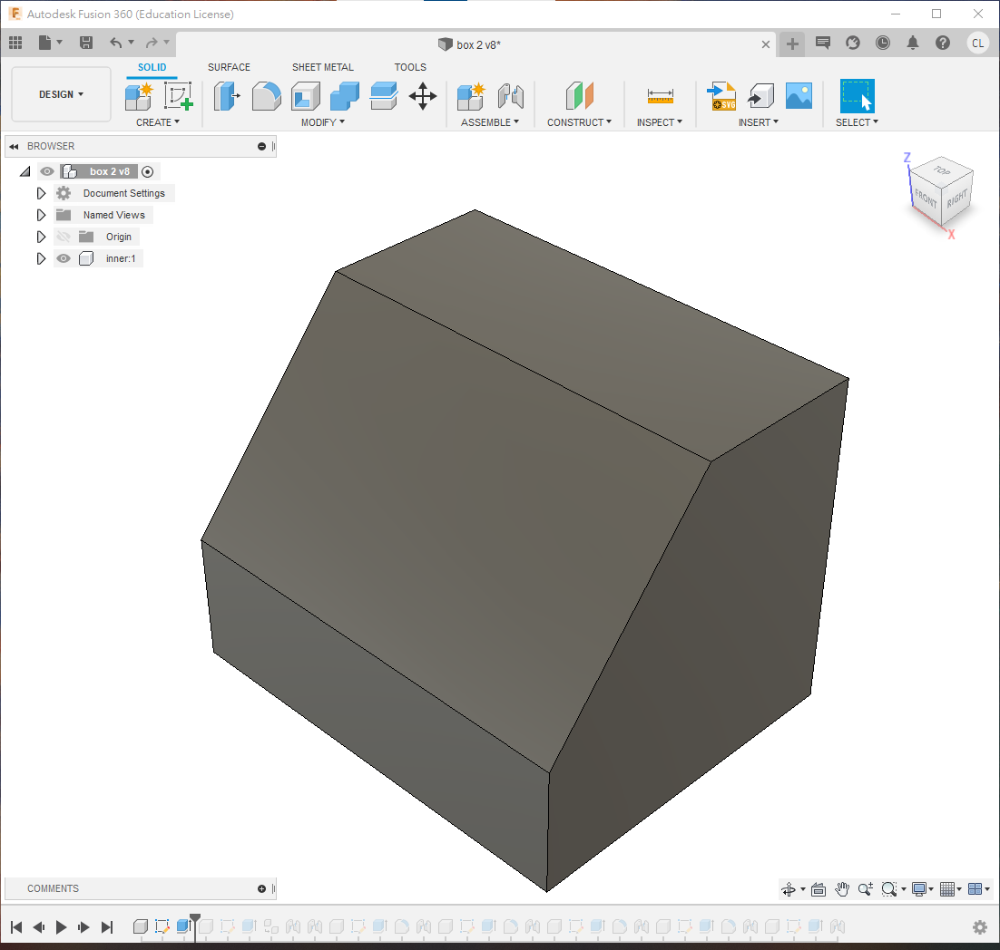
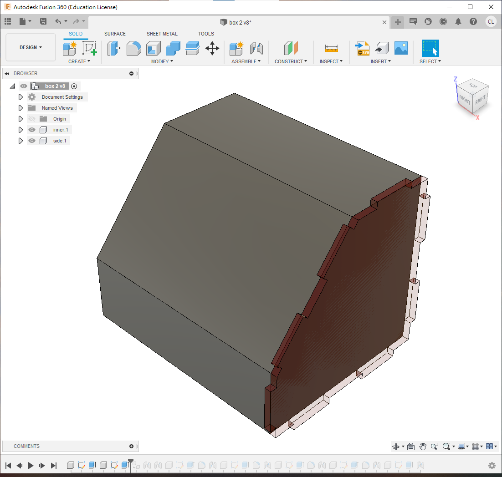
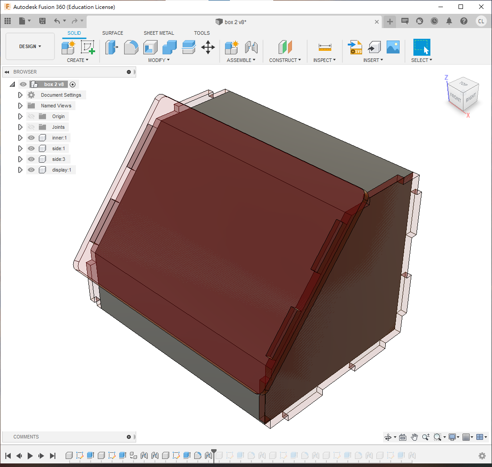
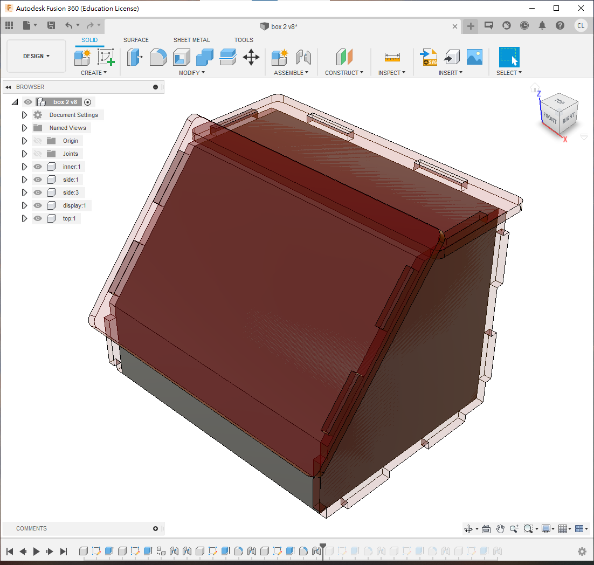
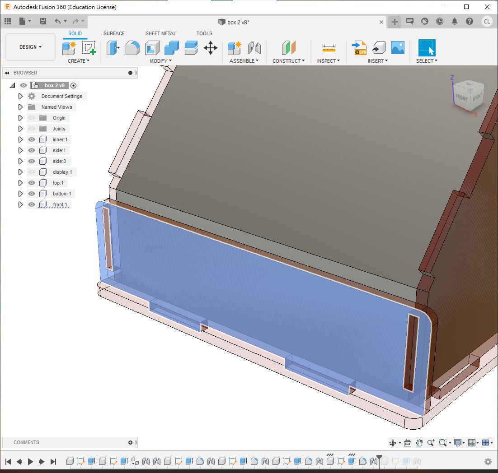

# 2.2 Advanced box

今次製作的，為這樣的一個盒子。

<b><a href="box_2_Drawing_v12.pdf" target="_blank">box 2 Drawing v12.pdf</a></b>

<iframe width=50% height = 500 src="https://www.youtube.com/embed/kjJeNhulm70" title="YouTube video player" frameborder="0" allow="accelerometer; autoplay; clipboard-write; encrypted-media; gyroscope; picture-in-picture" allowfullscreen></iframe>

1. 首先建立一個inner的內層, 指定其形狀(尺寸pdf上有)

2. 新增一個叫"side"的component,

- 在梯形的旁邊投影
- 用thickness 3mm擠出
- 用joint來組合

3. 確保黑點在最上層，複製/貼上和組合另一個側面

4. 跟著就可以建立斜面;      

- 確保黑點在最上層;
- 開一個新的component; 在斜面上投影;
- 斜面的上和下要預留多少許(通常做斜面的原因是用來展示的)

5. 接著就可以製作頂板

- 確保黑點在最上層
- 開一個新的component
- 投影在頂視圖的面
- 上面和旁邊預留`2*thickness`的距離
- 由於前面的斜面會與這塊頂板相撞, 所以這塊板必須要短一些，下面的`fx: 2.517`的尺寸，其實是$\frac{thickness}{tan(180-sideAngle)}$

6.  接著是做底板:

- 確保小黑點在最上層
- 開一個新的component
- 在inner的底部開一個新的sketch
- 投影底部和左右兩塊板, 再在前和後方繪畫四個方型留為榫位
- 在外面再加上一層`thickness`的厚度製造榫位

7.  跟著就是畫前方的板:

- 確保小黑點在最上層
- 開一個新的component
- 在inner的前方開一個新的sketch
- 投影inner的前方和兩塊側板
- 跟頂板一樣，這塊板會與斜板相撞，所以要縮短一些，圖中的`fx:3.575`，其實是$\frac{thickness}{tan(sideAngle-90)}$

8.  最後則是繪畫背面的板:

- 確保小黑點在最上層
- 開一個新的component
- 在inner的背面開一個新的sketch
- 投影背面和上下左右的板
- 在左右位置各加長`thickness`的長度, 用來做入榫
- 最後擠出和joint就大功告成

##完成

完成後，pdf文件裏面有包含phase1和phase2的尺寸, 試著用"change parameter"去修改一下參數尺寸, 看看整個設計是否立即修改
