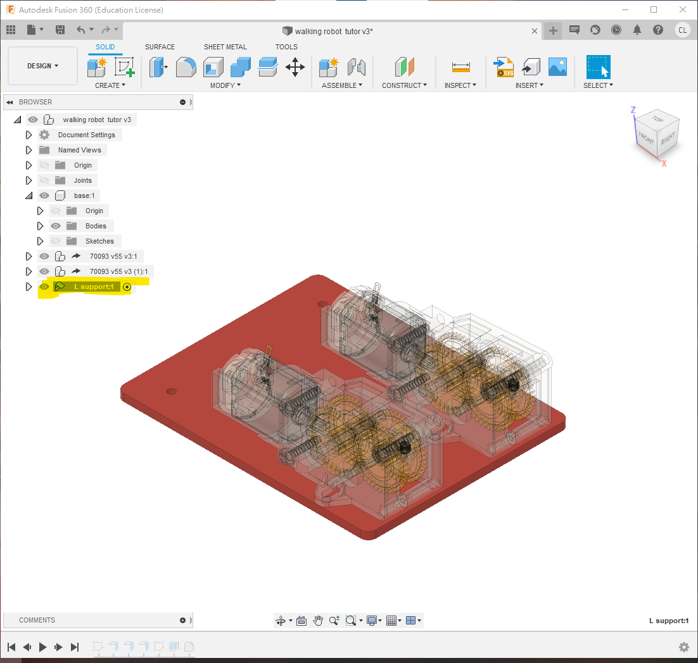
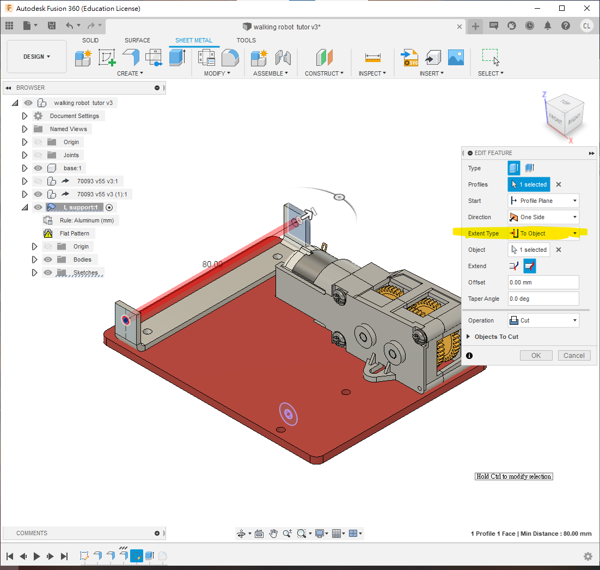
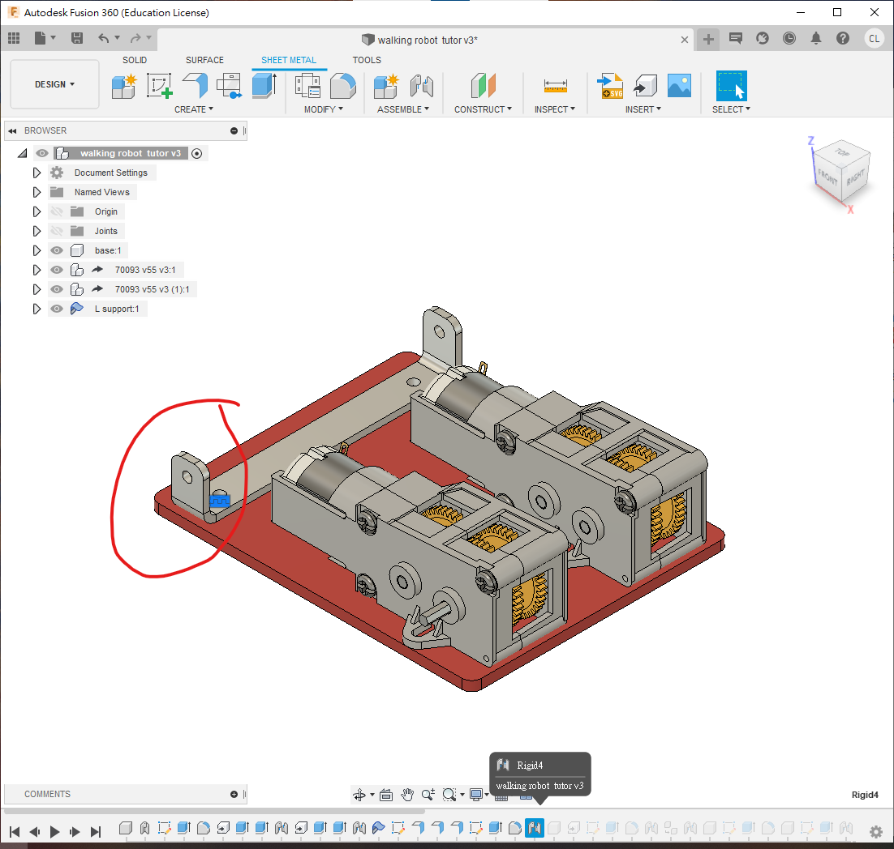
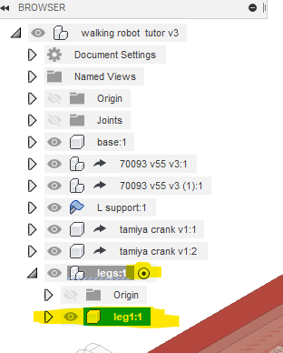
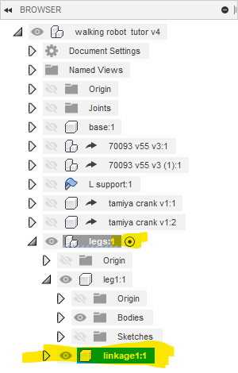
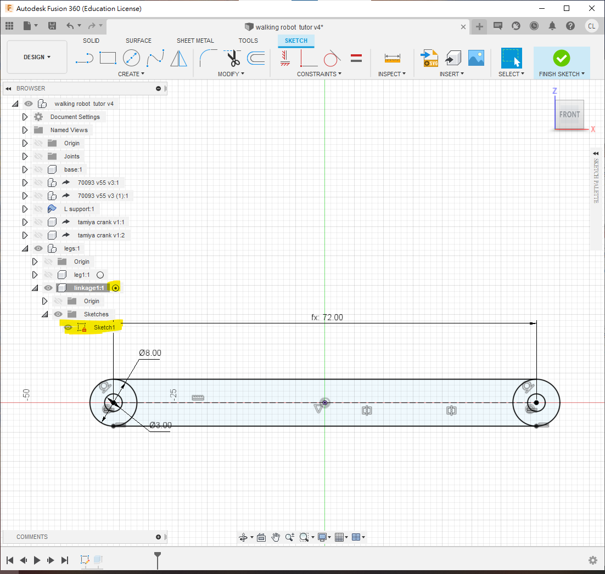
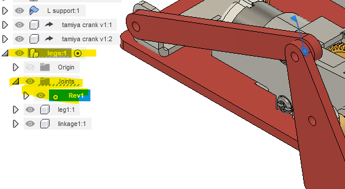

#2.3 Walking linkage robot

本節要繪製的，是下圖這一部四足連杆機械人。本節主要學習應用fusion360中的joint功能，應用不同的joint去模擬連杆機械人的效果。

**[walking robot  tutor Drawing v4.pdf](walking_robot__tutor_Drawing_v4.pdf)**

<iframe width=50% height="500" src="https://www.youtube.com/embed/MEb5YBgFR4s" title="YouTube video player" frameborder="0" allow="accelerometer; autoplay; clipboard-write; encrypted-media; gyroscope; picture-in-picture" allowfullscreen></iframe>

##檔案

本次會應用到的檔案(以下為step檔)，下載**解壓**後，在fusion左邊欄尋找"upload"鍵，就能上載到fuison中應用

[useful robotics component step.zip](useful_robotics_component_step.zip)

或者你可以在grabcad.com直接下載fusion360檔案(需要注冊登入)

[https://grabcad.com/library/tamiya-70093-3-speed-crank-axle-gearbox-kit-1](https://grabcad.com/library/tamiya-70093-3-speed-crank-axle-gearbox-kit-1)
[https://grabcad.com/library/tamiya-crank-1](https://grabcad.com/library/tamiya-crank-1)

##STEP 1

首先，繪製底板，用"s"搜尋"new component", 開一個新的component，名為"base", 或者你自己喜歡的名字。並**確保黑色小點在旁邊**, 代表activate

接著在xy平面(或水平面)， 開一個新的sketch，繪制如下:

 

1. 先用"s"搜尋"change parameter"，開啟參數列表，定義一個新的參數叫"thickness", 值為3mm，跟著用"e"，擠出`thickness` 的厚度 

##STEP 2

如果你是直接用fusion360的齒輪箱檔案(f3d或f3z檔)，齒輪箱只有一種規格

💡*如果你是用useful robotics components step 的step檔案，step檔案中有一個70093L和70093R的檔案，分別為左和右的齒輪箱，長軸並非對稱。*

❗**<u>記得要用insert derive功能, 不要直接拖拉gearbox入去, 否則是不能修改的</u>**

1. 利用"s"搜尋"insert derive"功能，將70093 gearbox插入衍生到此檔案中。
2. 在70093的component上, 按mouse右鍵, 選擇rigid group

 

1. 確保小黑點在這個70093 gearbox旁。
2. 用"e"將齒輪箱的軸適當地修短(或增長, 如果有需要)
3. 再用"j"把齒輪箱組合到底板

 

1. 重復，利用"s"搜尋"derive"功能，將另一個70093 gearbox插入衍生到此檔案中。
2. 確保小黑點在新派入的70093旁
3. 跟上面一樣，用"e"將齒輪箱的長軸適當修剪一下
4. 用"j"組合到底板上

💡*如果用step檔案，今次derive的是70093R*

❗️**<u>記得要用derive功能來插入衍生，不要用copy & paste，否則修改齒輪箱時，左右兩邊會同步喔!!!!</u>**

##STEP 3

接著:

1. 將小黑點退回最上層
2. 開一個新的sheet metal component，名字叫"L support"或者你喜歡的名字，材料和厚度隨便選一個就可以，之後會修改
3. 確認一下，sheet metal component的圖示跟普遍的component是不同的
4. 確保小黑點在旁，activate這個component
5. 在底板的上面，用"new sketch"開一個新的sketch
6. 投影上面的兩個洞
7. 在洞的中心點加上作圖線的中線
8. 繪畫一個寬10mm的方型
9. 可用中點或對稱限制，方型對稱於中線

💡*可以在component的左方找到一個眼睛的icon，點選後可隱藏component方便操作*

 

1. 在sheet metal的頁面中，找到edit rule的icon，在你選用的材料旁邊，會有一支筆的icon，點進去就能修改屬性，例如有厚度，摺的時候要預留多少延展長度等等
2. 在sheet metal的頁面中，找到"Flange"的icon，或者用"s"來搜尋"Flange"
3. 點選剛剛的方型，變成1個厚度2mm的金屬簿片

❗️**<u>確保要用"Flange"製作金屬薄片，不要用"e" extrude擠出</u>**

 

 

1. 繼續使用"Flange"，按下金屬片的邊緣，會自動出現bending功能，
2. bending的高度和位置分別可以設定位"inside", "outside"和"center"三種，就是計算高度和摺疊的位置由那裡計起，你可以試試看有甚麼分別
3. 今次凸出，高16mm(由outer face計起)，位置則由"inside"內側計起
4. 重復，鋁片的另一邊也是16mm高

 

1. 繼續確保小黑點在"L support"旁邊
2. 用"s"搜尋"new sketch", 在凸起的鋁板表面開一個新的sketch
3. 將其中一個齒輪箱顯示出來
4. 用"p"投影長軸和鋁板
5. 在鋁板劃一條中線和一個3mm的圓
6. 用constraints的第一個icon "horizontal and vertical"，指定3mm圓的高度和長軸同高

 

1. 用"e" extrude，選擇3mm圓，到"extent type"用"to object"，將圓孔穿到鋁板的另一面
2. 最後用"f" fillet修圓角，半徑隨意，一般2mm或3mm

 

1. 接著就可以將小黑點褪回最外層
2. 用"j" 組合，將鋁板組合到底板

##STEP 4

1. 繼續確保小黑點在最外層
2. 用"s"搜尋"derive"衍生插入"tamiya crank"曲柄的step檔或者f3d檔
3. 插入之後將小黑點active到曲柄的旁邊，將其activate
4. 在表面用"new sketch"開一個新的sketch
5. 投影並繪製一條線，如圖

💡*可善用component旁的小眼睛icon，適當地顯示和隱藏component，方便操作*

 

1. 繼續確保小黑點在tamiya crank曲柄的旁邊
2. 用"e" extrude，將多餘的曲柄剪走，只留下最近的一個孔
3. 接著就可以將小黑點褪回最外層
4. 用"j" 組合，將曲柄組合到70093齒輪箱的長軸

&#10071;<i><b>如果用的是f3d fusion360檔案, 由於齒輪箱內部是可以轉旋的, 所以用"rigid"即可</b></i>

&#10071;<i><b>如果是用step檔案的話, joint的時候要到"motion"頁面，選用joint的類型為revolving joint</b></i>

 

##STEP 5

1. 確保小黑點在最上層
2. 用ctrl-c/ctrl-v, 將tamiya crank複製多一個
3. 用"j"組合到另一邊的齒輪箱長軸
4. 記得方向要跟另一邊相差180度, 如果左方是向著後，這邊要向著前方

&#128161;<i>*如果零件是完全相同的話，可直接複製/貼上; 如果零件相似但需要有獨立修改，則要用derive衍派功能*</i>

&#128161;<i>*同樣, 如果是用step檔的70093齒輪箱, joint的類型應為revolving joint*</i>

##STEP 6

1. 確保小黑點在最上層
2. 搜尋"new component"，開一個新的component叫"legs"，用來裝起左半邊的全部腳和連杆
3. 確保小黑點在"legs"的旁邊，再開一個新的component叫"leg1"

接下來的所有腳和連杆，請確保必須要在"legs"的下方，否則複製之時，全部的joint組合的關係都會散落，要重新組合

 

##STEP 7

1. Activate剛剛開的"leg1"，確保小黑點在旁
2. 用"s"尋找"new sketch", 在原點的xz平面開一個新的sketch(可先隱藏全部component)
3. 跟著下圖的尺寸繪製
4. 繪製之時，可以用"s"尋找"change parameter", 將連杆的尺寸設為變數，之後只要一改這個變數就會全部更改

 

1. 擠出`thickness`的厚度
2. 再用"f" fillet角度，半徑隨意，約2mm-3mm

 

##STEP 8

1. 接下來，確保小黑點在"legs"的旁邊
2. 用"s"搜尋"new component"，開一個新的component叫"linkage1"
3. activage這個"linkage1"，確保小黑點在旁，開一個新的sketch在xz平面上
4. 繪畫一支連杆，長度用"parameter"來設定一個叫"L3"的變數，都時設定值為72mm
5. 最後用"e"擠出`thickness`的厚度

&#128161;<i>*可以善用hide/show功能，暫時隱藏其他零件*</i>

 

##STEP 9

接下來開始複製和組裝左腳:

1. 首先將全部零件全部顯示出來方便操作
2. 用"j"將"linkage1"組裝在鋁片上
    1. 兩個joint的接口保留距離1mm, 如果是實物裝砌時，可以用1mm鐵墊片將其隔開，確保可以旋轉
    2. 大約將接口的角度旋轉25度，大約即可，方便後面的操作
    3. 去到"motion"的頁面，選用joint的類型為revolving joint
    4. 完成後，會發現這個joint的符號會出現在最上層
    5. 即使是在activage"legs"(小黑點在legs旁)時操作，這個joint也會在"legs"之外，之後複製"legs"時，並不會跟著複製

 

##STEP 10

1. 接著用joint將"leg1"組合到曲柄上，offset 4mm, 這個offset不是4mm都可以, 因為之後要到"motion"頁面
2. 到"motion"頁面選擇"cylindrical" joint, 這類型的joint有2個自由度, 一個是旋轉, 另一個是緣著旋轉軸移動，所以上面選的4mm offset只是參考，並沒有限制的
3. 跟上面的rev7一樣，這個joint即使是在"legs" activate下做, joint也不是在"legs"底下的，因為曲柄並非在"legs"底下

 

##STEP 11

1. 確保小黑點是在component "legs"旁
2. 將"leg1"用joint組合到"linkage1"上
    1. joint接觸面距離1mm, 跟之前一樣，如果實際組裝時，可用1mm墊片隔離
    2. 到"motion"頁面選擇"revo4lving joint"
3. 完成後確認一下，這個joint是在component "legs"之下，之後複製才會跟著被複製

&#128161; <i>記著四連杆組合的秘決為: 3個joints 中, 2個revolve joints 1個cylindrical joint, 次序可以隨意, 這樣就不用計算offset的距離和thickness的厚度</i>

 

##STEP 12

1. 確保小黑點繼續在"legs"旁邊
2. 將"leg1"和"linkage1"用ctrl-c/ctrl-v複製一份, 複製成leg1:2和linkage1:2, 如圖
3. 確保兩隻腳兩條連杆都是在同一個component "legs"之下

##STEP 13

圖1:

1. 確保小黑點在"legs"旁
2. 用"joint"將"leg1:2"組合到"linkage1"之上，offset 1mm間距
3. 到"motion"頁面，joint的類型為"revolving" joint

同樣地, 圖2

1. 將"linkage1:2"連接到"leg1:2"上
2. "motion" type為"revolving" joint
3. offset 1mm

最後，圖3

1. 將"linkage1:2"的另一端，接合到"leg1"上
2. "motion" type為"cylindrical" joint
3. 今次可以不用offset, 因為用cylindrical joint會自動因應剛才兩個offset而調整間隔

 

##STEP 14

這樣，左腳部分就完成了，

1. 試著轉動齒輪箱，看看腳是否跟著動
2. 試著調整leg和linkage的offset間距，由1mm改為0.5mm(或任意數值), 看看修改完之後會否有error警告彈出, 如果正確跟著步驟, 調整參數應該沒有error的

##STEP 15

1. 把小黑點褪回到最上層
2. 用ctrl-c/ctrl-v將整個component "legs"(即左腳)複製一份, 複製成legs1:2
3. 可以在複製的同時移遠一點方便操作

❗**fusion360的鏡像功能是不能複製joint的關係的，所以如果要強求完全左右對稱, 則要全部重新joint一次**

##STEP 16

1. 將最近右邊tamiya crank的linkage1:1用"j" joint到曲柄的孔上
2. "motion" type為"revolving" joint
3. offset 1mm

##STEP 17

1. 最後將右邊的leg1:1, 和餘下的鋁支架L support的孔組合
2. "motion" type為"cylindrical" joint
3. 今次可以不用offset, 因為用cylindrical joint會自動因應剛才兩個offset而調整間隔

##完成

完成之後，

1. 模擬一下，試著轉動右邊的腳，看看是否可以模擬真實機械連杆轉動
2. 試修改一下間隔offset的數值，看看有否出現error
3. pdf文件裏面有包含phase1和phase2的尺寸, 試著用"change parameter"去修改一下參數尺寸, 看看整個設計是否立即修改
