# 3.2 繪製電路圖與佈線圖

讓我們由一個最簡單的555調光器示範開始。

[TOC]

## Start

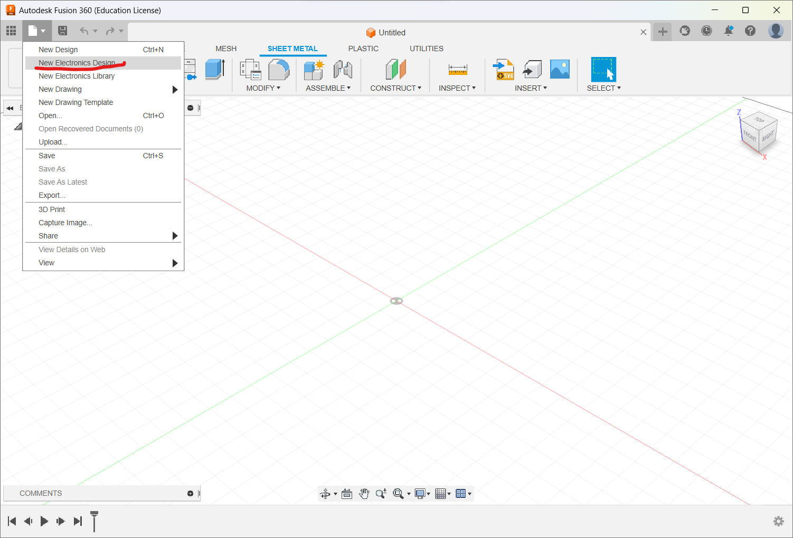

開啟我們熟識的Fusion360軟件。在左上角的`file`中，開始一個新的`New Electronics Design`。

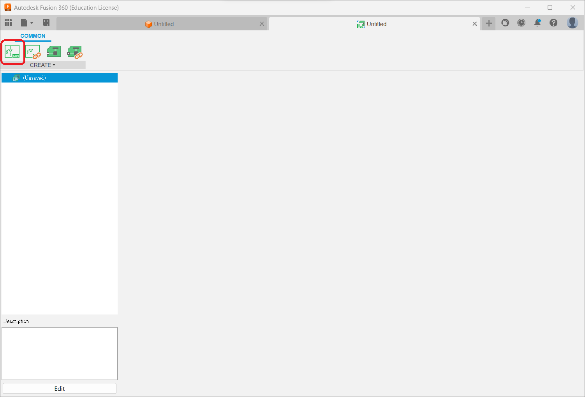

接著會去到管理頁面。一塊PCB板最基本可分為兩種檔案，分別為電路圖和實際樣貌的佈線圖，如果你有心機的話，可以再輸出成3D PCB板，配合Fusion 360去設計。

**首先按左上角，新增一個電路圖。**

## 電路圖

電路圖的介面長這樣。左邊的欄位是可以拖動的，不用時可以將它收起來，或者嫌太小太難看的話，可以將它拖出來放大。

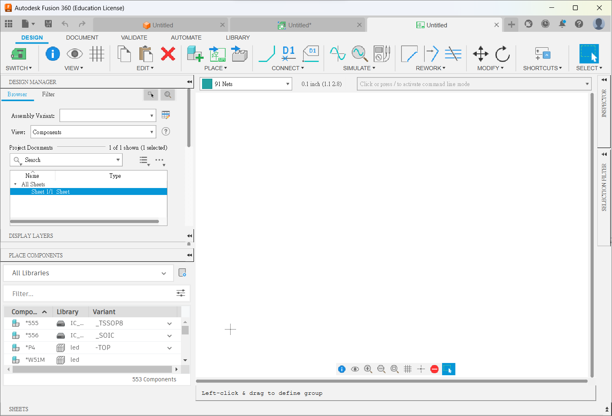

首先，在上方的`Grid Setting`，將格線打開方便對位置。

　　　　　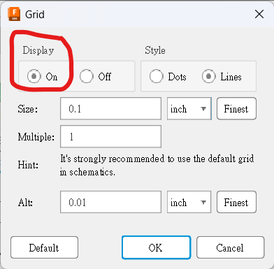   

###插入零件

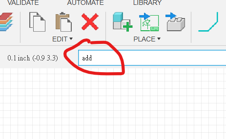

在命令欄打`add`。

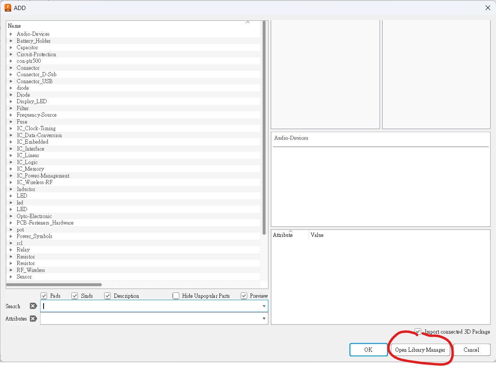

今次我們要製作的電路為555定時閃爍器，所以第一步就是要找到`NE555`。但如果你直接在搜尋欄是找不到的，因為了節省空間，Fusion360是沒有安裝電子元件的library的，所以第一步首先是按`Open Library Manager`。

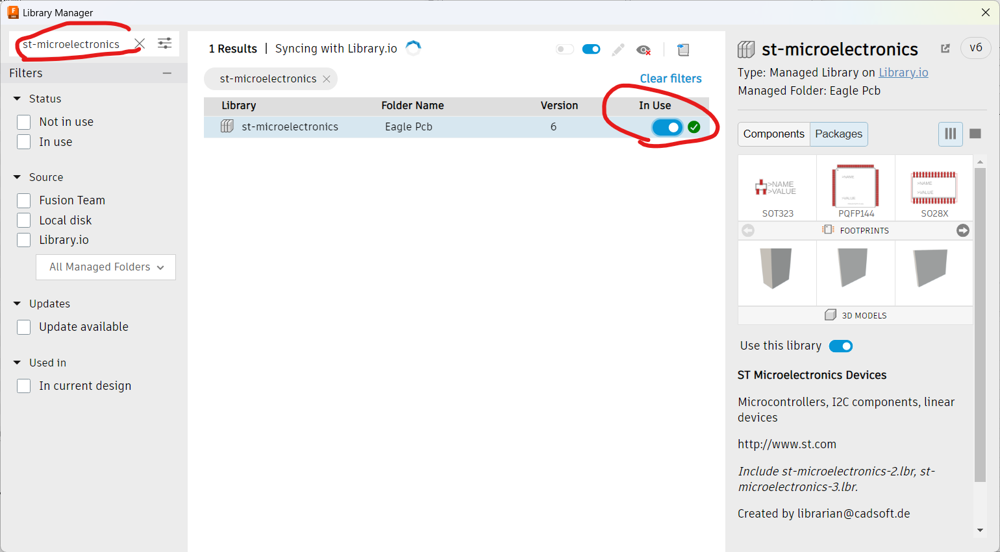

`NE555`有很多個library都有，今次選用`st-microelectronics`，找到這個library之後，點選`In Use`。

之後就能在搜尋欄找到`NE555`。

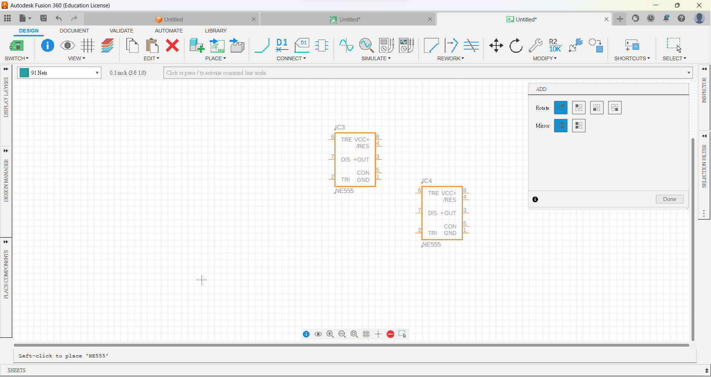

按下`OK`後，就可以在畫面放下`NE555`。

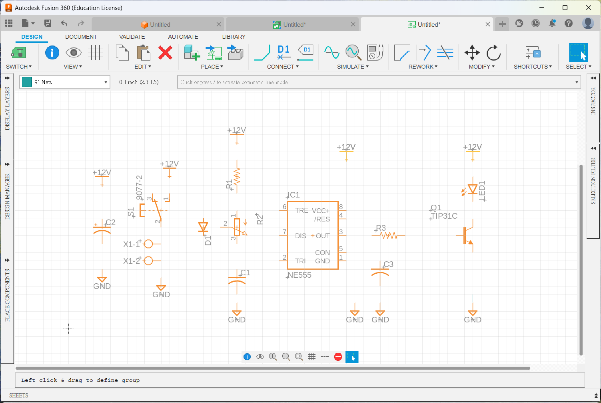

之後就可以按照下表，將零件找出並放好。如果找到到零件的話，記得先搜尋相應的library，選取使用後才能找到。

|Part   |  Value  |   Device    	|     Package  |    Library      |
| ----  | ----    | ----        	|----          |----             |
|C1     |0.1uF    |C-US025-025X050  |  C025-025X050|  rcl 			 |
|C2     |  10uF      |     CPOL-USE2.5-6   |E2,5-6      | rcl                |
|C3     |  0.01uF    |     C-US025-025X050 |C025-025X050| rcl                |
|D1     |            |     DIODE-D-2.5     |D-2.5       | diode              |
|IC1    |  NE555     |     NE555           |DIL-08      | st-microelectronics|
|LED1   |            |     LED3MM          |LED3MM      | led                |
|Q1     |  TIP41C    |     TIP31C          |TO220       | transistor-npn     |
|R1     |  4.7k      |     R-US_0207/2V    |0207/2V     | resistor           |
|R2     |  100k var. |     3RP/1610N       |3RP/1610N   | pot                |
|R3     |  1k        |     R-US_0207/2V    |0207/2V     | resistor           |
|S2     |  9077-2    |     9077-2          |9077-2      | switch-misc        |
|VIN    |            |     AK500/2         |AK500/2     | con-ptr500         |
|+12V   |            |     +12V            |       |     supply1     |
|GND   |            |     GND            |       |     supply1     |

1. 跟據手繪的線路圖，依次將需要用的零件在library中找出來放在繪圖區上
2. 在放置的過程中
   1. 可用`move`指令來移動零件[^1]
   2. 在移動時按*滑鼠右鍵*則可以很方便地旋轉(或者直接用`rotate`指令都可以)
   3. 可用`copy`指令來複製零件。
   4. 可用`name`來為零件命名
   5. 用`value`來為零件設定值

### 連接零件

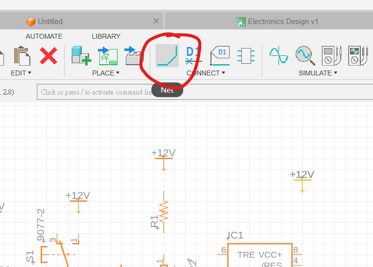

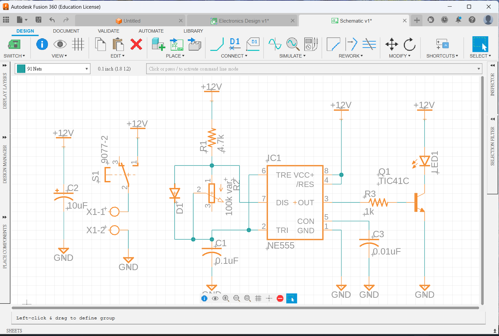

1. 可用`net`指令來為零件與零件之間接線
2. 在用net指今的時候，可按*滑鼠右鍵*來改變接線的方向，你也可以在上方的工具列改變接線的形狀。
3. ==如果接線有重疊，而又有需要連在一起的，記得用`junction`指令為其加入墨點以表示是連結的==

### Electrical Rule Check(ERC)

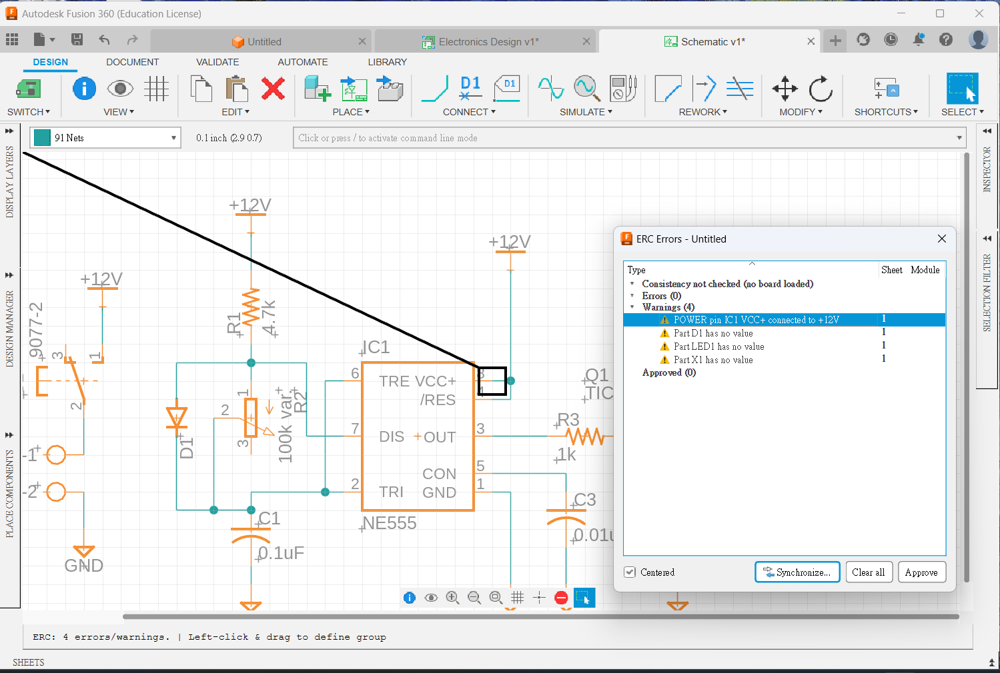

**在命令列輸入指令`ERC`**。接著則要做ERC，檢查一下零件的接線有沒有問題，一般都只會見到有warnings，可以了解一下是甚麼原因，但如果見到有error的就一定要處理。常見的errors可能有: 忘記用`junction`將接線連接、接線沒有真的接到零件、忘記接線、接漏。而常見的warnings不外乎都是零件沒有值。如果不想下次再做ERC時再見到這些warnings，**可以按`Approve`去接受這些warnings**。

## 佈線圖

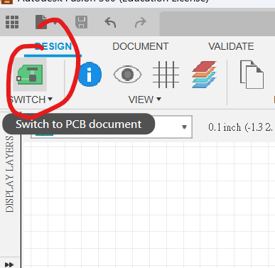

電路圖繪製好之後，就到電路板的佈線圖，這個部分和實物有直接關係，所以佈線時有些地方需要注意。

按下上方工具列有一個小小的白色/綠色icon，寫著`SWITCH`的icon。之後就會開啟多一個檔案。

### 準備工作

之後就會見到一個與之前差不多的介面，插入的零件已經放置在一旁，有幼細的綠色線，代表著剛才sch檔所繪製的電路接線。

先進行準備工作，第一個步驟是打開左上角icon的網格工具，或直接在命令列打`grid`。

Display選擇On，Size則選擇100mil，而下方的Alt則選擇50mill。如此，你在佈線圖上的所有移動和佈線距離都但鎖定在100mil的網格，而當你按下*鍵盤的Alt鍵*時，就會變成50mil的網格。

==100mil即為1/1000英寸，即2.54mm，是典型的面包板的間隔距離，也是一般通孔元件的標準間距，所以佈線圖單位通常都用mil而不用mm==

### 將零件排好

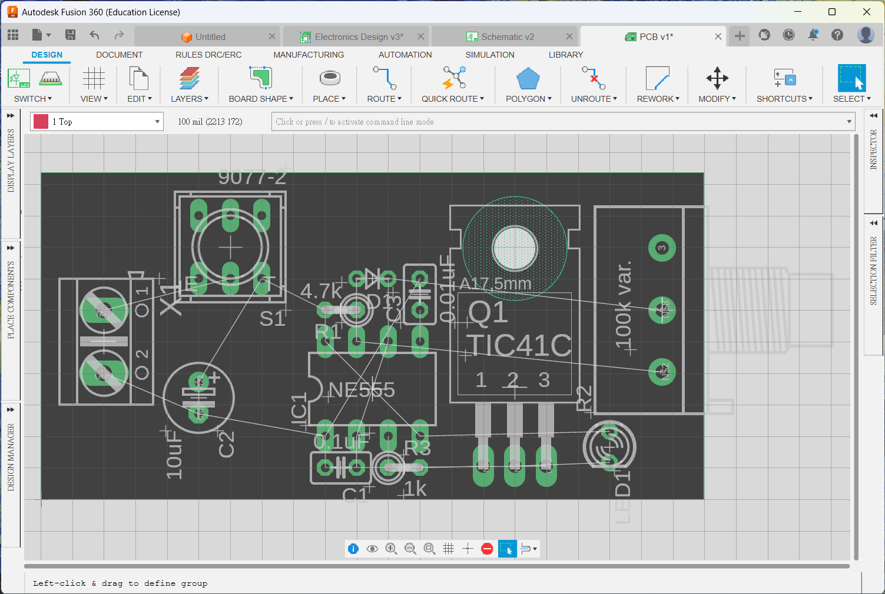

1. 先移動最外層的綠色格，到差不多的大小
2. 跟著就可以用`move`指令，將元件移動到合適位置
3. 移動時可以用*滑鼠右鍵*旋轉，或者用`rotate`指令
4. 移動時可以用*滑鼠中鍵*將元件反轉到板的下方，或者用`mirror`指令(不過今次所有零件我們都會放在頂層)
5. 移動時要留意白色幼線的連接，留意零件的方向和排位，確保之後的連線盡可能短。

### 自動佈線中將所有power線都變粗

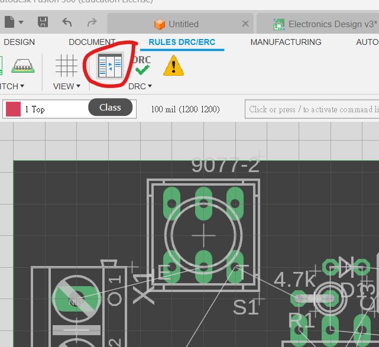

在命令列輸入`class`或在`RULES DRC/ERC`中找得到。

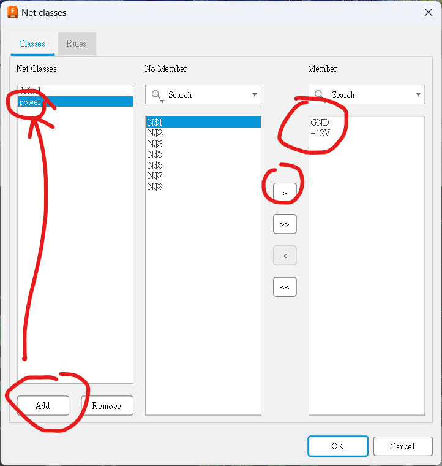　　　　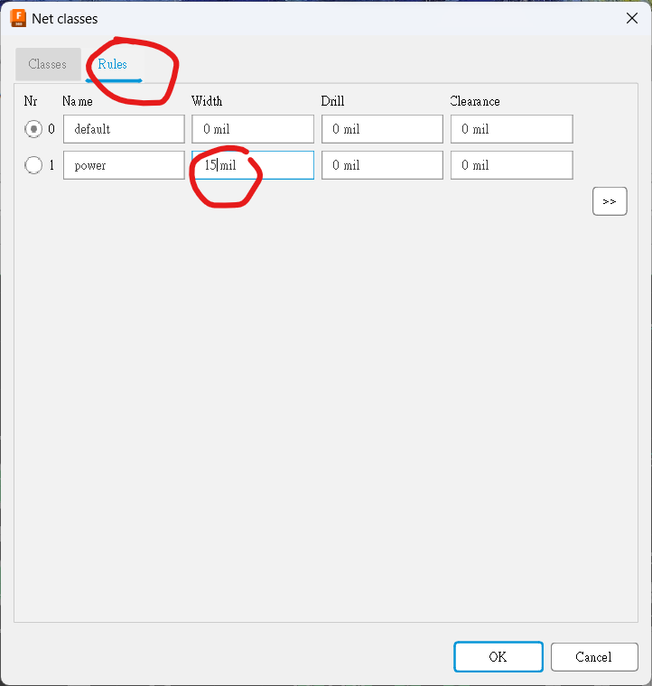 

1. 在第一版按下`add`鍵，新增一個class，名稱叫`POWER`(或其他名稱都可以)。
2. 將`GND`和`+12V`都加進這個class中
3. 在第二版的`rules`中，將POWER的線寬強制轉做15mil
4. 接下`ok`

這塊PCB板因空間十分充裕，所以所有power線都轉成15mil都沒有問題，但如果空間十分狹窄，用這個方法會將本來應該是信號線的`+12V`和`GND`都變寬(例如IC555的4腳雖然接著`+12V`，但並非power腳位)

### Design Rule設定

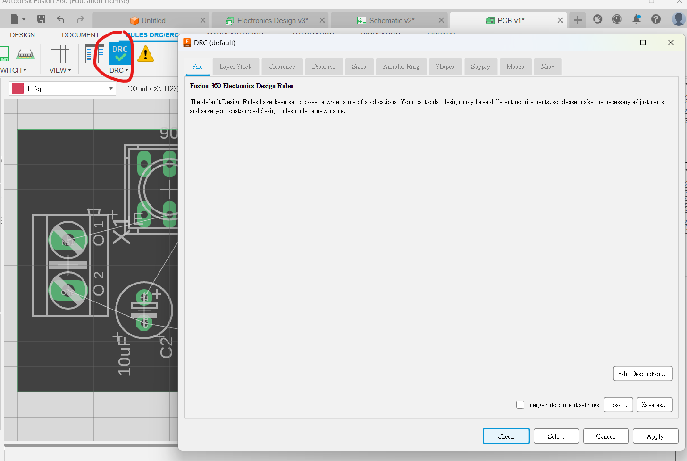

先去到`RULES DRC/ERC`-->`DRC`。

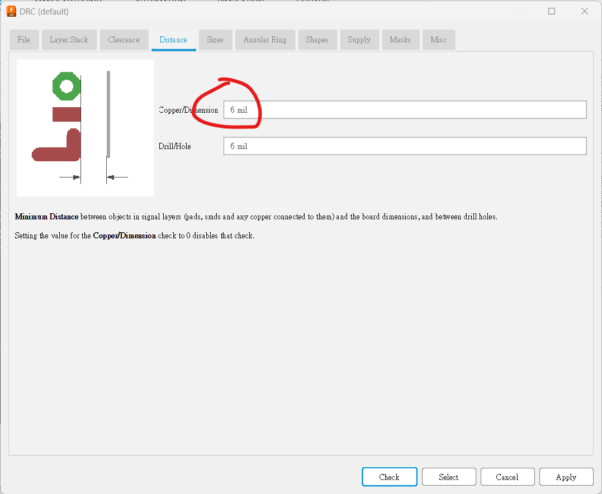

到`distance `這一版設定焊盤、導線等與邊緣的距離，預設是`40mil`，但一般不用設得這麼大，設計`6mil`已經足夠(但今次這塊板空間這樣大，所以都沒有所謂)

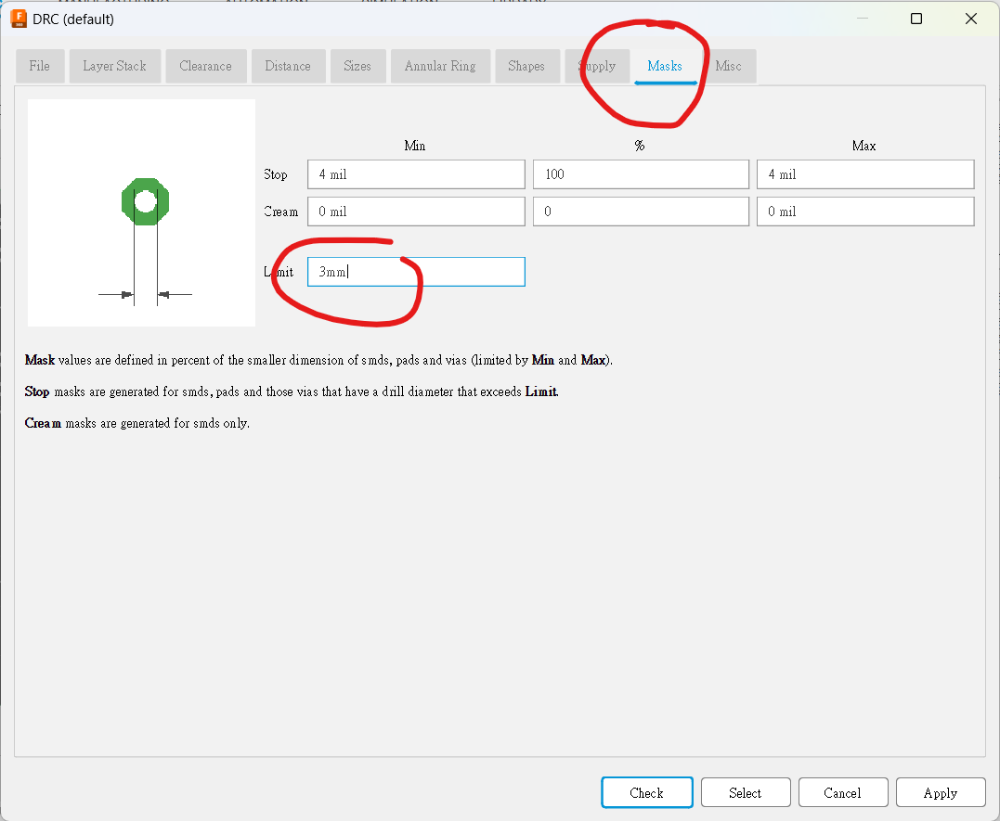

再到`Masks`頁面，上面是決定阻焊綠油距離焊盤要多少緩衝。下面Limit就比較重要，用以決定大於多少的鑽孔不用蓋上阻焊綠油，一般我都會設定為3mm以上，如果設定是0mil的話，所有的通孔都不會蓋綠油，那在焊接時就會很容易不小心短路。

==**最後按下`Apply`。**==

### 自動佈線

接下來只要全部自動佈線即可。

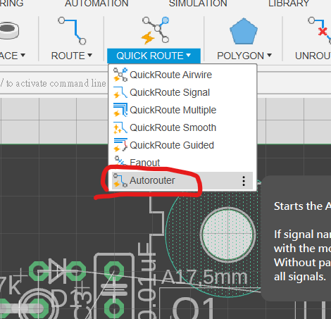

按下自動佈線的icon。

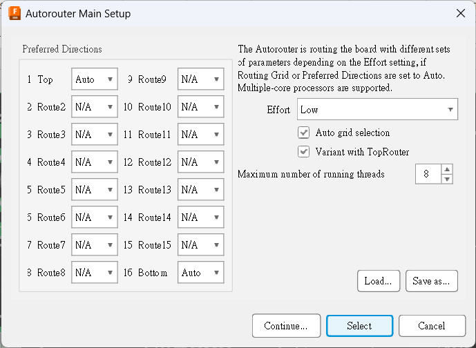

之後就會彈出一個setup的精靈，1-16的意思是有多少層的板，Fusion360最高支持16層的夾板，會我們今次的板只有上下兩層，所以只有1的top和16的bottom需要佈線。按`continue`繼續

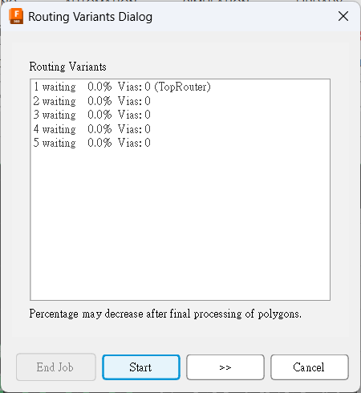

如果手動佈了一點線，就會有一定的百分比已佈線，否則就會是0%已完成，按下`start`繼續。

等待電腦佈線計算，通常下面幾個會計算得比較快，最上的一個因為有經過最佳調教，所以會時間久一點，如無特別的話，用第一個結果就可以了。==記得確保佈線是100%完成!!!==

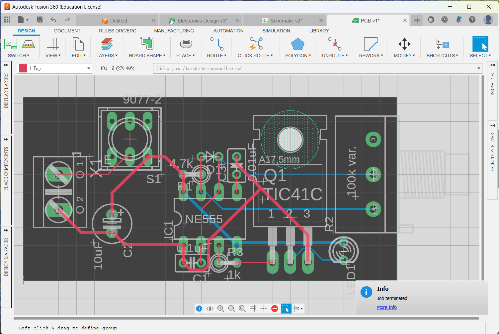

佈好之後就是這個樣子。

之後就會介紹其他必要的設定和怎樣輸出成gerber檔給代工公司生產。

[^1]: 用`group`指令圈起要群組移動的零件，再輸入`move`指令，最後對著highlight後的群組按mouse右鍵，就會找到`Group:move`

## Polygon

在準備輸出之前，首先要做polygon的動作。

因為PCB生產是用完整的覆銅板蝕走不要的地方造成電路，所以如果有很大面積需要蝕走，那泡在酸的時間就會增加，導致一些十分幼的信號線都有機會蝕走或變得十分脆弱，所以在做輸出檔之前，要先將整塊電路板鋪上一增polygon，將引線隔離出來，只需蝕走隔離的部分。

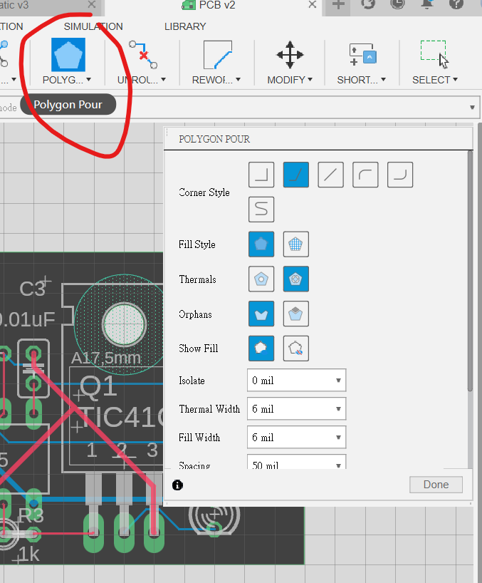

1. 先在左邊工具列按下polygon的按鍵，或者在命令列打`polygon`。
2. 在上方工具列選擇`TOP`
3. 右方的工具列可以保留原值。

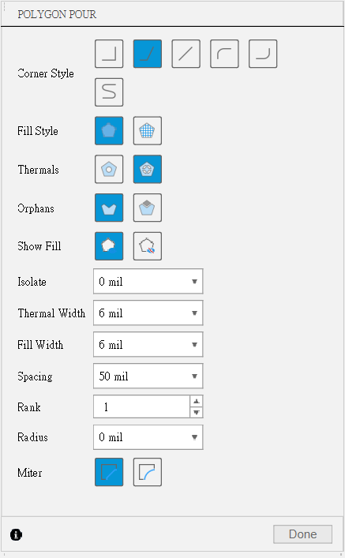

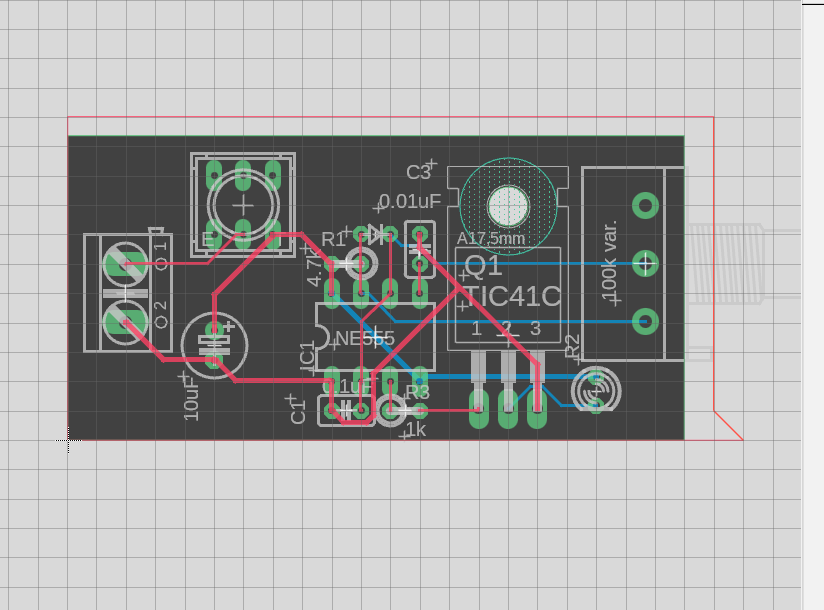　　　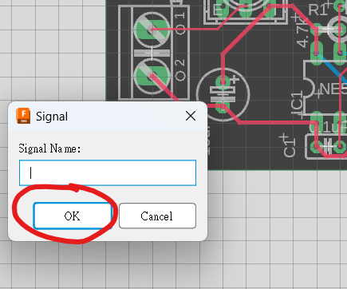　　　　

1. 緣著板邊畫出一個方形。
2. 接合好polygon後會彈出一個視窗，問你polygon接去那個signal
3. 留空就可以，按下`OK`。
4. 一般的電路板都會將這些polygon signal選擇為正電源或負電源，以獲得最大線寬

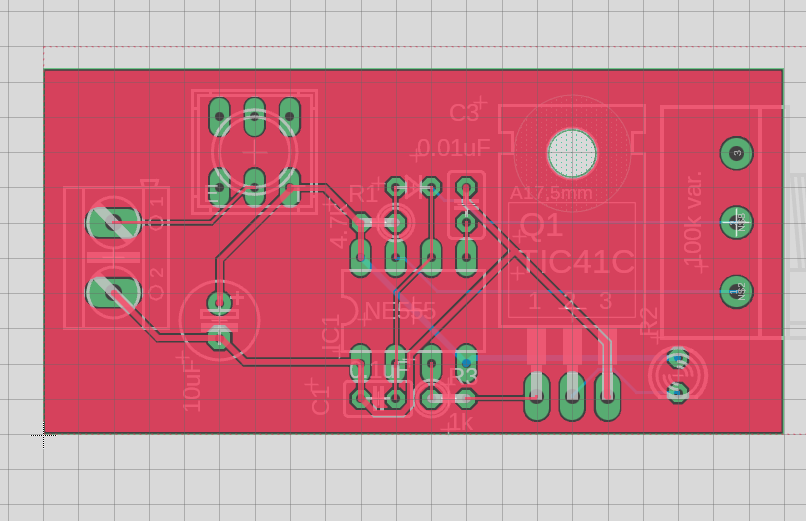

　　　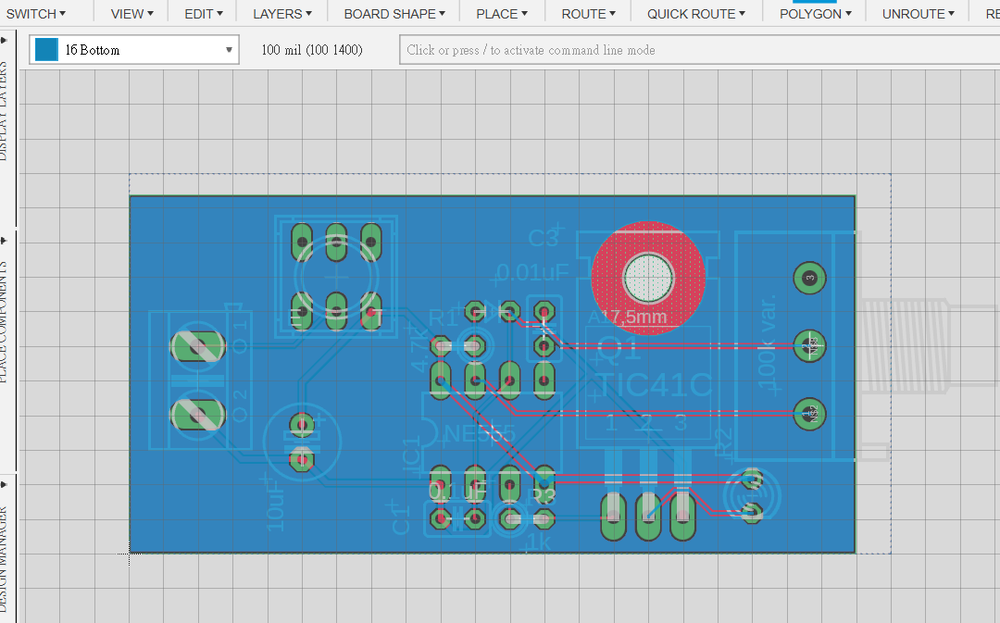

重覆上面的步驟，今次在底層用`polygon`鋪滿銅。

## Design Rules Check(DRC)

跟ERC一樣，設計好的板記得記得要經過一次DRC，去檢查設計是否有出錯。

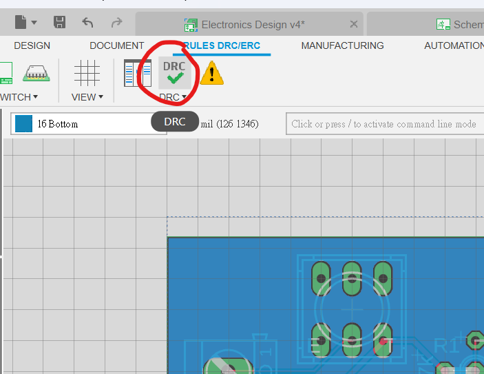

如果板是剛剛自動佈線完成，一般來說都應該是沒有錯誤的，此時不會有任何反應，否則就會出現error的視窗。

==大功告成。==

## 練習1

**555+4017 LED Roulette Circuit**[^1]

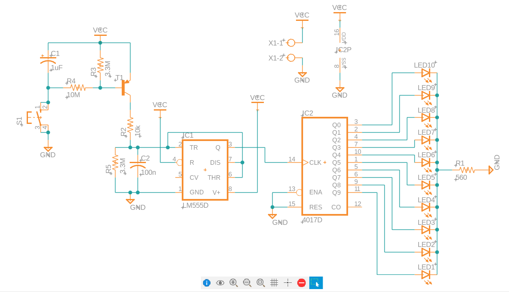

以上練習題為一個555+4017的幸運輪盤，4017的16和8腳預設會隱藏起來，要對著4017按mouse右鍵-->`invoke`，將8和16腳顯示出來。`R1`的值則可以根據`vcc`的電壓值由`330`至`1.5k`不等而其他的零件可以參考下表:

| Part | Value  | Device              | Package      | Library      |
| ---- | ------ | ------------------- | ------------ | ------------ |
| C1   | 1uF    | CPOL-USE2-5         | E2-5         | rcl          |
| C2   | 100n   | C-US025-024X044     | C025-024X044 | rcl          |
| IC3  | LM555D | LM555D              | SO08         | linear       |
| IC2  | 4017D  | 4017D               | SO16         | 40xx         |
| LEDs |        | LED3MM              | LED3MM       | led          |
| R1   | 560    | R-US_0207/10        | 0207/10      | rcl          |
| R2   | 10K    | R-US_0207/10        | 0207/10      | rcl          |
| R3   | 3.3M   | R-US_0207/10        | 0207/10      | rcl          |
| R4   | 10M    | R-US_0207/10        | 0207/10      | rcl          |
| R5   | 3.3M   | R-US_0207/10        | 0207/10      | rcl          |
| S1   |        | 10-XX               | B3F-10XX     | switch-omron |
| T1   |        | BC557A-PNP-TO92-EBC | TO92-EBC     | transistor   |
| X1   |        | AK500/2             | AK500/2      | con-ptr500   |

跟之前的步驟一樣做ERC的話，會有以下error, 是正常的，全部approve就可以了，如果有其他以外的error就真的是error了。

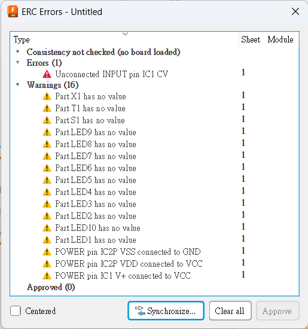

### 佈線圖

這是一個555的抽獎燈線路，所以LED燈要佈成一個圓形，但如果手動佈的話很難確保是一個圓，這裡可以用到一個指令叫`arrange`。

1. 第一步首先將電路板的邊界設定成2000mil x 2000mil
2. 之後一次過選取10粒LED
3. 在命令列打上`arrange`
4. 這時會彈出一個視窗，選取圓形陣列，中心點打1000mil x 1000mil，超始角度為90度(即正上方)，半徑800mil

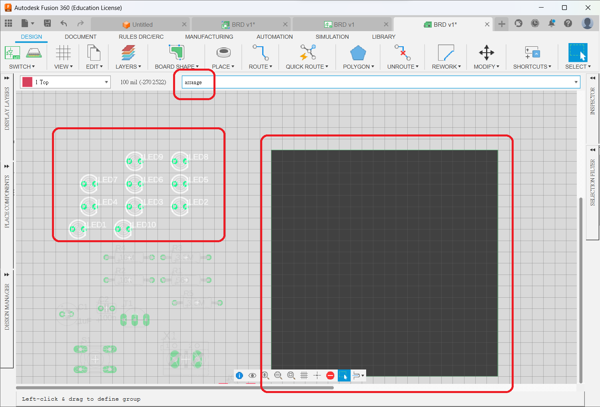

1. 接著就可以隨意將其他零件擺放，只是要注意，電源應該放在最外面，而接鍵應該放在最中間。
2. 記得參考之前的例子，設定`DRC `rules將`distance`設定成`6mil`, `masks`中的`limits`設定成`3mm`
3. 還有`class`中新增一個叫`Power`的class，線寬設定成`25mil`，將`VCC`, `GND`和==R1與LED負極的接線==也加到這個class中。
4. 最後再加入polygon。

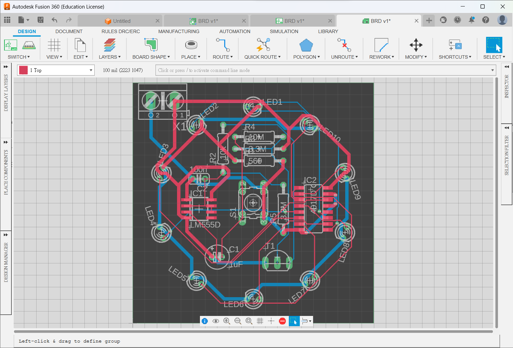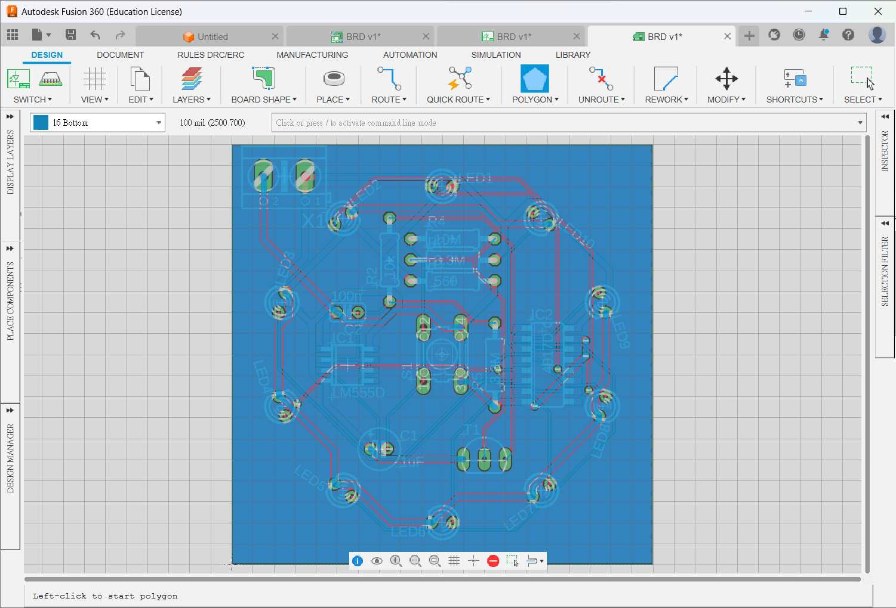

[^1]: 有些IC的power線預設是接在特定的例如vcc, vdd等引腳，所以會隱藏起來, 要將其展示出來，步驟如下:

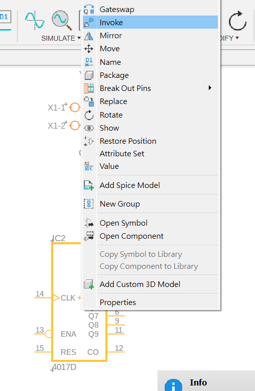 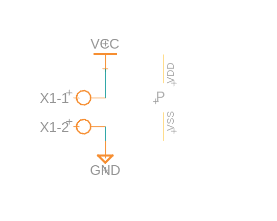

##(附錄)真正生產時Design Rule設定

==記得到先設定好所有design rule再做自動佈線，佈線後再改design rule，要重自動佈線。==

接下來，就讓我們逐個Design Rules的設定去看看，有些設定是需要特別注意和有用的。

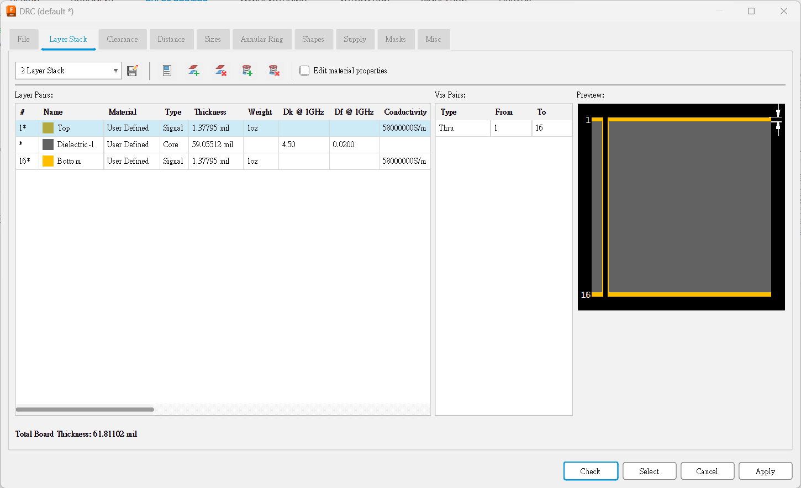

由第二版說起，Layers: 設定板的層數和覆銅的厚度，1.37795mil(0.035mm)厚的覆銅，就是一般1oz/feet^2^ 的覆銅板，fusion360預設是雙層板，上層和下層都是1oz/feet^2^的板，如果你有需要，你也可以用上面的icon去增加或減少層數。工業生產的電路板，可以去到16層板

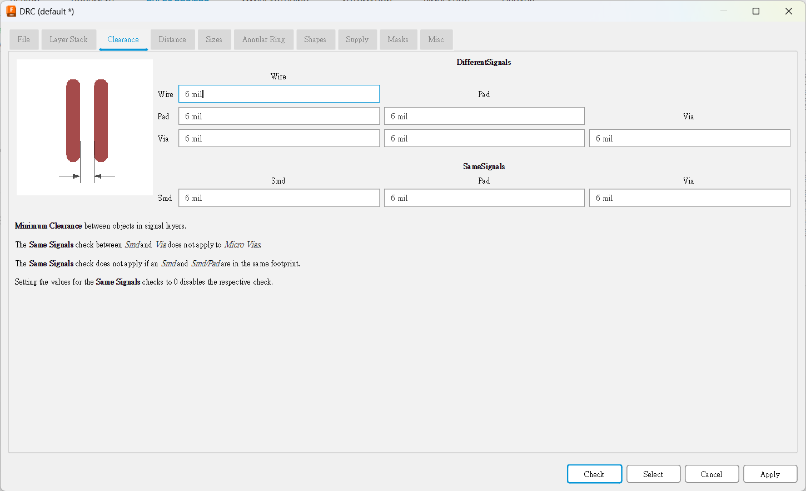

clearance: 很直觀的告訴你，是引線、焊盤、通孔等等之間的最少距離，6mil是一般PCB廠的最少距離，這個數不能再小了。

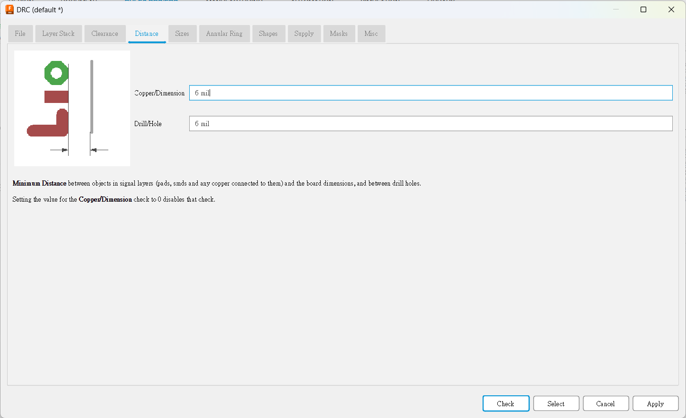

distance: 這一版設定焊盤、導線等與邊緣的距離，預設是40mil，但一般不用設得這麼大，設計6mil已經足夠(但今次這塊板空間這樣大，所以都沒有所謂)

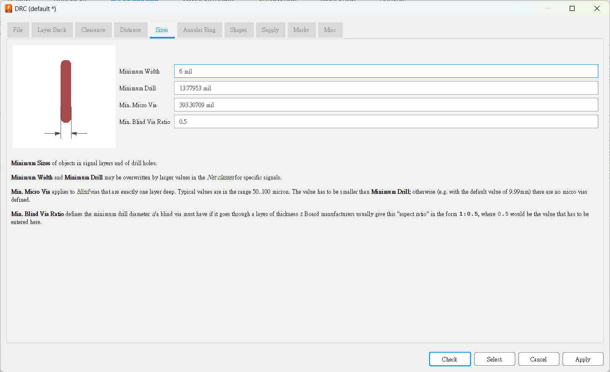

size: 這個頁面主要決定線的寬度，同樣，6mil是一般的PCB廠最小的線寬

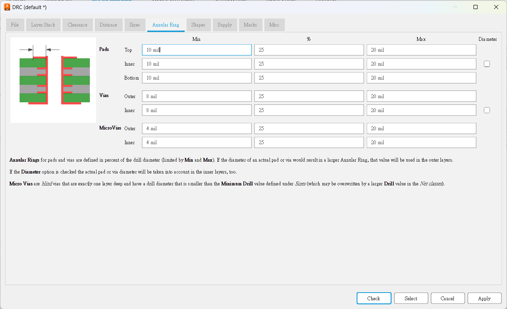

Annular Ring: 決定pad焊盤的尺寸。一般預設的電容、電阻等零件，焊盤都不會很大，==對焊功較差之人很容易會虛焊，可以在這裡將%調大一點，那度焊盤就會大些==。

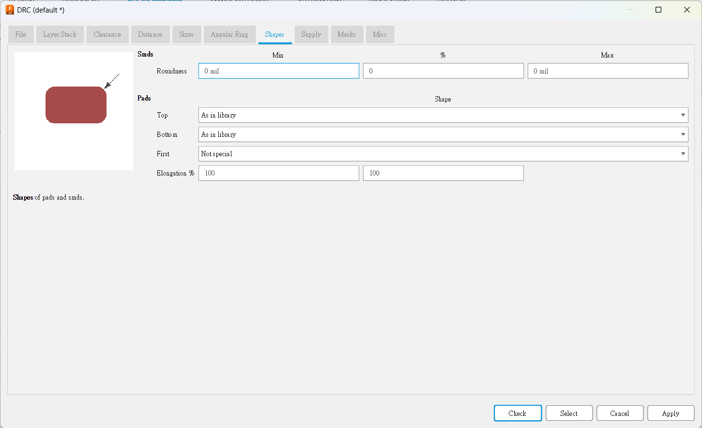

Shapes: 決定smd焊盤的圓角尺寸，下面的pads選項，則是決定通孔元件焊盤的形狀，可以設定為圓形、方形和八角形，也可以選過Elongation %將長焊盤加長或縮短。

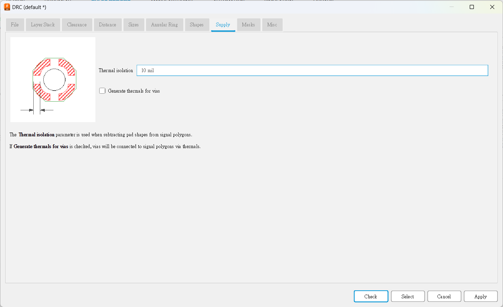

Supply頁面: 決定隔熱層。如果PCB有用整面銅箔來作為信號(一般是正vcc或gnd)，那麼在焊接時，電烙鐵的熱會散走，導致很容易虛焊，所以一般都會有入隔熱層，但如果用整面銅箔的原因是導大電流的話，就要將隔熱層設成0mil。

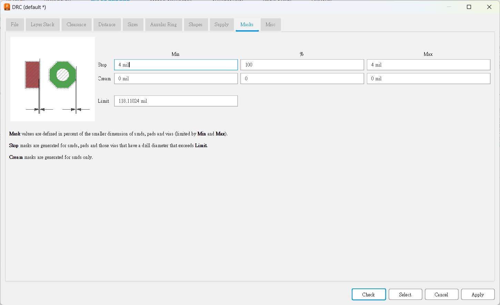

Masks頁面: 上面是決定阻焊綠油距離焊盤要多少緩衝。下面Limit就比較重要，用以決定大於多少的鑽孔不用蓋上阻焊綠油，==一般我都會設定為3mm以上，如果設定是0mil的話，所有的通孔都不會蓋綠油，那在焊接時就會很容易不小心短路==。

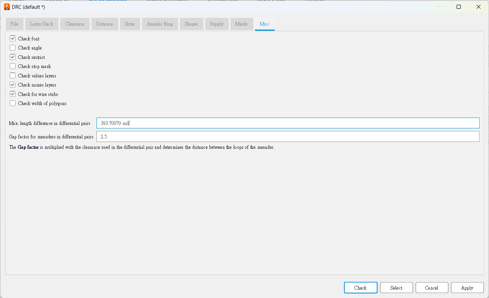

最後一版設定是否檢討字型等等，因為values層都會加入pcb絲網層，所以可以加入檢查。

***==最後如果經常使用這個design rules的話，可以返回第一版將設定的規則儲存起來。==***

