# 3.3  生產PCB

今次生產服務介紹就用youtube maker較為常見的JLCPCB，選用的原因有:

1. 公司位於深圳，出貨和運貨都比較快，如果身處外國也可以寄去外國
2. 有製作5塊的選項(一般淘寶的PCB廠最少都要10以上才會幫你造)
3. 平價: JLCPCB要搶佔外國市場，只需要2美金就可以造5塊，一般淘寶最少都要RMB35才能起跳造10塊，但一般情況下其實自家DIY project我們實際只需要1至2塊。
4. 有互動式的選項和即時電腦報價，你可以試清楚那一個組合更加化算(因PCB生產是計算面積和有起步費的，所以做50塊的價格不一定是10塊的5倍，視乎需要好好組合有時會便宜點)

以下的介紹不保證時效，可能一年半載後介面和收費也完全不同，所以才專門開一個新的chapter來介紹。而且我也沒有收任何廣告費去宣傳。

[TOC]

## 輸出生產檔

檢查完沒有問題，確認value和name等label都有放好，就可以輸出生產。

PCB生產，會接受一種標準的生產檔案，叫做==gerber==檔案。當中包括**<u>8個</u>**副檔名的檔案:

1. `*.GKO `: Mechanical，為機械生產檔，包含需要銑的刀路(`20: Dimension`, `48: Milling`)
2. `*.CMP`: Component side，包含PCB頂層所有的銅箔線路、焊盤和通孔(`1: Top`, `17: Pads`, `18: Vias`)
3. `*.SOL`: Solder side，包含PCB底部走線、焊盤和通孔(`16: Bottom`, `17: Pads`, `18: Vias`)
4. `*.PLC`: Silk screen CMP，component side的絲網層，就是頂層的絲網印刷文字圖檔，原始檔案只包括`20 Dimension`, `21 tPlace`, `25 tNames`, 但如果要再清晰的話，就需要額外包括: `27 tValue`, `51 tDoc`
5. `*.PLS`: Silk screen SOL，solder side的絲網層，就是底層的絲網文字層，包括: `20 Dimension`, `22 bPlace`, `26 bNames`, 可以再額外包括: `28 tValue`和`52 bDoc`
6. `*.STC`: Solder stop mask CMP, component side的stop mask，stop mask就是最後PCB外露銅箔，不覆蓋綠油的地方，`stc`檔除了用來生產外，也可以用來製作鋼網，放便掃錫膏焊接貼片式元件，包括: `29 tStop`
7. `*.STS`: Solder stop mask SOL, 就是底層的stop mask層，包括: `30 bStop`
8. 最後，額外會有一個鑽孔生產檔: `*.DRD`: Generate drill data, 包括: `44 Drills`, `45 Holes`, 額外要包括: `46 Milling`

這些生產資訊，會用到2個cam檔去生產出上面的8個生產檔:

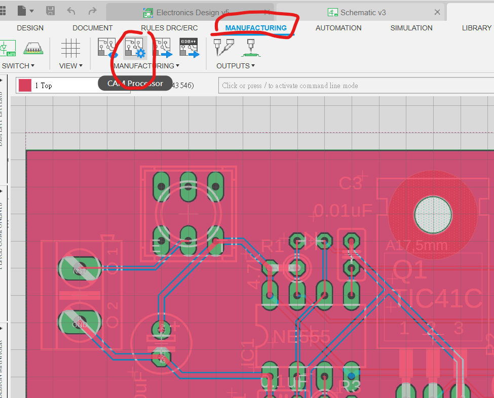

找到上方toolbar的`CAM Processor`, 

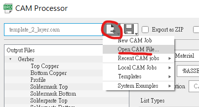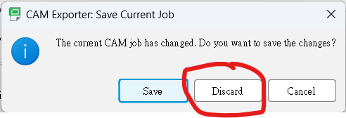

按下`Load Job file`按鍵, `Open CAM File`, 

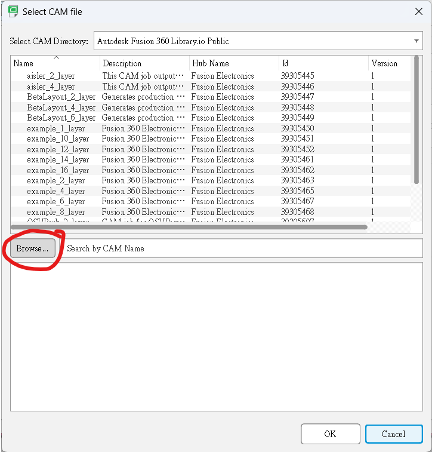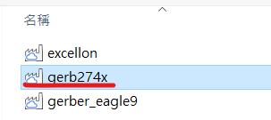

下載這個[==檔案==](gerb274x.cam) <-----這裡，名叫gerb274x，找到路徑後按`開啟`。

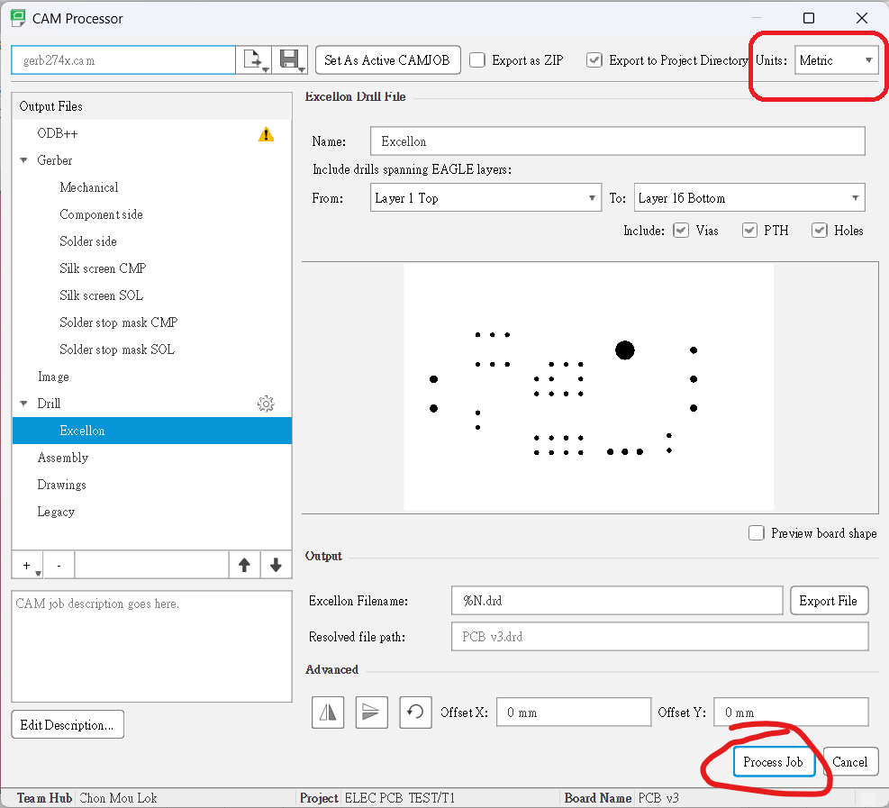

 之後就可以見得到之前介紹的頭7個生產檔案副檔名和另一個鑽孔檔的副檔名。對一對沒有問題的話(一般都不會有甚麼問題，除非你開始錯誤)，對一對單位是Metric公制，就可以按下右下角的`Process Job`。

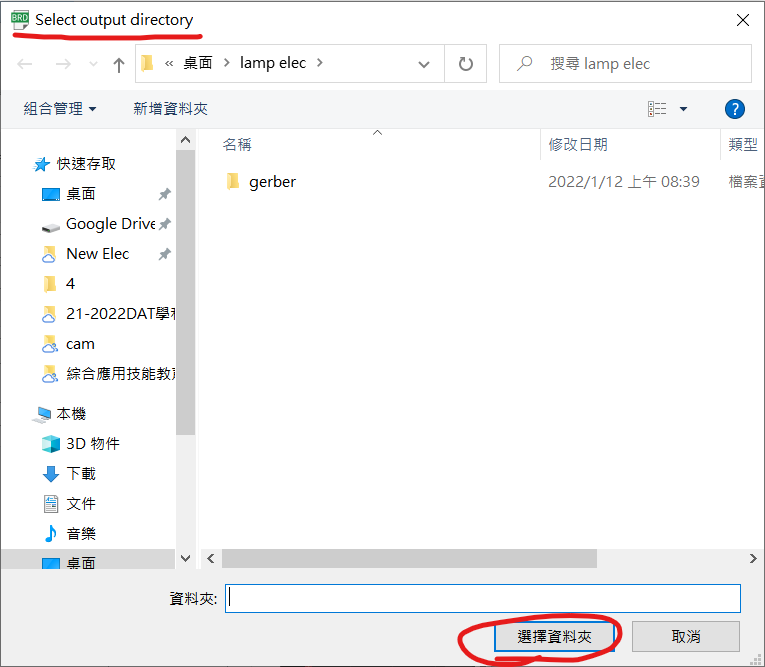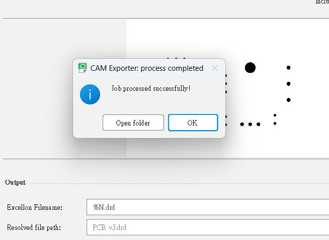

輸出完成，打開完成的folder看一看，如下。

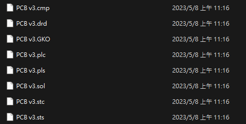

這時會發現folder入面多了cmp, gko, plc, pls, sol, stc, sts和drd 8 個檔案。

之後就可以將檔案拿去生產了。

## 上載生產檔

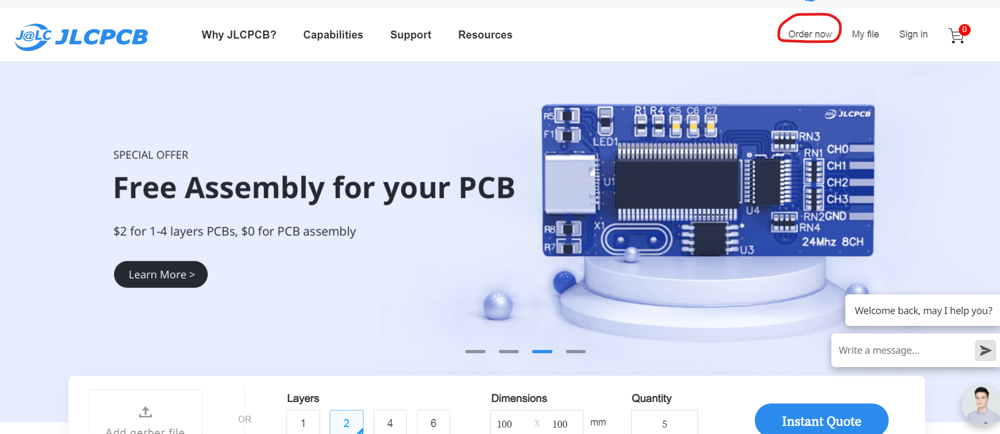

在browser搜尋JLCPCB，或者到https://jlcpcb.com/。右上角就有一個`order now`的選項。

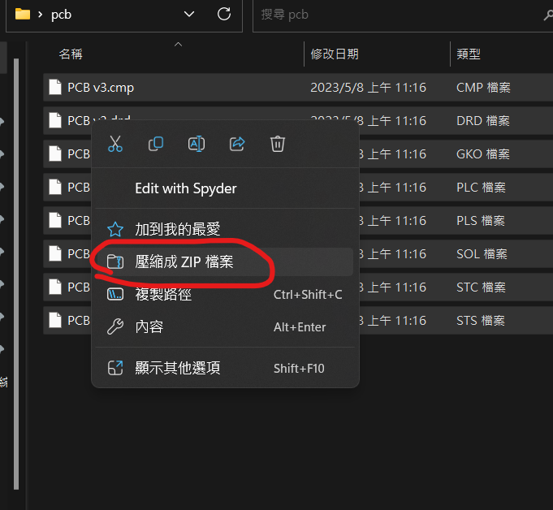

將上一章生產的8個gerber生產檔分別按住ctrl鍵選取，按`mouse右鍵-->傳送到-->壓縮的(zipped)資料夾`。如果是window11的話，就可以直接用`壓縮成ZIP檔案`

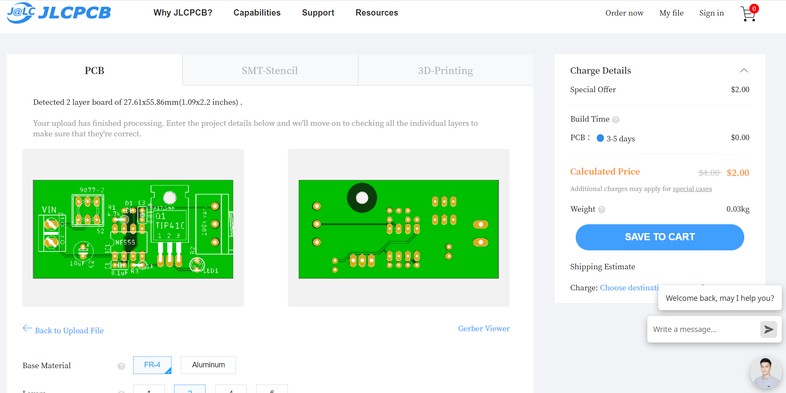

跟著就可以將壓縮後的zip檔拉到網頁，上載後就會自動偵測到是雙層板，而且會有預覽圖。這時看清楚絲網層的文字會否太細或者重疊(理論上其他佈線層經過DRC應該不會錯，而且有錯你肉眼也不可能看清楚)

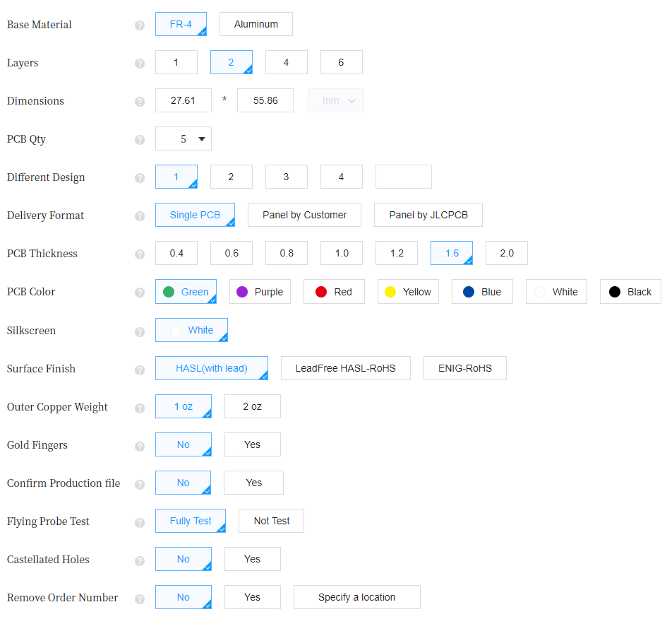

好，讓我們逐個參數看一看:

1. Base Material: pcb基板的物料，一般都是FR-4玻纖板，另一個鋁板通常用於led基板，方便散熱的。
2. Layers: 設計時是雙層板，所以就是2 layers
3. Deminsion: 這個是自動計算的，gerber沒有錯就沒有錯
4. PCB Qty: 就是生產多少塊pcb，JLCPCB最少可生產5塊，如果有需要可以按需要將數量增多，而你會發展產量與價錢不是線性的
5. Different Design: 你可以一次過在同一批pcb生產多款pcb的，淘寶稱為併板
	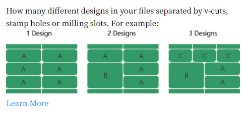
6. Delivery Format: `Single PCB`就是正常幫你分離每一塊板，獨立的給你。另兩個選項是: 有此人可能需要PCB版像郵票般十多塊連在一起，需要用時才撕下來。正常選第一個就可以
7. PCB Thickness: 就是基板的厚度，預設是1.6mm，有需要的話你可以設定厚一點或薄一點，但有些厚度會影響價錢和影響出貨時間。
8. PCB Color: 就是PCB保護油的顏色，可按自己喜好修改，但一樣，有些顏色會影響價錢和出貨時間。
9. Silkscreen: 絲網印刷的顏色。預設是白色，如果你的PCB Color是白色就會改為黑色
10. Surface Finish: 製作好的PCB，為防止焊盤的銅箔外露於空氣中而氧代，最後會再噴上金屬保護和加強傳導，一般平價會噴上有鉛錫(預設)，貴價的會噴上金。
11. Outer Copper Weight: 之前計算trace的寬度時有介紹過。覆銅板銅的厚度，單位為:每平分英吋有多少重量的銅(1安士或2安士)，預設為1oz，如果電路板需要應負大電流才需要考慮2oz。2oz板除了價錢會貴很多外，製作時間也會長一些。
12. Gold Fingers: PCB表面是否噴金。用於例如電腦RAM等直接插入槽接觸的pcb板。
	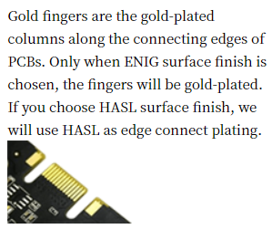

13. Confirm Porduction File: 就是廠家每一個生產步驟圖檔都會寄email來叫你確認一次，沒有需要預設就是不要。
14. Flying Probe Test: 製作好的pcb板會幫你檢查一下有否短路或斷開，預設fully test
15. Castellated Holes: 中文我也不清楚正確譯名。一般用於這塊pcb板需要貼片焊接去別一塊pcb板時才會使用。
	
16. Remove Order Numer: 一般pcb廠商在每個訂單都會有一個order number，通常會印在pcb板的不起眼處方便廠家跟進訂單，如果十分介意的話可以不要或指定一個地方印上。(不要訂單號有機會增加廠商的出錯機會，如非特別最好保留)

## 其他服務

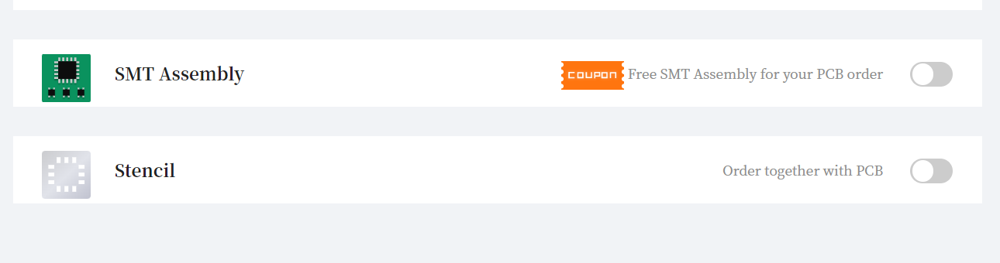

一般的pcb廠都會提供另外兩個服務，分別為:

1. SMT Assembly: 即是代為焊接smd零件服務，一般都會收一筆固定的最少生產費，之後每粒零件再逐一計費。但要注意，要檢討清楚自己要焊接的smd零件代工廠是否有貨，或者例如arduino 主ic要在焊接前燒bootloader等，而且使用SMT服務，需要提交BOM零件清單和別外的生產檔，有機會再介紹。
2. Stencil: 就是提供鐳射鋼網服務。一般如果貼片零件較多的，就不會用手焊，會用鋼網覆蓋，露出焊盤，再用軟身的焊膏掃上去，之後就可以貼零件和用風槍或熱床去焊接。
