# 3.4 Adding library and Real world

這一章節主要是介紹怎樣找到eagle內置沒有的library和怎樣簡單去修改library。

[TOC]

##那裡可以找到零件?

首先，如果遇到一些eagle內置沒有的元件，可以在google搜尋一下，一般常見的都應該會有eagle library的。如果再找到到，可以試試到下面的網站: https://componentsearchengine.com/

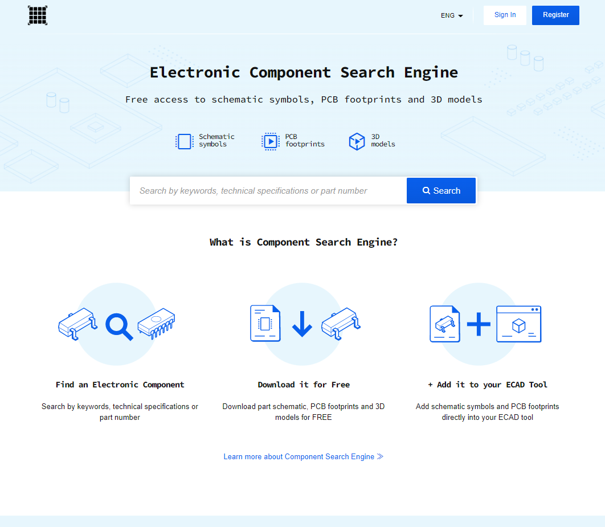

這個網站集合了很多不同的元件，而且不單止有eagle檔案，如果你用其他的pcb軟件，也是支援的。但缺點是下載後的圖檔感自上都十分陽春。

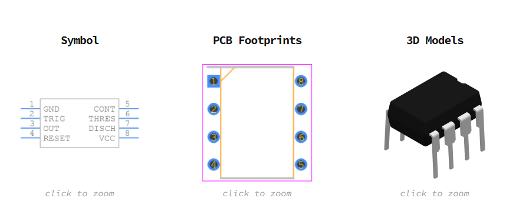

舉個例子同樣是NE555，上圖是componentsearchengine.com的搜尋結果，而下圖是Fusion360內置的NE555，可見Fusion360內置的符號是有根據閱讀需要排序的，但上圖搜尋結果的符號就只是按零件的腳位排序。如果真的找不到排版更好的library，則可以先下載來使用，再打開eagle的library修改。

另外兩個比較常見和常用的資源有SparkFun和diy-modules:

1. SparkFun是一間出名的電子電路司，從元件到模組都有售，教學資料也十分充足，只要搜尋`SparkFun ealge library`就會找到他們的github page下載。

2. diy-modules則售會了十分多淘寶有售的模組的eagle library，十分實用，只可惜官網已經下了架，但仍可在其他的github 副本中下載。

以下為方便大家，已把library都打包了，下載以下幾個檔就可:

* [Arduino-clone](Arduino-clone.lbr) 
* [diy-modules.lbr](diy-modules.lbr) 

## 匯入元件庫

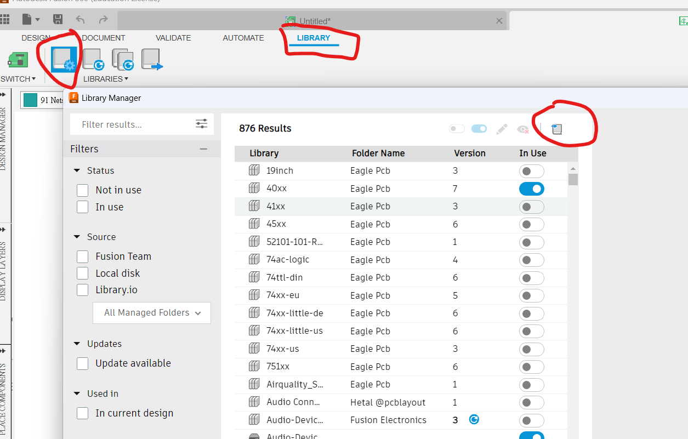

新增一個schematic檔，之後在上方的工具列中，找到`LIBRARY`，找到`OPEN LIBRARY MANAGER`。

或者你在命令列中輸入`add`，也能在右下角找到`OPEN LIBRARY MANAGER`。

在`LIBRARY MANAGER`右上角按下`IMPORT LIBRARY`-->`Import from local disk`，就能匯入，記得要在`In use`的選項選取使用。

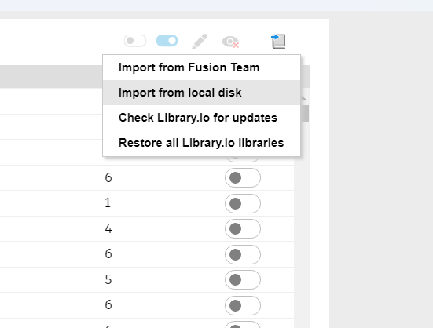

## 線路圖

以下的線路，是一塊arduino uno的shield的nano版本，這塊擴充板你們在中四時有用過，整合了常見的按鍵，RGB LED和可調電阻方便教arduino編程，另外也整合了常見的nRF24L01模組，放便做雙向無線通訊遙控。

灰色的標籤就好似一個傳送門，只要是名字相同就會連在一起，讓線路看起來更清晰，不用佈滿引線。

對於arduino，你可以用`Net Breakout`中的`Pin names`來自動引出引線和標籤。對於其他的零件，你可以用`net`引出引腳，再用`name`和`label`來為引線命名。

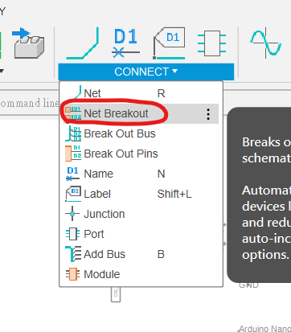　　　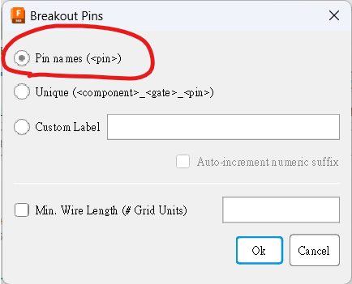

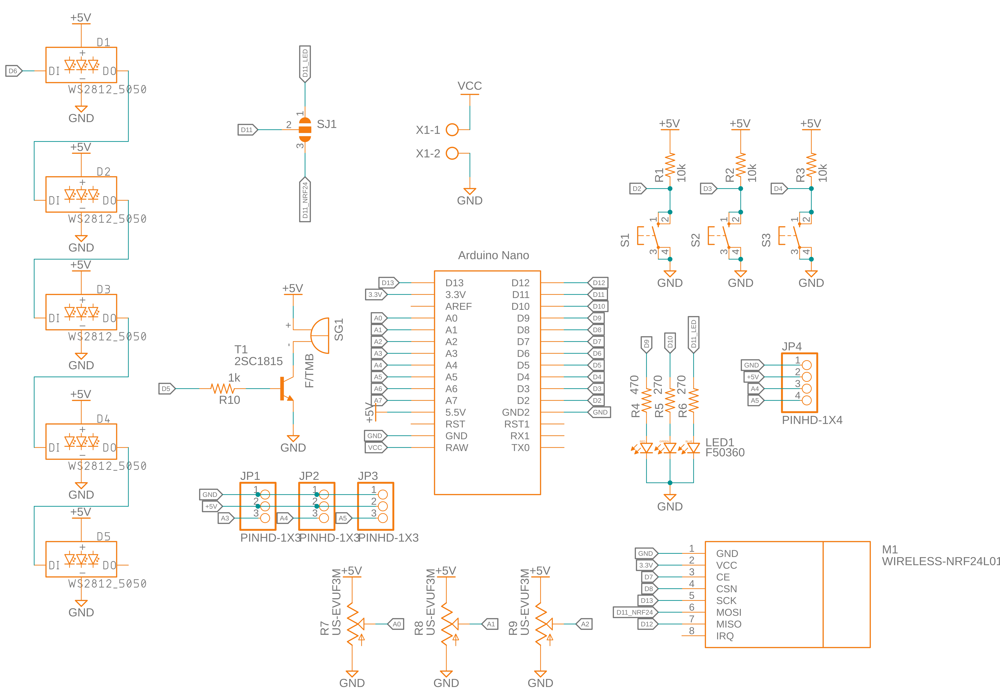

零件列表可看下方，其中nRF24L01需要用到[diy-modules](diy-modules.lbr) 元件庫，Arduino Nano則用到[Arduino-clone](Arduino-clone.lbr) 。其他的都可以在Fusion360內置的library中找得到。==值得留意的是，`VCC`只有一個，是連接電源到Arduino的RAW腳位，其他都是arduino供的`+5V`，另外NRF24的電源是arduino的`3.3v`==

|Part | Value             | Device            |  Package           | Library      |   
| :-: |   :-: |                :-: |             :-: |                  :-: |
|D1   | WS2812_5050       | WS2812_5050       |  WS2812-5X5-4PIN   | SparkFun-LED |                   
|D2   | WS2812_5050       | WS2812_5050       |  WS2812-5X5-4PIN   | SparkFun-LED |
|D3   | WS2812_5050       | WS2812_5050       |  WS2812-5X5-4PIN   | SparkFun-LED |
|D4   | WS2812_5050       | WS2812_5050       |  WS2812-5X5-4PIN   | SparkFun-LED |
|D5   | WS2812_5050       | WS2812_5050       |  WS2812-5X5-4PIN   | SparkFun-LED |
|JP1  | PINHD-1X3         | PINHD-1X3         |  1X03              | Connector |
|JP2  | PINHD-1X3         | PINHD-1X3         |  1X03              | Connector |
|JP3  | PINHD-1X3         | PINHD-1X3         |  1X03              | Connector |
|JP4  | PINHD-1X4         | PINHD-1X4         |  1X04              | Connector |
|LED1 | F50360            | F50360            |  F50360            | Connector |
|M1   | WIRELESS-NRF24L01 | WIRELESS-NRF24L01 |  WIRELESS-NRF24L01 | diy-modules |
|R1   | 10k               | R-US_R0805W       |  R0805W            | rcl (Version 11) |
|R2   | 10k               | R-US_R0805W       |  R0805W            | rcl (Version 11) |
|R3   | 10k               | R-US_R0805W       |  R0805W            | rcl (Version 11) |
|R4   | 470               | R-US_R0805W       |  R0805W            | rcl (Version 11) |
|R5   | 270               | R-US_R0805W       |  R0805W            | rcl (Version 11) |
|R6   | 270               | R-US_R0805W       |  R0805W            | rcl (Version 11) |
|R7   | US-EVUF3M         | US-EVUF3M         |  EVUFXM            | pot (Version 2) |
|R8   | US-EVUF3M         | US-EVUF3M         |  EVUFXM            | pot (Version 2) |
|R9   | US-EVUF3M         | US-EVUF3M         |  EVUFXM            | pot (Version 2) |
|R10  | 1k                | R-US_R0805W       |  R0805W            | rcl (Version 11) |
|S1   |                   | 40-XX             |  B3F-40XX          | switch-omron (Version 3)| 
|S2   |                   | 40-XX             |  B3F-40XX          | switch-omron (Version 3)| 
|S3   |                   | 40-XX             |  B3F-40XX          | switch-omron (Version 3)| 
|SG1  | F/TMB             | F/TMB             |  F/TMB             | buzzer (Version 2)|
|SJ1  |                   | SJ2W              |  SJ_2              | jumper (Version 2) |
|T1   | 2SC1815           | 2SC1815           |  TO92-ECB          | transistor (Version 7) |
|U$1  | NANO              | NANO              |  NANO              | Arduino-clone |
|X1   |                   | AK500/2           |  AK500/2           | con-ptr500 (Version 3) |

完成之後記得先做ERC。看到下方的warnings是正常的，全部Approve就可以了。

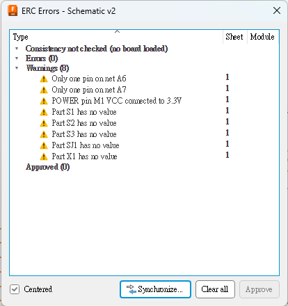

## 佈線圖

我將所有零件盡量縮在最小的空間中，對比原電路圖，比較近的零件(例如RGB LED的電阻和transistor的電阻)就放在近零件處。

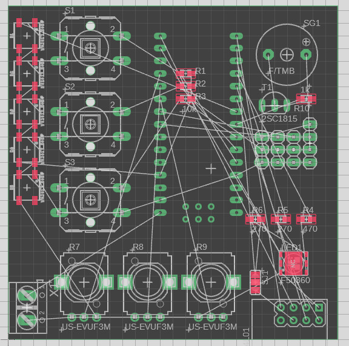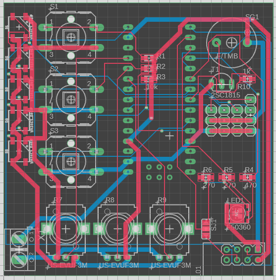

1. 接著我將`VCC`,`GND`,`+5V`和`3.3V`都加入一個新的net class中，線寬我設成`1mm`。
2. 記得用`DRC`設定邊界和mask設成3mm。
3. 最後就可以加入polygon完成。

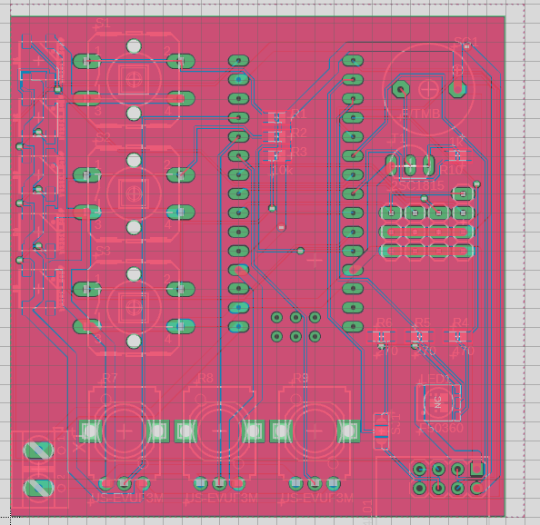