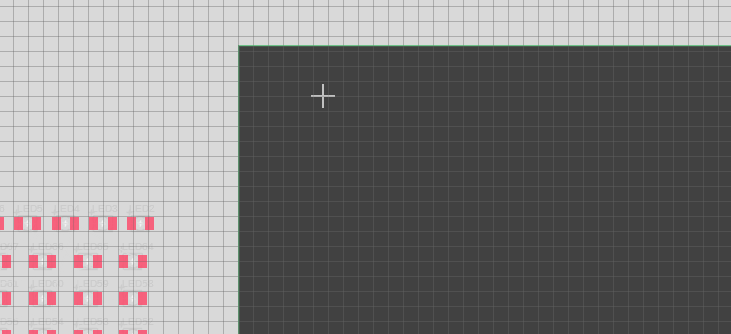

# 3.5 在家自製PCB

[TOC]

開啟我們熟識的Fusion360軟件。在左上角的`file`中，開始一個新的`New Electronics Design`。

接著會去到管理頁面。一塊PCB板最基本可分為兩種檔案，分別為電路圖和實際樣貌的佈線圖，如果你有心機的話，可以再輸出成3D PCB板，配合Fusion 360去設計。

**首先按左上角，新增一個電路圖。**

## 電路圖

電路圖的介面長這樣。左邊的欄位是可以拖動的，不用時可以將它收起來，或者嫌太小太難看的話，可以將它拖出來放大。

首先，在上方的`Grid Setting`，將格線打開方便對位置。

　　　　　   

###插入零件

在命令欄打`add`。

今次我們要製作的電路LED燈牌，所以第一步要搜尋我們的貼片LED。我們的貼片LED尺寸型號為3528，即尺寸是3.5mm x 2.8mm。

但如果你直接在搜尋欄是找不到的，因為了節省空間，Fusion360是沒有安裝電子元件的library的，所以第一步首先是按`Open Library Manager`。

接著搜尋`led`，將`in use`的選項剔選。

接著搜尋==`LEDKA-3528ASYC`==就能找到我們使用的LED。

另外還有一個3.5mm連接block，keyword是==`ak500/2`==，如果找到到，它在==`con-ptr500`==library當中。

### 連接零件

接著就按照4粒LED一串，複製並聯出來，你可以2變4, 4變8, 8變16出來，最終首先複製32份，多了出來之後可以刪除。

連接零件可以用到上方工具列的`net`，或在命令列直接輸入`net`。`VCC`和`GND`也是可以在library中找出來的。

### Electrical Rule Check(ERC)

**在命令列輸入指令`ERC`**。接著則要做ERC，檢查一下零件的接線有沒有問題，一般都只會見到有warnings，可以了解一下是甚麼原因，但如果見到有error的就一定要處理。常見的errors可能有: 忘記用`junction`將接線連接、接線沒有真的接到零件、忘記接線、接漏。而常見的warnings不外乎都是零件沒有值。如果不想下次再做ERC時再見到這些warnings，**可以按`Approve`去接受這些warnings**。

## 佈線圖

電路圖繪製好之後，就到電路板的佈線圖，這個部分和實物有直接關係，所以佈線時有些地方需要注意。

按下上方工具列有一個小小的白色/綠色icon，寫著`SWITCH`的icon。之後就會開啟多一個檔案。

### 準備工作

之後就會見到一個與之前差不多的介面，插入的零件已經放置在一旁，有幼細的綠色線，代表著剛才sch檔所繪製的電路接線。

先進行準備工作，第一個步驟是打開左上角icon的網格工具，或直接在命令列打`grid`。

Display選擇On，Size則選擇100mil，而下方的Alt則選擇50mill。如此，你在佈線圖上的所有移動和佈線距離都但鎖定在100mil的網格，而當你按下*鍵盤的Alt鍵*時，就會變成50mil的網格。

==100mil即為1/1000英寸，即2.54mm，是典型的面包板的間隔距離，也是一般通孔元件的標準間距，所以佈線圖單位通常都用mil而不用mm==

接著對著綠的的邊框線按滑鼠右鍵，打開`properties `

　　　

我們造的板的大小大約是70 x 60mm，所以換成mil的話就大約是2750 x 2360 mil，按ok後，就會發覺就會變成梯形，另一條邊也轉成這兩個數字就可以變回方形。

首先準備一張自己喜歡的圖檔，==一定要是bmp==，如果本身是jpg或png的話，就用小畫家將其另存做bmp，內容盡量簡單，只有黑白兩色，如果複雜的話，可以開corelDraw或者rhino勾線出來。

找到`AUTOMATION`中的`RUN ULP`，或直接在命令列中輸入`RUN ULP`。

搜尋`bmp`，應該就會找到一個`import-bmp`的選項。接著按下`ok`和選擇你的`bmp`檔案後，就會跳出以下畫面。

我的圖就只有黑和白兩色，我只需要黑色，所以我只剔選了黑色，按下`ok`。

接著就要點數學了。

我們的PCB板寬7cm，即2750mil，即2.75 inch，我匯入的圖片X寬度為569 Pixel，所以我點選右邊的`DPI`，即dot per inch，得出 $ \frac{569 pixel}{2.75inch} \approx 200dpi$。(如果你的圖是用corelDraw或rhino勾出來或畫出來的話，在匯出時就能選擇DPI，只要輸入一樣的DPI就可以了)

你可以拖動一下位置和調整一下外框的尺寸，之後可以在左邊欄`DISPLAY LAYERS`找到`200bmp`這一層，可以將其鎖起來以防不小心編輯到。

之後就是最費勁的工作，將所有LED排好。==排的時候記得留意零件的方向，佈線要盡可能短，因為今次佈的是單面板，過孔要盡可能少==

例如我的接線，就是首尾相連的。記得要是4的倍數，如果最後剩外一、兩顆LED的話，就將之前的位置調整一下盡量排，因為加電阻的話，光度會有差別。

之後在命令列輸入`DRC`。由於今次我們親手蝕刻自己的線路板，不能用預設的6mil間距和線寬，太緊湊的話難以製作，線太幼也很容易洗掉。我們將所有的置都設定成`20mil`，大約為`0.5mm`。**如果你第一次做沒有信心的話，可以再大一定到`30mil`**

### 自動佈線

接下來只要全部自動佈線即可。按下自動佈線的icon。

Fusion360預設是雙面板，但雙面板需要鑽過孔和難以對位，所以我們將`16Bottom`轉成`N/A`，即不佈線。按下`Continue`。

**佈線沒有100%是正常的**，我的線路圖就有3條線是末接的。**但如果不超過95%的話，你就要看清楚到底為什麼不能佈**，可能是你將LED的順序搞錯，一顆在左一顆在右，或者排得太緊湊沒有位置讓它走線，這樣的話就要先將零件排好再自動佈線一次。

### 手動佈線

之後就要手動佈線。按下手動佈線的icon。

佈線的時候，一開始是紅色(即頂層)，==按下滑鼠中鍵(即滾輪按鍵)==，就會出現綠色的過孔，放下就會變成藍色線(即底層)，跨過其他線後再==按下滑鼠中鍵(即滾輪按鍵)==，就會再出現過孔，放下就能變會頂層。這樣每條末佈的線都會有2個過孔，我有3條末佈，就會有6個過孔，所以如果你有五、六條末佈的線的話，之後要鑽12個孔飛線，會十分困難。

將所有末佈的線都手動佈好後，就要將過孔放大。預設過孔的尺寸跟線寬成正比的，線寬只有0.5mm，所以過孔也是差不多尺寸。但0.5mm的鑽孔我們很難操作，也十分容易折斷，所以要改成`1mm`，而過孔的周圍，要加上2mm寬的佈線。

　　　　

將所有的過孔尺寸都放大。完成後我的線路圖是這樣的。==之後記得記得做一次`DRC`檢查有否錯誤。==

沒有錯誤的話，就可以用`polygon`指令將電路佈上覆銅，只留下要蝕刻的空位。

