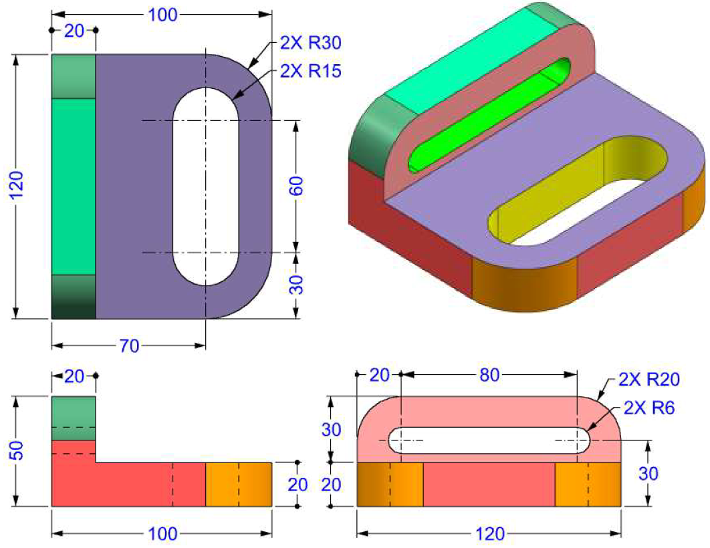
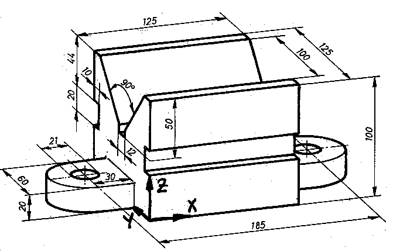
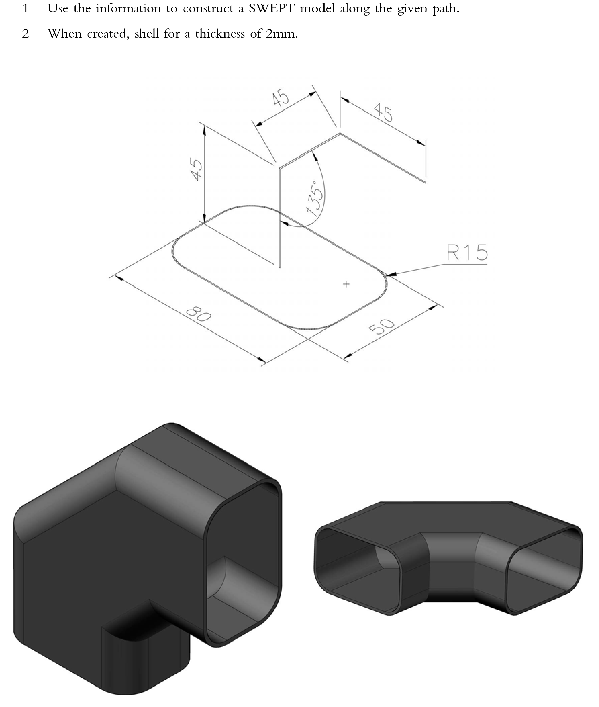
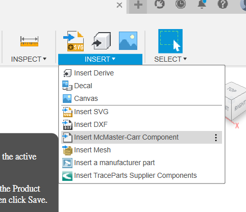
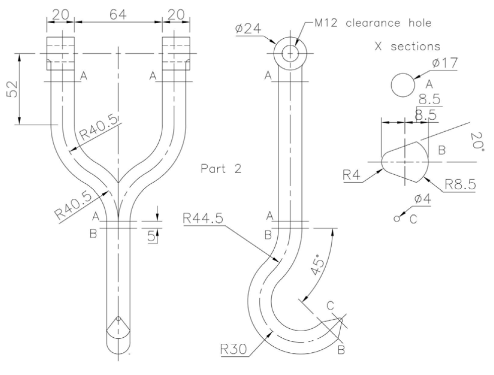
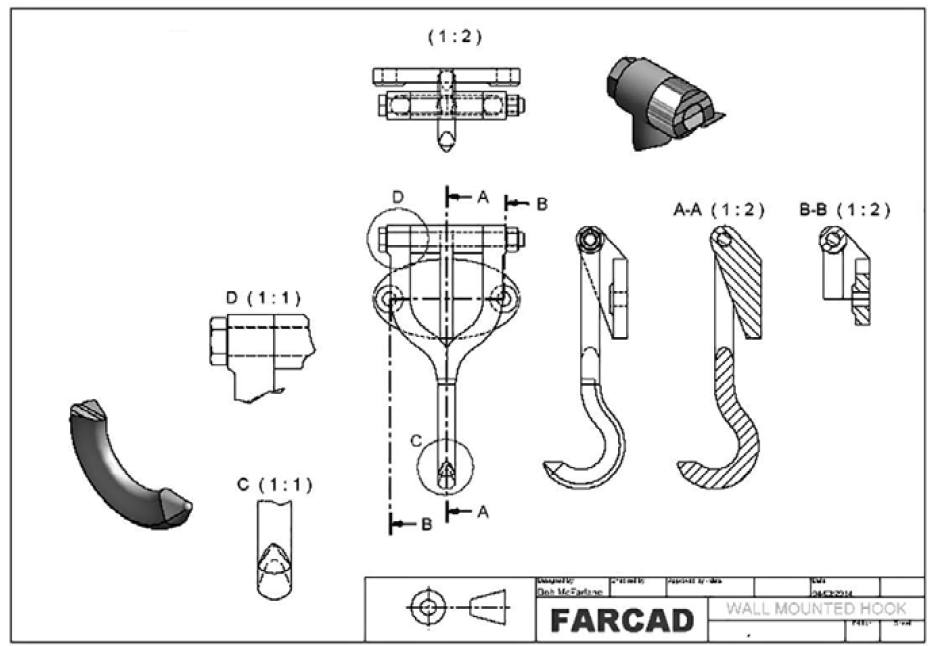

# 3D繪圖小測試

[TOC]

## 1. L block

## 2. Block

## 3. X block

## 4. roller

## 5. Pulley

## 6. Tube

## 7. Connector

## 8. Spanner

沒有標明的尺寸，可自行選擇合適尺寸。

## 9. Tube Connector

1. ==請小心，三個圓盤都是不同size的。==

## 10. Wall mount holder

1. 你可以到MCMaster-Carr Component去選擇合適長度的螺杆和螺絲, 螺杆和螺絲不用自己畫。
	
2. Part 1和Part 2的joint請使用revolve joint，兩者組合後是可以旋轉的。

