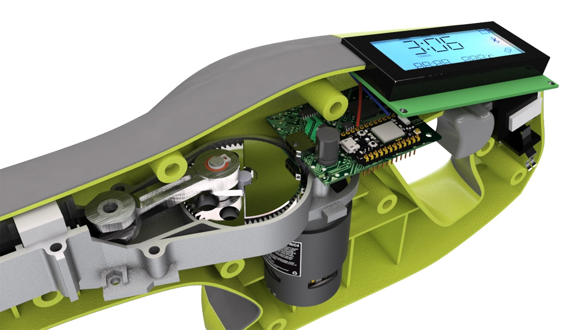
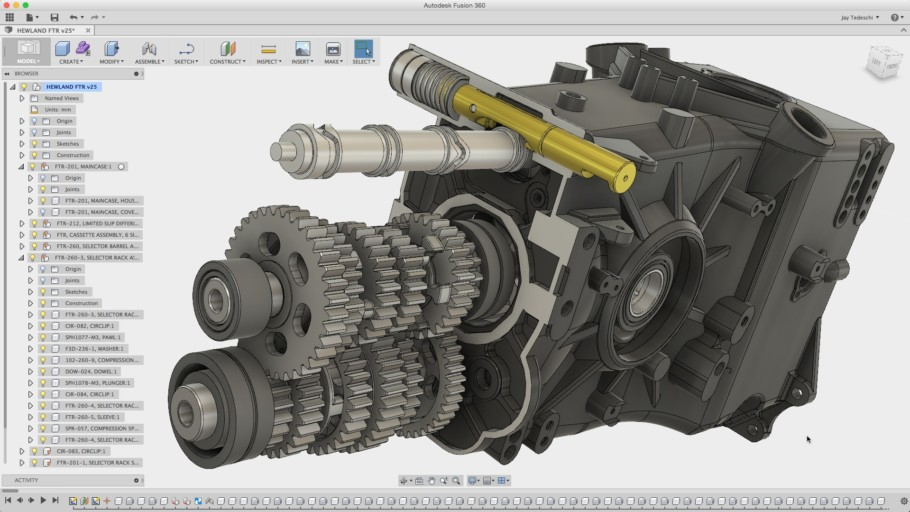

#Preparation

[TOC]

## Fusion360簡介

- Fusion360是一款由Autodesk公司推出的3D特徵編輯軟件
- AutoCAD是一款經典的2D繪圖軟件，但其3D功能非特徵編輯，對於複雜的3D模型繪製會比較吃力
- Inventor是一款早期由Autodesk公司推出的特徵編輯軟件，針對機械工程師設計，與solidwork和solidedge等軟件競爭
- 特徵編輯軟件在繪製三維零件時類似編程，設定變量，一步一步執行
- Fusion360是一個輕量版/web base的Inventor軟件，免費試用期為一年，現在只有一個月試用，個人版也不收費
- Fusion360受到廣大maker所喜愛，並整合了Autodesk其下的pcb編程軟件Eagle的功能
- Inventor比較適合機械工程的深度用家，而Fusion360除了比較適合初學者外，也因為整合了pcb功能，變得十分適合機電整合的項目製作

##注冊教育版

- 自從Fusion360的個人版限制增多後，申請教育版變得十分重要
- 鼓勵同學申請教育版，不浪費教學資源
- 申請教育版的流程現在比較複雜，以下是2021年9月的申請流程
- 💡**<u>*資料不要亂填，因Autodesk公司的審查越來越嚴格，如果上載資料與所填資料不符，可能導致不能注冊成功*</u>**

### Step 1

- 到google直接搜尋`fusion 360 education`

- 找到`Fusion 360 | Free Software for Students and Educators..`的網頁

- 你也可能找到下圖的一個影片，是一個香港導師所拍攝的粵語注冊教學

### Step 2

- 進入網站後，會找到一個醒目的`GET STARTED`按鍵

- 按下開始注冊

### Step 3

- 在Country中嘗試找`Macau`，如果沒有的話則選`China`

- 在Educational role中，選擇你的身分`Student`

- 在Institution Type中，選擇``High School/Secondary`

- 出生日期則根據自己的出生日期填寫，之後忘記密碼有可能會驗證生日，所以不要亂填

**<u>❗Fusion教育版需要年滿14歲才能注冊，所以如果你未滿14歲的話, 在年份上修改一下到足夠14歲</u>**

### Step 4

- 在資料注冊頁面填入以下資料

	- First name是名字，Last Name 是你的姓，請用英文，根據你在本校和教青局注冊的資料填寫

	- ***<u>❗此名稱用於之後核對你上傳的資料，所以請勿亂填，資料要對得上</u>***

- 填上email ***<u>❗記得要使用@ism.edu.mo的電郵來注冊</u>***

- 最後填上password和checkbox就可以

- 之後就會收要求確認電郵地址

### Step 5

- 去到你的eclass電郵帳號下，等待收取確認郵件, 並在郵件中的連結按下確認。

### Step 6

- 確認完郵件之後， autodesk會要求你確認所在學校

- 在學校中"Name of educational institution"，==用繁體中文打上`澳門慈幼中學`==，一般打到第3或第4個字已經會有提示讓你選擇

- `Enrolled from date`和`Expected graduation date`為入讀和預計畢業日期

- 如實填寫自己form1入學的年份， 月份為9月
- 預計form6畢業的年份，月份為7月

### Step 7

- 之後就會進入產品下載的頁面。

- 在第一個fusion360的`get started`按下就會叫你再確認一下個人資料, 如無更改可按下`confirm`。

- 最後一步，在下載之前，autodesk會要求你出示在這間學校就讀的證明並人工驗證。

- 你可以上載:

	1. **成績表: 如果你不介意的話，而且也是最方便的辦法，用手機拍下上載即可。**

	1. 學校發出的在學證明: 此辦法比較麻煩。

	3. 學生證: 

		- 由於教青局的學生證上是沒有任何資料的，你需要下載教青局的手機app

		- 之後掃瞄學生證上的qr code，就會得到下面的學生資料

		- 但此資料又沒有學生的姓名，**所以你需要cap下手機的畫面，同時也要將學生證拍照同時上傳**

- 如果資料正確，大概一日之後就會驗證成功。成功了的話就會發現登入fusion360後title會多了一個教育版的字樣。

- 等待驗證的日子內，請經常檢看驗證的email, 如果不能成功驗證的話, 會電郵告訴你缺了甚麼。

