# Printed Circuit Boards(PCB)

> 印刷電路板，又稱印製電路板，印刷線路板，常用英文縮寫PCB（Printed circuit board）或PWB（Printed wire board），是電子元件的支撐體，在這其中有金屬導體作為連接電子元器件的線路。
> 傳統的電路板，採用印刷蝕刻阻劑的工法，做出電路的線路及圖面，因此被稱為印刷電路板或印刷線路板。由於電子產品不斷微小化跟精細化，目前大多數的電路板都是採用貼附蝕刻阻劑（壓膜或塗佈），經過曝光顯影後，再以蝕刻做出電路板。

[TOC]

## Introduction

PCB版主要由基底和上面的金屬導體所組成。常見的PCB有1, 2, 4, 6層。

### Single-Sided Board

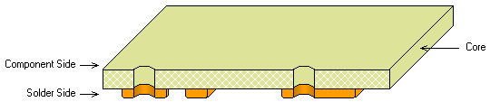

如圖所示，單層PCB板只有基底和單面的佈線層，PCB板的基底一般會使用FR4玻纖板，也有一些會使用鋁基板去幫助散熱。

### Double-Sided Board

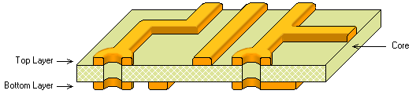 

另一款較為常用的是雙面板，和單面一樣，將電路佈在基板的兩邊。而有在大部分情況，我們會希望正面和背面的線路會有連接，一般來說所有的穿孔中間都會佈有銅，令兩邊的電路連接。

### Solder Masks

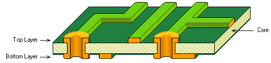

Solder Masks即焊接面，電路板製好之後都會有綠油去保護和絕緣，而相反，沒有綠油保護的就是solder masks，solder masks的作用是外露電路出來焊接零件，或者有時會刻意外露出來讓走線可以再落焊加粗。

### Via

承上，為了連接上下兩面的線路，有時會刻意地鑽孔再鍍上銅，讓電路上下導通，這種通孔就叫做Via

### Silkscreen Layers

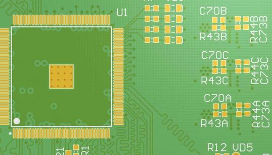

最後是絲網層，絲網層就是電路板表面的白色文字，用來方便焊接的人正確放置零件。

## PCB板製作過程

1. 準備覆銅板，這種板事前已鍍上銅，一般單位為每平分英尺**1 oz** 或每平分英尺**2 oz**，但2 oz板會令pcb訂制造價貴上不少，所以一般選1 oz板即可。
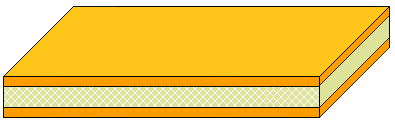
2. 第二個步驟會用cnc機為pcb鑽孔
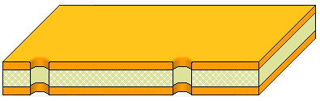
3. 用感光抗蝕劑覆蓋兩邊
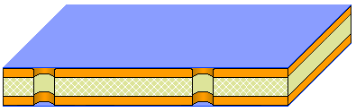
4. 用負片將希望蝕刻的地方蓋上，露出電路，再用特定波長的uv燈照射
  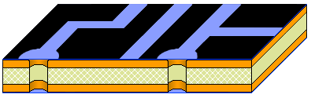
  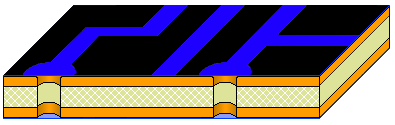
5. 曬完燈後，照到的地方就會變硬，此時就可以洗走未變硬的抗蝕劑
  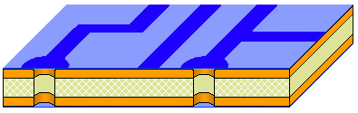
  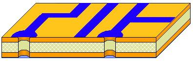
6. 跟著就可以將pcb板浸在強酸中，蝕走多餘的銅，留下電路的部分。跟著再用清潔劑洗走變硬的抗蝕劑。
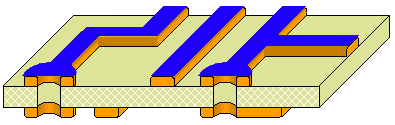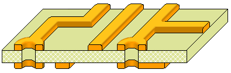
7. 跟著就會將pcb板電鍍，將via和其他鑽孔的孔壁覆上銅
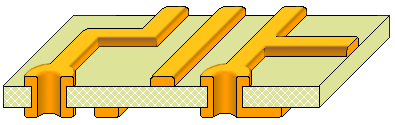
8. 最後重覆上面的步驟，用感光的綠油阻隔劑和白色的感光墨水印上阻隔層和絲網層。最後就會將pcb外露的銅噴上錫(有時會噴上金)
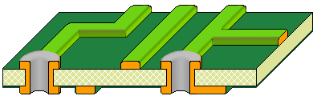

<!--資料來源: https://www.altium.com/-->

##  Surface Mount and Though Hole(SMD and THT)

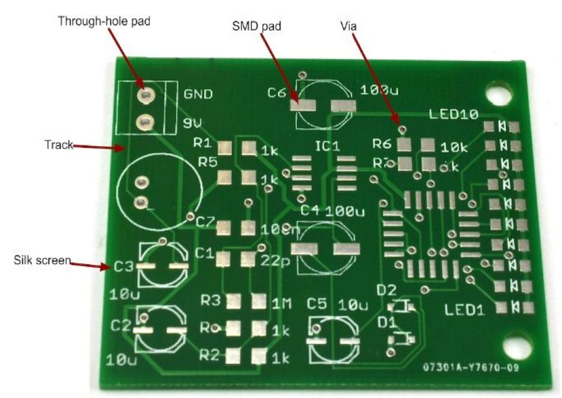

剛才上面都有說明一些關於pcb板上的板上的名稱，現在我們再用一張pcb的實物照片更清楚地了解。

如上圖所見，白色用來標悉的文字是絲網層(**Silk screen**)，用來連接線路的銅線稱為銅箔(**track**)，之後是通孔元件焊盤(Through-hole pad)，貼片元件焊盤(SMD pad)，最後是通孔(via)。

##通孔元件vs貼片元件

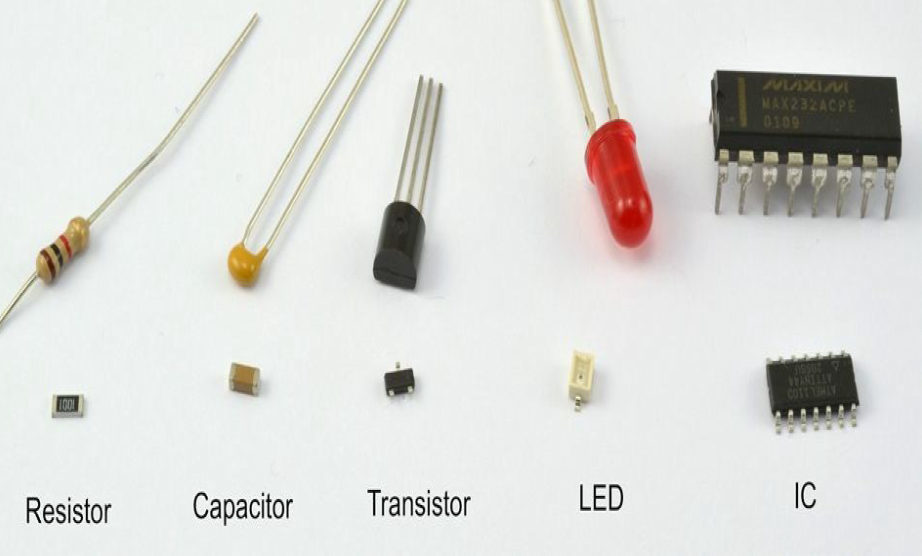

如果你有打開過上世紀八九十年代的電器，你會發現大多數都是通孔元件的佔大多數，當時的製作工藝未成熟，而且電路大多不會太複雜，所以多數用人手比較容易焊製的通孔元件居多。但自從千禧年後，電路板變得越來越複雜，大多數的電路板都改用4層以上的工藝製作，電器都已改用貼片元件。貼片元件的好處除了面積細小很多之外，另一好處是零件引腳不會穿過電路板，那麼在電路板的正面和背面之間，可以藏有更多的中間夾層而不影響元件焊接在pcb上。現在大多數新出的IC，都只會推出SMD版本，不會再出THT的版本。
