# 自製Arduino

在這一章節，我們將教你如何自製一塊Arduino板。

隨著你的專案變得越來越複雜，Arduino原本只有20個的腳位可能會變得不夠用，而程式也會變得越來越複雜，越來越難以除錯。現在普遍的解決方案是將功能分開，不同的功能由不同的MCU實現，例如馬達集成編程器、驅動和調速，姿態傳感器集成MCU和計算姿態等。當需要讀取傳感器數據或控制馬達時，主程式只需要與其他的MCU溝通，而不需要參與底層複雜的計算和控制。這方面，樂高機械人做得非常成熟，樂高機械人的傳感器和制動器都是透過I^2^C溝通的，而近年的教育機械人廠家，例如大彊，則是透過更穩定的CAN BUS溝通。

要將功能模組化，就需要學會如何自製Arduino板。

[toc]

## 1. 甚麼是bootloader？


想像一下，你有一台電腦，作業系統就像是控制整個電腦運作的大腦。它負責管理和分配電腦的資源，例如處理器、記憶體和硬碟等。同樣地，Arduino的bootloader就像是它的小腦，專門負責控制Arduino板子的啟動和執行。

當你開機時，作業系統會載入到電腦的記憶體中，並確保所有必要的程式和資源都正確地被載入和初始化。這樣你才能使用電腦進行各種任務，如瀏覽網頁、運行程式等。同樣地，Arduino的bootloader會在開機時載入到Arduino板子的記憶體中，並確保你的程式碼能夠正確地被載入和執行。

簡單來說，作業系統和bootloader都是負責控制和管理電腦（或Arduino板子）的重要程式，讓它們能夠正常運作並執行你想要的操作。要燒錄bootloader，有幾種方法。我們將在接下來的章節中詳細介紹。

一般要燒錄程式到MCU，都需要專門的燒錄器，例如下圖是專門燒錄Atmel系列(即Arduino UNO)的AVR MKII，另外還有專門燒錄STM32的ST-LINK。
<div style="text-align: CENTER">
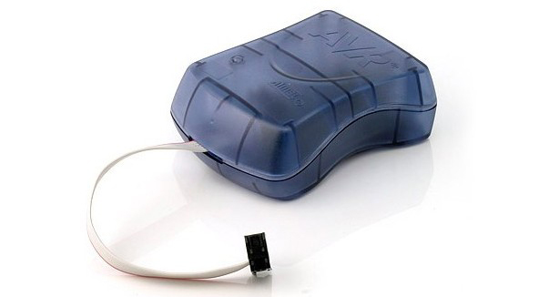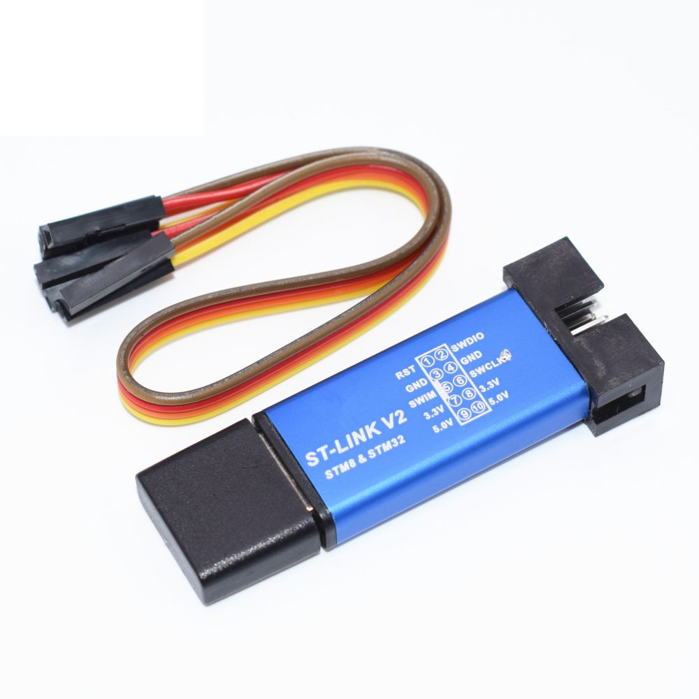</div>

Arduino UNO的ICSP其實就是用來燒錄程式的。

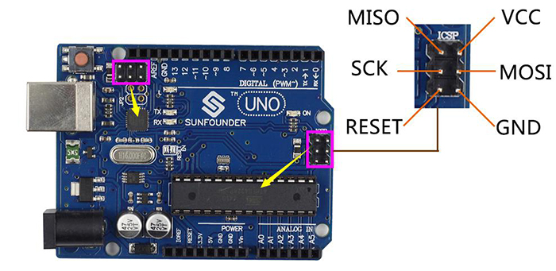

但我們平常「上傳」程式到 Arduino UNO ，又為何不需要透過ICSP和燒錄器呢？

當我們「上傳」程式到 Arduino UNO 時，我們實際上是在 Arduino 的 **bootloader** 上運行程式。

Bootloader 就像是一個小型的作業系統，它允許我們通過**串口（Serial Port）**將程式碼上傳到 Arduino 板上。當我們上傳程式碼時，程式碼是被燒錄到微控制器的 **Flash 記憶體**中的。

然後，當 Arduino 板啟動時，Bootloader 會運行並檢查是否有新的程式需要加載。如果有，它會加載並運行該程式。所以，我們可以說，我們的程式碼被「燒錄」到了 Arduino 板上，並且是在 Bootloader 的控制下運行的。

所以我們自製Arduio板，首先要為Arduino的核心，燒錄bootloader，否則就要預留ICSP插頭，為自製的板先燒錄bootloader後才能使用。

## 2. 燒錄bootloader

要燒錄bootloader有好幾種方法：

1. 使用AVR USB tiny ISP燒錄；
2. 使用AVR 下載器;
3. 使用其他Arduino板燒錄。

最容易的話，當然是第3種方法，不需額外再購買其他零件，這是第3種方法官方的[教程](https://support.arduino.cc/hc/en-us/articles/4841602539164-Burn-the-bootloader-on-UNO-Mega-and-classic-Nano-using-another-Arduino)。但我跟著這個方法，從沒試過成功，再加上我需要燒錄還沒焊接的Atmega328 IC，想找一個更簡單的方法。

後來我找到[這個](https://www.gammon.com.au/forum/?id=11635)方法。以下是我整理過後的介紹。

### Step 1

首先找一塊Arduino UNO板，先將[Atmega_Board_Programmer](https://github.com/nickgammon/arduino_sketches/tree/master/Atmega_Board_Programmer)程式上傳。

### Step 2

將Arduino UNO的腳位，跟著以下的接線，接到目標Atmega328的腳位上。

```
Arduino Uno      Target Uno (Atemga328)

D10 (SS)            Reset
D11 (MOSI)          D11
D12 (MISO)          D12
D13 (SCK)           D13

Gnd                 Gnd
+5V                 +5V
```

| DIP-28 package *ATmega8/48/88/168/328* | TQFP-32 SMD package *ATmega8/48/88/168/328* | TQFP-32 SMD package *ATmega48/88/168/328PB* |
| -------------------------------------- | ------------------------------------------- | ------------------------------------------- |
|                  | 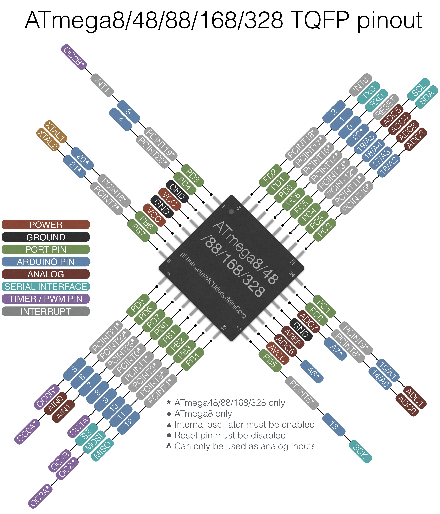                     | 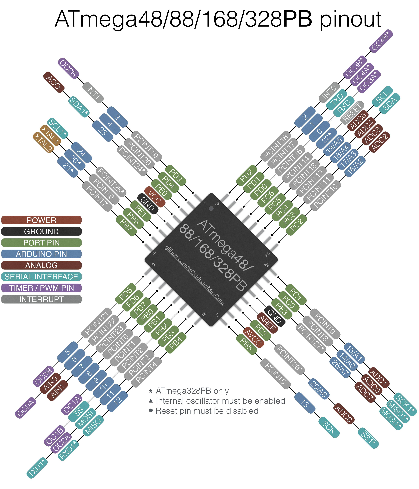                 |

可以根據上圖的pinout，找到目標UNO的`D11`, `D12`, `D13`, `Reset`, `+5V`和`GND`

### Step 3

開啟Arduino的序列埠監測器（Serial Monitor），就會見到以下介面：

```
Type 'L' to use Lilypad (8 MHz) loader, or 'U' for Uno (16 MHz) loader ...
```

按下`U`選擇`UNO`，


```
Atmega chip programmer.
Written by Nick Gammon.
Entered programming mode OK.
Signature = 0x1E 0x95 0x0F 
Processor = ATmega328P
Flash memory size = 32768 bytes.
LFuse = 0xFF 
HFuse = 0xDE 
EFuse = 0xFD 
Lock byte = 0xCF 
Bootloader address = 0x7E00
Bootloader length = 512 bytes.
Type 'G' to program the chip with the bootloader ...
```

如果接線沒有錯誤，成功讀取到目標的Atmega328 IC的話，就會讀到型號、signature等資訊，接著根據指示，按`G`，


```
Erasing chip ...
Writing bootloader ...
Committing page starting at 0x7E00
Committing page starting at 0x7E80
Committing page starting at 0x7F00
Committing page starting at 0x7F80
Written.
Verifying ...
No errors found.
Writing fuses ...
LFuse = 0xFF 
HFuse = 0xDE 
EFuse = 0xFD 
Lock byte = 0xCF 
Done.
Type 'C' when ready to continue with another chip ...
```

這時就會自己清洗IC，自動燒入bootloader和核對，見到上面的文字，即燒錄已經成功。

##3. (option)自製專用燒錄器

為了方便的燒錄，我買了一個TQFP-32轉DIP-32的轉換器，


跟據上圖的引腳轉換和Atmega328原始腳位與Arduino UNO的腳位配置，自製了一個燒錄器，具體線圖如下：

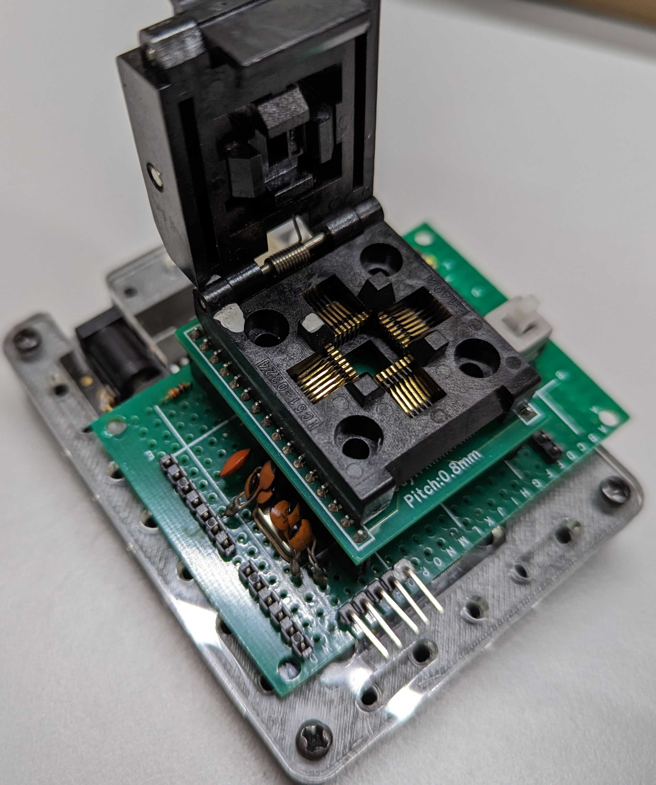


由於要燒錄的Atmega328不是一個完整的Arduino板，所以除了跟據上述Step 2的接線外，還要為這顆要燒錄的Atmega328，加上晶振和電容電阻等基本配置。

為方便大家使用，也為我這個燒錄器未來更加專業，我順便設計了一塊Arduino shield。


這塊shield，除了有TQFP-32轉DIP-32轉換器的引腳，也預留了空的TQFP-32引腳，如果只是間中需要燒錄，不想買TQFP-32轉DIP-32轉換器的話，就可以用膠紙將Atmega328固定在引腳上，燒錄後就可以把它取下。

Gerber生產檔在這裡： [PCB v3_2023-11-17.zip](.\PCB v3_2023-11-17.zip) 

## 4. 自製Arduino

在這一節中，我們會配合上一章自製PCB板，用覆銅板和蝕刻劑自己蝕刻一塊WS2812的全彩燈環，當然，如果你有興趣，也可以將設計檔轉成Gerber檔，交給代工廠製作，詳情可參考[這一章](../代工生產PCB/代工生產PCB.html)。

### 4.1 繪劃線路圖

為了方便快速設計，可以將常用的線路，打包成`design block`，這樣下次再使用時，就可以快速拉入，不用每次重覆繪圖同一線路。

先下載這個檔案： **[pro mini atmega328.dbl](pro mini atmega328.dbl)** 。這是我劃好的Arduino Pro Mini線路。Pro Mini跟UNO一樣都是做用Atmega328作為核心，唯一分別是Pro Mini沒有了Serial通訊的部分，需要額外的上載器為Arduino通訊和上傳程式。但只要燒錄UNO的bootloader，就可以當成UNO使用。


<div style="text-align: CENTER">
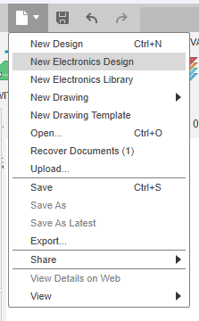　　　　　　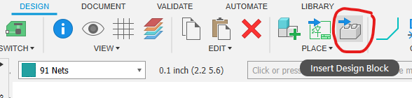</div>
在Fusion360中，開啟`New Eelctronics Design`，找到`Insert Design Block`，就能匯入剛下載的design block。


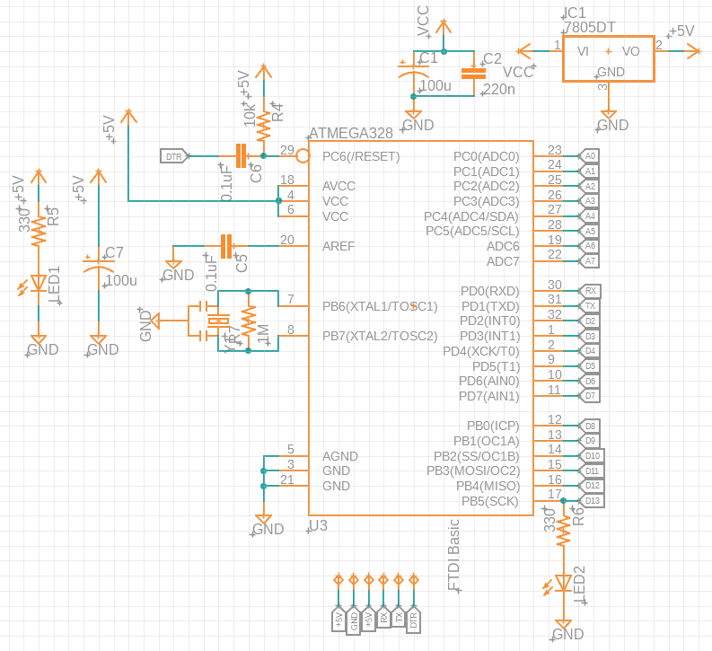

這個design block包含了降壓用的7805、13號引腳的built-in LED和一些穩壓電容，如果我們直接接5V火牛作為輸入的話，就不需要降壓，所以首先將降壓的部分和built-in LED刪除。接著輸入`add`，在`wirepad`library中，找到`SMD5`加入電路中，分別接上`+5V`和`GND`如右圖。


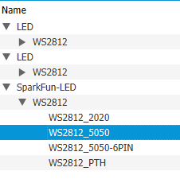

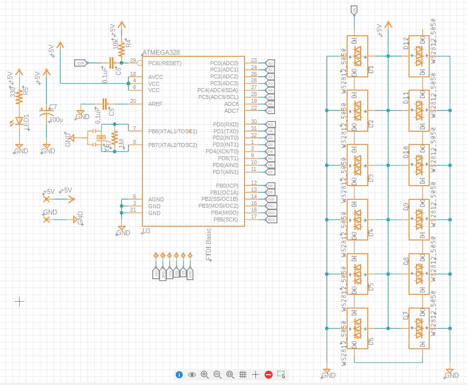

接著在`SparkFun-LED`中，找到`WS2812_5050`，將`WS2812_5050`的`DO`接上下一顆的`DI`，串成12顆，供上電源，**記得第一顆的`DI`接在Arduino的`D6`**。


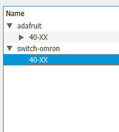

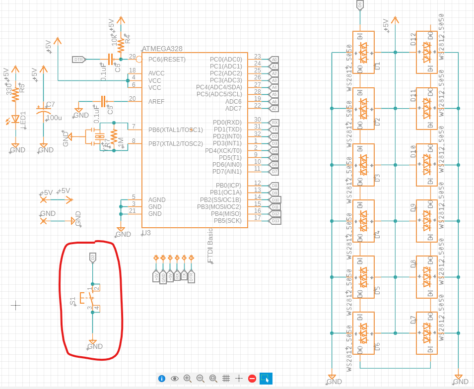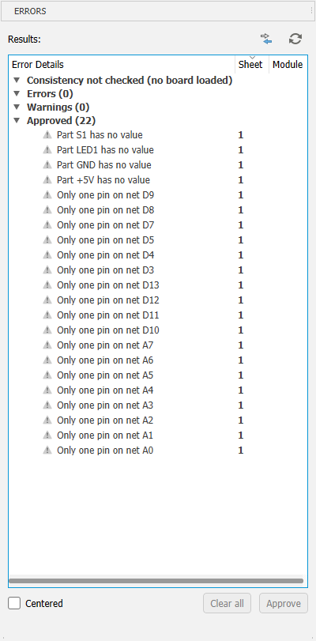

最後為`D2`腳加入一顆`40-xx`按鍵。完成後記得做一次`ERC`，可以將上圖的這些`Warnings`都選`Approve`。


### 4.2 設計電路板

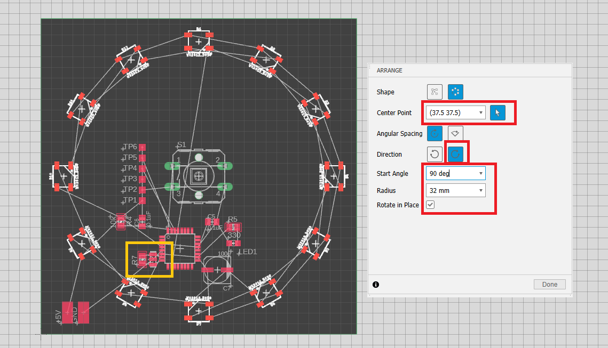

1. 先打開`grid`，將單位轉成`mm`，每一格為`2.54mm`
2. 將電路板的綠色尺寸線，設定成`75mmx75mm`的正方形。(可以直接對著綠線，按滑鼠右鍵，選取`Properties`，直接輸入座標)
3. 對著`40-xx`按鍵零件，按滑鼠右鍵，直接輸入座標，放置到`(37.5 37.5)`
4. 先群選12顆ws2812 LED，輸入`arrange`，就可以跟據上圖的設定，一次過排序所有LED成環形
5. 其他零件可以任意放置，但要注意四件事：
	1. **<u>*==晶振零件`Y1`和`R7`電阻必須盡量接近Atmega328的`7`和`8`引腳==*</u>**
	2. `TP1`至`TP6`為程式上傳用的引腳，需要順序排成一直線，間隔為`2.54mm(100mil)`
	3. `+5V`和`GND`的`wirepad`為電源輸入，放在其中一個角位。
	4. 你可能要花點時間和心力，想一想零件的排序，怎樣才減少過孔
6. 打開`drc`，跟據上一章的指示，將線寬設定成`0.5mm`、間距設定成`0.2mm`，最小鑽孔設定成`0.9mm`，由於Atmega328原本的間距就已經大於`0.5mm`，所以首先要將設計規則定成`0.2mm`，手動佈線所有Atmega328的引腳

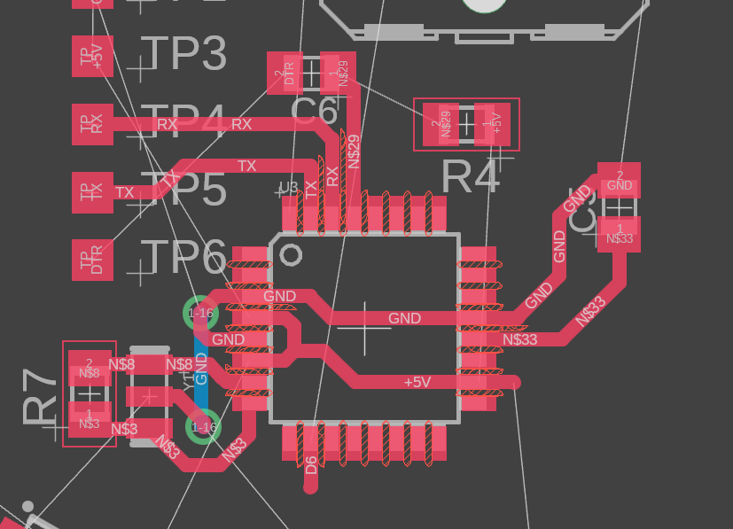

7. 之後再次開啟`drc`，將間距重新設定成`0.5mm`，之後就可以自動佈線。佈線不難，但要將過孔盡量減少就十分困難，最後我將所有ws2812 LED都轉了180度，穩壓電容和開關指示LED都搬到左下角，`TP1`至`TP6`轉了180度，才能將過孔控制在2個。
8. 最後我用`show`功能，將`+5V`和`GND`都顯示出來觀察，由於`GND`要經過全部LED轉一個圈才到達Atmega328，而LED是十分耗電的，為防到達Atmega328時電壓下降，我額外在`GND`輸入的`wirepad`旁，加了一個過孔，

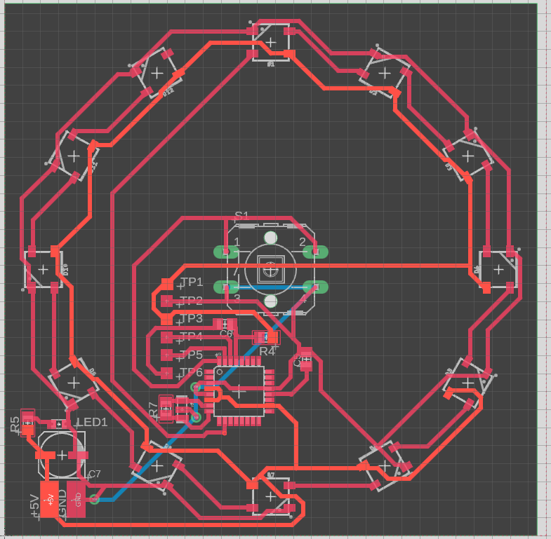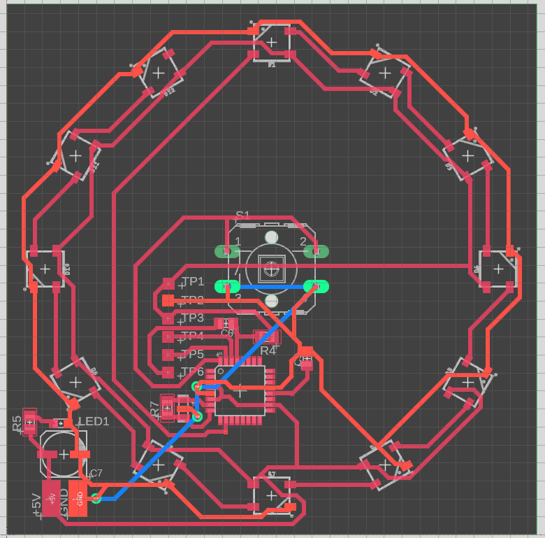

9. 最後劃`polygon`後，我開啟`drc`將間距設定成`1mm`，令`polygon`不要太密，增加製作的成功率。

  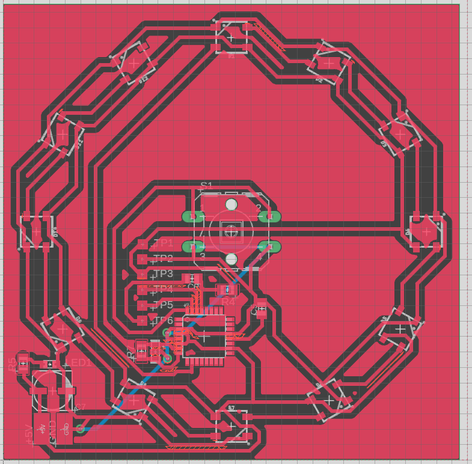

10. 製作部分與上一章一樣，在此就不再重覆了。

## 5. 上傳程式

在家/在校自製的話，由於線路本身較複雜，間距又少，失敗率都比較高，條件許可的話我建議可代工生產。如果代工的話，可參考[之前章節](../代工生產PCB/代工生產PCB.html)，而design rules也不用特別設成0.5mm線寬和間距，一般工廠設定可參考[這裡](../繪製電路圖與佈線圖/繪製電路圖與佈線圖.html#design-rule設定)。

焊接成功後，就可以上傳程式測試，由於你的arduino板是沒有上傳器的，所以需要額外的上傳器，你可以在網上找到FTDI TTL Serial Converter上傳器，或者可以用一塊可拆IC的UNO板。

### 5.1 FTDI TTL SerialConverter上傳器

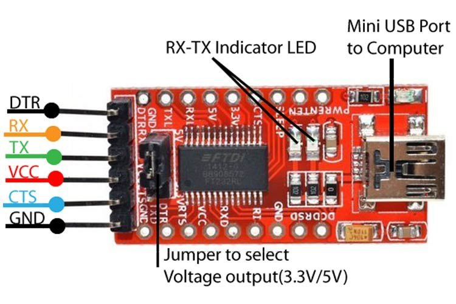

將Arduino的TP1至TP6，如下表接至上傳器

```
自製Arduino			  上傳器
TP1		+5V		<-->	---
TP2		GND		<-->	GND
TP3		+5V		<-->	+5V
TP4		RX		<-->	TX
TP5		TX		<-->	RX
TP6		DTR		<-->	DTR
```

之後就可以按照一般Arduino UNO的上傳流程上傳了。

### 5.2 可拆IC的UNO板

上述是首選，如果手邊突然沒有上傳器的話，可以找一塊可拆IC的UNO板，先將主IC用一字批輕輕取出(小心IC腳會彎)。

 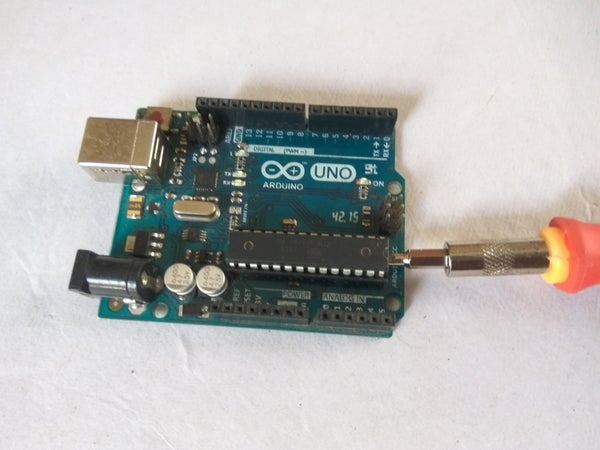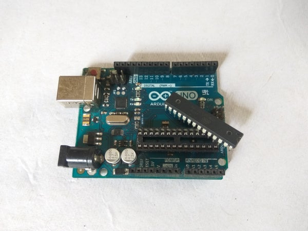


之後可根據下表按線：

```
自製Arduino			已拆IC Arduino
TP1		+5V		<-->	---
TP2		GND		<-->	GND
TP3		+5V		<-->	+5V
TP4		RX		<-->	RX(0)
TP5		TX		<-->	TX(1)
TP6		DTR		<-->	RESET
```

之後就可以按照一般上傳流程進行。

