# 自製PCB

[toc]

我們嘗試用我們常造的電路---IC555+IC4017流水燈線路，來示範怎樣自製PCB。

## 繪製電路原理圖

- 首先開始要繪劃電路原理圖，這部分教程可以參考 [之前的教學](../繪製電路圖與佈線圖/繪製電路圖與佈線圖.html)，這裡就不再重覆。

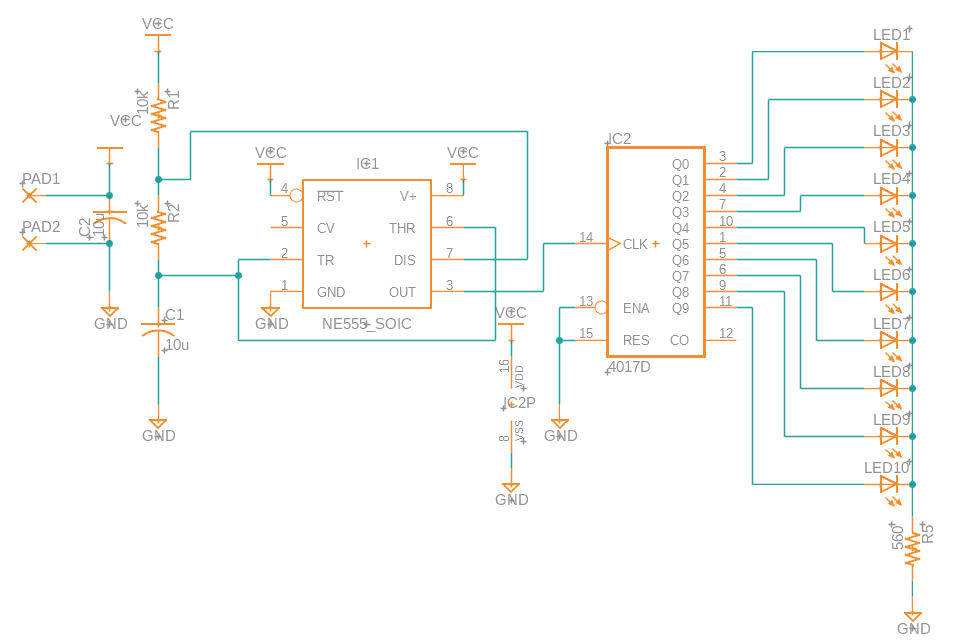

| Part  |   Value    |     Device      |      Package       |       Library        |
| :---: | :--------: | :-------------: | :----------------: | :------------------: |
|  C1   |    10u     |   C-USC0805K    |       C0805K       |   rcl (Version 11)   |
|  C2   |    10u     |   C-USC0805K    |       C0805K       |   rcl (Version 11)   |
|  IC1  | NE555_SOIC |   NE555_SOIC    | SOIC127P599X175-8N |   IC_Clock-Timing    |
|  IC2  |   4017D    |      4017D      |        SO16        |   40xx (Version 7)   |
| LED1  |            | LEDCHIP-LED0805 |    CHIP-LED0805    | adafruit (Version 2) |
| LED2  |            | LEDCHIP-LED0805 |    CHIP-LED0805    | adafruit (Version 2) |
| LED3  |            | LEDCHIP-LED0805 |    CHIP-LED0805    | adafruit (Version 2) |
| LED4  |            | LEDCHIP-LED0805 |    CHIP-LED0805    | adafruit (Version 2) |
| LED5  |            | LEDCHIP-LED0805 |    CHIP-LED0805    | adafruit (Version 2) |
| LED6  |            | LEDCHIP-LED0805 |    CHIP-LED0805    | adafruit (Version 2) |
| LED7  |            | LEDCHIP-LED0805 |    CHIP-LED0805    | adafruit (Version 2) |
| LED8  |            | LEDCHIP-LED0805 |    CHIP-LED0805    | adafruit (Version 2) |
| LED9  |            | LEDCHIP-LED0805 |    CHIP-LED0805    | adafruit (Version 2) |
| LED10 |            | LEDCHIP-LED0805 |    CHIP-LED0805    | adafruit (Version 2) |
| PAD1  |            |      SMD2       |    SMD1,27-2,54    | wirepad (Version 2)  |
| PAD2  |            |      SMD2       |    SMD1,27-2,54    | wirepad (Version 2)  |
|  R1   |    10k     |   R-US_R0805    |       R0805        |   rcl (Version 11)   |
|  R2   |    10k     |   R-US_R0805    |       R0805        |   rcl (Version 11)   |
|  R5   |    560     |   R-US_R0805    |       R0805        |   rcl (Version 11)   |

**完成後記得做`erc`確認有否錯誤，下方的warning可以按`Approved`，都是正常的。**

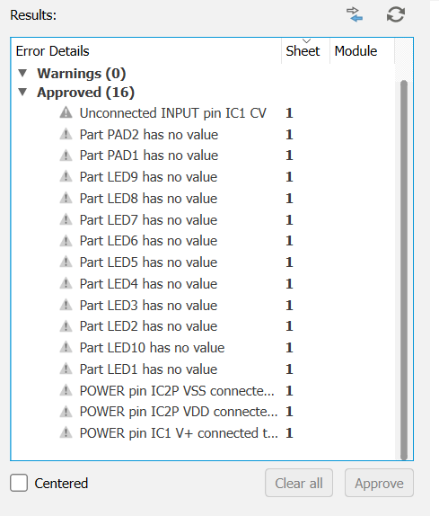

## 繪制電路圖

### 放置元件

- 首先開啟`grid`設定，將網格設定成`100mil`，`Alt`設定為`50mil`，

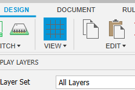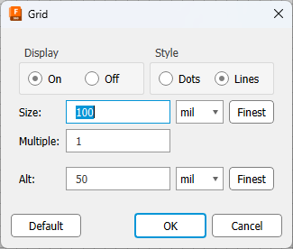

- 將零件大約跟著識個版本來排，你未必需要跟我完全一樣，但要注意白線，盡量將相鄰的元件放在一起。

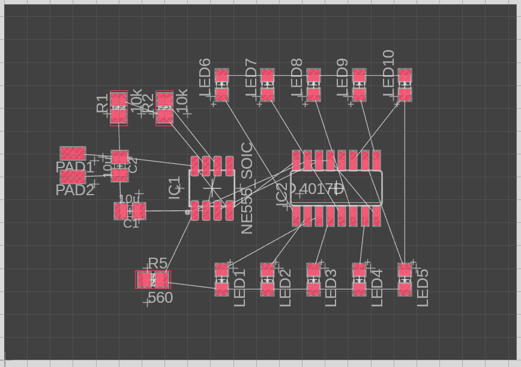

- 接著佈線前跟之前不一樣
- 預設的佈線設定是為工廠所生產，線寬一般為6mil，如果是自製的話，會非常難以控制，所以需要將線寬、線距和最小孔徑加大
- 在命令列輸入`drc`

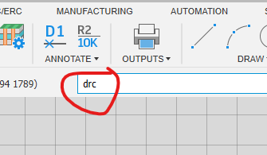

- 在`Clearance`欄中，將所有`Wire`、`Pad`和`Via`的間距設定為``0.5mm`，==記得輸入單位`mm`==
- `Distance`中，將`Dimension`設定為`6mil`

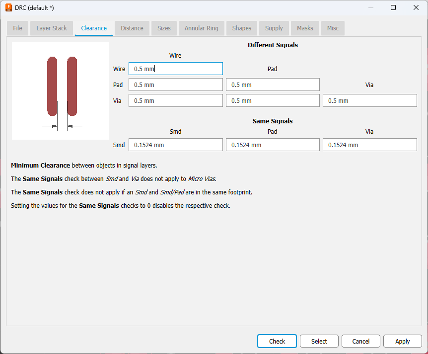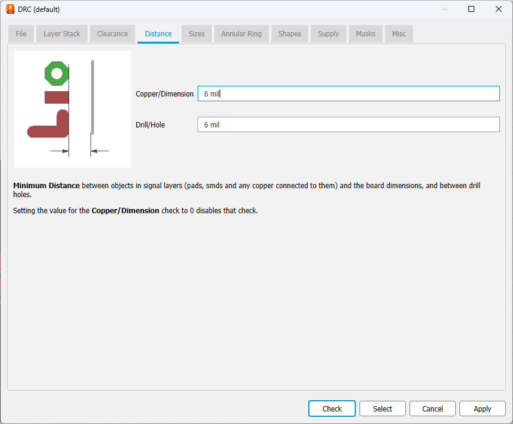

- 在`sizes`欄中，將`Minimum Width`和`Minimum Drill`分別設為`0.5mm`和`0.9mm`，==記得輸入單位`mm`==
- 最後在`Masks`欄中，將`Limit`設定為`3mm`，將所有小於3mm的鑽孔都蓋上綠油

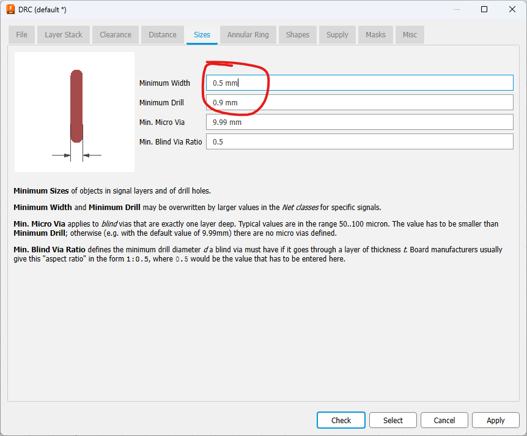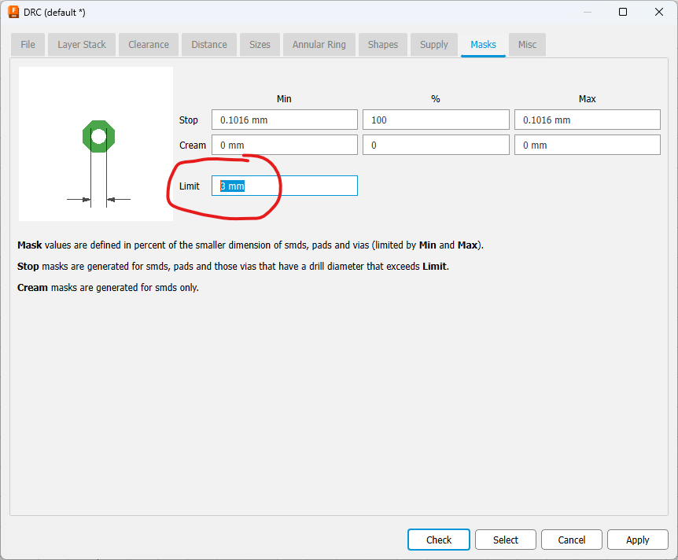

- 最後按下`Apply`，==不是`Check`==

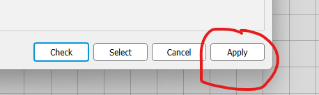

###自動佈線

- 按下自動佈線按鍵

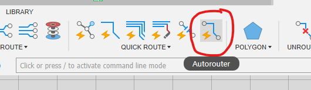

- 自製PCB的話，如果製作雙面板，會有大量via過孔，需要使用CNC鑽孔，有機會會再寫教程
- 但今次只佈單面板
- 將`1 Top`保持為`Auto`，將`16 Bottom`設定為`N/A`

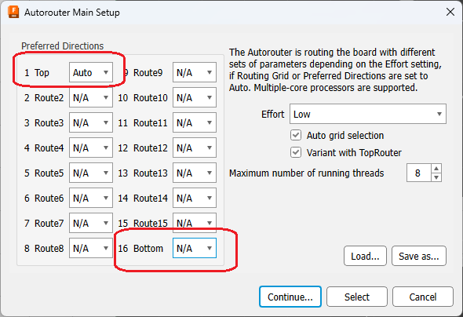

- 佈線沒有100%是正常的
- 如果沒有90%以上，可以將板的面積加大一點，讓它留有空間走線
- 選一個走線不要太遠的按下`End Job`

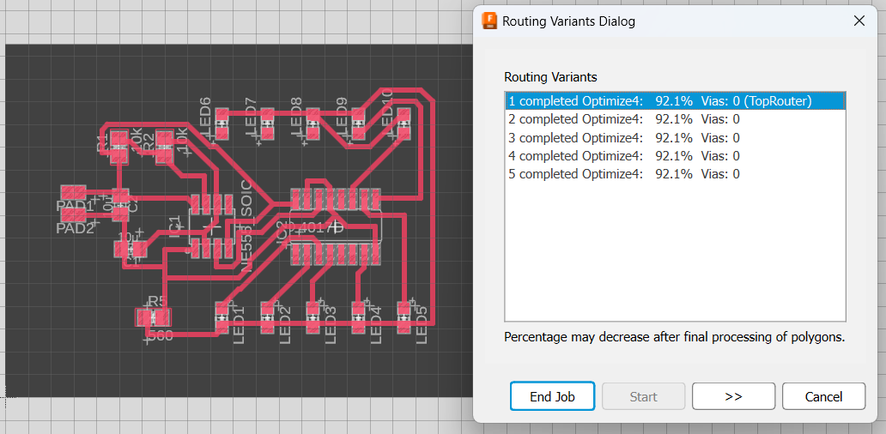

- 以我的例子為例，還有3條線是未佈的，由白色的幼線連著。

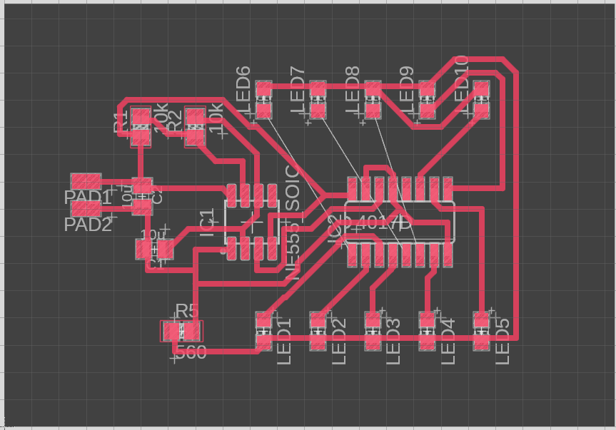

- 接著是手動佈線，由於手動佈線是跟著網格去佈的，所以要先將網格縮少
- 打開`Grid`選項，或在命令列輸入`Grid`。
- 將每一格的`Size`設定成`5mil`或更少的值。

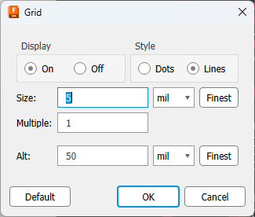

- 按手動佈線按鍵，或直接在命令列輸入`route`
- 將線寬設成`0.5mm`

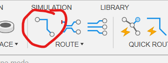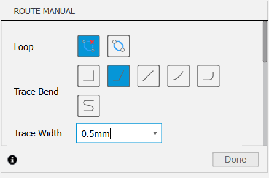

- 按一按未佈的線，就會有紅色線引出來，移動時其他的紅色線會輕輕避開
- 按一按滑鼠中鍵（即滑鼠滾輪），就會出現綠色的via過孔
- 找空位放下後，就會跳到藍色的線，藍線代表PCB下層的佈線
- 接著按下滑鼠中鍵（即滑鼠滾輪），再次放下via過孔
- 就能返回佈PCB上層的紅線
- 重覆步驟，例如我的板下層就有3條，共6個via過孔

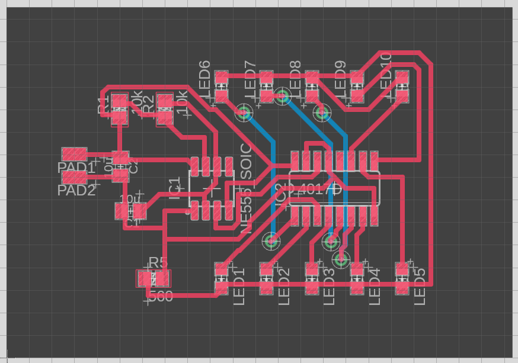

- 最後按下`polygon`按鍵
- 在板的四邊畫一個方型，就會見到下面的效果
- 由於PCB製作是由覆銅板蝕去不要的地方，所以盡可能保留銅，減少溶劑的損耗

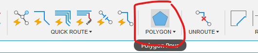

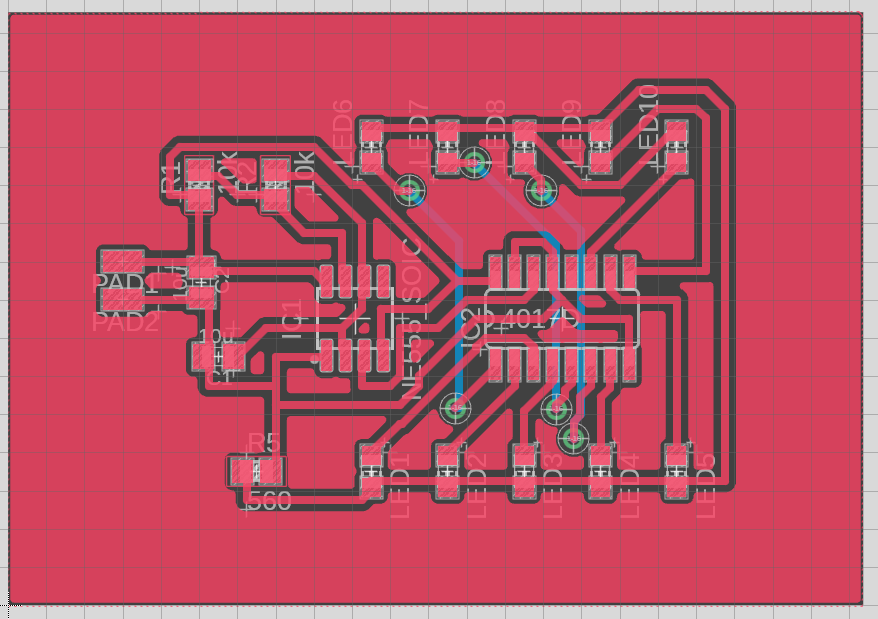

### 製作PCB板

- 打開左邊的`Display Layer`欄，如果找不到，可以在上方圖示找到`layer`指令，或直接在命令列輸入`layer`
- 只保留`1 Top`、`17 Pad`和`18 Vias`

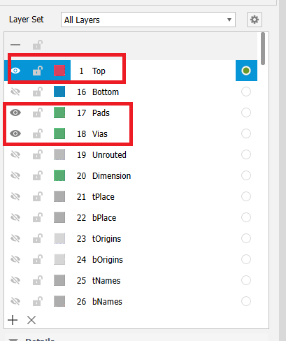

- 在上方找`Print`圖示，或直接在命令列輸入`Print`

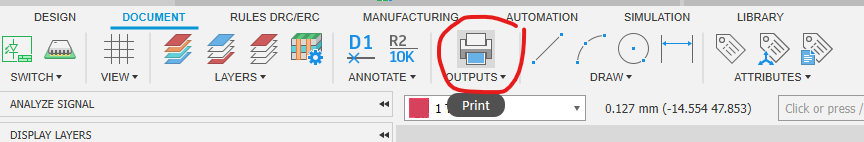

- 在`Printer`中設為`Print to File(PDF)`
- 選擇`Output file`的路徑，例如我是直接放在桌面
- `Options`中，
	- 將影像鏡像`mirror`，因熱轉印是蓋在覆銅板上方轉印，所以需要鏡像
	- 選擇`Black`，將影像強制轉成黑白，令印出來更深色
- 在`Scale`中，將`Scale factor`設定成`1`，這樣才能一比一的印出直實尺寸

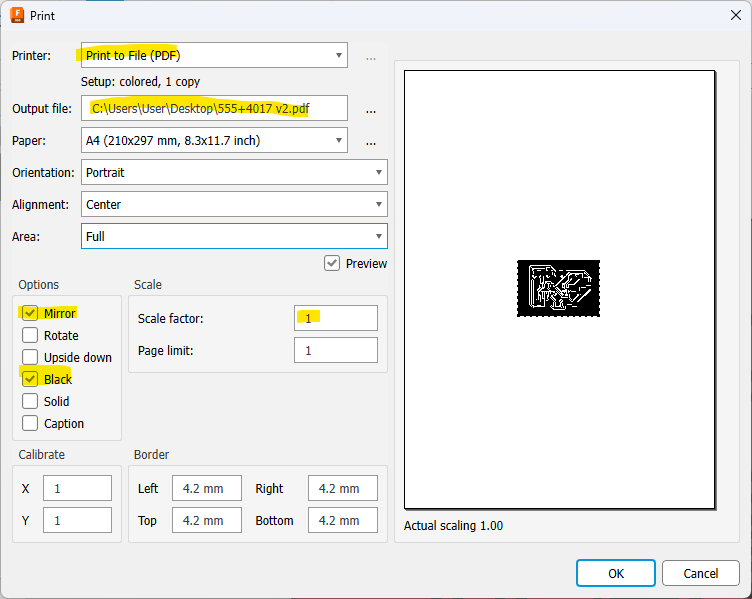

- 開始一個你熟識的排版軟件
	- 我的話是Adobe Illustrator
	- 你可以選擇學校電腦有預安裝的CorelDraw
	- 或者在家又不想花錢的話，可以下載免費的 [Inkscape](https://inkscape.org/)
- 將PDF檔排入版面，一次過印數份，即使後面的步驟失敗了也能再試

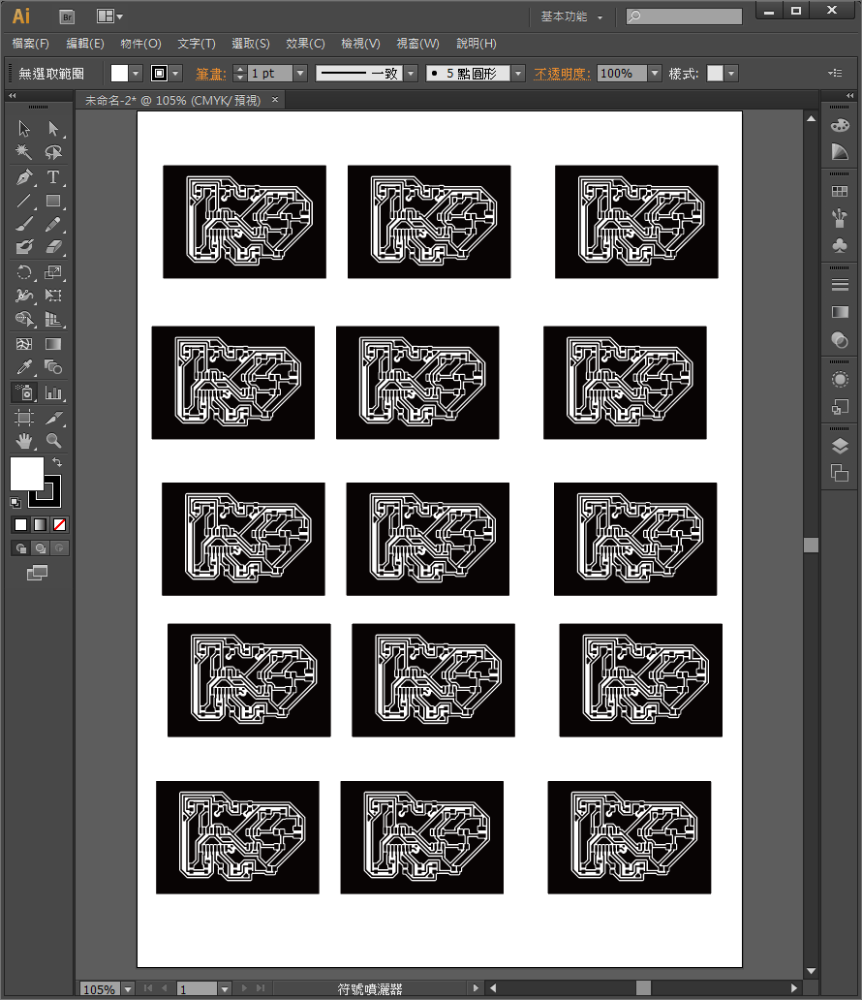

- 用熱**轉印紙**和**激光打印機**打印出來
- ==熱轉紙有分兩面，要打印在**<u>*光滑*</u>**的一面==

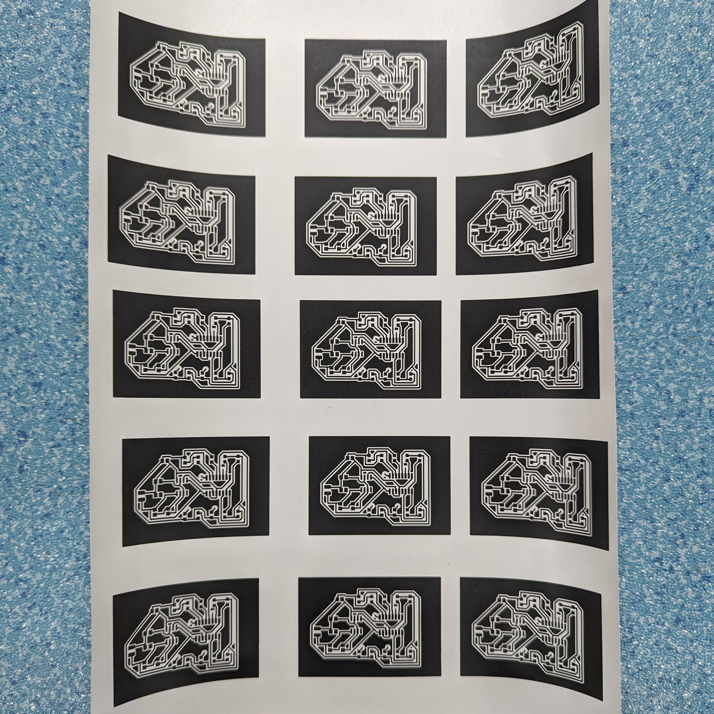

- 將覆銅板截一半，約100 x 75 mm大小
- ==不要將覆銅板截太少，邊長少於70mm的話，下一個步驟不能卷進熱轉印機==

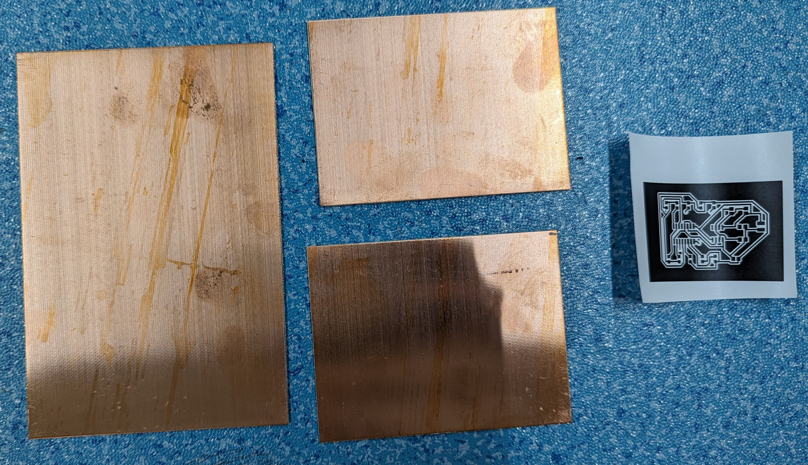

- 用400號沙紙，沾水輕力研磨，將表面的氧化物去除

	- ==不要太大力研磨，也不要用粗沙紙和研磨太久，典型的覆銅板，銅的厚度只有`0.035mm`，後容易會全部磨走==

- 用洗潔精、洗手液或沐浴露，將銅板兩邊的油脂清洗乾淨

	- 也可以用高濃度酒精或其他去油去水的化學品
		- *使用化學品請做足保護措施*

	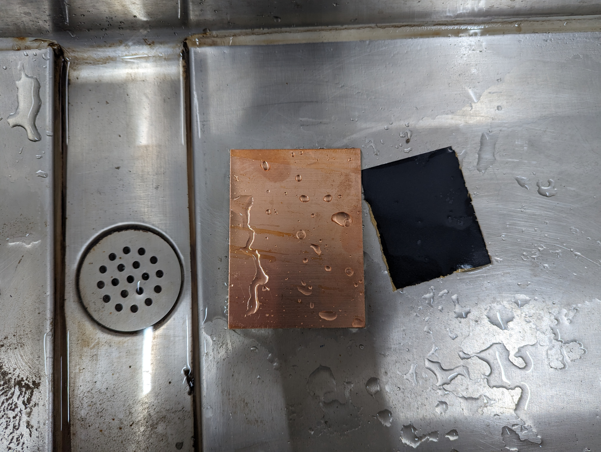

	

- 清洗後的用紙抹乾

	- *盡量不要用手指佔到銅的位置，免得油脂再次污染*

- 抹乾水後風乾一會

- 等待期間將熱轉印紙剪好備用

	- ==熱轉印紙要預留白邊大約1-2cm，不要剛貼著黑邊去剪裁==

	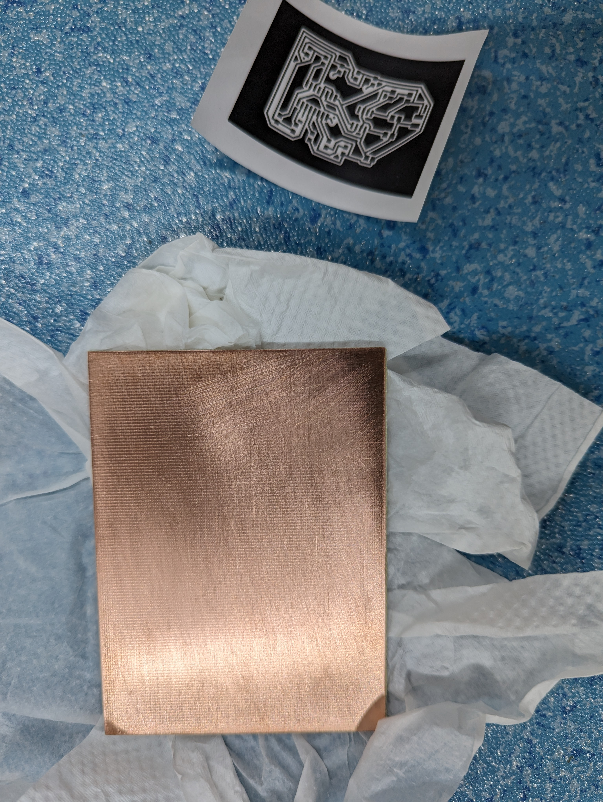

- 用防熱膠紙(最好用3cm寬的那款)，將熱轉印紙貼在覆銅板表面
	- ==防熱膠紙不要蓋到黑色部分==，否則該部分不能熱轉印到銅板上
	- 熱轉印紙貼到正中央，==讓防熱膠紙有足夠的面積貼著銅板==，否則下一步放入熱轉印機中，很容易會脫落走位
	- ==只需貼一個短邊和少量長邊(如下圖)==，機械滾動時但將紙輕輕拉長
	- ==確保熱轉印紙完全貼服==

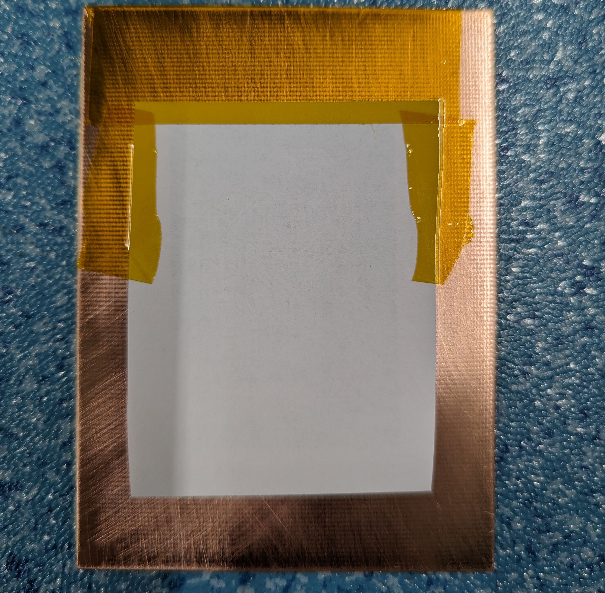

- 可以提前準備，將熱轉印機調到180攝氏度左右

- 將銅板有膠紙的一邊推入機器中

- 見到銅板出來後，可用鉗輕輕拉出==(注意銅板會非常高熱，不要用手觸碰)==

- 重覆這個步驟，共放入機器兩次

	- 下圖是拉出來的圖片，不是推入去的圖片
	- 整個過程中，==都需要適當的用力推入和拉出機器==，不要只讓上面的膠紙和熱轉印紙==受力卷入機器==，否則很易脫落

	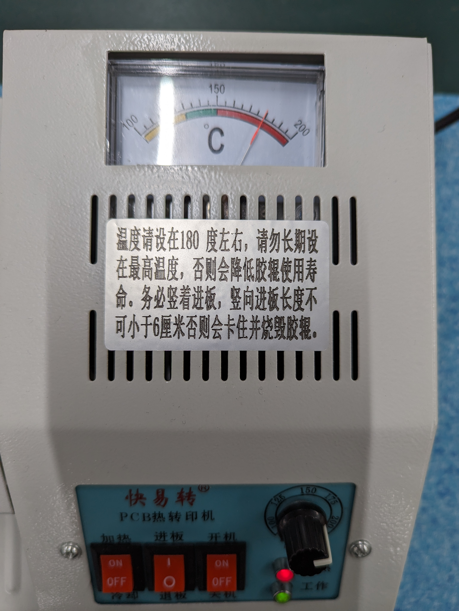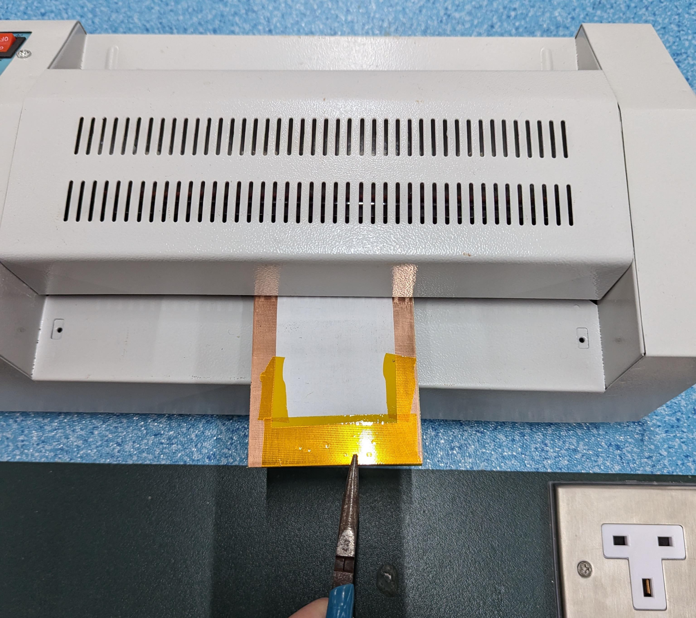

- 讓
