# 齒輪簡介

**齒輪**確實是一種重要的機械零件，其輪緣上的齒可以連續囓合，從而傳遞運動和動力。**齒輪**可以與其他齒狀機械零件（如另一齒輪、齒條、蝸桿等）囓合傳動，實現改變轉速、扭矩、運動方向和運動形式等功能。由於其傳動效率高、傳動比準確、功率範圍大等優點，齒輪機構在工業產品中得到了廣泛的應用。齒輪的設計與製造水準會直接影響到工業產品的品質。

[toc]

## 1. 模數、齒距圓直徑與齒數

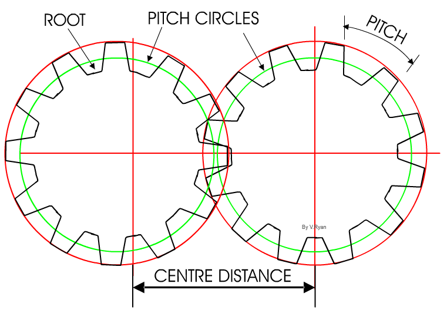

1. **模數 (Module)**：齒輪模數是一個用來度量齒輪尺寸的基本參數。我們使用模數來決定齒輪的大小和形狀。具體來說，模數（m）是齒輪的齒距圓直徑除以齒數（z）的比值：
  $$
  \text{模數(m)} = \frac{\text{齒距圓直徑(d)}}{\text{齒數(z)}}
  $$
  模數越大，齒輪的尺寸越大。相同模數的齒輪才能相互囓合並進行傳動。

2. **齒距圓直徑 (Pitch Diameter)**：齒距圓(pitch circle)是一個理論上的圓，它通過齒輪的齒距點(pitch point)，而這個圓的直徑，就是**齒距圓直徑(Pitch Diameter)**。

	齒輪的齒形狀並非可以用簡單的尺規作圖法來描繪出來的。在理論上，兩個囓合的齒輪在傳動過程中，只有在齒距點（Pitch Point）處才會有接觸。這個齒距點並不位於齒頂和齒根的正中間，而是位於兩者之間的某一點。

	因此，為了方便計算齒輪與齒輪間的中心距，我們會畫一個通過齒距點的圓，這個圓就是我們所說的齒距圓。齒距圓的直徑，即齒距圓直徑，這個齒距圓對於確定齒輪的大小和傳動比起著關鍵的作用。

	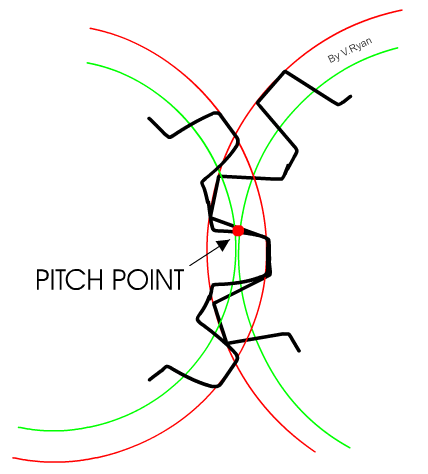                     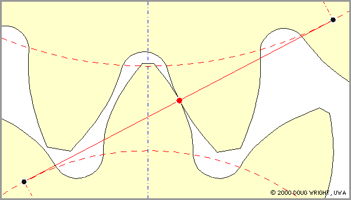

3. **齒數 (Number of Teeth)**：齒數表示齒輪上的齒的數量。

## 2. 中心距

齒輪要互相囓合，首先要確保齒輪的模數(也就是齒輪的大小)是一致的，接著，就要用模數和齒數，計算齒距圓(pitch circle)的直徑($m=\frac{d}{z}$)，就能計算兩齒輪間的中心距。

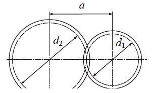
$$
a = \frac{d_1+d_2}{2}
$$
例如下圖是我們常見的Tamiya田宮的齒輪箱，是標準公制0.5模數，大和小齒輪分別是42齒和12齒，那它長軸和短軸的間距是多少呢?

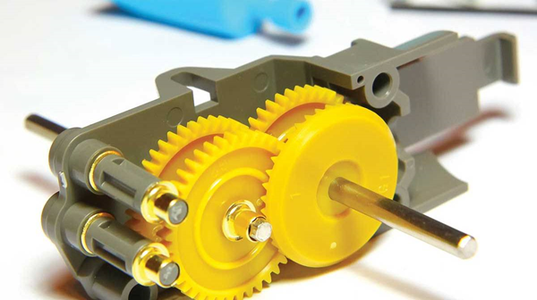

可以代入:
$$
\begin{align}
a &= \frac{m \times (z_1 + z_2)}{2} \\
&= \frac{0.5 \times (42 + 12)}{2}  \\
&= 13.5\text{ }mm
\end{align}
$$

## 3. 在Fusion360中繪畫齒輪

###3.1 安裝插件

如上文所說，齒輪並非一般尺規作圖法能畫得出來，而是由漸開線生成的。故此，我們會使用一個叫[Helical Gear Plus](https://apps.autodesk.com/FUSION/en/Detail/Index?id=1259509007239787473&appLang=en&os=Mac)的插件，幫我們生成齒輪。

首先到[==Helical Gear Plus==](https://apps.autodesk.com/FUSION/en/Detail/Index?id=1259509007239787473&appLang=en&os=Mac)下載插件：

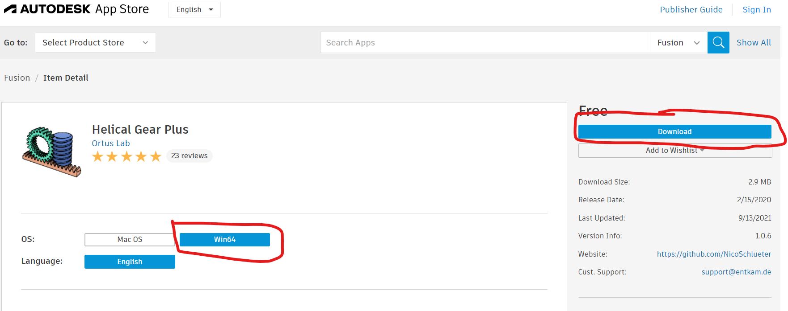

記得要選擇對應的OS，按右手邊的`Download`就可以，系統會要求你先登入Autodesk帳號，就可以下載。下載後按正常安裝程序安裝就可以了。

### 3.2 生成齒輪

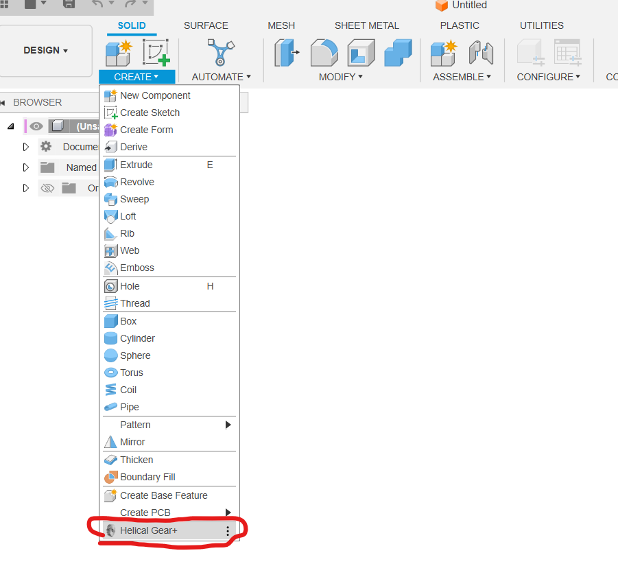

正確安裝的話，在`create`的最下方，就會見到多了一個`Helical Gear+`的選項。

### 3.3 參數介紹

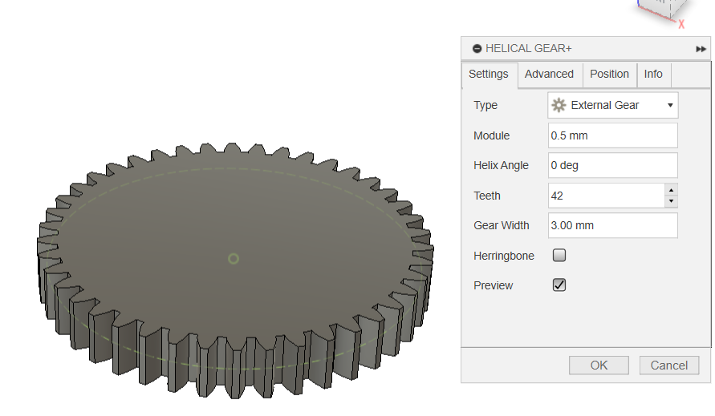

之後就會在右手邊有幾個選項：

- **`Type`**：有`外齒輪`、`內齒輪`和`齒條`三個選項。

- **`Module`**：就是上文所說的模數，是齒輪的大小，例如我輸入，是Tamiya常見的`0.5`模數。

- **`Helix Angle`**：齒輪的螺旋角，如果是一般常見的正齒輪(Spur Gear)，則為`0°`。關於螺旋角，下一章會作詳述。

- **`Teeth`**：齒數，如上述齒輪就是`42`齒。

- **`Gear Width`**：齒輪的厚度，例如我隨便輸入了`3mm`厚度。

- **`Herringbone`**：用於螺旋齒輪(Helical Gear)，將單一個螺旋齒輪變為對稱的人字齒輪(Herringbone Gear)

- **`Preview`**：就是字面上的意思，即時預覽最終結果。

	

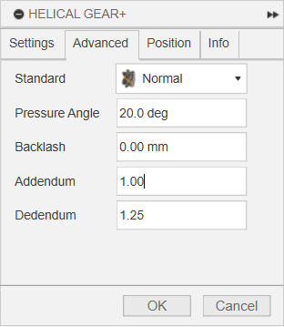

我們跳到下一版：

- **`Standard`**：有分為`Normal`和`Radial`，用於螺旋齒輪計算模數，是用平面投影作為尺寸，還是用真實距離作為計算。

	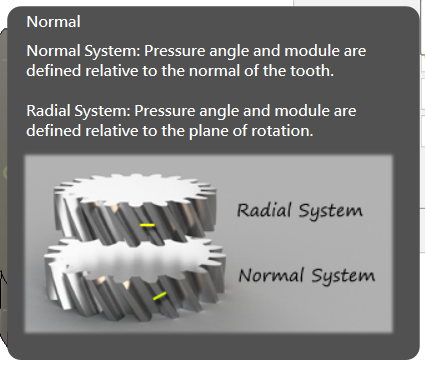

- **`Pressure Angle`**：壓力角。用以控制齒輪的齒有多尖。壓力角越大，齒輪的形狀就會變得扁而尖，越像一個三角型﹔壓力角越少，齒輪看起來就越方正，越像一個長方形。一般壓力角有`20°`和`14.5°`兩款，常用是`20°`。

- **`Backlash`**：齒輪間隙。就是齒輪的虛位，在真實的齒輪中，齒輪間隙的存在有其必要性，例如為了防止齒輪卡死，或者為了留出潤滑油的空間。然而，過大的齒輪間隙會導致傳動不準確，甚至可能導致齒輪的損壞。
- **`Addendum`**和**`Dedendum`**：齒輪的齒頂距和齒根距。正常的齒輪，兩者的比例為模數的`1`和`1.25`倍。

第三版的**`Position`**和第四版的**`Info`**就不詳述了，按下`OK`，就會得到一隻42齒0.5模數的齒輪，而且還很貼心，保留了齒距圓(Pitch Circle)幫忙我們後續的設計和組裝。

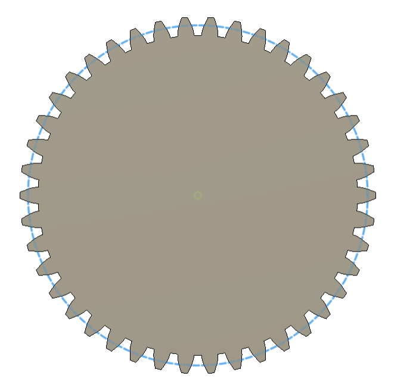