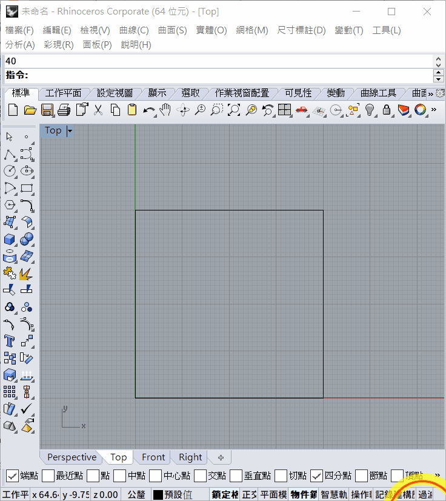

# Introduction of Rhinoceros 2

[TOC]

## 1. Tangent line

There are few method to draw a tangent line:

### Horizontal/ vertical tangent line

1. If the tangent line is horizontal(水平) or vertical(垂直), that means it tangent two identical and horizontal circle, then just simply use the `quad(四分點)` in `Osnap(物件鎖點)` toolbar.

### Point to tangent circle

1. Select the start point of tangent line
2. Make sure that you have selected the `tan(切點)` in `Osnap(物件鎖定)` toolbar
3. Move the curser near the tangent point, the word `tangent` should come out and snap the tangent point
4. ***<u>Make sure ==unselect== the `cen(中心點)` in  `Osnap(物件鎖定)` toolbar, or it may snap the center of circle</u>***

### Circle to circle tangent line

1. ***<u>Make sure ==unselect== the `cen(中心點)` in  `Osnap(物件鎖定)` toolbar, or it may snap the center of circle</u>***
2. Type command `line` then press `ENTER`
3. Then press `T` and press `ENTER` OR select `tangent(與曲線正切)`
4. Move your mouse curser near one of the circle, it should snap a white color tangent line, click the mouse left click
5. Then move the mouse curser near another circle, there are 2 types tangent line, inner tangent line and outer tangent line, move your mouse curser to define it

## 2. Offset

1. Type `offset` in the command line
2. Select the object that you want to offset, press `spacebar`, `ENTER` or mouse right click to confirm
3. Select `Distance(距離) ` to define the offset distance
4. Click mouse left click to define the direction and confirm

***You can use offset to offset line, circle, rectangle and any enclosed (use command `join`) shape***

***`Offset `is useful to locate the objects***

1. `offset` also work in both(兩側) mode, it is useful when you need to offset both side simultaneously.

## 3. Mirror

1. Type command `mirror`
2. Select the object that you want to mirror, then press `spacebar`, `ENTER` or mouse right click to confirm
3. Select the start and end point of mirror line
4. If you want to mirror and copy the objects, select the `copy` command before select the mirror line

## 4. Fillet

If you want to fillet(建立圓角) two object

1. Type command `fillet` in command line
2. Select `radian(半徑)` OR type `R` and then press `ENTER`
3. Enter the radian that you want to fillet, then press `ENTER`
4. Select the first and second objects

1. Fillet also work between two circle

1. Fillet also work between circle and line.

## Exercise

1 ~ 3:

4 ~ 7:

8 ~ 11:

12 ~ 15:

