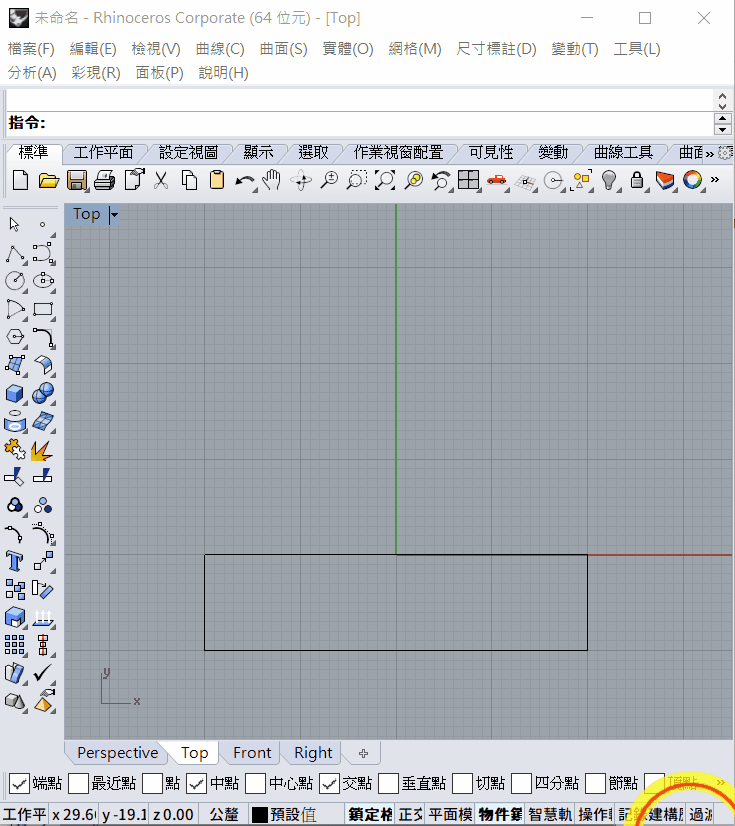
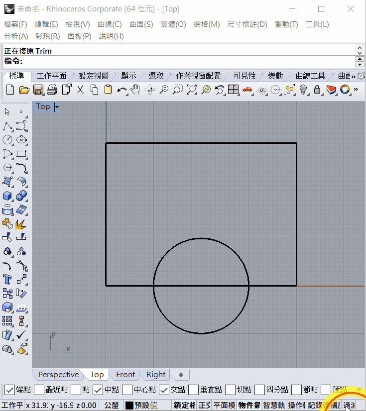

# Introduction of Rhinoceros

[TOC]

## 1. Open Rhinoceros

1. Find the icon of Rhinoceros 5 (64-bit) OR Rhinoceros 4.

   

2. When you open Rhinoceros, choose a template, you can choose:

   1. Large Objects - Millimeter OR
   2. Small Objects - Millimeter

   

   
## 2. User Interface

There are three main parts in the user interface:

1. Command line
2. Object Snap
3. Status bar

   ### 1. Command line

一般繪圖軟件功能比較多，分散得比較多個版面，一般都會設有搜尋列或命令列方便用家直線打指令。

### 2. Object Snap

- We need to focus on `Osnap`, which is 物件鎖點in Chinese(You can see the English and Chinese version on the above graph)
- Also, `Grid Snap` (`鎖定格點`)feature is usefully

- `Osnap `stand for  "Object Snap", which can snap(鎖定)the special point in the geometry

# Start to draw

1. Only focus on the TOP view, ==DOUBLE CLICK== the `TOP `icon
1. Hold ***<u>mouse right click</u>*** to drag the view

## 1. Line/Polyline

### `Line`

1. Type command `line` to draw line
2. First select the start point of line
3. Then select the end point
4. **If you want to repeat the `line` command, simply click *right click of mouse* OR press the *spacebar of keyboard***

To draw a line with certain length:

1. You can select the first point
2. Then input the length of the line, e.g. 10
3. There will be a white line to link the curser, but the black line to show the 10mm length
4. Hold the key `SHIFT` to define the line horizontal(水平) or vertebral(垂直)
5. Click the mouse left click to confirm the line

To draw a line with certain angle and length:

1. You can first select the start point
2. Input `<60` and press `ENTER` to constrain the line 60 degree along the x-axis
3. Input `10` and press `ENTER` to constrain the length of line as 10mm
4. Click mouse left to confirm and finish

### `Polyline`

If you want to draw a few continues line segment, you can use command `polyline`

## 2. Rectangle

1. Use command `rectangle` to draw rectangle
2. There are 3 method to draw:

### Diagonal mode

The default mode is diagonal mode, just select the 2 corner of the rectangle

###  3 point mode

You can type command `P` after the command `rectangle`, or just click the `3 point` in the command line, then you can use 3 point to define a rectangle

### Center mode

Or you can use center method, define the center point of the rectangle, then define the corner

## 3. Circle

1. Use command `circle` to draw circle:
2. There are a few method:

### Center mode

The default mode is center mode, first select the center point of circle, then use command `R` or `D` to define the radius or diameter of the circle

### 2 point mode

Or use `2 point` mode, define 2 points as the diameter of the circle

## 4. Trim

Use the command `Trim` to trim the extra line.

1. Type command `Trim`
2. Select the objects that you want to trim, then press spacebar, ENTER OR mouse right click to confirm
3. Select the segment that you want to trim to delete it, press spacebar, ENTER OR mouse right click to finish.

# Exercise

1. Each grid is 10x10mm

​								PDF version here -->  [week 1.pdf](week 1.pdf) 

