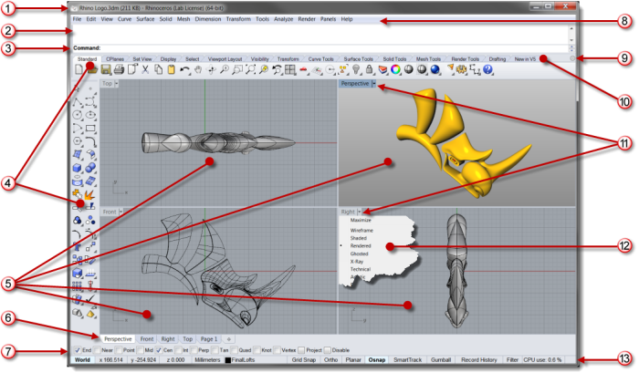
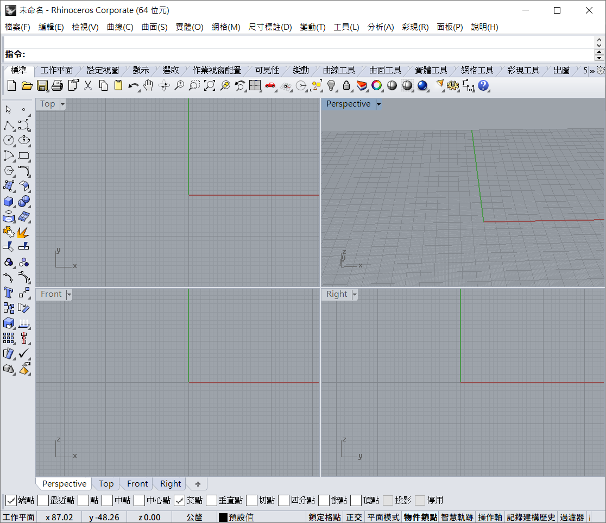

# 1.0 Interface of Rhinoceros

今次我們會用到的軟件為Rhinoceros。Rhinoceros在工程業界沒有AutoCAD出名，AutoCAD主要用於工程圖則，主要以平面則為主(雖然AutoCAD都有3D功能，但業界常用的多為2D功能)；另一邊，Rhinoceros無論在用法跟功能上都跟AutoCAD差不多，但因Rhinoceros有很好的3D曲線建模功能，也有十分多的插件去擴充，多為設計師(例如建築師、珠寶設計等)使用。

## 用戶介面

由於我用的版本為中文版，我沒有英文版，所以我在官方說明下載一個英文介面做中英對照。

## OSnap

OSnap即為Object Snap，snap在中文是鎖點的意思，Rhino上的劃的圖