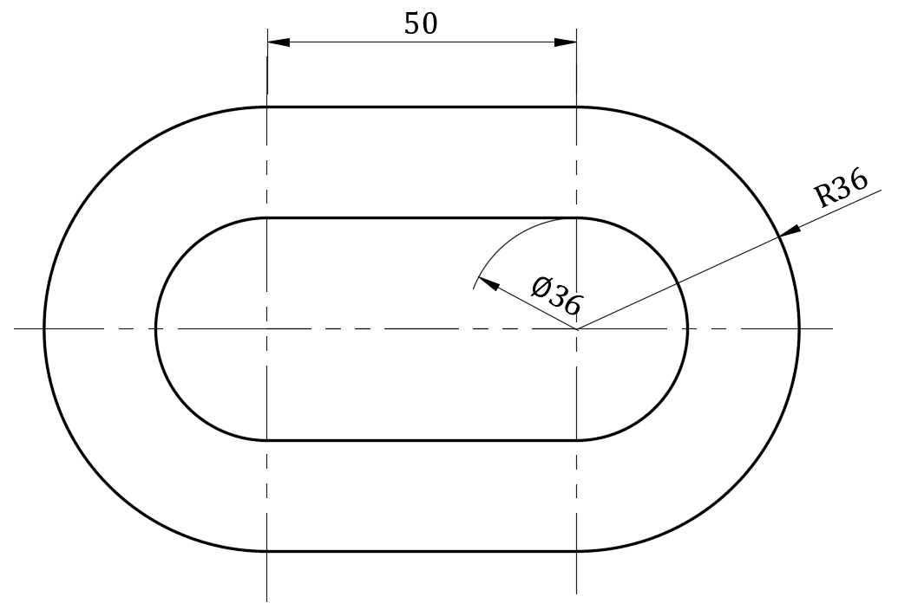
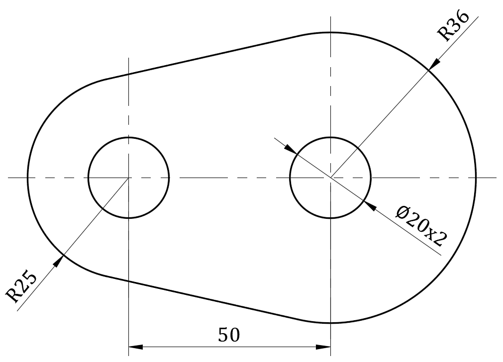
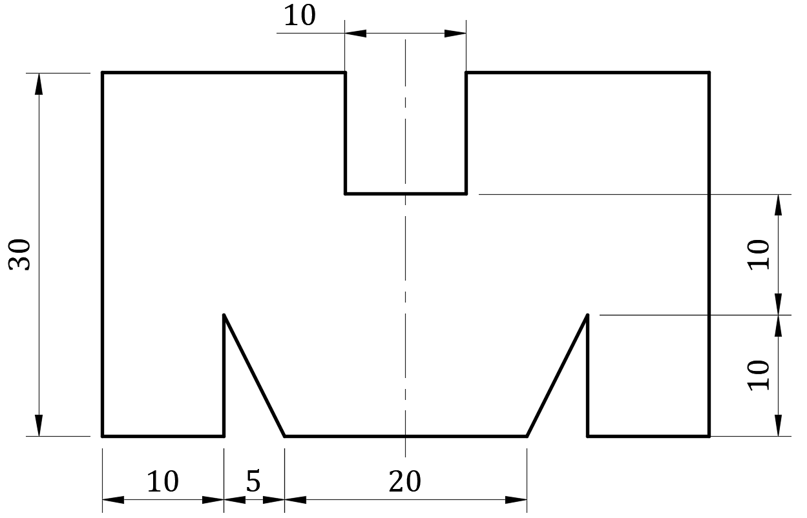
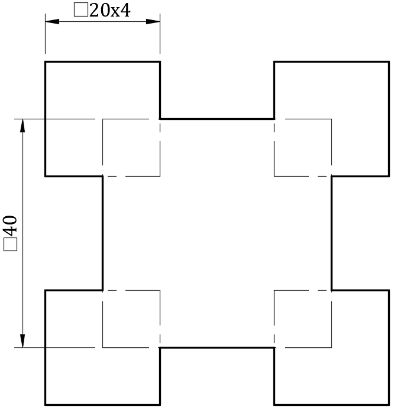
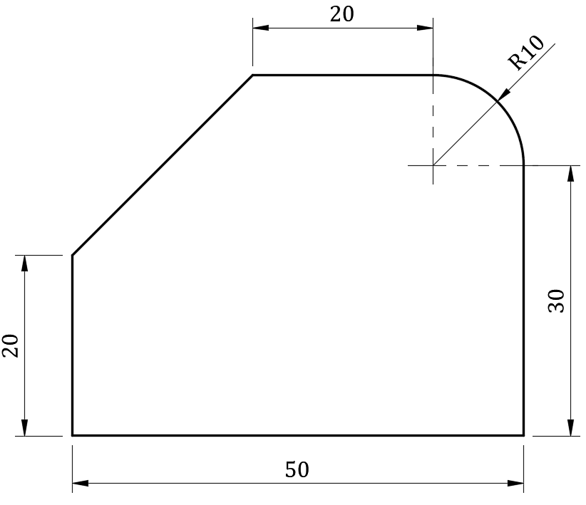
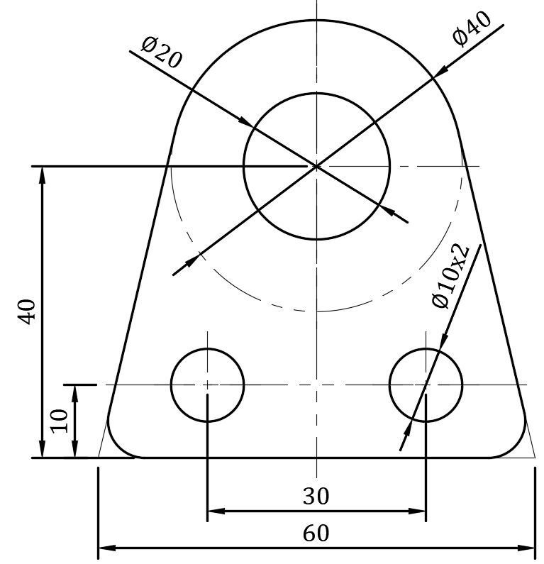
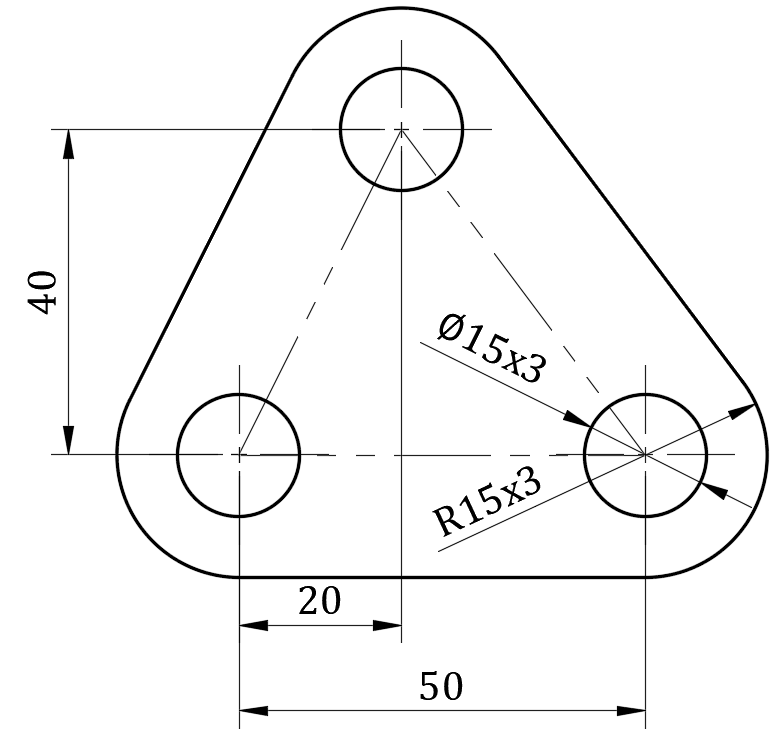
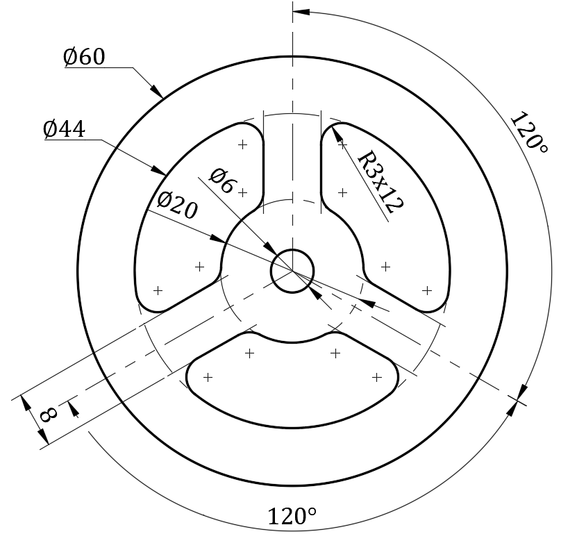

# 1.1  Construction of geometric figures

[TOC]

## 1. Construction of triangle

##2. Construction of  quadrilateral

##3. Construction of tangent line and arc

## Exercise

## Harder problem

