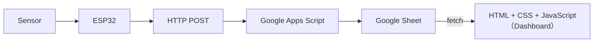

# 建立你的 Web Dashboard —— HTML / CSS / JavaScript 基礎

> 本章目標：讓你理解 **網站如何構成、放在哪裡、如何讀取 Google Sheet 資料做圖表**，為下一章 Dashboard 實作作準備。

------

## 1｜為何要學 HTML、CSS、JavaScript？

Dashboard = 一個「網頁」。
 網頁由三個部分組合：

### 1.1 HTML —— 結構（Structure）

- 決定「內容放在哪裡」
- 例子：標題、段落、表格、Canvas（畫圖用）

範例：

```
<h1>My Dashboard</h1>
<div id="chart"></div>
```

------

### 1.2 CSS —— 外觀（Style）

- 決定「長相」
- 顏色、字型、間距、排版

範例：

```
#chart {
    width: 600px;
    margin: 20px auto;
}
```

------

### 1.3 JavaScript —— 邏輯（Logic）

- 真正「會動」的部分
- 連 Google Sheet / GAS API
- 畫圖表（Plotly.js、Chart.js、ECharts）
- 設計自動更新資料

範例：

```
console.log("Dashboard Ready");
```

------

## 2｜靜態網站 vs 動態網站

同一個 Dashboard，可能有不同部署方式。
 你需要理解「它屬於哪一類」。

------

### 2.1 靜態網站（Static Website）

**特點：**

- 只是檔案（.html / .css / .js）
- 不會自己產生資料
- 最常見：GitHub Pages、ESP32 小型控制頁面

適合：

- 展示頁、分數板、小工具

------

### 2.2 動態網站（Dynamic Website）

**特點：**

- 會「向伺服器拿資料」、「寫入資料庫」
- 透過 API 抽資料（例如 GAS 提供的 JSON）

你的 Dashboard 屬於：

> **前端靜態網站 + 後端 GAS API 取資料的混合模式。**

------

## 3｜Dashboard 應該放在哪裡？（ESP32？電腦？雲端？）

### 3.1 放 ESP32（不推薦）

ESP32 可以開 Web Server，但：

- 容量只有幾百 KB
- 圖表 Library（Plotly.js、Chart.js、ECharts）體積大，塞不下
- 前端每改一次 → 要重燒 firmware
- 性能弱

只適合：

> 控制面板（按鈕 / LED 開關演示），不適合資料視覺化。

------

### 3.2 放你的電腦（VS Code + Live Server）

**優點：**

- 最易測試
- 可用任何 JS Library
- 效能好

**缺點：**

- 家裡電腦關機 → 網站就停止
- 不能分享給其他人

適合：

> 開發階段、教學階段。

------

### 3.3 放 GitHub Pages / Netlify / Vercel（最推薦）

**優點：**

- 免費
- 全球可瀏覽
- 前端改動 → 自動部署
- 非常適合 Dashboard

**注意：**

- 靜態網站無法直接連資料庫 → 需要「GAS API」取 Sheet 資料。

完整資料鏈：

```
ESP32 → GAS → Google Sheet → Dashboard（JS）
```

### 📘 小練習：建立你的第一個「本地網站」（Live Server）

> 目標：令你理解 HTML × CSS × JavaScript 如何在一個網頁中協同運作。
>  無需上載、無需 API、純本地。

------

#### ✔ Step 1：建立 `index.html`

建立一個新資料夾（例如：`F5X15 XXX`），在裡面新增`index.html`：

填入：

```html
<style>
body {
    font-family: Arial;
    margin: 40px;
}
</style>

<script>
console.log("JS Loaded");
</script>

<h1>ESP32 Dashboard</h1>
<p>準備連接 Google Sheet…</p>
```


#### ✔ Step 2：下載live server


下載並啟動 **Live Server**。

#### ✔ Step 3：驗證目標

1. 你應該看到白底網頁＋標題
2. 打開 DevTools(按下`F12`) → Console → 看到「JS Loaded」


#### ✔ Step 4 ：正規化你的HTML

在這個Project folder中，新增兩個檔案：`script.js`和`style.css`，將剛才的style和script部分，分別剪下貼回對應的檔(記得不需要`<style> </style>`和`<script> </script>`)

HTML請修改為標準HTML格式，將script和style都放在一開始的header中(VS Code中，只要打html，就會有下拉html5的選單，直接生成這個完整的HTML格式，不用自己打)


#### 常見HTML代碼


#### 🔧 練習 A：加一個按鈕，按下會改變頁面文字

在 `index.html`的`<body>` 添加：

```html
<button id="btn">按我更新內容</button>
<p id="result">（按鈕未被按）</p>
```

在 `script.js`加入：

```javascript
window.onload = () => {
    document.getElementById("btn").onclick = () => {
        document.getElementById("result").innerText = "按鈕已被按下！";
    };
};
```

**重點技能：DOM 操作**

#### 🔧 練習 B：加 CSS 版面（最基本的 Layout 設計）

在 `index.html`的`<body>` 添加：

```html
<div id="container">
    <h1>My First Web Dashboard</h1>
    <button id="btn">Click to Update</button>
    <p id="result">Waiting…</p>
</div>
```

在 `style.css`加入：

```css
#container {
    max-width: 600px;
    margin: auto;
    padding: 20px;
    border: 1px solid #ddd;
    border-radius: 12px;
}
button {
    padding: 8px 16px;
    border-radius: 6px;
    cursor: pointer;
}
```

**重點技能：CSS 區塊、邊框、置中、排版**

#### 🔧 練習 C：加入 JavaScript 計算（例如：即時計算平均值）

加入一個輸入框(**請自行判斷要放在哪**)：

```html
<input id="num" type="number" placeholder="輸入一個數字">
<button id="add">加入</button>

<p>目前資料：<span id="list">[]</span></p>
<p>平均值：<span id="avg">0</span></p>
```

放在`script.js`的`window.onload = () => `之中(==記得取代之後前`btn` `onclick`的內容，否則JS會誤會==):

```javascript
let arr = [];

    document.getElementById("add").onclick = () => {
        const value = Number(document.getElementById("num").value);
        arr.push(value);

        // 更新顯示
        document.getElementById("list").innerText = JSON.stringify(arr);

        // 計算平均
        const avg = arr.reduce((a, b) => a + b, 0) / arr.length;
        document.getElementById("avg").innerText = avg.toFixed(2);
    };
```

**所學：**

- JS 陣列操作
- DOM 更新
- 計算邏輯
- 立即反應的前端互動

（為之後做圖表奠定基礎）

#### 🔧 練習 D：讓文字變「動態時鐘」

**請自行判斷要放在哪**：

```html
<p id="clock"></p>
```

**請自行判斷要放在哪**：

```javascript
setInterval(() => {
    const now = new Date();
    document.getElementById("clock").innerText =
        now.toLocaleTimeString();
}, 1000);
```

**所學：**

- `setInterval()`
- 動態更新 UI
- 時間格式處理

之後接 IoT Realtime chart 就靠這種模式。

#### 🔧 練習 E：加入「假資料」的迷你折線圖（純 JS）

不需要 Chart.js，只用 HTML + JS 即可，**請自行判斷要放在哪**：

```
<pre id="chartArea"></pre>
```

**請自行判斷要放在哪**：

```javascript
let fake = [24, 26, 25, 28, 27, 20];

function drawChart() {
    const max = Math.max(...fake);
    let str = "";

    fake.forEach(v => {
        const bar = "▇".repeat((v / max) * 20);
        str += `${v}°C  ${bar}\n`;
    });

    document.getElementById("chartArea").innerText = str;
}

drawChart();
```

**所學：**

- 把數據畫成「字元圖」
- 之後換 Chart.js／ECharts 學生會更快明白圖表原理
- 不依賴任何 library，適合初級練習

#### 🔧 練習 F：請做到以下效果


## 4｜Dashboard 的整體架構（Big Picture）



你會做的事：

- **不寫後端**
- **不寫資料庫**
- **純前端（HTML+CSS+JS）+ 呼叫 GAS API**

## 5｜如何從 Google Sheet 取資料

打開上一堂建立的Google Sheet，如果資料數量不多, 請先手動加一點data，一會畫圖表較易看到效果，你可以用AI幫忙生成dummy數據。


打開`擴充功能`--> `App Script`


你之前已建立的 Apps Script（`doPost`）可以再新增一個`doGet`：

```javascript
function doGet(e) {
  const sheet = SpreadsheetApp.getActive().getSheetByName('ESP32_Data');
  const rows = sheet.getDataRange().getValues();

  const output = rows.map(r => ({
    timestamp: r[0],
    device:    r[1],
    value:     r[2],
    extra:     r[3]
  }));

  return ContentService
    .createTextOutput(JSON.stringify(output))
    .setMimeType(ContentService.MimeType.JSON);
}
```


部署後，`https://script.google.com/.../exec`可以直接取得整份 Sheet 的 JSON。


將以下 JavaScript新增到你前端的`script.js`：

```javascript
const url = "你的_GAS_URL";

fetch(url)
  .then(r => r.json())
  .then(data => {
      console.log(data);
  });
```

**看到資料成功輸出 console(F12)，即代表下一步可以畫圖。**


## 6｜用Dashboard劃出資料

在任何一個AI工具，輸入以下prompt，重點包括：數據來源、獲取機制、繪圖庫、 圖表類型、更新要求。


之後就可以貼在前端上，觀察效果。


在Google Sheet中加入數據，等一會，觀察一下折線圖是否有更新數據。


當然，要做一個實時的數據監測，還是固定數據顯示的窗口(例如顯示最近一小時的數據)，數據統計的直方圖、餅圖等，而Plotly.js的好處是已經內置了這此統計工具，用一句指令就能即時畫到一幅精美的統計圖。

## 7｜本章總結

- Dashboard = HTML（結構）＋ CSS（外觀）＋ JavaScript（資料 & 圖表）
- 靜態網站（GitHub Pages）最適合部署你的儀表板
- ESP32 不適合放 Dashboard（容量 / 效能限制）
- Google Sheet = 資料庫
- GAS = API
- Dashboard = 用 JavaScript 去「讀取資料」＋「畫圖」
