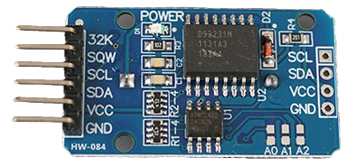

# 🕒 時間從哪裡來？——ESP32 × NTP × Wi-Fi 對時

## ⏰ 一、如果沒有網絡：RTC 是什麼？

在早期或離線系統（例如 Arduino UNO、STM32、Raspberry Pi Pico），
主控板**並不具備內建網絡功能**。
這時候若要讓系統知道「現在是幾點幾分」，
就需要額外接上一個 **RTC（Real-Time Clock，實時時鐘）模組**。

### 🔹 RTC 的角色

RTC 裏面有一顆微型晶體震盪器（通常是 32.768 kHz），
負責在設備斷電時仍能保持時間運作，
通常會配合一顆紐扣電池（CR2032）供電。

| 元件       | 功能                       |
| ---------- | -------------------------- |
| 晶體振盪器 | 穩定產生每秒 1 Hz 時鐘脈衝 |
| 寄存器     | 儲存秒、分、時、日期等資料 |
| 電池       | 維持時間記錄不丟失         |

### 🧩 常見型號

- DS1307：入門型、I²C 介面、易用但精度一般
- DS3231：溫度補償型、高精度 RTC、誤差低於 ±2 ppm

💡 使用 RTC 時，主控板必須在開機時**向模組讀取時間**，
 而且一旦 RTC 電池耗盡或未初始化，就會「回到 2000/01/01 00:00:00」。



左圖：DS1207, 右圖：DS3231

## 🌐 二、現代網絡是如何運作的？

ESP32 具備 Wi-Fi 模組，能夠「上網」。
但學生常有一個誤解：

> 「上網」唔係一條線拉去 Internet 就自然有資料。

事實上，現代網絡的核心在於「**資料封包（Data Packet）**」與「**請求（Request）**」的傳遞。

------

### 📦 什麼是 Data Packet（資料封包）？

你可以將互聯網想像成一個「全球郵政系統」：
每一份傳輸資料（例如一張圖片、一段文字、一個時間訊息）
都會被拆成一個個「封包（Packet）」——
每個封包都有兩個部分：

| 部分                    | 內容                                      | 類比             |
| ----------------------- | ----------------------------------------- | ---------------- |
| **Header（信封）**      | 寄件人（來源 IP）與收件人（目標 IP）地址  | 寫在信封外的地址 |
| **Payload（信件內容）** | 真正要傳送的資料，例如「現在是 14:35:22」 | 信件內容         |

互聯網上的每個 Router（路由器）就像郵局，
負責幫你轉寄這些封包去正確目的地。

### 💬 什麼是「請求」？

「請求（Request）」即係裝置主動向伺服器發問。
每一次上網行為，其實都係「問與答」的過程：

> ESP32：「請問現在時間是幾點？」
>
> 伺服器（NTP Server）：「現在是 2025 年 10 月 29 日 14:35:02 UTC。」

這個過程稱為 **Request–Response Model（請求–回應模型）**。

在技術層面上：

- ESP32 發出一個封包（Request）
- Server 收到後回覆另一個封包（Response）
- ESP32 再從 Response 內容中提取想要的資料

## 📶 三、Wi-Fi 是通往網絡的橋樑

ESP32 無網絡線接口，因此只能透過 **Wi-Fi** 上網。
但有一個關鍵限制——

### ⚠️ ESP32 只支援 2.4GHz 頻段

| 頻段       | 特性                     | 是否支援 |
| ---------- | ------------------------ | -------- |
| **2.4GHz** | 穩定、穿透力強、速度較慢 | ✅ 支援   |
| **5GHz**   | 高速、干擾少、但距離短   | ❌ 不支援 |

📱 若你用手機開熱點，
 大多數手機預設會輸出 5GHz 模式，
 此時 ESP32 不能掃描 Wi-Fi。

📱**iPhone熱點並不直接支援ESP32，**
**需要有一定設定，**
**你可以跟同學借用Android試一試，** 
**或打開電腦的熱點分享(2.4GHz)**

## 🌍 四、NTP：讓所有裝置「對時」的國際標準

現代電子系統不再單靠 RTC，而係用網絡時間同步：
 **NTP（Network Time Protocol）** 是一個全球對時標準。

### 🔹 NTP 的作用

- 提供全球一致的「原子鐘時間」（UTC）；
- 讓所有裝置（包括伺服器、電腦、微控制器）時間保持一致；
- 精確度通常在 ±1 秒以內。

### 🔹 ESP32 對時流程


### 🔹 常見公共 NTP 伺服器

| 名稱             | 網址              |
| ---------------- | ----------------- |
| NTP Pool Project | `pool.ntp.org`    |
| Google NTP       | `time.google.com` |
| NIST NTP         | `time.nist.gov`   |

## 五、操作關鍵

###  Wi-Fi 連線流程

1. 設定 SSID 同密碼：

	```c++
	const char* ssid = "MyWiFi";
	const char* password = "mypassword";
	WiFi.begin(ssid, password);
	```

2. 檢查連線狀態（`WiFi.status()`）；

3. 成功後打印 IP；

4. 才能再呼叫 NTP 函式同步時間。

------

### NTP 常用設定範例（概念）

```c++
configTime(8 * 3600, 0, "pool.ntp.org", "time.nist.gov");
```

- 第一個參數：時區（秒），這裡是 UTC+8；
- 第二個：日光節約時間（Macau 通常填 0）；
- 後面：可填多個 NTP server；
- 成功後可用 `getLocalTime(&timeinfo)` 取得 struct。

## 🧭 六、小總結

| 概念           | 關鍵點                                           |
| -------------- | ------------------------------------------------ |
| NTP            | 網路對時協定，提供全球標準時間                   |
| ESP32 Wi-Fi    | 僅支援 2.4GHz；需正確設定 SSID / 密碼            |
| WiFi.begin()   | ==AI不懂讀心，要自己手動輸入正確SSID和Password== |
| configTime()   | 設定時區 + NTP 伺服器；自動更新系統時間          |
| getLocalTime() | 讀取時間結構，方便格式化輸出                     |

## 🧪 七、學習任務（自學鷹架）

| PRD 要點          | 引導問題                                                     |
| ----------------- | ------------------------------------------------------------ |
| 🎯 **Goal**        | 你想要裝置顯示時間（Serial / OLED / LED）？更新頻率幾多？完成後是否可加其他功能？ |
| 🔌 **I/O**         | 輸出顯示用咩？有冇用 Wi-Fi 模組？是否需要輸入模組？          |
| ⚙️ **Constraints** | 要使用 2.4GHz還是5GHz Wi-Fi？甚麼是 `configTime()`，要怎樣設置才能告訴AI知道是澳門時間？如果用了 delay() 會怎樣？ |
| 🧪 **驗收標準**    | 輸出本地時間（請問澳門時間與格林威治標準時間相差多少?即UTC多少?）；每幾多秒與網路對時(即發出請求)才算合理；Wi-Fi 連線失敗怎樣提示錯誤？ |

> ==延伸上一章的Computational Thinking × Vibe Coding，你是否應該一次過完成整個任務，還是要將大任務拆成小任務，逐一擊破？==

## 🚀 八、挑戰延伸（Optional Extension）

> 進階學生可試以下一項，作為「自主創意」延伸任務，例如：

==(Hints: 先獨立測試RGB LED，再將腳位等資訊拿回給上一個AI)==

1. **彩燈時鐘**
	 用 RGB LED 以不同顏色代表時間段：
	- 06:00–11:59 → 黃色（早晨）
	
	- 12:00–17:59 → 白色（下午）
	- 18:00–23:59 → 紫色（晚上）
	- 00:00–05:59 → 藍色（深夜）
	
2. **錯誤狀態指示燈**
	- Wi-Fi 未連上 → LED 快閃紅色；
	- NTP 同步失敗 → LED 慢閃黃色。
	
3. **自主創新**

	- 請發揮你的創意，加入不同傳感器，制動器(輸出)，或者，你可以想想，除了時間，有甚麼值你經常需要關心，可以上網查詢，連同時間做成一個裝置？(你可以先預習下一章)

## 💡九、延伸閱讀

[人類計時技術的偉大征途：從精工機械計時到光晶格量子極限](人類計時技術的偉大征途：從精工機械計時到光晶格量子極限.html)

[(簡略版)時間的追逐](時間的追逐.html)

## 十、工具

[工作紙](../Computational Thinking × Vibe Coding/Computational Thinking × Vibe Coding worksheet.docx)

[反思表](../Computational Thinking × Vibe Coding/AI 協作編程反思與自檢表.pdf)