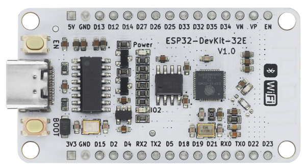

# ESP32 getting started

## ESP32 Devkit 32E



==[官方文檔](https://emakefun.github.io/emakefun-docsify/#/zh-cn/esp32/esp32_devkit_32e/esp32_devkit_32e)==


| 特性                | Arduino（典型 AVR / Arduino 系列）                           | ESP32 系列                                                 |
| ------------------- | ------------------------------------------------------------ | ---------------------------------------------------------- |
| 類型                | 微控制器開發板 / 板子（如 Uno 基於 ATmega328P）              | SoC（System-on-Chip），**整合 WiFi、藍牙**與 MCU 核心      |
| 核心 / 架構         | 多為 **8 位** AVR（如 ATmega328P），或部分為 32 位 ARM（如某些 Arduino 型號） | 多為 **32 位**架構（Xtensa LX6 / LX7 / 或新款採用 RISC-V） |
| 工作電壓            | 多為 5V                                                      | 多為 **3.3V**（必須注意與 5V 相容性）                      |
| 記憶體 / 快閃       | 較小（例如 Uno 有 2 KB SRAM + 32 KB Flash）                  | 記憶體與快閃容量較大（例如典型 ESP32 有 520 KB SRAM）      |
| 通信與無線功能      | 若要 WiFi、藍牙需外掛模組                                    | **原生內建 WiFi & 藍牙功能**                               |
| 處理速度 / 運算能力 | 較低（時鐘頻率如 16 MHz 等）                                 | 較高（可達 160–240 MHz，支援雙核心）                       |

1. **若目的是教基礎控制概念，對初學者：選 Arduino 為佳**

- Arduino 的學習門檻低、範例多、學生易於理解硬體與軟體交互流程。
- 在許多課堂與教材中就以 Arduino 為入門平台。
- 對於一般控制、輸入／輸出操作、LED、按鈕、簡單感測器控制等，都非常足夠。

2. **若專題需要網路、雲端、遠端控制、低功耗：優先考慮 ESP32**

- 若你的課程或專題有「物聯網」、「遠端資料上傳」、「無線感測網路」等需求，ESP32 幾乎是標配。
- ESP32 可在程式中整合 WiFi、藍牙，減少額外模組。
- 在資源允許下，學生可直接進入更實際的 IoT 應用。

3. **漸進式教學策略**

- 可從 Arduino 入門 → 再進階到 ESP32。先讓學生熟悉基本概念、數位／類比電路控制，再導入無線、網路、資料通訊。
- 這樣學生比較不會被一次吸收過多技術細節 overwhelm。

4. **硬體兼容性檢查**

- **ESP32 的腳位有些限制**（某些腳可能在啟動時有特殊功能、不能作為一般 GPIO）
- 與 **5V 感測器**或模組連接，需注意電壓相容性
- 某些舊教材、擴展板（shield / 擴充模組）是為 Arduino 設計的，在 ESP32 上要確認 pinout 相容性。

## 引腳說明


## 上傳測試

1. 打開**Arduino IDE**，==注意為Arduino 2.0以上==
2. *這個步驟只須做一次，之後不用再做*：
	1. 選取左邊欄的**Board**
	2. 輸入`ESP32`
	3. 選擇`ESP32 by Espressif`


3. 選擇`Tools-->Board-->esp32-->ESP32 Dev Module`

  

4. 選擇`Tools-->Port`，選擇合適的Port，window的話，一般是`COMX`，通常最後一個，或不連續的`COMX`就是，試一試

  

5. ==(非所有ESP32必要，但這款板需要)==`Tools-->Upload Speed`，選`460800`，將上傳速度放慢，可有助上傳穩定性，但ESP32本身的轉譯和上傳就會比Arduino慢，所以盡可能的話選一個較高的上傳速度

   

6. 上傳一個測試程式:

```c++
void setup() {
  // put your setup code here, to run once:
  Serial.begin(115200);
}

void loop() {
  // put your main code here, to run repeatedly:
  Serial.println("Hello World");
}
```

7. 打開右上角`Serial Monitor`，選取baud rate為`115200`，見到有文字彈出就即正常上傳到。
8. 