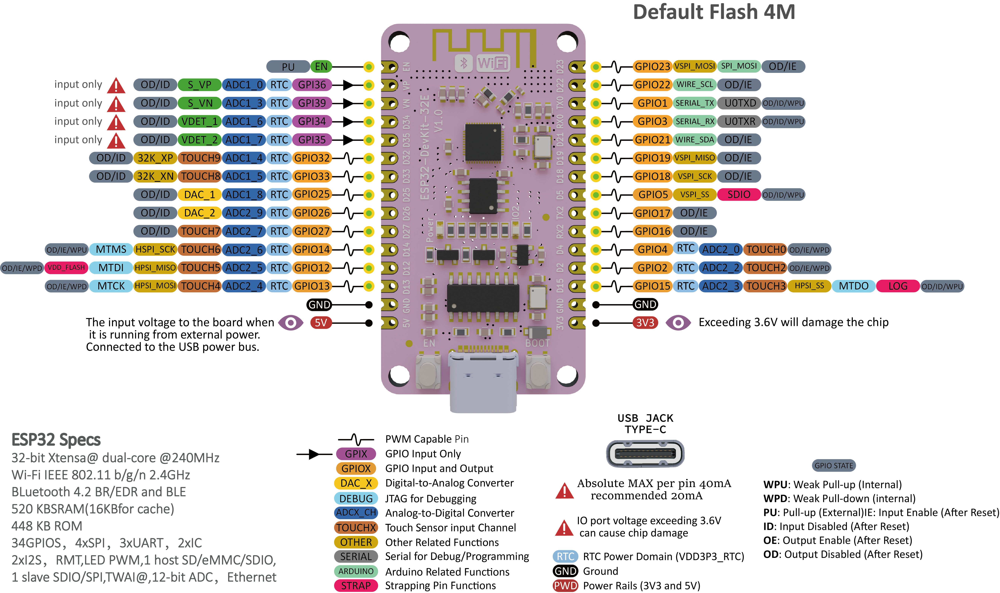

# ESP32 getting started

## ESP32 Devkit 32E


==[官方文檔](https://emakefun.github.io/emakefun-docsify/#/zh-cn/esp32/esp32_devkit_32e/esp32_devkit_32e)==


## 引腳說明



## 上傳測試

1. 打開**Arduino IDE**，==注意為Arduino 2.0以上==
2. *這個步驟只須做一次，之後不用再做*：
	1. 選取左邊欄的**Board**
	2. 輸入`ESP32`
	3. 選擇`ESP32 by Espressif`


3. 選擇`Tools-->Board-->esp32-->ESP32 Dev Module`

  

4. 選擇`Tools-->Port`，選擇合適我Port，window的話，一般是`COMX`，通常最後一個，或不連續的`COMX`就是，試一試

  

5. ==(非所有ESP32必要，但這款板需要)==`Tools-->Upload Speed`，選`460800`，將上傳速度放慢，可有助上傳穩定性，但ESP32本身的轉譯和上傳就會比Arduino慢，所以盡可能的話選一個較高的上傳速度

   

6. 上傳一個最少程式:

```c++
void setup() {
  // put your setup code here, to run once:
  Serial.begin(115200);
}

void loop() {
  // put your main code here, to run repeatedly:
  Serial.println("Hello World");
}
```

7. 打開右上角`Serial Monitor`，選取baud rate為`115200`，見到有文字彈出就即正常上傳到。
8. 