# 巡線機械人(Line Following Robot)

[TOC]

## 甚麼是自動導引車（Automated Guided Vehicle，AGV）?

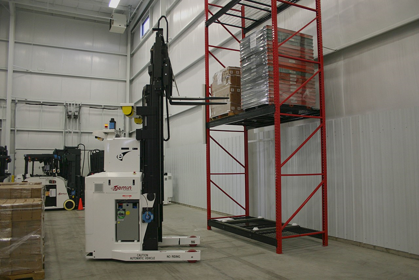

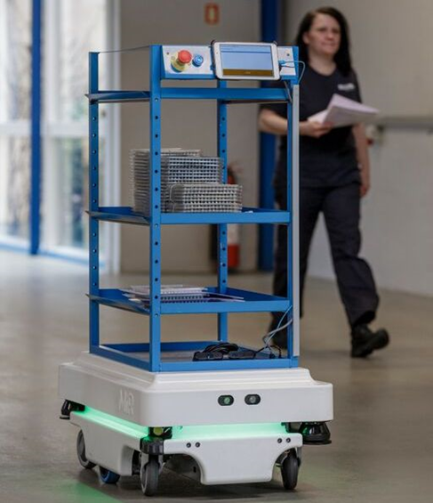

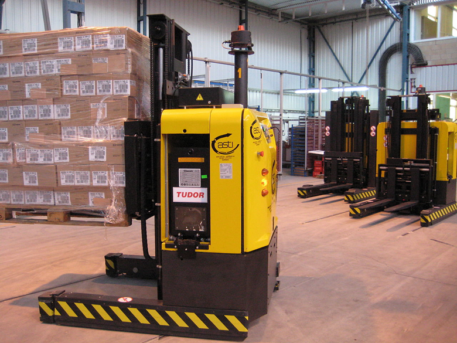

自動導引車（Automated Guided Vehicle，AGV）是工業上常見的一種自動化工具，通常會出現在全自動的無人工廠或全自動倉庫中。它是一類輪式移動機械人，沿着地板上的導線或標記塊或磁條運動，或者通過視覺導航或激光導航。多用於工業生產，在車間、倉庫運輸貨物。

<iframe width="560" height="315" src="https://www.youtube.com/embed/WIlS3vNSuQ4?start=17" title="YouTube video player" frameborder="0" allow="accelerometer; autoplay; clipboard-write; encrypted-media; gyroscope; picture-in-picture" allowfullscreen></iframe>

<iframe width="560" height="315" src="https://www.youtube.com/embed/8gy5tYVR-28" title="YouTube video player" frameborder="0" allow="accelerometer; autoplay; clipboard-write; encrypted-media; gyroscope; picture-in-picture" allowfullscreen></iframe>

現代的自動導引車一般都是配備了自動導航的IMU傳感器，也會用二維碼，機械人互相通訊，磁力地標等手段幫忙精準導航。

要完成一部功能完整的AGV，懂得巡線(或沿著特定路線行走)只是第一步。

如果巡線的路徑多於一條時，要由一間房間，到達另一間指定的房間，就要規劃最短(或至少能到達)的路徑，你可能有聽過在迷宮中只要沿著牆壁一路向左邊/或右邊走，就能找到迷宮出口；或者在每個迷宮分岔口留下小石塊，發現前方沒有路時，就能回到上一個分岔口走另一條路。這些「方法」稱之為「演算法」。

<div  style=" float: left;">
    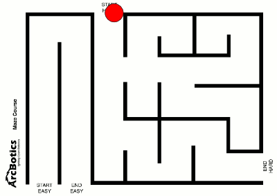
    <p><i>每到分岔口都向左，沿著牆壁而行</i></p>
</div>

<div  style=" float: right;">
    
    <p><i>在每個路口放下小石塊</i></p>
</div>

<div >
    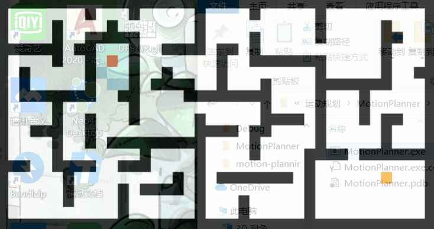
    <p><i>洪水演算法</i></p>
</div>


當自動導引車多於一部時，就會產生交通管理問題，要怎樣同時為幾部導引車製定最短路線，而又互相不會相撞或擋路，這又是另一個「演算法」的問題。

## 控制系統(Control System)

巡線機械人是一個經典的控制系統問題。甚麼是控制系統(Control System)?


控制系統(Control System)是指控制一個類比值保持一個指定的值。

For controlling a “dynamical systems”(for you, mostly is a analog value) to a desired value(set point) and “hold” the value 

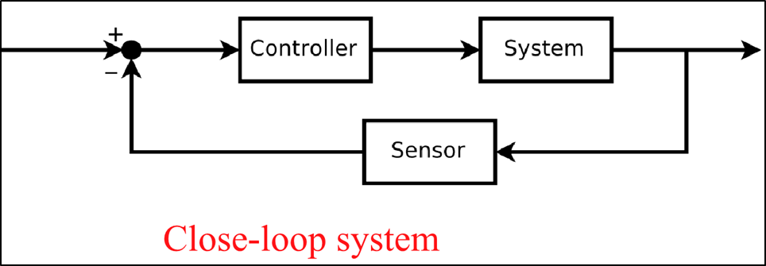

例如你的冷氣機控制著房內的溫度保持27攝氏度，慢煮機控制著水溫保持在54攝氏度，電鉻鐵保持尖端的溫度為320攝氏度等等。

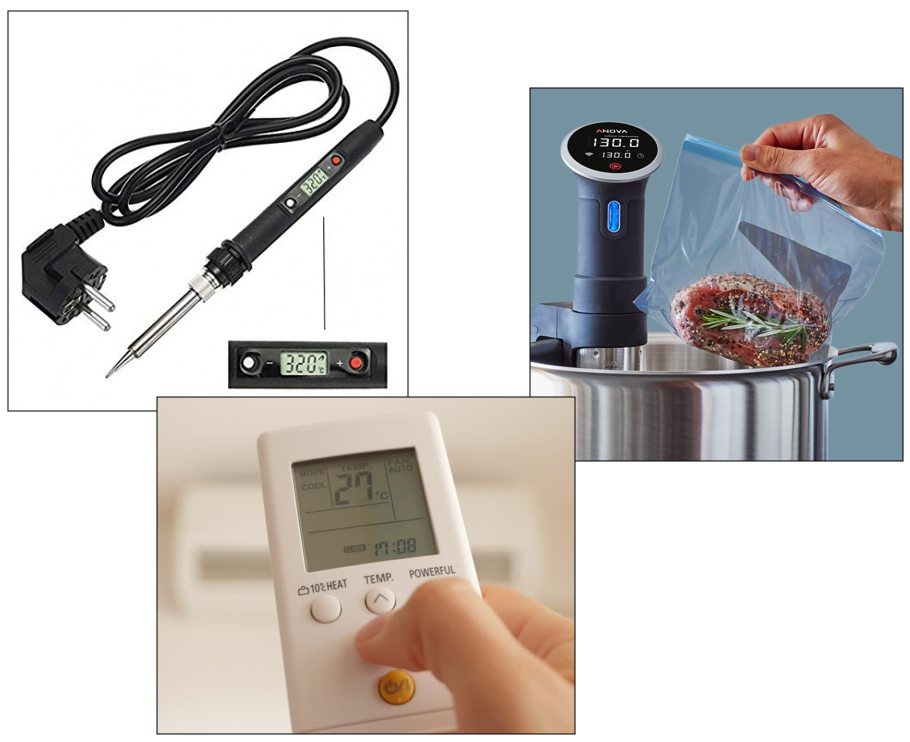

又或者，常用的伺服馬達就是一個典型的控制系統例子，一般的有刷馬達，只要供電就會不停旋轉，但伺服馬達連接上電位器，能感測到現在的角度，控制並保持特定的角度。

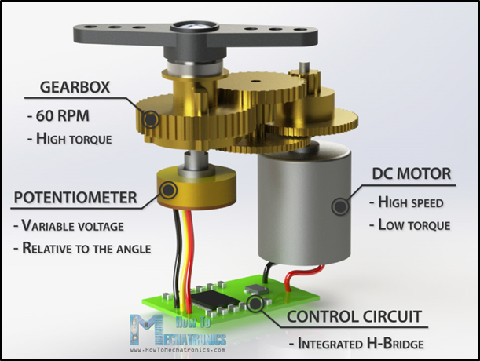

利用控制系統，除了溫度和角度，也可以控制位置。


而近年常見的自平衡車和無人機，都是控制系統的一種，分別控制其姿態(Attitude)和高度(Altitude)。

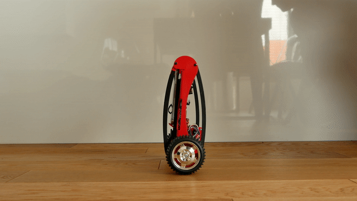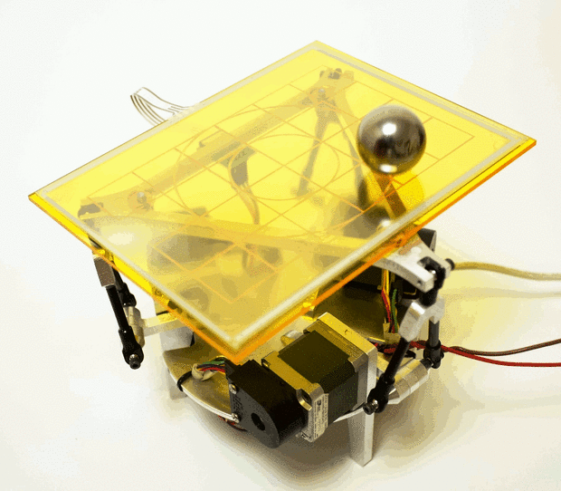

## Programming

### Motor Controlling

如果要控制馬達單方向旋轉，那只需要加一顆三極管就可以了。將控制端(三極管的Base腳)接上Arduino UNO的9腳(或其他有PWM功能的腳位: 3, 5, 6, 9, 10, 11)，就可以用Arduino內置的PWM功能(即`analogWrite()` )來控制馬達的轉速

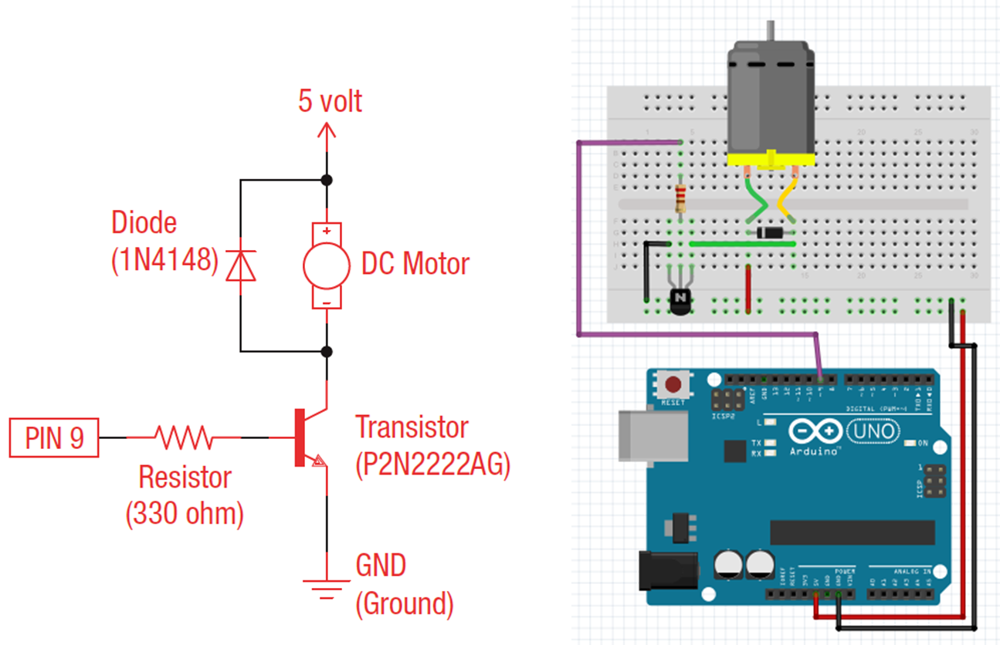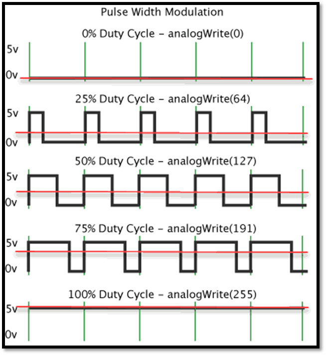

但如果馬達是要雙方向轉動，即可以正轉或反轉的話，電路就比較複雜，需要用到H橋(H-bridge)來控制。


如果要控制兩個馬達的話，就需要至少8顆三極管，線路就會變得很複雜。幸好，有市面上有專門的IC能做到相同的效果。

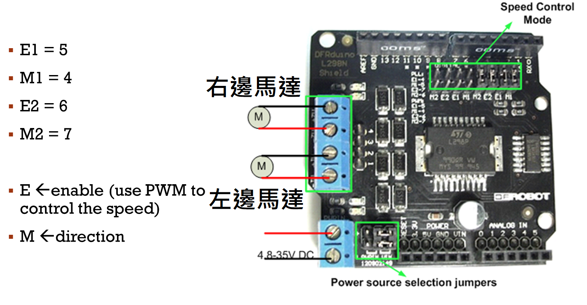

今次項目，我們會用到L298N motor shield。L298N整合了2個上面所提的H橋線路，能夠控制兩個小馬達，每路最多可輸出2A電流。而這塊L298N motor shield，甚至將L298N的控制腳位再簡化，`E`腳用來給PWM訊號去控制速度，`M`腳則控制馬達的旋轉方向。


### Step 1 Test the motor

每次要控制馬達的旋轉，就需要到4句指令，如下圖，`M1`和`M2`是控制馬達的正轉或逆轉，`HIGH`是正轉，`LOW`是逆轉，`M1`是控制左邊馬達，`M2`是控制右邊馬達；`E1`和`E2`則為控制馬達的速度，範圍是`0~255`，`E1`控制左馬達，`E2`控制右馬達。所以下面4句，是命令左邊馬達以最高速度(`255`)正轉，右邊馬達則停下。

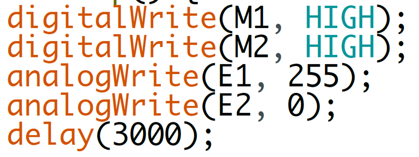

**但每次控制馬達，都要打4句指令，是否覺得很麻煩呢?重覆的指令，而只改變變數的話，我們可以自定一個函數。**

在Arduino右上角，有一個三個點的符號，按下去，就會見到一個新增標籤的選項，之後輸入新標籤的檔案名稱(`function`)，就會出多一個分頁。

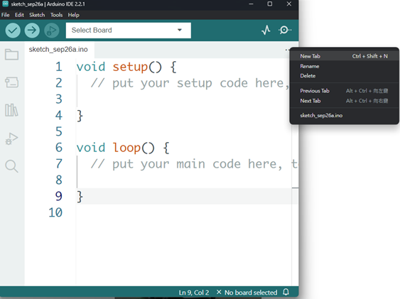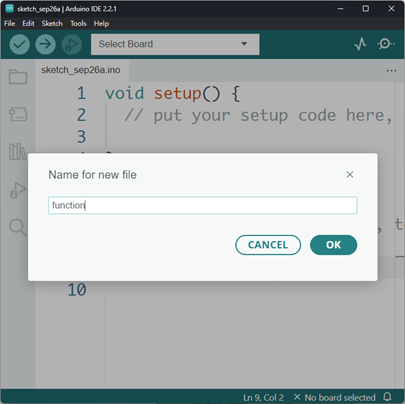

我們可以定義一個叫`motorControl()`的函數，函數有2個輸入，分別為左馬達的速度和右馬達的速度。

1. 首先將輸入的速度限制在`-255~255`間，==`constrain`==就是限制的意思，所有大於`255`的輸入會變成`255`，所有小於`-255`的數字會變成`-255`
2. `M1`和`M2`腳位是用以控制馬達的正逆轉，但一般我們會用正數代表正轉，負數代表逆轉，就會更加直覺，所以下一步是判斷輸入的`leftSpeed`和`rightSpeed`是正數還是負數，正數的話，`M1`和`M2`腳位輸入`HIGH`，負數則相反。
3. 最後則是輸入`E1`和`E2`的速度值，由於`leftSpeed`和`rightSpeed`有機會是負數，直接輸入`analogWrite()`的話會有錯誤，所以需要額外加入==`abs()`==絕對正。

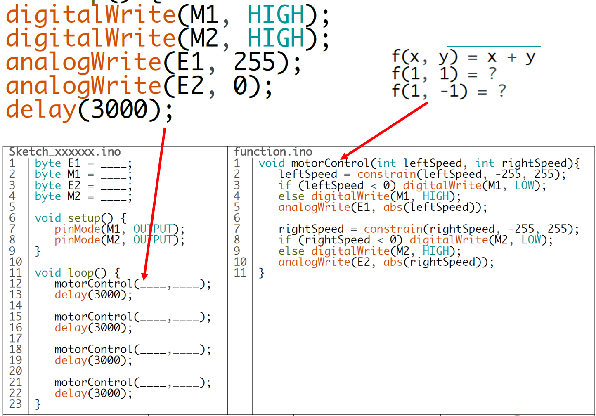

利用這些指令，我們首先測試一下馬達的接線是否正確。例如下面的程式，兩邊馬達應為***左正轉***，***右正轉***，***兩邊一起正轉***，***兩邊一起停***。==(記得打開鋰電池開關，否則USB的電是不足以同時推動兩隻馬達)==


### Step 2 Test the IR sensors

下一步，要測試一下對地的紅外線傳感器是否能正常運作。

==保留上一步的program==，`loop()`係面的可以全部刪去，紅圈為新增的部分。


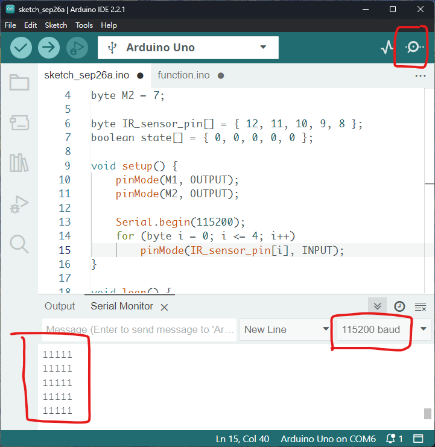

第6行`IR_sensor_pin[]`，顧名思意，就是插著IR sensor的腳位，我插的是8至12腳。

而後面的`[]`，是陣列(array)的意思。等同於你自行複製5次，名叫`IR_sensor_pin_0`至`IR_sensor_pin_4`，你當然可以這樣做，但如果IR sensor的數量再增加，例如增加到13隻，那這麼多變數就會十分難管理。

在陣列(array)的方括號中間加上數字，就會指定陣列中對應的編號。==注意編程所有的數目都是由0開始。==所以，`IR_sensor_pin[0]`對應的值就是`12`，`IR_sensor_pin[1]`對應的值就是`11`，如此類推。

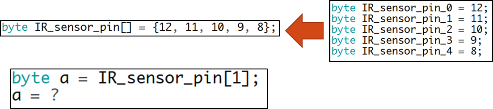

所以新增的幾行代碼，就是用`digitalRead()`讀取對應的腳位後，儲存在`state[]`中，接著用`Serial.print()`將它顯示出來。

打開右上角的序列埠監空視窗(Serial Monitor)，確保右下角的鮑率(bute rate)和你`Serial.begin(115200)`所輸入的鮑率是一樣的。就會見到5個0。

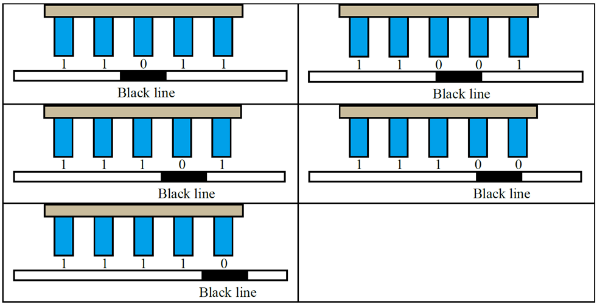

將sensor放在黑線上面，白色能反射紅外線，sensor就會收到反射的光，就讀到`1`，而黑線因不能反射紅外線，所以就會讀到`0`。你可以將sensor陣列放在黑線上面，左右移動，確保sensor在黑線上面是`0`，在白色面上是`1`。

**動動腦:**

1. **我們的sensor有兩款，你要先試一試sensor在黑線上是`0`還是`1`，這將影響後面編程的部分**
2. **我這裡只有5粒sensor，但如果你有7粒、9粒或更多，你應該要怎樣修改程式？**


### Step 3 Sensors to input value

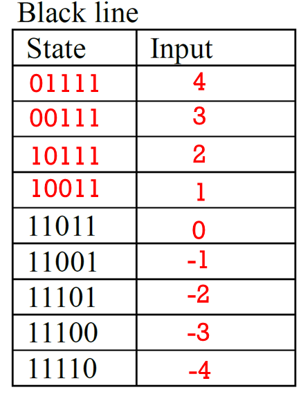

如果只有sensor的值，是不能反映機械人與直線偏移了多少的，所以要將讀到的值變成一個有意義的「偏移值」。

正如上面所示，如果黑線剛好在正中間的sensor之上，就會讀到`11011`，這時我們可以將「偏移值」設定為`0`。隨著機械人**偏移**向**左**邊，相反sensor陣列讀到的黑線就會**偏移**向**右**邊。如果sensor陣列剛好是黑線寬度的$\frac{2}{3}$，那慢慢向左移動機械人的話，就會慢慢得出`11011`，`11001`，`11101`，`11100`，`11110`，到最後變成`11111`。我們就可以將其偏移的量量化，變成`0`，`-1`，`-2`，`-3`，`-4`，如此類推，機械人偏向右時也一樣。

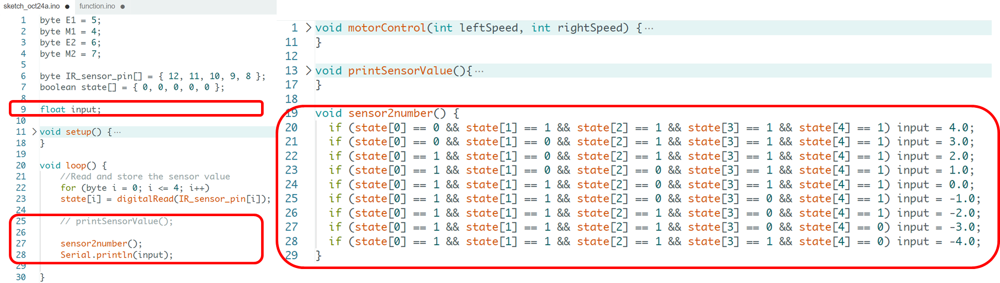

理論是有了，那怎麼將其用程式實行呢？首先要開一個**變數**，名字叫`input`，而格式是`float`。`float`跟之前的`byte`和`int`不同，後兩者只有整數，但`float`是浮點數，可以計算到小數。

`sensor2number()`是一個函數，其用途是將上述的表格，用「暴力」的方法實現出來。輸入代碼後上傳，開啟序列埠監控視窗(Serial Monitor)，將機械人在黑線上偏移，就會見到相對的偏移值。

**動動腦:**

1. **我們的sensor有兩款，如果你用的sensor在黑線上是`1`白線上是`0`，你應該要怎樣修改？**
2. **我這裡只有5粒sensor，但如果你有7粒、9粒或更多，你應該要怎樣修改程式？**


### Step 4 P controller

所謂的P controller，這裡並不是指一個實體的微控制器或甚麼遙控器(雖然P controller的確可以用電路來實現)，這裡指的，更多的是一個演算法。

試想像一下，如果你冬天時在一間房間，房內有暖氣，但此暖氣是不能自動調溫的，如果你希望室溫保持在23度，那你會怎麼做？

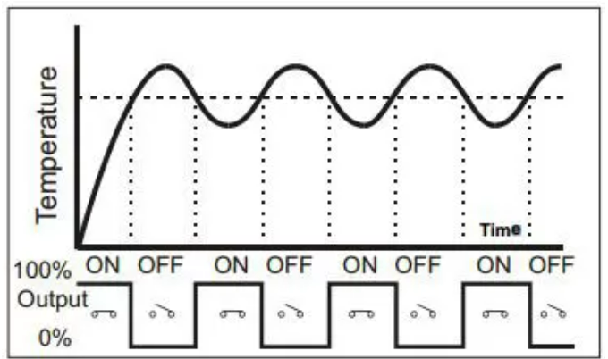

其中一個方法是：你看著溫度計，當溫度低於23度時就將暖氣開著，相反當溫度高於23度時，就將暖氣關掉讓室溫下降。這種方法稱為ON/OFF control，ON/OFF control簡單而有效，容易實現成本又低，但其的缺點也十分明顯，想像一下如果汽車稍微偏離航道，司機就將方向盤轉到底，那汽車就算不失控，也會不停左搖右擺。


用剛剛汽車的例子，如果要保持汽車在一條直線的路上行走，那麼司機只要看著地上的白線，如果汽車偏移向左少許，就將方向盤轉向右少許，如果偏移得多，就相應地將方向盤轉得更多。對，這就是P controller。P controller全稱為**Proportional controller(比例控制器)**，就是上面所說，偏移得少，補償(方向盤轉去相反方向)得少，偏移得多，則補償得多。那要怎樣實現呢？
$$
Output = K_p \times error =K_p \times (setpoint - input)
$$
由於我們當初定義input時，就將置中值設定為0，而我們需要控制的，就是希望機械人一直保持置中，所以`setpoint`就是零，為方便運算，可以直接簡化為：
$$
Output = K_p \times input
$$

這裡的$K_p$是一個自定的常數，你可以理解成為當有偏移時，用多大的力量轉方向盤。

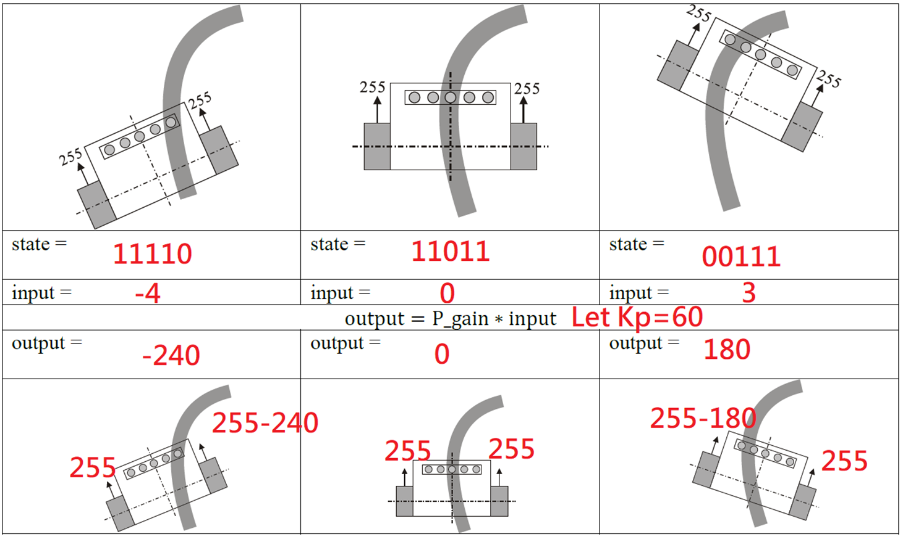

例如上圖，假設 $$K_p$$ 的值定為 $$60$$ ==(這是自定的，你可以修改一下它看看有甚麼變化)==。當機械人偏向最左，$$input$$得到$$-4$$，那$$output$$就是  $$60 \times -4 = -240$$，$$output$$ 的正負值，你可以理解成是左輪還是右輪需要減速，車子偏向了左，所以右輪需要減速，$$-240$$ 即為右邊減速。

相反，如果`state = 00111`，$$input = 3$$，那$$output$$就是  $$60 \times 3 = 180$$，代表就是左輪需要減速。由此可見，程式自己就會跟據*偏移的量*的大小，去自動將相對的輪子減速，從而修正。

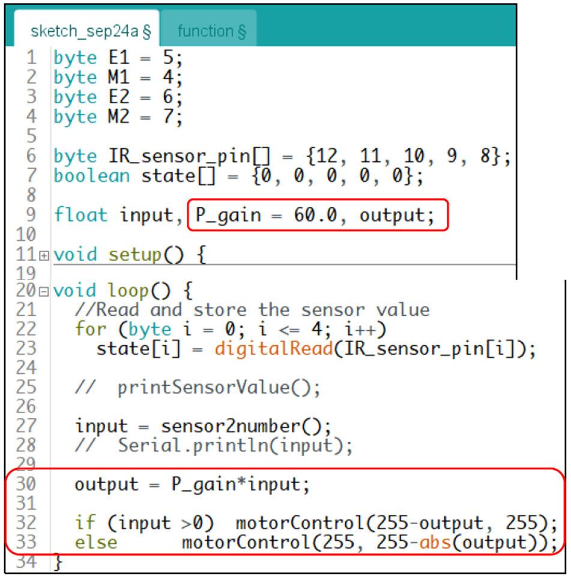

用program去實現上表，先將第**28行**的`Serial.println(input);`前加兩個`//`，將其轉變成注解。

數學式的$$K_p$$，在程式我們則用`P_gain`來命名，之後需要再加入變數`output`對應數學式的$$Output$$。之後加入紅圈的兩個部分(數學式和輸出到馬達)。上傳後就可以將機械人放在黑線上試試了。

如果你是用慢速齒輪箱的話，將機械人放下，就應該可以直接在比賽場上走一圈。如果發現不能隨線的話，請檢查一下馬達左右/正負有否調轉，sensor的腳位有否左右反轉了。

### Robot Simulator

[Line Foloower Simulator](../../interactive/lineFollowerSim/index.html)

<iframe width=100% height="650" src="../../interactive/lineFollowerSim/index.html
"></iframe>

利用模擬器, 你可以見到，當$$K_p$$不夠大時，機械人修正的「力度」不夠，即使是曲率不大的彎也過不了；但當機械人的$$K_p$$值太大時，即使巡直線，也會不斷左右搖擺，令行車十分不穩家，也很容易會出界或會調頭。至於甚麼是適當的值，則跟機械人的大小、寬度、sensor的距離有關。

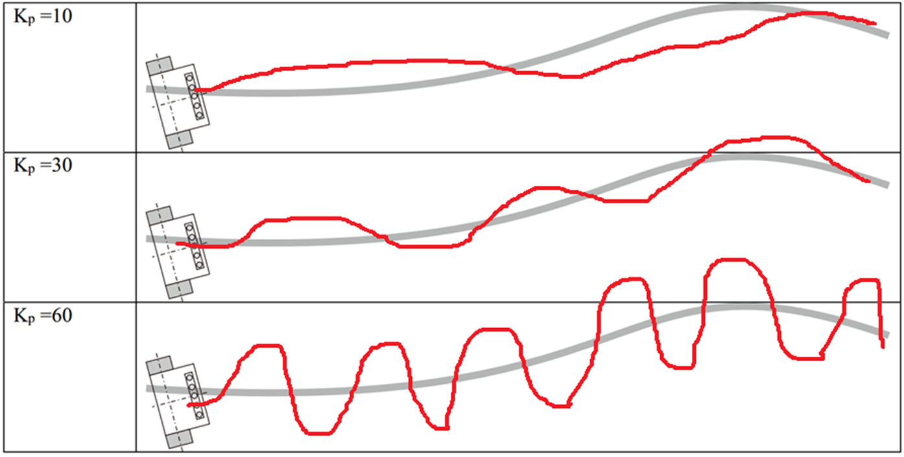

### Step 4.1 Modify the code if the robot run too fast

如果機械人是使用慢速齒輪箱的話，就不會有這個問題，你恨不得它再快上一倍；但如果是使用快速齒輪箱，尤其是換了其他更快的馬達後，就會發現將速度設定到最大反而十分不穩定，很容易會出界，這時就需要將最大速度設定慢一點。

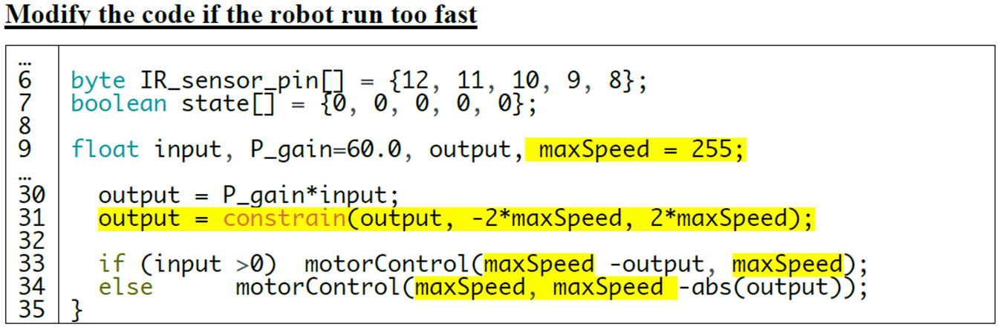

設定一個叫`maxSpeed`的變數，用來設定最大速度。之前我們沒有為計算出來的output值設限制的，限制來自於`motorControl()`中，有限制輸入到馬達的值最多是`-255 ~ 255`，但如果我們的最大速度不是255的話，就需要為`output`設限，限制為`-2*maxSpeed ~ 2*maxSpeed`。原本馬達輸出的`255`，也要設定為`maxSpeed `，***建議可以用`ctrl+H`去做搜尋和取代***。

### Step 5 D controller

**D controller** 的全稱為**Derivative controller(微分控制器)**，所謂的微分，其實就是**斜率(slope)**的意思。一個函數的微分，就是這個函數每一點的斜率所形成的函數。

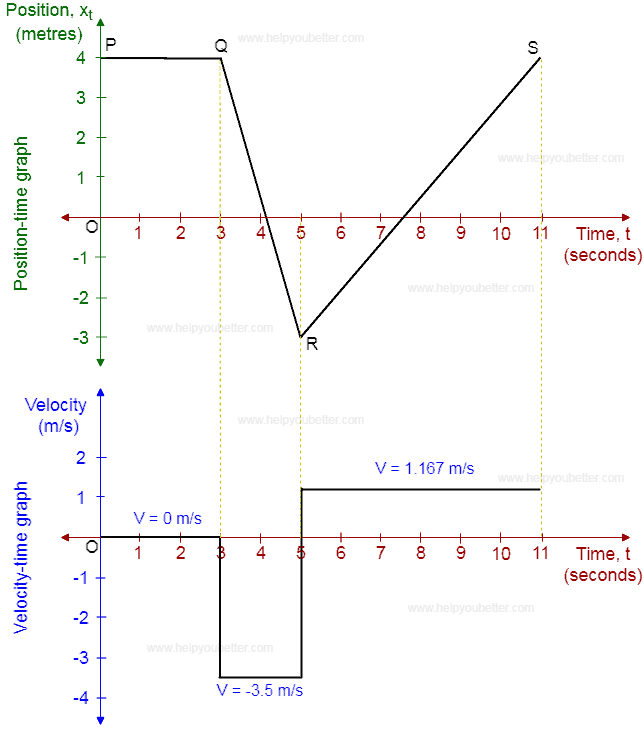

一個簡單的例子，就是你物理有見過的D-T graph和V-T graph的關係。要由上圖的D-T graph找出下面的V-T graph，就要就著每一條線段找出其slope(斜率)。

例如時間段`0s ~ 3s`，$$\displaystyle Slope_{PQ} = \frac{4-4}{3-0} = 0$$；

時間段`3s ~ 5s`，$$\displaystyle Slope_{QR} = \frac{-3-4}{5-3} = -3.5$$；

時間段`5s ~ 11s`，$$\displaystyle Slope_{RS} = \frac{4-(-3)}{11-5} = \frac{7}{6} \approx 1.167 $$。

其實對於位移(displayment)來說，速率(velocity)就是它的微分函數，對於速率(velocity)來說，加速率(acceleration)就是它的微分函數。

返回我們的D controller，如果只用P  controller的話，無論你怎樣去調，你都會發現：**如果直線調得很順滑，就會不夠力轉彎；如果夠力轉彎，直線就會不停左右搖擺**。這時候，就需要再加上D controller，在數學式上是：

$$
error_n = setpoint_n - input_n
 \\
 Output = K_d \times \frac{error_n - error_{n-1}}{\Delta time}
$$
將今次測到的誤差減去上一次的誤差，再除以時間差。如果仔細看，後面的分數，其實就是斜率($$\displaystyle slope = \frac{y_2-y_1}{x_2-x_1}$$)，跟之前一樣，由於我們機械人的置中位置就會讀到`0`，所以$$setpoint$$就是`0`。又由於$$K_d$$的值是我們自定的，無論正負也可以，所以可以簡化成：
$$
Output = K_d \times \frac{input_n - input_{n-1}}{\Delta time}
$$
由於D controller是對應**變化**而作出反應，所以走直線時幾乎不會有反應，只會對**突然的變化**，例如**急彎**時才會發生變化。但如果只用D controller的話，是沒辦法控制的，所以就會合併P controller 變成 PD controller：
$$
Output = K_p \times input + K_d \times \frac{input_n - input_{n-1}}{\Delta time}
$$
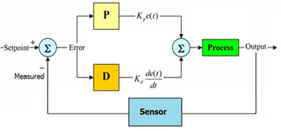

這裡有兩個參數，分別為$$K_p$$和$$K_d$$，只要調當調試這個兩參數的值，就可以順利控制機械人。

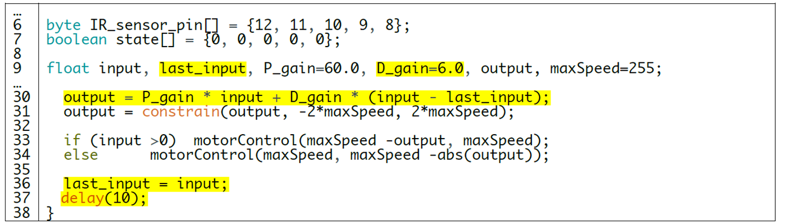

在程式上，只要簡單修改，就可以實現到D controller。如上面的數學式，你需要有一個變數儲存$$input_{n-1}$$，這裡命名為`last_input`，另外，$$K_d$$則名為`D_gain`，將**第30行**修改一下，變成上面數學式(5)，但可以不需要除$$\Delta time$$，因$$\Delta time$$是常數，所以可以融合到$$K_d$$。之後在程式的最下面，加上`last_input = input;`，將今次的`input`儲存起來，之後要加入`delay()`作為上面數學式的$$\Delta time$$，這個$$\Delta time$$(`delay()`)不能太少，否則D controller的部分只會有極短時間有作用，加了等於沒有加。

[Line Foloower Simulator](../../interactive/lineFollowerSim/index.html)

<iframe width=100% height="650" src="../../interactive/lineFollowerSim/index.html
"></iframe>


你可以用這個模擬器，試試看$$K_d$$對機械人的表現有甚麼影響。

## 附錄

`main.ino`

```c++
byte E1 = 5; // Enable pin for Left Motor
byte M1 = 4; // Control pin  for Left Motor
byte E2 = 6; // Enable pin  for Right Motor
byte M2 = 7; // Control pin for Right Motor

byte IR_sensor_pin[] = {12, 11, 10, 9, 8, A0, A1};
boolean state[] = {0, 0, 0, 0, 0, 0, 0};

byte no_of_sensors = 7;

float input, last_input, P_gain = 60.0, D_gain = 6.0, output, maxSpeed = 255;

void setup(){
	pinMode(M1, OUTPUT);
	pinMode(M2, OUTPUT);

	Serial.begin(115200);
	for(int i = 0; i < no_of_sensors; i++)
		pinMode(IR_sensor_pin[i], INPUT);
	
}

void loop(){

	/*
	// test the motor, check the wiring
	motorControl(255, 0);
	delay(3000);
	motorControl(0, 255);
	delay(3000);
	motorControl(255, 255);
	delay(3000);
	motorControl(0, 0);
	delay(3000);
	*/

	// Read and store the sensors value
	for(int i = 0; i < no_of_sensors; i++)
		state[i] = digitalRead(IR_sensor_pin[i]);

	printSensorValue();

	sensor2number();
	// Serial.println(input);

	output = P_gain * input + D_gain * (input - last_input);
	output = constrain(output, -2*maxSpeed, 2*maxSpeed);

	if (input > 0) 	motorControl(maxSpeed - output, maxSpeed);
	else			motorControl(maxSpeed, maxSpeed - abs(output));
    
	last_input = input;
	delay(10);
}
```

`function.ino`

```c++
void motorControl(int leftSpeed, int rightSpeed){
    leftSpeed = constrain(leftSpeed, -255, 255);
    if (leftSpeed < 0) digitalWrite(M1, LOW);
    else digitalWrite(M1, HIGH);
    analogWrite(E1, abs(leftSpeed));

    rightSpeed = constrain(rightSpeed, -255, 255);
    if (rightSpeed < 0) digitalWrite(M2, LOW);
    else digitalWrite(M2, HIGH);
    analogWrite(E2, abs(rightSpeed));
}

void printSensorValue(){
    for (byte i = 0; i < no_of_sensors; i++)   
        Serial.print(state[i]);
    Serial.println();
}

void sensor2number(){
    if (state[0] == 1 && state[1] == 0 && state[2] == 0 && state[3] == 0 && state[4] == 0 && state[5] == 0 && state[6] == 0) input = 6.0;
    if (state[0] == 1 && state[1] == 1 && state[2] == 0 && state[3] == 0 && state[4] == 0 && state[5] == 0 && state[6] == 0) input = 5.0;
    if (state[0] == 0 && state[1] == 1 && state[2] == 0 && state[3] == 0 && state[4] == 0 && state[5] == 0 && state[6] == 0) input = 4.0;
    if (state[0] == 0 && state[1] == 1 && state[2] == 1 && state[3] == 0 && state[4] == 0 && state[5] == 0 && state[6] == 0) input = 3.0;
    if (state[0] == 0 && state[1] == 0 && state[2] == 1 && state[3] == 0 && state[4] == 0 && state[5] == 0 && state[6] == 0) input = 2.0;
    if (state[0] == 0 && state[1] == 0 && state[2] == 1 && state[3] == 1 && state[4] == 0 && state[5] == 0 && state[6] == 0) input = 1.0;
    if (state[0] == 0 && state[1] == 0 && state[2] == 0 && state[3] == 1 && state[4] == 0 && state[5] == 0 && state[6] == 0) input = 0.0;
    if (state[0] == 0 && state[1] == 0 && state[2] == 0 && state[3] == 1 && state[4] == 1 && state[5] == 0 && state[6] == 0) input = -1.0;
    if (state[0] == 0 && state[1] == 0 && state[2] == 0 && state[3] == 0 && state[4] == 1 && state[5] == 0 && state[6] == 0) input = -2.0;
    if (state[0] == 0 && state[1] == 0 && state[2] == 0 && state[3] == 0 && state[4] == 1 && state[5] == 1 && state[6] == 0) input = -3.0;
    if (state[0] == 0 && state[1] == 0 && state[2] == 0 && state[3] == 0 && state[4] == 0 && state[5] == 1 && state[6] == 0) input = -4.0;
    if (state[0] == 0 && state[1] == 0 && state[2] == 0 && state[3] == 0 && state[4] == 0 && state[5] == 1 && state[6] == 1) input = -5.0;
    if (state[0] == 0 && state[1] == 0 && state[2] == 0 && state[3] == 0 && state[4] == 0 && state[5] == 0 && state[6] == 1) input = -6.0;

    // float avg = 0, sum = 0;
    // boolean onLine = false;

    // for (byte i = 0; i < no_of_sensors; i++){
    //     avg += i * state[i];
    //     sum += state[i];
    //     onLine = onLine || state[i];
    // }
    
    // if (!onLine)    input = last_input;
    // else            input = avg/sum - (no_of_sensors - 1) / 2.0;
}
```

