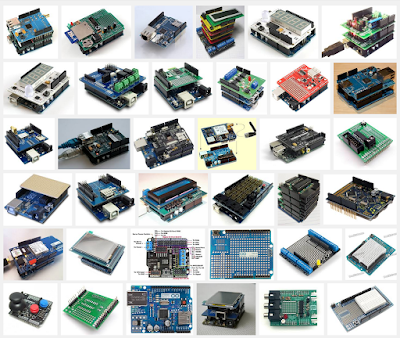

# 0. 前言

Arduino，是一個開放原始碼的單晶片微控制器，它使用了Atmel AVR單片機，採用了基於開放原始碼的軟硬件平台，建構於簡易輸出/輸入（simple I/O）介面板，並且具有使用類似Java、C語言的Processing/Wiring開發環境。

[TOC]

## 關於

Arduino可以使用 Arduino 語言與 Macromedia Flash、Processing等軟件，結合電子元件，作出互動作品。

Arduino也可以獨立運作成為一個可以跟軟件溝通的介面。

使用者可以在 Arduino 板子上接上各種電子裝置，例如 LED 燈、喇叭、馬達、開關、溫濕度感測器、紅外線發射與接收器、LCD 顯示裝置，以及 Ethernet, WiFi, XBee, Bluetooth, RFID, GPS 等各種通訊模組。

若再配合撰寫一些自動控制的程式，就能利用 Arduino 做出各式各樣的自動控制應用，例如利用溫度感測器控制風扇的運轉、使用可變電阻控制燈光的明暗、控制馬達的轉速、利用紅外線遙控家電／ 利用伺服機(Servo)控制機械手臂或機器人，以及製作自走車、飛行器等等。

> Arduino 有下列這些特色：
>
> 1. 開放源碼。不僅軟體是開放源碼，連硬體也是開放的。開發軟體用的 IDE 可免費下載，Arduino 的電路設計圖也可以從網路上下載。
> 2. 簡單好用資源多。傳統上，要開發微控制器的程式，開發者需要具備電子電機相關科系的背景，一般人不容易進入這個世界。Arduino 進入門檻低，即便沒有電子電機相關科系的背景，也可以很容易學會使用 Arduino。再者，由於 Arduino 開放的精神，很多人都樂於分享他們的作品，所以網路上有非常多的資源。很多時候，我們只要參考網友的作品，配合自己的需求調整一下設計，就可以在短時間內完成自己的作品。
> 3. 物美價廉。一張微控制器板子動輒 3000 元台幣，相較於這類微控制板子，Arduino 控制板只要 30 美元左右，可以說是俗擱大碗。
> 4. 有各式各樣不同的shield(擴充板)，需要不同的功能就擴充不同的shield。

## 簡單歷史

> Arduino的核心開發團隊成員包括：Massimo Banzi，David Cuartielles，Tom Igoe，Gianluca Martino，David Mellis 和 Nicholas Zambetti。
>
> 據說 Massimo Banzi 之前是意大利 Ivrea 一家高科技設計學校的老師。
>
> 他的學生們經常抱怨找不到便宜好用的微控制器。2005年冬天， Massimo Banzi 跟David Cuartielles 討論了這個問題。
>
> David Cuartielles 是一個西班牙籍晶片工程師，當時在這所學校做訪問學者。
>
> 兩人決定設計自己的電路板，並引入了Banzi 的學生 David Mellis 為電路板設計編程語言。
>
> 兩天以後，David Mellis 就寫出了程式碼。又過了三天，電路板就完工了。
>
> 這塊電路板被命名為Arduino。幾乎任何人，即使不懂電腦編程，也能用 Arduino 做出很酷的東西，比如對感測器作出回應，閃爍燈光，還能控制馬達。
>
> 隨後Banzi、Cuartielles和Mellis把設計圖放到了網上。
>
> 在共享創意許可下，任何人都被允許生產電路板的複製品，還能重新設計，甚至銷售原設計的複製品。
>
> 你不需要付版稅，甚至不用取得 Arduino 團隊的許可。
>
> 然而，如果你重新發佈了引用設計，你必須說明原始Arduino 團隊的貢獻。
>
> 如果你調整或改動了電路板，你的最新設計必須使用相同或類似的共享創意許可，以保證新版本的Arduino電路板也會一樣的自由和開放。
>
> 唯一被保留的只有Arduino這個名字。它被註冊成了商標。如果有人想用這個名字賣電路板，那他們可能必須付一點商標費用給 Arduino 的核心開發團隊成員。

## 有趣專案

<table style="width:100%">   
<tr>     
    <th><iframe width="300px" height="315" src="https://www.youtube.com/embed/CqrQmQqpHXc" frameborder="0" allow="accelerometer; autoplay; encrypted-media; gyroscope; picture-in-picture" allowfullscreen></iframe></th>
    <th><iframe width="560" height="315" src="https://www.youtube.com/embed/0NP_qXaEca0" frameborder="0" allow="accelerometer; autoplay; encrypted-media; gyroscope; picture-in-picture" allowfullscreen></iframe></th>  
</tr>  
<tr>     
    <td><iframe width="560" height="315" src="https://www.youtube.com/embed/B8F44CyJRRA" frameborder="0" allow="accelerometer; autoplay; encrypted-media; gyroscope; picture-in-picture" allowfullscreen></iframe></td>
    <td><iframe width="560" height="315" src="https://www.youtube.com/embed/SPvRGtFM5UM" frameborder="0" allow="accelerometer; autoplay; encrypted-media; gyroscope; picture-in-picture" allowfullscreen></iframe></td>
</tr>
<tr>
    <td><iframe width="560" height="315" src="https://www.youtube.com/embed/ZtNEPkwCfxA" frameborder="0" allow="accelerometer; autoplay; encrypted-media; gyroscope; picture-in-picture" allowfullscreen></iframe></td>
    <td><iframe width="560" height="315" src="https://www.youtube.com/embed/xvl3tnCVd4M" frameborder="0" allow="accelerometer; autoplay; encrypted-media; gyroscope; picture-in-picture" allowfullscreen></iframe></td>
</tr>
</table>
