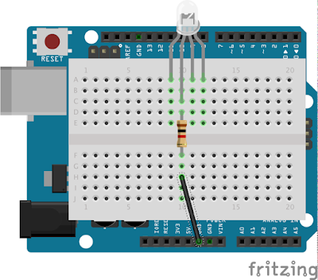

# 1.1 digital output

本章主要有三：Arduino digital output，Arduino多工作業，多粒LED控制

[TOC]

## Arduino digital Output

### 效果

讓一粒LED閃爍，每隔一秒開關一次。

### 電路圖


### 程式碼

```java
byte LED = 13;

void setup() {
  pinMode(LED, OUTPUT);  //set as output

}

void loop() {
  digitalWrite(LED, HIGH);  //turn on the LED
  delay(1000);              //wait for 1 sec
  digitalWrite(LED, LOW);  //turn off the LED
  delay(1000);              //wait for 1 sec
}
```

### 說明

`byte LED = 13;` : 設定一個變數，名稱叫`LED`，儲存格式為`byte`，Arduino的內存有限，可行的話盡可能減少沒必要的消耗，範圍用不著這樣大的就選擇最少的一個，常用變數列表牽參考[這裡](https://www.google.com/search?safe=off&sxsrf=ALeKk03djUEBjid_DBnWpJES1joxUvIKvw%3A1583907556597&ei=5IJoXvWEIuKQr7wPr8G5iA4&q=arduino+Data+Types&oq=arduino+Data+Types&gs_l=psy-ab.3..0i203l10.693.1362..1566...0.2..0.94.301.4......0....1j2..gws-wiz.......0i71j35i39j0.cljru9tpDXk&ved=0ahUKEwj1hpC645HoAhViyIsBHa9gDuEQ4dUDCAs&uact=5)。

`pinMode(LED, OUTPUT);`  : 用來設定腳位的模式(輸入/輸出)。

`digitalWrite(LED, HIGH);`  : 用來設定腳位的輸出值，`HIGH`為5V，`LOW`為0V。

`delay(1000);` : 為延時函數，microsecond(毫秒=1/1000秒)為單位，`delay(1000);`就是延時一秒，但值得注意的是，用`delay`來延時的話，這一秒之內，Arduino不會作出任何回應。如果需要Arduino在同一時間之內執行多項任務，就需要用別的方法延時，下一節會詳談。

## Arduino 多工作業

先聲明，我也不清楚這個是否應該叫做多工作業，如有你知道，請指正。

有些情況下，我們需要同一時間做多樣事情。

例如，要需要一粒LED閃爍，但又希望讀取另一個button的狀況；

又例如，Arduino小車撞到東西，觸發touch sensor，令其後褪，但後褪的同時又要確保小車車底的邊緣感應器edge sensor正常運作，令小車知道自己快要跌下平台，及時作出回應。

在這種情況下，我們不會用`delay()`來延時。

`delay()`的好處是簡單易用，一句指令就可以做到延時，對於簡單的程式和應用來說，已經夠用。但在大多數的情況下，尤其是千變萬化，需要同時處理多項任務的智能式機械人，明顯是不夠用。

### 效果

本節會繼續用上一節的電路，但會改變一下程式，令閃燈在閃動的期間，可以同時處理其他任務。

### 電路圖


### 程式碼

```java
byte LED =  13;      
boolean LED_state = LOW;             //紀錄現時LED的狀況，是開燈還是關燈
unsigned long timer;

void setup() {
	pinMode(LED, OUTPUT);      
}

void loop()	{
	if(millis() - timer >= 1000){
	    if (LED_state == LOW){
	    	LED_state = HIGH;
	    }
	    else {
	    	LED_state = LOW;
	    }
	    digitalWrite(LED, LED_state);
	    
	    timer = millis();
	}
}
```

### 說明

`boolean LED_state = LOW;`  : 設定一個叫`LED_state`的變數，格式是`boolean`。`boolean`專門用來儲存邏輯變數，只有2個情況，不是`HIGH`就是`LOW`。

`unsigned long timer;` :  `unsigned long`是另一種類型的變數，最大容量很大。設定一個叫`timer`的變數用以記錄時間。

`millis()`: 傳回Arduino開機之後的時間，單位為毫秒。例如Arduino開機一秒，就傳回數值`1000`。由於時間不停累加，所以要用一個很大容量的變數去記錄。
用以計時的格式是這樣的，例如我要一個變數 `i` 每0.5秒累加`1`，那我的格式應該是：

```java
if(millis() - timer >= 500){    
    i = i+1;
    
	timer = millis();
}
```

又例如，一個變數 `j` 每1.5秒累加`2`，那就應是：

```java
if(millis() - timer >= 1500){    
    j = j+2;
	    
	timer = millis();
}
```

如此類推。

`if (LED_state == LOW){LED_state = HIGH;}` : 看清楚，`if`入面的比較是用兩個等號。
如果是 `LED_state = HIGH;` (一個等號)是輸入，只有一個等號，而且是右邊的`HIGH`輸入到左邊的`LED_state`，不能互換。

## Arduino 多LED控制

本節主要介紹`array`和`for loop`的用法，用以簡化多粒LED(和其他I/O)的程式碼。

### 效果

讓一排LED走馬燈閃爍。

### 電路圖


### 程式碼

```java
byte LED[] = {13,12,11,10,9,8,7,6};

void setup(){
	for(byte i=0; i<=7; i++){
	    pinMode(LED[i], OUTPUT);
	}
}

void loop(){
	for(int i=0; i<=7; i++){
	    digitalWrite(LED[i], HIGH);
	    delay(500);
	    digitalWrite(LED[i], LOW);
	}
}
```

### 說明

`byte LED[] = {13,12,11,10,9,8,7,6};` : `LED[]`是一個陣列，用以紀錄多個名稱相同但編號不同的變數。例如現在`LED[0]`即是`13`, `LED[1]`即是`12`, 如此類推，所以`LED[7]`就是`6`。

```java
for(byte i=0; i<=7; i++){
	    pinMode(LED[i], OUTPUT);
	}
```

: `for`是一個重覆執行的函數，在上面例子，`i`由`0`開始執行，`i++`即是`i=i+1`，所以執行一次後，`i`就加`1`，直到`i = 7`，所以，`0`至`7`，共執行`8`次。每執行一次時就累加`i`。

## 動動腦

1. 用[Arduino 多LED控制 ](#Arduino 多LED控制)的`陣列`和[Arduino 多工作業](#Arduino 多工作業)的`millis()`概念，試推動1粒RGB LED，紅燈每`500ms`閃一次，綠燈每`750ms`閃一次，藍燈每`1s`閃一次；負極串聯一粒1kohm電阻，其他接線請自行想像。

	

2. 用[Arduino 多工作業](#Arduino 多工作業)的多工概念，設定一個變數 `i`, 將 `i` 每一秒累加`1`, 當`i>3`, 亮紅燈, 當` i>6`, 只有綠燈亮, 當`i>9`, 只有藍燈亮。