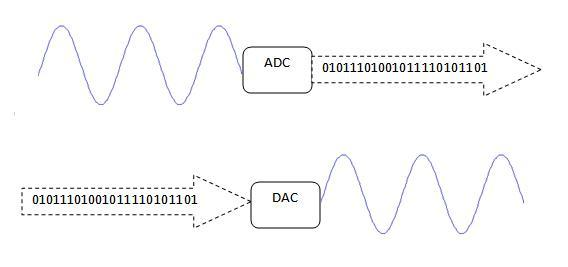

# 1.3 analog input

本章包含兩節：

1. `analogRead()`，即用Arduino讀取analog訊號，同時亦會介紹`Serial` library。
2. analog calibration，即初始化，用程式去初始化讀取的靈敏度。

[TOC]

## analogRead()

### 效果

用Arduino讀取光敏電阻的電壓值，再在電腦列出來。上傳完畢請按下Ardunio IDE介面右上角像放大鏡的Serial監視器。

### 電路圖


### 程式碼

```java
void setup(){
	Serial.begin(115200);
	pinMode(A0, INPUT);
}

void loop(){
	int voltage = analogRead(A0);
	//Or you can type pin 14 for A0, pin 15 for A1, etc.
	Serial.print("The voltage is:");
	Serial.println(voltage);
	delay(100);
}
```

### 說明

`int voltage = analogRead(A0);` : 用Arduino的`A0`腳位，讀取analog數值，儲存在變數`voltage`中。



Arduino微控制器是digital的，在微控制器的世界裡只有`0`(`LOW`)和`1`(`HIGH`)，不是`0`就是`1`，但現實世界的資訊都是analog的，例如聲音，光度，距離，溫度等等，要和現實世界互動，就需要把analog的訊號變成digital，這元件稱之為ADC(analog-digital-converter)。

Arduino內建了6隻腳位(`A0` - `A5`)(或用pin `14`- pin `19`表示)，能讀取analog訊號。解柝度為10-bits，即可將5V分成1024級, 讀到0V，出來的數值是0；讀到5V, 就應該是1024。但由於最大只有1023，所以數值是1023。而讀到3.75V，就是：
$$
\frac{3.75V}{5V} \times 1024 = 768
$$
相反，如果是讀到512，那實際的電壓是：
$$
\frac{512}{1024} \times 5V = 2.5V
$$


上圖中，橫軸的取樣時間稱為sample time，而取樣的密度就是sample rate，sample rate即每秒取樣多少次，數字越大即取樣越密，還原當然越好，但資訊量會大很多。而直軸的密度就叫resolution，解柝度，以bit為單位，上圖是4-bits，所以有0-15共16個級數(圖中只顯示0-9，但實際應該是0-15的)。

Arduino的內置ADC，resolution有10-bits, 即有1024個等級，而sample rate就視乎你寫的程式有否`delay`和程式的長度，但最好每次`loop()`預留10ms給Arduino作為資料傳輸。

`Serial.begin(115200);` : Serial是[串行通訊](https://zh.wikipedia.org/wiki/串行通信)的library，Arduino IDE本身已內置的library之一。Arduino通過USB線，與電腦通訊，通訊的單位是`byte`，與電腦通訊其間會佔用了pin `0` 和pin `1`，當然，上傳程式至Arduino時都會佔用到，所以，如無特別，留空Arduino的pin `0`和pin `1`以免程式不能上傳和影響通訊。

`115200`是通訊速度，即115200bps，常用的Serial傳輸速度，Serial需要透過雙方事先協定一樣的速度。如果開了Serial監視器，出了很多奇怪的文字，那確認一下**<u>Serial監視器</u>**<u>右下角</u>的通訊速度是否115200bps。

```java
Serial.print("The voltage is:");
Serial.println(voltage);
```

`print`跟`println`最大的分別是：`print`沒有隔行，而`println`在列印出時會順便按下enter，變成在下一行再列出新的數值。

## analog calibration

### 效果

按下serial監視器後，首五秒鐘請盡量讓光敏電阻感受環境下的最光與最暗，讓Arduino記錄。五秒之後就會得出經調整的光度百分比。

### 電路圖


### 程式碼

```java
int sensorPin = A0; 

int sensorValue = 0;
int sensorMin = 1023; 
int sensorMax = 0;

void setup() {
	Serial.begin(115200);
	// turn on LED to signal the start of the calibration period:
	pinMode(13, OUTPUT);
	digitalWrite(13, HIGH);

	// calibrate during the first five seconds 
	while (millis() < 5000) {
		sensorValue = analogRead(sensorPin);
		if (sensorValue > sensorMax) {
			sensorMax = sensorValue;
		}
		if (sensorValue < sensorMin) {
			sensorMin = sensorValue;
		}
	}
	// signal the end of the calibration period
	digitalWrite(13, LOW);
}

void loop() {
	sensorValue = analogRead(sensorPin);
	sensorValue = map(sensorValue, sensorMin, sensorMax, 0, 100);
	sensorValue = constrain(sensorValue, 0, 100);
	Serial.print(sensorValue);
	Serial.println("%");
}
```

### 說明

```java
int sensorValue = 0;
int sensorMin = 1023; 
int sensorMax = 0;
```

宣告三個變數：`sensorValue`用來紀錄`A0`腳讀到的數值；`sensorMin`用來紀錄最少值；`sensorMax`用來紀錄最大值。一開始時刻意將min設做`1023`，max設做`0`。(今次需要用`int`需不用`byte`，因數值大於`255`。)

```java
while (millis() < 5000) {
	sensorValue = analogRead(sensorPin);
	if (sensorValue > sensorMax) {
		sensorMax = sensorValue;
	}
	if (sensorValue < sensorMin) {
		sensorMin = sensorValue;
	}
}
```

首五秒，讀取sensor所在的腳位，如果大於max，則更新max值，如果少於min，則更新min值。只要在首五秒讓光敏電阻感受環境中的最光和最暗值，就能把兩個min, max的差異擴大。

`sensorValue = map(sensorValue, sensorMin, sensorMax, 0, 100);` : `map`是用來將`sensorValue` 跟據比例縮放，由原本最大最少值是`sensorMax`和`sensorMin`，變成`0`至`100`。詳見[這裡](http://arduino.cc/en/Reference/Map)。

`sensorValue = constrain(sensorValue, 0, 100);` : `costrain`則是用來限制`sensorValue`的上下限，保存在`0`-`100`之內，即使多於`100`, 最大值還是`100`。詳見[這裡](http://arduino.cc/en/Reference/Constrain)。

## 動動腦

1. UNO的analogRead解柝度是？
2. UNO內建多少analog腳位？分別標籤為？
3. 計算：2.25V輸入UNO的`A0`腳，`val = analogRead(A0);` 中`val`是多少？
4. 在[例程一](#analogRead())中，在Serial監視器顯示`533`，實際輸入`A0`的電壓是？
5. 利用第一章學過的[陣列](./content1_1.html#arduino-多led控制)概念，初始化兩顆光敏電阻，一顆上拉電阻是$10k\Omega$, 另一顆上拉電阻是$100k\Omega$。