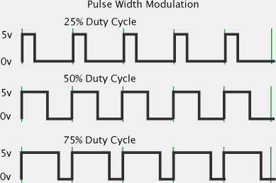
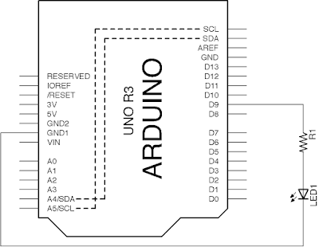

# 1.4 analog output

Arduino UNO沒有真正的analog output。

但有時，要與真實世界互動，digital的輸出只有開與關，並不夠用，例如要控制LED的光亮度，要控制直流馬達的運行速度等，就需要analog輸出。Arduino雖然沒有直正的analog輸出，但在大部分情況下，用PWM模擬analog輸出已經足夠。



PWM(Pulse Width Modulation)，顧名思意，就是用pulse(即是方波)的寬度，去控制平均輸出的電壓值。

例如上圖中，25% Duty Cycle就是在一個週期內，25%時間是`HIGH`，75%時間是`LOW`，只要週期夠小，變化速度夠快，用來亮LED，人的肉眼根本看不到閃爍，只會見到LED暗了。

所以說，25% Duty Cycle，平均輸出的電壓是: $5V \times \frac{25}{100} = 1.25V$

50% Duty Cycle，平均電壓就是：$5V \times \frac{50}{100} = 2.5V$，如此類推。

Arduino UNO只有==pin 3, 5, 6, 9, 10, 11==可以用內置的`analogWrite()`函數輸出PWM訊號。輸出的解柝度是==8-bits==，即==0 ~ 255==。下面再詳談。

[TOC]

## analogWrite()與PWM

### 效果

上傳後，LED會由暗慢慢變光。

### 電路圖



### 程式碼

```java
void setup(){
	pinMode(9, OUTPUT);
}

void loop(){
	for(byte i=0; i<=255; i++){
	    analogWrite(9, i);
	    delay(20);
	}
}
```

### 說明

一段很簡單的程式。上一節已經提過，`analogWrite(pin, value);`是用來輸出PWM訊號的，第一個參數用來返定輸出腳位。第二個參數設定輸出的"力度"。

例如，`analogWrite(9, 30);` 就是在`9`腳輸出$5V \times \frac{30}{255} \approx 0.59V$。

## 動動腦

1. PWM全寫是？
2. 計算：平均輸出要3.75V，`analogWrite(9, x)`中的`x`應該是多少？
3. 計算：`analogWrite(9, 200);`中，`9`腳的平均輸出電壓是多少？
4. 列出Arduino UNO內置可用analogWrite的PWM腳位。
5. Arduino UNO內置的PWM解柝度是多少？