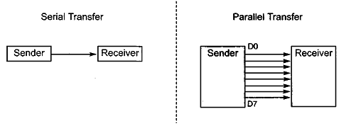
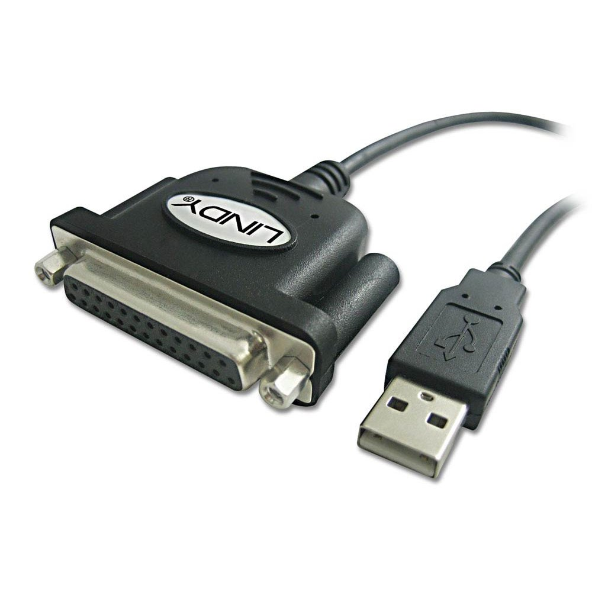
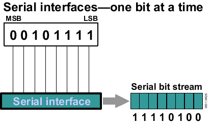
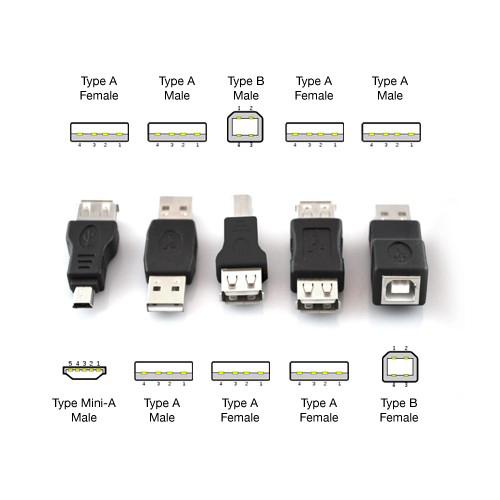
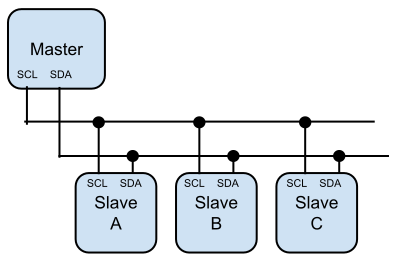

# 2.1 Communication

[TOC]

## 字符

要於兩部裝置(電腦、Arduino、微控制器等)傳輸資料，首先就要了解資料的格式和怎樣傳遞的。

你可能有聽過摩斯編碼，就是用dash和dot來編成不同的英字字母和符號。而到了電腦年代，則是使用ASCII碼來傳遞字符(當然也有不同的編碼，例如中文常用的是BIG5)。摩斯編碼用3 - 4個dash和dot組成字母，而ASCII碼則用固定8個`0`和`1`來表示。例如，`A`就是`0100 0001`，`a`就是`0110 0001`。

每個`0`或`1`稱之為bit，8 bits組合起來就是1 byte, 1024 bytes就是1 KB，1024 KB就是1 MB，如此類推。

## Serial VS. Parallel傳輸

而在兩個裝置間傳遞這些資訊，大體可分為serial和parallel兩種方法。

### Parallel

Parallel傳輸就是接8條導線，在同一時間將8個bits傳輸過去，用5V代表`1`，用0V代表0``，90年代常用的printer port就是parallel傳輸。

好處是結構簡單，不需要複雜的程式，例如用Arduino A的8隻腳同時使用`digitalWrite()`，用Arduino B的8隻腳同時使用`digitalRead()`，就能自己架接一個parallel傳輸。另一好處是傳遞速度快，同一時間傳輸8bits。但缺點是需要用上多條電線，難以減少和簡化插頭。

### Serial

隨著電腦的速度提升，serial傳輸速度不比parallel來得慢，現在裝置間傳輸資料(例如電腦接printer，滑鼠等)，都是使用serial傳輸(當然更多的是無線傳輸)。

Serial就是將原本一次過傳遞的8個bits變成串流，逐個傳輸去另一個裝置。理論上要比parallel傳輸多用8倍時間。而且在裝置內容的結構上，需要在兩個裝置都加上buffer，用來暫存收到的串流，再逐個bit吐出來讀取。但好處是用的電線較少，插頭的結構可以簡單很多，相對損壞的機率也較低。常見的USB就是serial傳輸，還有這個年代已甚少用的RS232也是。

## Arduino常用傳輸

### Serial UART

Arduino能用USB線來與電腦溝通，但用的是Serial port UART通訊。溝通時會佔用pin` 0`為RX(receive接收)和pin `1`為TX(Transmit傳送)。也可以用`SoftwareSerial` library將其他腳位變成serial傳輸的腳位。

Serial傳輸對比parallel傳輸雖然用少了接線，但如果要用Device A分別連接Device B和Device C的話，就要用2對連接線，如果Device A要一次過連接10個設備，就要10對接線。對於Arduino這類腳位不多的微控制器，擴展上比較麻煩。

### I^2^C

I^2^C是另一種Arduino常見的傳輸格式。

I^2^C用兩條傳輸線`SCL`(clock)和`SDA`(data)來傳輸，分為master和slave，每個slave都有自己的終身編號，這個編號在一出廠時已固定，一般可以在datasheet裡找到。在傳輸時，只要先呼喚slave的終身編號，master就能與那個slave溝通，而其他slave雖然收到命令，但由於編號不同，不會作出回應。Slave的終身編號為7bits，所以，理論上，用I^2^C能夠並聯128個slave裝置(但有些位址保留了作特殊用途，所以實際只有112個)。這些裝置可能包括不同類型的sensor、LCD顯示器、ram記憶體等。