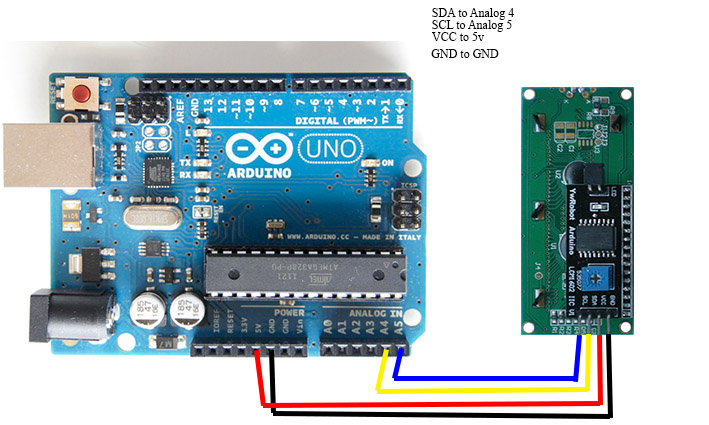

# 2.2 I^2^C LCD Display

據筆者經驗，由把玩Arduino轉而發展Arduino操控智能式機械人，最大的難度在於難以debug。

以往Arduino接上電腦，必要時可以打開serial監視器，在各個`if` case入面加上`Serial.println()`。就可以將程式運行到那裡顯示出來。例如光敏電阻A讀得的電壓大於`500`時，就把LED B亮起，而同時，只要加多一句`Serial.println("light LED B")`，就可以知道是進入了這個case之內(因有時有幾個case都會亮起LED B，難以知道是那一個case)。

而轉了操控智能機械人後，由於難以接著USB線走動，debug變得有一定難度，如果sensor本身有指示燈還好點，是自己焊製的sensor、沒有指示燈，有時難以知道是sensor有問題、收不到，還是program本身有問題，這時候，在機械人上加一個LCD Display就會易於debug。

[TOC]

## 下載外掛library

[下載](./LiquidCrystal_I2C.zip) (安裝方法參考[這裡](https://www.arduino.cc/en/guide/libraries))。

## I^2^C LCD Display

### 效果

用4條I^2^C接線，連接Arduino並顯示文字。

### 電路圖



### 程式碼

```java
//YWROBOT
//Compatible with the Arduino IDE 1.0
//Library version:1.1
#include <Wire.h>
#include <LiquidCrystal_I2C.h>

LiquidCrystal_I2C lcd(0x27, 16, 2); 
// set the LCD address to 0x27 for a 16 chars and 2 line display

void setup()
{
  lcd.begin();
  lcd.backlight();
}

void loop()
{
  lcd.setCursor(0, 0);
  lcd.print("Hello, world!");
  lcd.setCursor(0, 1);
  lcd.print("I <3 IS");
}
```

### 說明

`LiquidCrystal_I2C lcd(0x27, 16, 2); ` : 宣告一個lcd，slave終身編號是`0x27`(這個是16進制，即`0010 0111`)，這個編號是LCD的解讀器固定的，如果要修改，就要焊接解讀器的跳線。`16, 2`是指LCD橫有16個字符寬，直有2個字符高。

`lcd.begin();`
`lcd.backlight();`

初始化LCD和開LCD背光燈。

`lcd.setCursor(0, 0);` 
`lcd.print("Hello, world!");`

設定在LCD的座標(0, 0)打上`Hello, world!`。(x座標由左至右，y座標由上而下)

`lcd.setCursor(0, 1);`
`lcd.print("I <3 IS");`

在LCD座標(0,1)打上I <3 IS。
