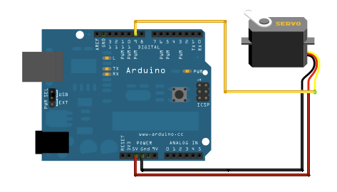
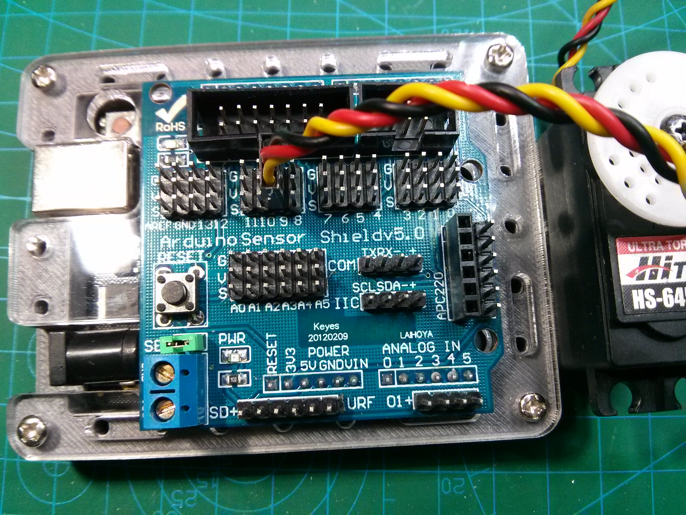
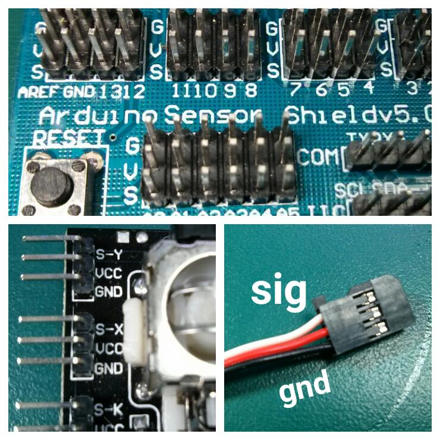

# 2.3 Servo Motor

Servo motor伺服馬達在機械人中佔一個很重要的地位。Servo motor並不會像一般馬達那樣連續旋轉，而是會依指令在0度到180度的範圍內轉動或停止。

<iframe width="560px" height="315" src="https://www.youtube.com/embed/bu3SPwzcocU" frameborder="0" allow="accelerometer; autoplay; encrypted-media; gyroscope; picture-in-picture" allowfullscreen></iframe>


Servo motor整合了控制電路，控制馬達的角度，整個反饋控制迴路(feedback control loop)藉由電位器(potentiometer)，即可變電阻，量度馬達的輸出角度，控制電路讀取電阻值後，便會依此數值來調整馬達的運轉方向和轉速，從而令馬達保持在指令的角度。

[TOC]

## Servo motor control

### 效果

Servo motor的角度會由0度累加至180度，再由180度累減至0度。如此循環。

### 接線圖





### 程式碼

```java
#include <Servo.h> 

Servo myservo;
byte angle;
byte step = 1;

void setup(){
	myservo.attach(9);
}

void loop(){
	angle += step;
	if(angle > 180 || angle < 0){
	    step *= -1;
	}
	myservo.write(angle);
	delay(50);
}
```

### 說明

`#include <Servo.h>` : `Servo`是Arduino內建的library之一，但它不像Serial library已經包含在程式之中，需要另外呼叫`Serial.h`文件去令它運作。

`Servo myservo;` : 就是設定一個`Servo`物件，叫`myservo`。

`byte angle;`
`byte step = 1;`

設定一個變數`angle`，再設定一個累加的步數，下面每一個`loop()`回圈，`angle`就會累加`step`的值。

`myservo.attach(9);` : 一開始需要告訴Arduino servo是接在那一腳位，現在是接在`9`腳。

`angle += step;`
`if(angle > 180 || angle < 0){`
        `step *= -1;`
`}`

`angle`每一次`loop()`的循環都會累加`step`的數值。`angle += step` 即 `angle = angle + step`的簡寫。

如果`angle`大於`180`度或者`angle`少於`0`度，`step = step * -1`，所以如果`angle`大於`180`度，就變成 `angle = angle - step`，之後再累減到少於`0`度，又會變成`angle = angle + step`。

`myservo.write(angle);` : 就是寫入角度，Arduino的Servo library可以直接寫入角度，一般的servo motor，signal腳位控制角度的訊號是這樣的：


signal腳位收的訊號是PWM訊號，==週期約20ms==，pulse的寬度為1ms時，servo motor的角度為0度，pulse的寬度為1.5ms時，角度為90度，pulse寬2ms，角度為180度。

當然，每一個品牌的servo都會有少量的差異，有的可能是90度servo，有的可能出廠時最大只有0 - 160度，但一般都大同小異，如果需要微調，請參考[這裡](http://arduino.cc/en/Reference/ServoWriteMicroseconds)。

## 動動腦

1. 參考第一章的[analogRead()](../1/content1_3.html#analogread)，試用`analogRead()`讀取電位器的數值，用[map()](http://www.arduino.cc/en/reference/map)把0-1023的讀數重速縮放為0-180度，再控制servo的角度。

	

2. 參考上一章的[digital input](../1/content1_2.html#邊緣觸發edge-trigger)，當按下按鍵時，servo由原本的0度變成180度，當再按下時，由180度復原為0度，如此反復運作。
3. 把IR反射式sensor綁在servo之上，令其跟著servo如上面的[例題](#程式碼)般左右轉動，參考上一章的[digital input](../1/content1_2.html#準位觸發level-trigger)，當IR反射式sensor搜尋到有物件阻擋時，停止servo轉動並在Serial監視器列印出servo當時的轉動角度。