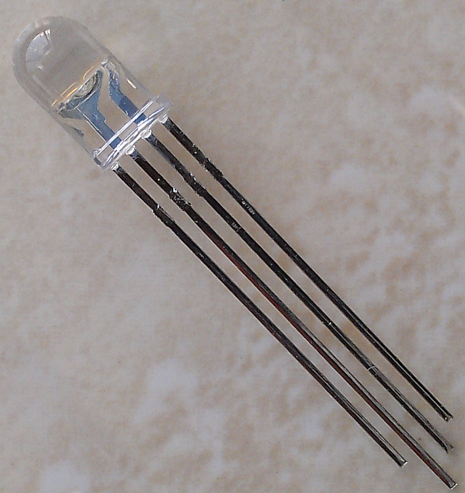
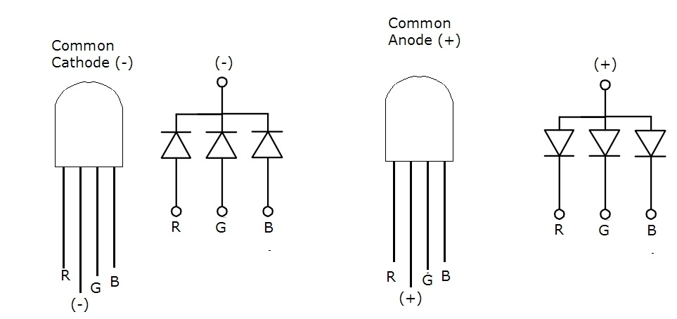
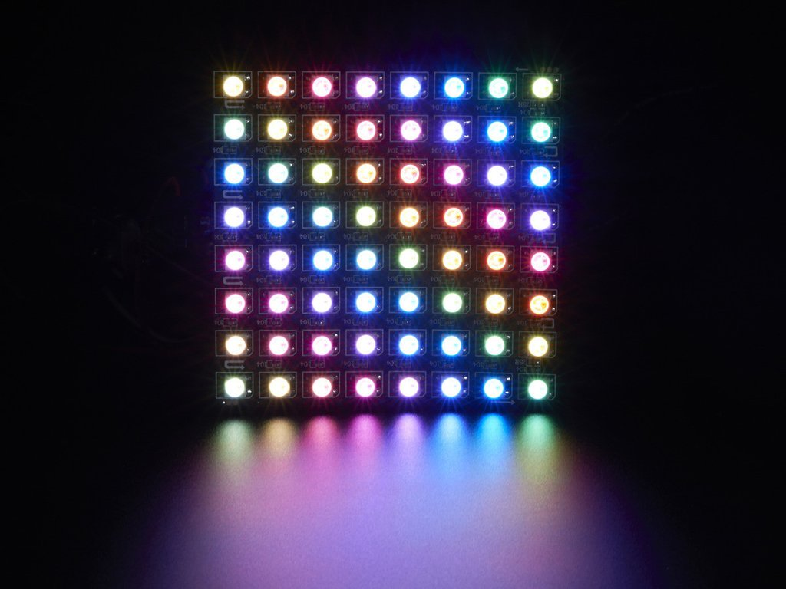
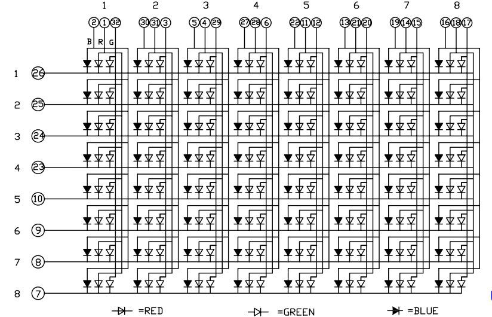
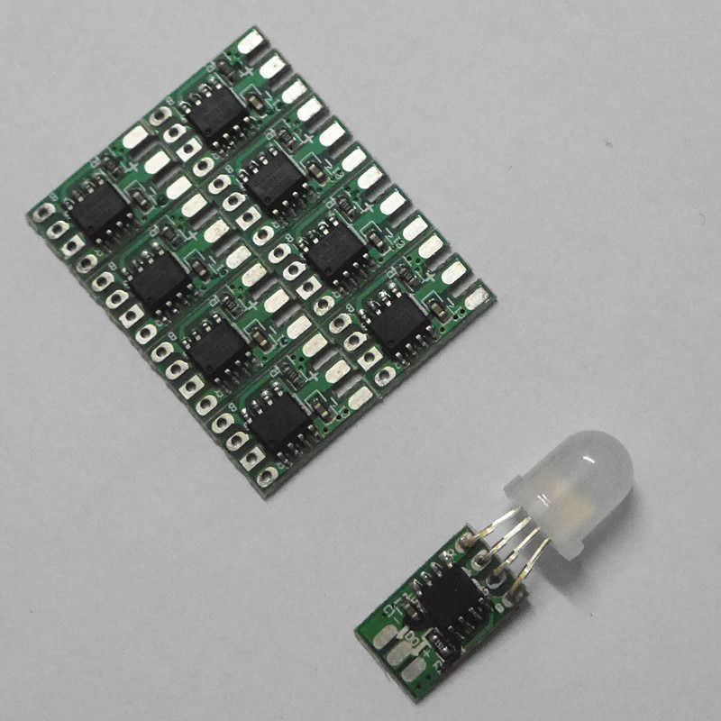
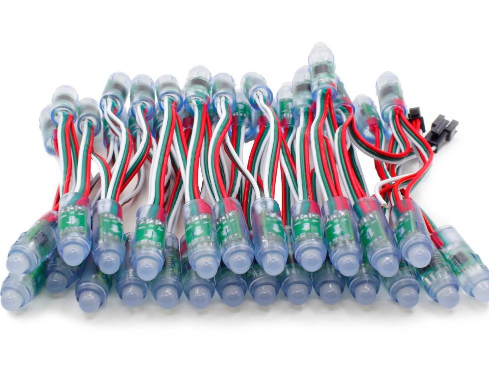
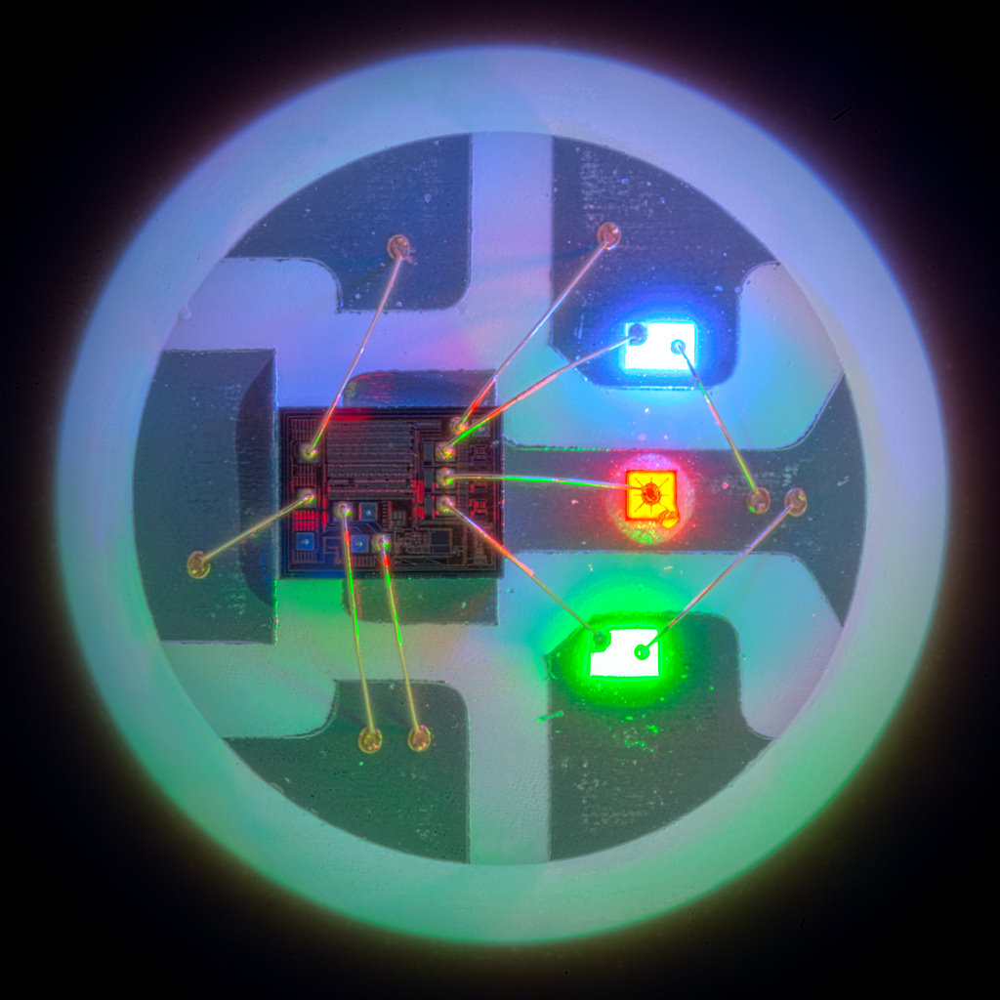
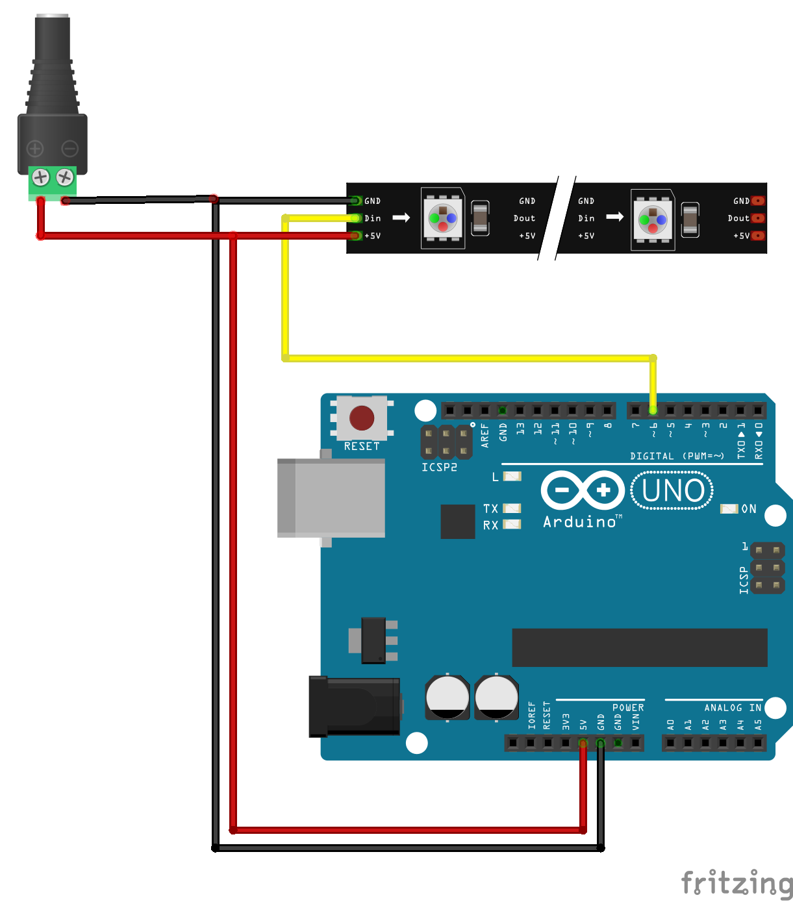

# 2.4 RGB LED with WS2811 driver

[TOC]

##原理

###RGB color

> **三原色光模式（RGB color model），又稱RGB顏色模型或紅綠藍顏色模型，是一種加色模型，將紅（Red）、綠（Green）、藍（Blue）三原色的色光以不同的比例相加，以合成產生各種色彩光。 -- 維基百科


### RGB LED 燈

跟 RGB 的原理一樣，要利用 LED 重現彩色的世界，例如 OLED 電視，戶外的大型 LED 廣告牌等等，就需要用到 RGB LED 燈。

有點電子製作經驗的人都知道，LED 是一隻有極性的兩腳小元件，所以紅、綠、藍三色即有 3 顆 LED燈組成在一起。

為減少引腳，一般分為共正 ( 正極相連 ) 和共負 ( 負極相連 )。所以每顆 RGB 燈共有 4 隻
引腳，即使是貼片式的也不例外。如果要組成 60 顆燈珠的指針時鐘,每顆燈要能獨立控制,用並聯的方式就最少需要 181 條引線 (60 紅+60 綠 +60 藍 +1 共負 )，微控制器亦需要 181 隻獨立控制腳，如果是更大型的 LED 廣告牌和顯示器，引腳數目就更誇張，可以想像製作過程要花相當大的功夫。




### LED 陣列

為減少引腳，前人就想到了用掃瞄式的 LED 陣列。

LED 陣列就是將 LED 排成方陣，將每個橫行的負腳相連，再將每個直列的正腳相連，所以單色 8x8 的LED 陣列只有 16 隻引腳，而三色的 8x8 陣式只有 32隻引腳。

使用時，例如只要將 2 列 3 行供電，對應的LED(2,3) 就會亮。 如要同時再亮 LED(4,7)， 理論上就給 2 列、4 列供正電源,3 行、7 行接負極即可。但問題是,如果按照這樣供電，LED(2,7) 和 LED(4,3) 也會同時亮起來。

為了使 LED 看起來能每顆獨立控制，就要用掃瞄式的顯示。方法是每一個時間點只控制一直列或一橫行的 LED 燈，只要時間點分得夠細，看起來就好像每顆燈都能獨立受控。市面上常見的 LED 顯示，例如巴士上方和旁邊的目的地顯示牌，就是用這方法顯示的。




### WS2811 LED DRIVER

對於 RGB 顯示來說，即使掃瞄式顯示可以大幅減少引腳數目，在大型項目來說還是很多。而且並非所有專案都適合使用陣列。

例如製作時鐘就並不適合，因所有的燈都是一直線的，如果用陣列式去佈線，燈與燈之間的引線一樣很複雜，一樣會有厚厚的電線紮。而且由於燈的位置並非方陣,在編程時就更
加困難。

所以市面上有種積體電路，專門針對 3 色 LED，每色有 256 個亮階，在控制時只需要一根訊號線就可以通訊和控制，大大減少引腳。其中一種就是ws2811。

而隨著科技的進步，積體電路能夠做到更加細少，現時已經不再需要一顆額外的 IC，因為有一種市售的 5050( 即 5mm x 5mm) 貼片式 RGB 燈珠，在小小的面積上已整合了 w2811 電路，製作成燈帶一卷一卷的出售。有些廠商例如 Adafruit 就製作成環形等特別形態出售。



## 下載外掛library

 打開Arduino 1.8以上的版本，開啟Library Manager([教學](https://www.arduino.cc/en/guide/libraries#toc3))，搜尋FastLED，就可以找到作者為Daniel Garcia的library，按下安裝就可以。

##LED獨立控制

### 電路圖



ws2812 LED是有信號==方向性==的，尤其是燈帶，不要搞錯，signal要接在`Din`腳，`+5V`接正電源，如果只需要亮==少量==的燈，直接接Arduino 的`5V`也可以。

### 程式碼

```java
#include <FastLED.h>

// How many leds in your strip?
#define NUM_LEDS 10

// For led chips  WS2812 DATA_PIN (Din).  
#define DATA_PIN 6

// Define the array of leds
CRGB leds[NUM_LEDS];

void setup() {

     FastLED.addLeds<WS2812, DATA_PIN, GRB>(leds, NUM_LEDS);  
     // GRB ordering is typical
     FastLED.setBrightness(127);
     //FastLED.setBrightness(BRIGHTNESS);
     //where BRIGHTNESS = 0 - 255
}

void loop() {
  for (int i = 0; i < NUM_LEDS; i++){
      leds[i] = CRGB(25*i,0,0);
      //leds[ID] = CRGB(R, G, B); where RGB = 0 - 255
      if (i >= 1)	leds[i-1] = CRGB(0,0,0);
      FastLED.show();
      delay(500);
  }
  for (int i = 0; i < NUM_LEDS; i++){
      leds[NUM_LEDS-i] = CRGB(0,25*i,0);
      if (i <= NUM_LEDS-2)	leds[NUM_LEDS-i+1] = CRGB(0,0,0);
      FastLED.show();
      delay(500);
  }
}
```

### 說明

`#define NUM_LEDS 10` : 定義有多少盞LED燈。

`#define DATA_PIN 6` : 指定 `6`腳為Data(Din)腳，也可以使用其他Arduino的腳位，即使`A0`-`A5`也可以用。

`FastLED.addLeds<WS2812, DATA_PIN, GRB>(leds, NUM_LEDS);` : ==注意是`GRB`而不是`RGB`==，是刻意的，典型的WS2811和WS2812也是紅和綠相反的。

`FastLED.setBrightness(127);` : 用來調節LED的光亮度，數值由`0`至`255`，如果無需調節，也可以不用打這一句。
