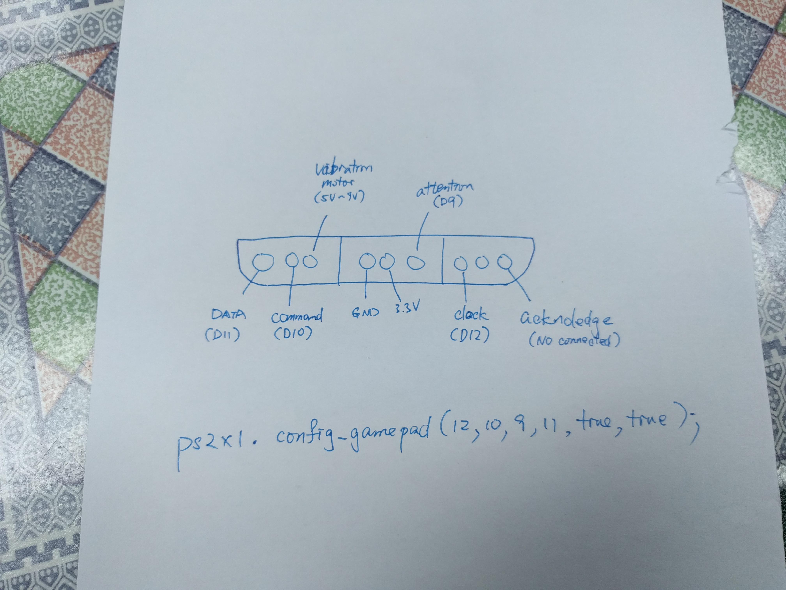

# 2.5 PS2 Remote

用Arduino做機械人或其他實作，常會用到輸入和輸出的模組，文字輸出可以用LCD顯示器輕鬆實現，而輸入方面，如果是少許按鍵，可以用普通按鍵實現，但如果需要一個遊戲的介面，如果自製就但十分麻煩，這時候就需要用到PS2遙控器。

[toc]

##下載外掛library

[下載](https://github.com/Lynxmotion/Arduino-PS2X/blob/master/PS2X_lib.zip) (安裝方法參考[這裡](https://www.arduino.cc/en/guide/libraries))。

## PS2 Remote

### 效果

打開Arduino序列埠監測器，按下PS2的按鍵，會列印出相應的語句。

### 電路圖



==注意，PS2接收器的電壓是3.3V，如果接5V接收器會即時報銷。==如果使用Sensor Shield V5.0的話，3V3在Bluetooth Interface的第一隻引腳，板的表面並沒有標示的。


### 程式碼

```java
#include <PS2X_lib.h>
#include <Wire.h>
#include <EEPROM.h>

PS2X ps2x1;

// PIN OF PS2 CONTROLLER
#define DATA 11
#define COMMAND 10
#define ATTENTION 9
#define CLOCK 12
// 也可以是任意的引腳，線路接對就可以
 
int error = 0;
byte type = 0;
byte vibrate = 0;

unsigned long timer;

void setup() {
  Serial.begin(115200);
  error = ps2x1.config_gamepad(CLOCK, COMMAND, ATTENTION, DATA, true, true);
  type = ps2x1.readType();
}

void loop() {
  if (millis() - timer >= 30) {
    timer = millis();

    if (error != 0) {
      //如果error不是0，可能是無線斷了，自動重新連接
      error = ps2x1.config_gamepad(CLOCK, COMMAND, ATTENTION, DATA, true, true);
      type = ps2x1.readType();
    }
    else {
      if (type == 1)  { //type是1即平時所用的PS2遙控
        ps2x1.read_gamepad(false, vibrate);

        if (ps2x1.Button(PSB_PAD_UP)) Serial.println("UP");
        else if (ps2x1.Button(PSB_PAD_DOWN)) Serial.println("DOWN");
        else if (ps2x1.Button(PSB_PAD_LEFT)) Serial.println("LEFT");
        else if (ps2x1.Button(PSB_PAD_RIGHT)) Serial.println("RIGHT");
         
        else if (ps2x1.Button(PSB_START))	Serial.println("START");
        else if (ps2x1.Button(PSB_SELECT))	Serial.println("SELECT");
          
        else if (ps2x1.Button(PSAB_CROSS)) Serial.println("CROSS");
        else if (ps2x1.Button(PSB_TRIANGLE)) Serial.println("TRIANGLE");
        else if (ps2x1.Button(PSB_SQUARE)) Serial.println("SQUARE");
        else if (ps2x1.Button(PSB_CIRCLE)) Serial.println("CIRCLE");
          
        vibrate = ps2x1.Analog(PSAB_CROSS); // vibrate when press 'x' button
        //ps2x1.Analog(PSS_LX), ps2x1.Analog(PSS_LY), 
        //ps2x1.Analog(PSS_RX), ps2x1.Analog(PSS_RY) 
        //則為JoyStrick的值，可以用Serial.println( ps2x1.Analog(PSS_LX) );
        //試一下
      }
    }
  }
}
```

