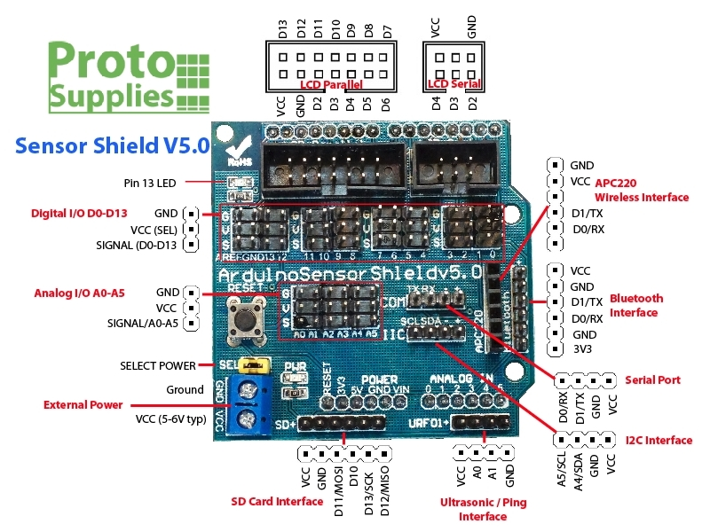

# 2.6 GRBL CNC firmware

如果需要用Arduino控制一隻stepper motor步進馬達，可以直接用Arduino連接或者用stepper motor driver IC例如A4988。但如果同時要控制2隻或以上的步進馬達，尤其是需要創造基於XYZ結構的機器等，直接使用現有的firmware會更加方便。

[toc]

## GRBL

[GRBL](https://github.com/grbl/grbl/wiki)是一個開源的CNC機韌體，可以利用ATMega328控制器(即Arduino UNO, NANO等)，配合stepper motor driver 來控制最多3個stepper，輸入上可利用Serial接口，用文字輸入標準GCode來控制機械。現今大行其途的3d打印機，有多個韌體都是繼承自GRBL的。

###Getting Start

部分淘寶買的GRBL控制板，使用CH340 driver的Arduino NANO，可能需要安裝[driver](http://www.wch.cn/products/CH340.html)。


安裝好之後(如有需要)，用usb線連接GRBL板上的Arduino，打開Arduino的serial監示器，或者用其他可以讀取serial的軟件都可以。只要開啟正確的串口後，Arduino會列印出`GRBL 1.XX ['$' for help]`，告訴你它的版本(至於我的截圖，我也不知為何會有亂碼error，可能是我的版本不是正統grbl吧)

確保右下角的bandrate是115200，文字結尾是NL&CR。在正面的文字輸入列，你可以輸入標準的GCode。

GCode是一種cnc機專用的控制命令語言，由於全部都是代號和數字，所以在一開始閱讀時可能需要邊讀邊查詢，但只要習慣了記住幾個常的的GCode代號，就會發現GCode的本質其實只是一堆座標吧了。

### G90/G91

**G90是Absolute positioning絕對座標，而G91是incremental positioning增量座標。**

學校買回來的繪圖機是沒有homing的極限開關和sensors(可以自行加裝的)，所以預設一開機的任置就是座標`(0,0)`，而座標系統預設是絕對座標。你可以試一下，在命令列輸入:

```
G0 X10 Y10
```

系統應該會傳回`ok`的字樣，X軸和Y軸應該會同一時間移動10mm。跟著再嘗試輸入:

```
G0 X0 Y20
```

這個系統是絕對座標系統，十分適合用來做繪圖或cnc的輸出。


別一個系統是增量座標系統:

```
G91 (只需要輸入一次)
G0 X10 Y10
X-10 Y10
```

以上這段gcode跟上面的絕對座標輸入的效果是一樣的，只是由絕對座標，變成每次跟據上一次的位置再增量出發。

增量座標適合用來debugs。

### G0/G1

上面的gcode中已經出現過，`G0`就是用機器預設最快的速度到達指定的座標。例如:

```
G0 X10 Y10
```

如果需要調整機器預設最快速度，可以用:

```gocde
$110=5000.000(X Max rate, mm/min)
$111=5000.000(Y Max rate, mm/min)
$112=500.000 (Z Max rate, mm/min)
```

如果都是覺得不夠快，未達到預期，好有可能是加速度太低所致

```
$120=1000.000	(X Acceleration, mm/sec^2)
$121=1000.000	(Y Acceleration, mm/sec^2)
$122=10.000	(Z Acceleration, mm/sec^2)
```

如果是方向反轉了，例如希望`+y`是下，`-y` 是上，可以用:

```
$3=2
```

| Setting Value | Mask     | Invert X | Invert Y | Invert Z |
| ------------- | -------- | -------- | -------- | -------- |
| 0             | 00000000 | N        | N        | N        |
| 1             | 00000001 | Y        | N        | N        |
| 2             | 00000010 | N        | Y        | N        |
| 3             | 00000011 | Y        | Y        | N        |
| 4             | 00000100 | N        | N        | Y        |
| 5             | 00000101 | Y        | N        | Y        |
| 6             | 00000110 | N        | Y        | Y        |
| 7             | 00000111 | Y        | Y        | Y        |

Setting Value為`2`，即二進制的`00000010`，對應上表是反轉y軸。


如果想知道現在的設定如何，可以用`$$`查詢。


`G1`是用指定的feedrate去到指定的目標，跟其他`G0`一樣，也可以指定用絕對座標和增量座標。

```gcode
G91
G1 X10 Y10 F1000
Y10
```

`G1`命令和feedrate指定過一次之後，就可以直接輸入座標，無需每次重覆輸入。


當然GCode還有很多其他的命令，而GRBL亦有很多參數可以設定，詳細可參考[這裡](https://github.com/gnea/grbl/wiki/Grbl-v1.1-Commands)和[這裡](https://github.com/gnea/grbl/wiki/Grbl-v1.1-Configuration)。

## 用另一塊Arduino控制GRBL

### 效果

用另一塊Arduino控制GRBL板，令其來回行走。

### 電路

```
Arduino			GRBL
Vcc		<-->	Vcc
GND		<-->	GND
TX		<-->	RX
RX		<-->	TX
```


細心留意, GRBL板是有標示的。



### 程式碼

==注意: 兩塊Arduino通訊是用硬體serial, 會佔用上傳功能，先上傳程式才接線，或在上傳時暫時斷開tx和rx連接。==

```java
unsigned long timer;
boolean direction = true;

void setup() {
  Serial.begin(115200);
  delay(3000);
  //一開始要等待GRBL回應版本表示開始
    
  Serial.println("G91");
  //設定為增量座標
}

void loop() {
  if (Serial.available()) 
    byte inByte = Serial.read();
  //每次傳送指令後GRBL都會回傳ok, 
  //如果不用read清空serial buffer,
  //經過一段時間後serial buffer就會滿

  if (millis() - timer >= 500)	{
    //這一句配合下面的 timer = millis();組成一個
    //multi-tasking的timer
    
    //這一段才是指令內容==================
    if (direction == true)  Serial.println("G0 X20 Y20");
    else Serial.println("G0 X-20 Y-20");
    direction = !direction;
    //這一段才是指令內容==================
      
    timer = millis();
  }
    
}
```

### 說明

GRBL的板會在收到正確指令時即時回傳`ok`的，不會理會機器是否到達指定的位置，雖然有方法可以讀取到機器現時的位置來判斷是否執行完指令，但相對較複雜，最好的辦法加一個`delay`, 但`delay`會令serial的buffer不能清空，一段時間後會產生問題，所以需要用到multi-tasking timer。