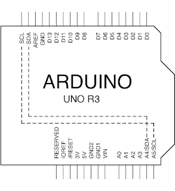
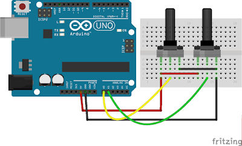

# 3.1 Arduino -> Processing

本篇主要介紹如何由Arduino傳輸資料去Processing軟件，從而令Processing畫出來的動畫能與Arduino互動。

Arduino與Processing之間可以透過Serial串口溝通，以下為Arduino傳送資料到Processing和Processing傳至Arduino的基礎程式結構。

[TOC]

## Arduino -> Processing

### 效果

Arduino以文字格式傳送三個數值給Processing，Processing讀取後，再分別放入陣列之中，然後列印出來。

<iframe width="560" height="315" src="https://www.youtube.com/embed/aEv9a7jZ05A" frameborder="0" allow="accelerometer; autoplay; encrypted-media; gyroscope; picture-in-picture" allowfullscreen></iframe>

### 電路圖



### 程式碼

#### Arduino:

```Java
void setup(){
	Serial.begin(115200);
}

void loop(){
	int random_number_1 = random(0, 512);
	int random_number_2 = random(0, 512);

	Serial.print(random_number_1);
	Serial.print(',');
	Serial.println(random_number_2);
	delay(1000);
}
```

#### Processing:

```java
import processing.serial.*;
Serial myPort;

int x_position, y_position;

void setup() {
  size(512, 512);
  println(Serial.list());
  myPort = new Serial(this, Serial.list()[0], 115200);
  myPort.bufferUntil('\n');
}

void draw() {
  //此處為空
}

void serialEvent(Serial myPort){
  String myString = myPort.readStringUntil('\n');
  myString = trim(myString);

  int data[] = int(split(myString, ','));

  for (int i = 0; i < data.length; i++) {
    print(data[i] + "     ");
  }
  println();

  x_position = data[0];
  y_position = data[1];
}
```

### 說明

上載完Arduino的程式後，開啟Arduino的serial監測器。確定Arduino每1秒鐘會出兩個數值，中間以逗號分隔(沒有空格)。

之後再運行Processing程式碼(運行前請先關閉Arduino的serial監測器，否則Processing會告訴你接口被佔用)，一開始按run鍵時，通常會告訴你這句有錯：

```java
myPort = new Serial(this, Serial.list()[0], 115200);
```

這句是告訴Processing，哪個serial串口是接Arduino的，Processing上面的`println(Serial.list());`會列出所有的串口，如果是window電腦的話，會列出`COMxx`, `COMxx`等，確定哪一個是Arduino(去Arduino IDE看看上傳的序列埠就知道)。例如Processing列出的是：`COM3` `COM8` `COM9`，而你確定`COM9`是Arduino，那就將`Serial.list()[0]`改為`Serial.list()[2]`。

```java
void serialEvent(Serial myPort){
  String myString = myPort.readStringUntil('\n');
  myString = trim(myString);

  int data[] = int(split(myString, ','));

  for (int i = 0; i < data.length; i++) {
    print(data[i] + "     ");
  }
  println();

  x_position = data[0];
  y_position = data[1];
}
```

整段`SerialEvent`函數中，每次`Serial`串口收到資訊就會運行，用一`String`字串去紀錄收到的字串，例如現在收到的是`127,242`。

`int data[] = int(split(myString, ','));` : `split`是把剛才收到的字串以逗記分隔開，再分別放入`data[ ]`這個陣列，所以現在`data[0]`是`127`，`data[1]`是`242`。

```java
for (int i = 0; i < data.length; i++) {
    print(data[i] + "     ");
  }
println();
```

之後再把再個`data[ ]`列印出來。

## 動動腦

1. 試在[上面的例子](#效果) ，在Processing畫一個50x50的方型，其位置是剛才收到的`x_position`和`y_position`。(劃方型可參考[這裡](https://processing.org/reference/rect_.html))

	<iframe width="560" height="315" src="https://www.youtube.com/embed/JlDd2bfZlQ0" frameborder="0" allow="accelerometer; autoplay; encrypted-media; gyroscope; picture-in-picture" allowfullscreen></iframe>

2. 試接兩個可變電阻，用analogRead接收(參考[這裡](../1/content1_3.html#analogread))，把它照上面的方法在Arduino serial監視器列印出來。確定沒有錯後，再在Processing中，控制一個50x50的方型，用剛才的兩個可變電阻控制方型的位置。
	
	