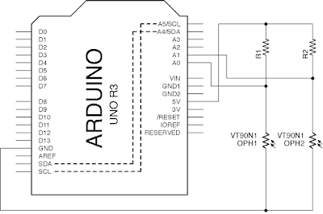

# 3.3 Arduino analogRead() -> Processing

[TOC]

## Analog Bar Chart

### 效果

將Arduino收到的兩個analog值用bar chart顯示出來。


### 電路圖



### 程式碼

#### Arduino

```java
void setup(){
	Serial.begin(115200);
	pinMode(A0, INPUT);
        pinMode(A1, INPUT);
}

void loop(){
	int voltage0 = analogRead(A0);
	int voltage1 = analogRead(A1);
	Serial.print(voltage0);
        Serial.print(',');
	Serial.println(voltage1);
	delay(100);
}
```

#### Processing

```java
import processing.serial.*;
Serial myPort;

int x_position, y_position;

void setup() {
  size(512, 512);
  println(Serial.list());
  myPort = new Serial(this, Serial.list()[9], 115200);
  myPort.bufferUntil('\n');
}

void draw() {
  //此處為空
}

void serialEvent(Serial myPort){
  String myString = myPort.readStringUntil('\n');
  myString = trim(myString);

  int data[] = int(split(myString, ','));

  for (int i = 0; i < data.length; i++) {
    print(data[i] + "     ");
  }
  println();

  background(200);
  fill(255,0,0);
  rect(width/5, height*4/5, 80, - data[0]/3);
  fill(0,255,0);
  rect(width*3/5, height*4/5, 80, - data[1]/3);
}
```

### 說明

Arduino程式可參考[這裡](../1/content1_3.html#analogread)。

Processing程式中，上半部分是跟之前的Serial接收是一樣的。後半部分:

`fill(255,0,0);`: 是填色，就是將長方形填上紅色。

`rect(width/5, height*4/5, 80, - data[0]/3);` : Processing預設畫長方形的模式是`rect(x, y, width, height)`，所以現在長方形的寬度是80, 高度是收到的`data[0]/3`，再乘收負號，令其向上增長(參考[這裡](https://processing.org/reference/rect_.html))。`width`和`height`是keyword，就是`setup()`中`size()`的兩個值。所以現在都是512。

## Analog V-T graph

### 效果

讀取Arduino的analog讀數，用時間軸顯示令其像示波器。


### 電路圖


### 程式碼

#### Arduino

```java
void setup(){
	Serial.begin(115200);
	pinMode(A0, INPUT);
        pinMode(A1, INPUT);
}

void loop(){
	int voltage0 = analogRead(A0);
	int voltage1 = analogRead(A1);
	Serial.print(voltage0);
        Serial.print(',');
	Serial.println(voltage1);
	delay(100);
}
```

#### Processing

```java
import processing.serial.*;
Serial myPort;

int voltage0, voltage1;
long time;

void setup() {
  size(512, 512);
  println(Serial.list());
  myPort = new Serial(this, Serial.list()[9], 115200);
  myPort.bufferUntil('\n');
}

void draw() {
  //此處為空
}

void serialEvent(Serial myPort){
  String myString = myPort.readStringUntil('\n');
  myString = trim(myString);

  int data[] = int(split(myString, ','));

  for (int i = 0; i < data.length; i++) {
    print(data[i] + "     ");
  }
  println();

  voltage0 = data[0];
  voltage1 = data[1];

  strokeWeight(4);
  stroke(255,0,0);
  point(time, height - voltage0/2);
  stroke(0,255,0);
  point(time, height - voltage1/2);

   time++;
  if (time > width) {
    time = 0;
    background(200);
  }
}
```

### 說明

Arduino程式跟之前的一樣。

Processing中，收集完之資料之後，將兩個收集到的`data`放入`voltage0`和`voltage1`之中。

`strokeWeight(4);` : 是畫圖形的邊框粗度，4就是4個像素粗。

`stroke(255,0,0);` : 是邊框的顏色，用`line()`和`point()`就需要用`stroke()`來決定其顏色，而用`rect()`和`ellipse()`等就用`stroke()`來決定邊框顏色，用`fill()`來決定填滿顏色。

`point(time, height - voltage0/2);` : 是畫點，輸入的兩個參數是點的位置，由於Processing的y軸是由上至下的，所以在畫V-T graph時，需要收`height`減去收到的值，令其曲線上下反轉。而`voltage0`和`voltage1`的最大值是1023，畫面只有512高，所以要除2。(你可以試用[`map()`](https://processing.org/reference/map_.html)指令來重新縮放 `voltage0`)

## 動動腦

1. 將Processing收的的兩個數值變成兩個圓形，收到的數值越大，圓形的直徑跟著變大。
	
2. 將收到的數值用儀錶板顯示出來。(Processing的線段沒有角度設定的，試用[sin()](https://processing.org/reference/sin_.html)，[cos()](https://processing.org/reference/cos_.html)和[radians()](https://processing.org/reference/radians_.html)控制線段末點座標。<br>
	
