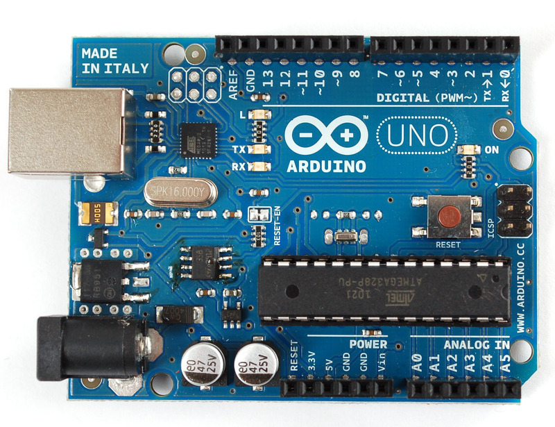
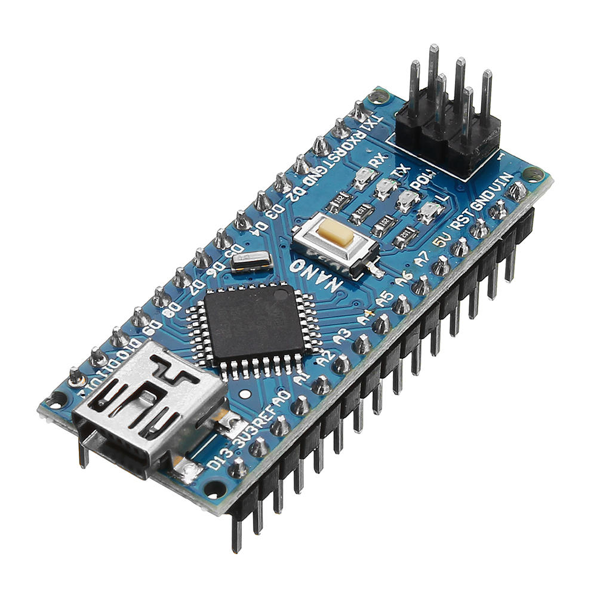
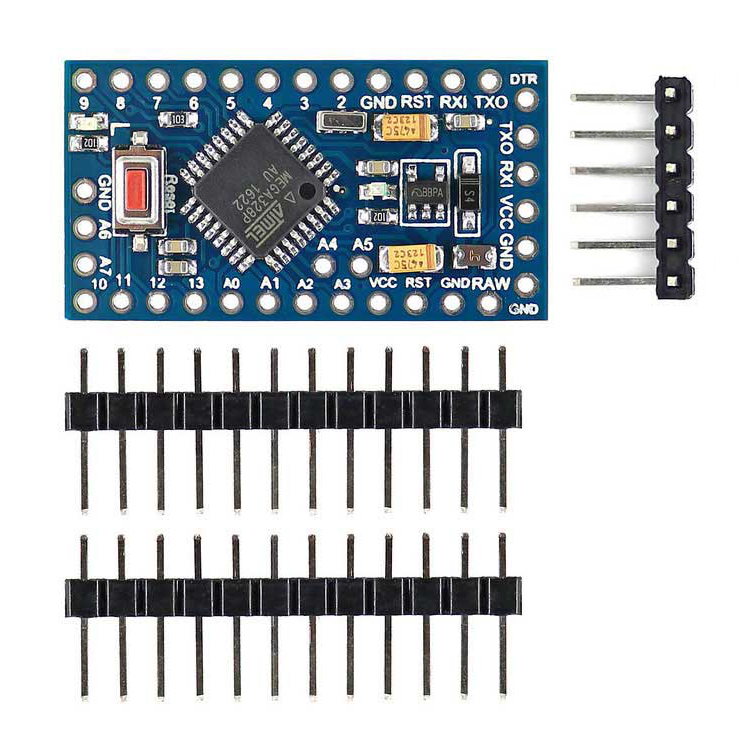
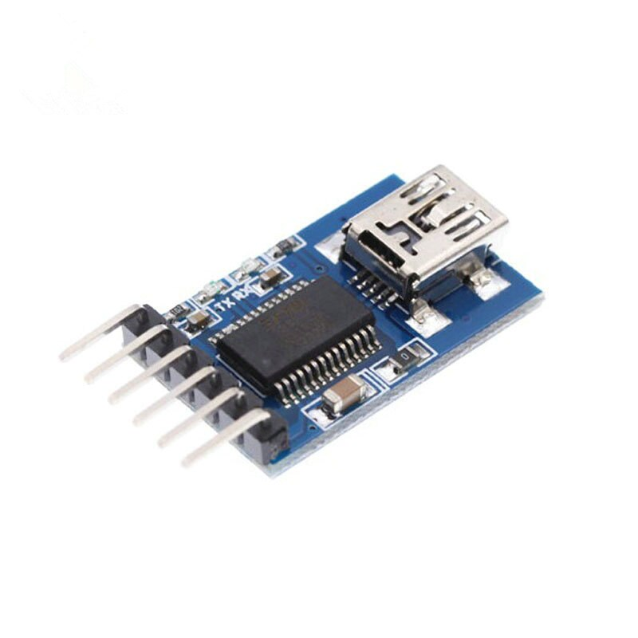
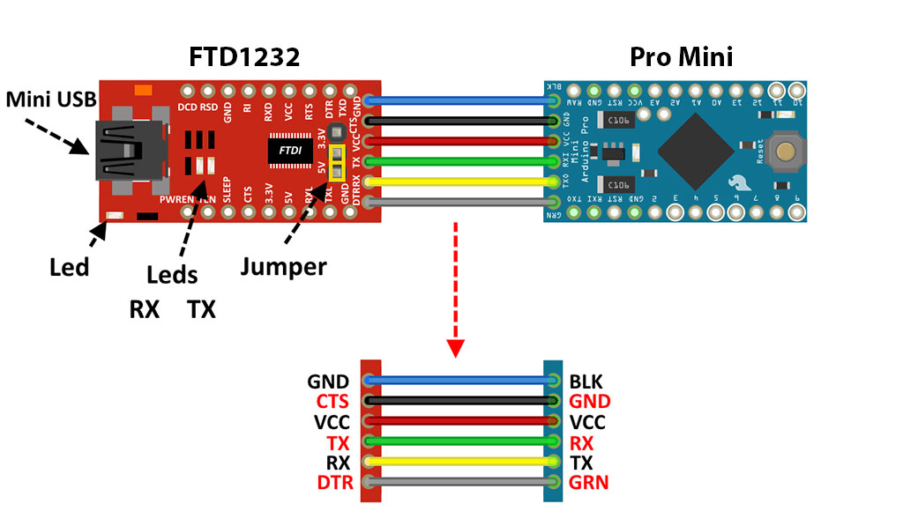
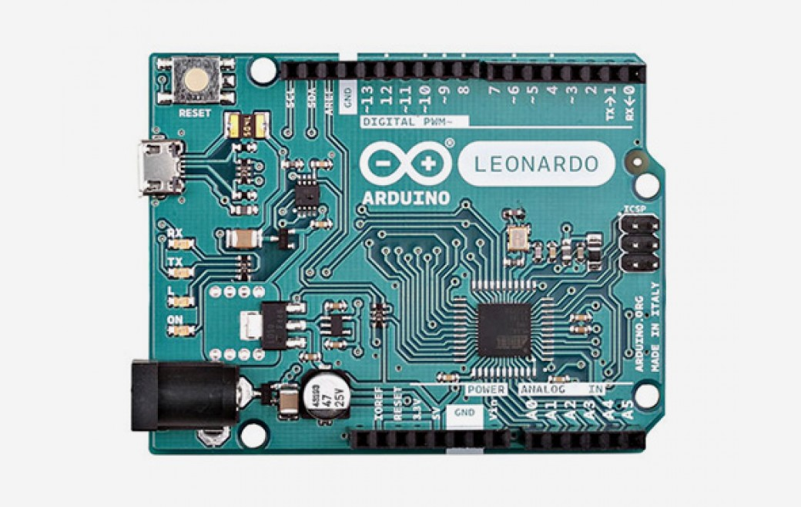

#4.1 不同型態的Arduino

[TOC]

Arduino除了是一個程式， 一塊控制板, 一個社群之外，由於其廣泛易用的特性，也衍生出行多形態和種類，常見的有:

## Arduino UNO

就是平常最常見的Arduino入門板，使用ATMega328作為核心，16MHz, 5V主電壓。

雖說是入門，但除了其引腳不足，經常需要外加sensor shield擴充外，在大部分的情況下都十分好用和易用。現時在淘寶上，價錢大約在20多元人民幣，太便宜的大多是通訊IC使用平價的CH340，而比較貴價的，可能是大廠的特別訂制版。

## Arduino NANO

跟UNO一樣，也是探用ATMega328作為核心，最大分別是，將UNO的引腳改成適合麵包板的DIP引腳。

大多數平價的淘寶NANO都是探用CH340作為通訊IC，driver可在[這裡](http://www.wch.cn/products/CH340.html)下載。

## Arduino Pro Mini

Pro Mini的核心也是探用ATMega328，外型跟NANO也十分像，最大分別是Pro Mini沒有通訊IC，價錢上會較便宜，適合一些不會經常需要改變程式的永久project。

由於沒有通訊IC，使用時需要額外一個FTDI uploader幫助才能上載程式，而FTDI uploader的driver在[這裡](https://www.ftdichip.com/Drivers/VCP.htm)。

## Arduino Leonardo

外型跟UNO幾乎一樣。分別是主核心採用ATmega32u4，好處可以用來當作虛擬mouse和keyboard。

## Arduino Mega

探用ATMega2560作主核心因而得名。可以向下支援UNO的擴充板，跟UNO最大分別是(外型也看得出)引腳多很多，主時脈跟UNO一樣是16MHz，比UNO更多的PWM腳位和Analog腳位。但我自己則甚少會用，如果需要如此多腳位的project，我會分開幾塊控制板做不同功能的控制，再互相通訊。