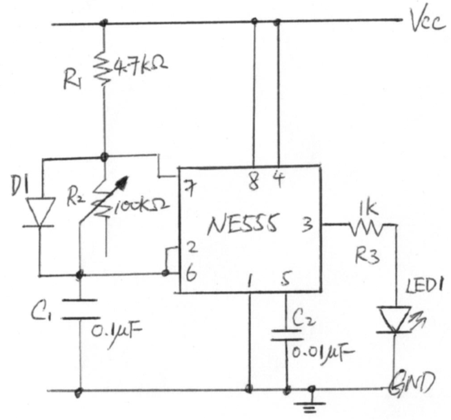

# 4.2 繪製電路圖與佈線圖

讓我們由一個最簡單的555調光器示範開始。

[TOC]

## Start

開啟EAGLE軟件，EAGLE軟件自從幾年前被Autodesk公司收購後，就跟其他Autodesk一樣可以登入Autodesk account，之後可以與自己的Fusion360 account有互動，將繪製好的PCB直接推送上fusion360變成立體圖，而fusion修改零件位置也能反映在eagle之上。

不過現階段暫時不用登入也可以。

## 電路圖

* 左手邊藍色圈起來的工具列，常用的工具都放在這裡
* 上面紅色圈的是次工具列，當左手邊的工具點選後，上面的工具列會跟著有變化
* 棕色圈起來的是設計資訊，會列出文件的頁數，零件，佈線等等，如果覺得沒甚麼用途，可將其都時關掉(反剔這麼)
  
* 最後綠色區域是線路圖的部分

###插入零件

在劃線路圖的上方命令欄打`add`，或者在左邊工具欄點選。

這時會彈出一個元件列表出來。我們需要找到IC555，所以在搜尋列中尋找。

==搜尋請打`*555`，eagle預計搜尋是完整文字搜尋，如果只打555，要找到555前有前置文字就需要加上`*`==

在劃圖區中放下零件。

|Part   |  Value  |   Device    	|     Package  |    Library      |   
| ----  | ----    | ----        	|----          |----             |
|C1     |0.1uF    |C-US025-025X050  |  C025-025X050|  rcl 			 |  
|C2     |  10uF      |     CPOL-USE2.5-6   |E2,5-6      | rcl                | 
|C3     |  0.01uF    |     C-US025-025X050 |C025-025X050| rcl                | 
|D1     |            |     DIODE-D-2.5     |D-2.5       | diode              | 
|IC1    |  NE555     |     NE555           |DIL-08      | st-microelectronics| 
|LED1   |            |     LED3MM          |LED3MM      | led                | 
|Q1     |  TIP41C    |     TIP31C          |TO220       | transistor-npn     | 
|R1     |  4.7k      |     R-US_0207/2V    |0207/2V     | resistor           | 
|R2     |  100k var. |     3RP/1610N       |3RP/1610N   | pot                | 
|R3     |  1k        |     R-US_0207/2V    |0207/2V     | resistor           | 
|S2     |  9077-2    |     9077-2          |9077-2      | switch-misc        | 
|VIN    |            |     AK500/2         |AK500/2     | con-ptr500         | 
|+12V   |            |     +12V            |       |     supply1     | 
|GND   |            |     GND            |       |     supply2     | 

1. 跟據手繪的線路圖，依次將需要用的零件在library中找出來放在繪圖區上
2. 在放置的過程中
   1. 可用`move`指令來移動零件[^1]
   2. 在移動時按*滑鼠右鍵*則可以很方便地旋轉(或者直接用`rotate`指令都可以)
   3. 可用`copy`指令來複製零件。
   4. 可用`name`來為零件命名
   5. 用`value`來為零件設定值

### 連接零件

1. 可用`net`指令來為零件與零件之間接線
2. 在用net指今的時候，可按*滑鼠右鍵*來改變接線的方向，你也可以在上方的工具列改變接線的形狀。
3. ==如果接線有重疊，而又有需要連在一起的，記得用`junction`指令為其加入墨點以表示是連結的==

### Electrical Rule Check(ERC)

接著則要做ERC，檢查一下零件的接線有沒有問題，一般都只會見到有warnings，可以了解一下是甚麼原因，但如果見到有error的就一定要處理。常見的errors可能有: 忘記用`junction`將接線連接、接線沒有真的接到零件、忘記接線、接漏。而常見的warnings不外乎都是零件沒有值。如果不想下次再做ERC時再見到這些warnings，可以按Approve去接受這些warnings。

## 佈線圖

電路圖繪製好之後，就到電路板的佈線圖，這個部分和實物有直接關係，所以佈線時有些地方需要注意。

按下上方工具列有一個小小的白色/綠色icon，寫著SCH/BRD的icon。之後會問你是否要生成一個brd檔案, 答"是"就可以。

### 準備工作

之後就會見到一個與之前差不多的介面，插入的零件已經放置在一旁，有幼細的黃色線，代表著剛才sch檔所繪製的電路接線。

先進行準備工作，第一個步驟是打開左上角icon的網格工具，或直接在命令列打`grid`。

Display選擇On，Size則選擇100mil，而下方的Alt則選擇50mill。如此，你在佈線圖上的所有移動和佈線距離都但鎖定在100mil的網格，而當你按下*鍵盤的Alt鍵*時，就會變成50mil的網格。

==100mil即為1/1000英寸，即2.54mm，是典型的面包板的間隔距離，也是一般通孔元件的標準間距，所以佈線圖單位通常都用mil而不用mm==

### 將零件排好

1. 先移動最外層的橙色格，到差不多的大小
2. 跟著就可以用`move`指令，將元件移動到合這位置
3. 移動時可以用*滑鼠右鍵*旋轉，或者用`rotate`指令
4. 移動時可以用*滑鼠中鍵*將元件反轉到板的下方，或者用`mirror`指令(不過今次所有零件我們都會放在頂層)
5. 移動時要留意黃線的連接，留意零件的方向和排位，確保之後的指線盡可能短。

### 自動佈線中將所有power線都變粗

找到`Edit-->Net class`。

1. 在第一版按下`add`鍵，新增一個class，名稱叫`POWER`(或其他名稱都可以)。
2. 將`GND`和`+12V`都加進這個class中
3. 在第二版的`rules`中，將POWER的線寬強制轉做15mil
4. 接下`ok`

這塊pcb板因空間十分充裕，所以所有power線都轉成15mil都沒有問題，但如果空間十分狹窄，用這個方法會將本來應該是信號線的`+12V`和`GND`都變寬(例如IC555的4腳雖然接著`+12V`，但並非power腳位)

### Design Rule設定

distance: 這一版設定焊盤、導線等與邊緣的距離，預設是40mil，但一般不用設得這麼大，設計6mil已經足夠(但今次這塊板空間這樣大，所以都沒有所謂)

Masks頁面: 上面是決定阻焊綠油距離焊盤要多少緩衝。下面Limit就比較重要，用以決定大於多少的鑽孔不用蓋上阻焊綠油，==一般我都會設定為3mm以上，如果設定是0mil的話，所有的通孔都不會蓋綠油，那在焊接時就會很容易不小心短路==。

###自動佈線

按下自動佈線的icon。

之後就會彈出一個setup的精靈，1-16的意思是eagle最高支持16層的夾板，會我們今次的板只有上下兩層，所以只有1的top和16的bottom需要佈線。按`continue`繼續

我剛才手動佈了一點線，所以會有36%已完成，否則就會是0%已完成，按下`start`繼續。

等待電腦佈線計算，通常下面幾個會計算得比較快，最上的一個因為有經過最佳調教，所以會時間久一點，如無特別的話，用第一個結果就可以了。==記得確保佈線是100%完成!!!==

佈好之後就是這個樣子。

下一章就會介紹其他必要的設定和怎樣輸出成gerber檔給代工公司生產。

---------------------------------------------------------------------------------------------------------------------------------

## (附錄)手動佈線

1. 之後就可以按工具列的佈線鍵或直接在命令列打`route`。

2. 上方就會出現另一個工具列，由左至右有幾項需要注意:

	1. Layer: 有top或者bottom選擇，就是雙面版的頂層或底層

	2. 第二個是避障功能:

		1. 第一個icon，佈線時直接無視其他零件和佈線;
		2. 第二個，佈線時自動轉彎和避開其他佈線和pad
		3. 第二個，佈線時會推開其他已經佈好的線

	3. Width: 佈線的線寬。

		 

1. 先說在前，eagle是有自動佈線的，只要盡量確保接線是最短距離，絕大部分情況下自動佈線就可以

2. 一般情況下，==預設是6mil==，這是一般PCB工廠所能生產的最幼線寬

3. 需要特別留意的是供電的電源線線寬，最好是人手佈線的，eagle有功能可以將供電線加寬，但會一併加粗其他用作signal的正極或負極信號線，所以最好都是人手佈線

4. 而考慮線寬需要有多寬，可以去到上面的PCB Trace Width Calculator計算:

	1. 首先設定需要的電流，今次的PWM調光器，有可能推動較多的燈，所以預計電流可以預大一點，就設定在2A
	2. Thickness: 即前一章所講，PCB的覆銅，是計算每一平方英尺有多少oz的銅，一般PCB板為1oz, 如果要訂制2oz的會貴非常多
	3. Temperature Rise: 是容許PCB的線升溫多少，以環境溫度25度計算，如果容許PCB線到達65度，那麼容許升溫就是40度
	4. 最後是Trace Length: 線的長度，由於今次板的大小約5cm x 3cm，所以trace的長度大約2吋就夠
	5. ==最後得出，外層的佈線，需要線寬最少是13.3mil，那我們取多一點點用15mil==

###手動佈線

1. 主要供電佈線大概這樣，你可以用自己的方式去佈，不一定要完全跟我的佈線
2. PCB板佈線，有經驗的工程師都會告訴你，盡量要避免有直角，尤其是高頻信號線，因直角會令trace的電容值有影響。
3. 除非你的焊功有一定程度，否則電源線只需要有足夠的寬度就可以，太粗的話除了之後在焊接時會因為熱被擴散開去，會難焊很多，很容易虛焊。
4. 其他的信號線就可以自動佈線。

[^1]: 用`group`指令圈起要群組移動的零件，再輸入`move`指令，最後對著highlight後的群組按mouse右鍵，就會找到`Group:move`

##(附錄)真正生產時Design Rule設定

==記得到先設定好所有design rule再做自動佈線，佈線後再改design rule，要重自動佈線。==

接下來，就讓我們逐個Design Rules的設定去看看，有些設定是需要特別注意和有用的。

先去到edit-->design rules

由第二版說起，Layers: 設定板的層數和覆銅的厚度，0.035mm厚的覆銅，就是一般1oz/feet^2^ 的覆銅板，下方2 layers的選項，則可以選擇板的層數，eagle提供最多可以設計16層板，這已經是非常專業的板了，一般來說雙面已經夠用，而且如果沒有教育版的話，最多只可以設計雙面板。

clearance: 很直觀的告訴你，是引線、焊盤、通孔等等之間的最少距離，6mil是一般pcb廠的最少距離，這個數不能再小了。

distance: 這一版設定焊盤、導線等與邊緣的距離，預設是40mil，但一般不用設得這麼大，設計6mil已經足夠(但今次這塊板空間這樣大，所以都沒有所謂)

size: 這個頁面主要決定線的寬度，同樣，6mil是一般的PCB廠最小的線寬

Annular Ring: 決定pad焊盤的尺寸。一般預設的電容、電阻等零件，焊盤都不會很大，==對焊功較差之人很容易會虛焊，可以在這裡將%調大一點，那度焊盤就會大些==。

Shapes: 決定smd焊盤的圓角尺寸，下面的pads選項，則是決定通孔元件焊盤的形狀，可以設定為圓形、方形和八角形，也可以選過Elongation %將長焊盤加長或縮短。

Supply頁面: 決定隔熱層。如果PCB有用整面銅箔來作為信號(一般是正vcc或gnd)，那麼在焊接時，電烙鐵的熱會散走，導致很容易虛焊，所以一般都會有入隔熱層，但如果用整面銅箔的原因是導大電流的話，就要將隔熱層設成0mil。

Masks頁面: 上面是決定阻焊綠油距離焊盤要多少緩衝。下面Limit就比較重要，用以決定大於多少的鑽孔不用蓋上阻焊綠油，==一般我都會設定為3mm以上，如果設定是0mil的話，所有的通孔都不會蓋綠油，那在焊接時就會很容易不小心短路==。

最後一版設定是否檢討字型等等，因為values層都會加入pcb絲網層，所以可以加入檢查。

最後如果經常使用這個design rules的話，可以返回第一版將設定的規則儲存起來。
