# 4.3  檢查、設定和輸出生產檔

[TOC]

## Polygon

在準備輸出之前，首先要做polygon的動作。==但要留意，這個步驟一定要等到自動佈線完才可以做，因自動佈線會切斷底部的覆銅，未佈線時所有GND是連著的，會佈線後有可能會斷開，但自動佈線前電腦會以為這些元件和引腳已經連接已略過不去佈線。==

因為PCB生產是用完整的覆銅板蝕走不要的地方造成電路，所以如果有很大面積需要蝕走，那泡在酸的時間就會增加，導致一些十分幼的信號線都有機會蝕走或變得十分脆弱，所以在做輸出檔之前，要先將整塊電路板鋪上一增polygon，將引線隔離出來，只需蝕走隔離的部分。


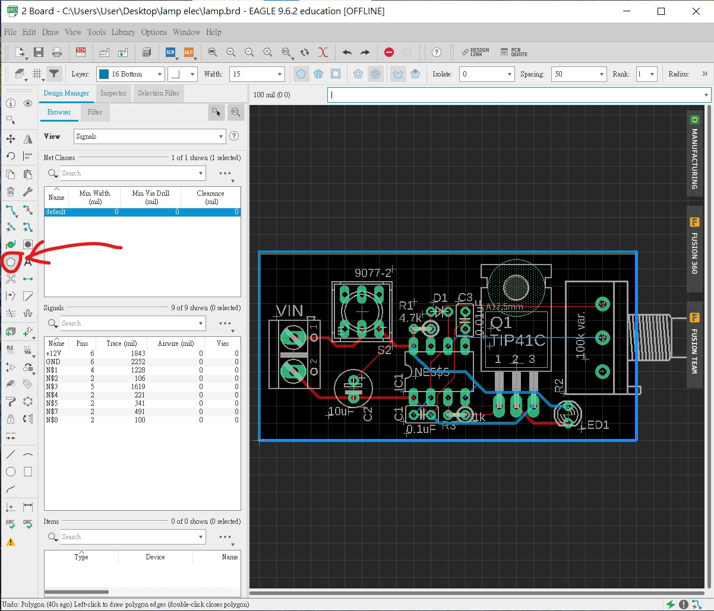

1. 先在左邊工具列按下polygon的按鍵，或者在命令列打`polygon`。
2. 在上方工具列選擇bottom，width的寬度，除非你的板十分細小而且你又有很多個polygon在上面在機會交疊，否則可以隨意。
3. 緣著板邊畫出一個方形。
4. 接合好polygon後會彈出一個視窗，問你polygon接去那個signal
5. 如果希望整個底的銅箔都是負極的話，就打`GND`，否則留空就可以。


之後只會見到剛剛的polygon變成虛線，沒有甚麼變化。


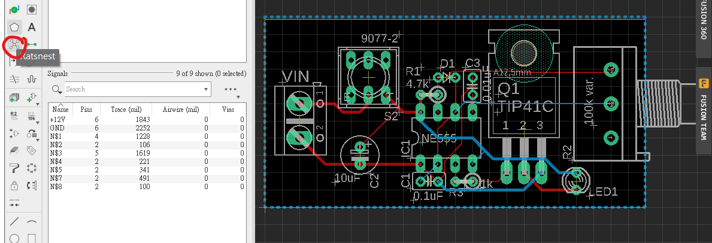

但只要你按下工具列的Ratsnest按鍵，或在命令列打`ratsnest`，就會有變化。


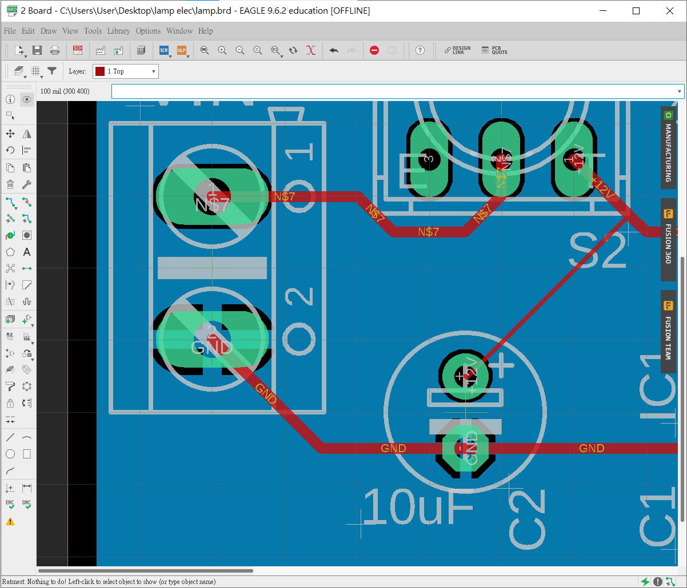

放大之後可以細心留意:

1. 引線和焊盤與藍色的覆銅留有一少段距離，那樣酸蝕時只需要蝕走這少量銅就夠。
2. 留意一下所有GND的焊盤和信號線，都已經融入了底部的覆銅中。


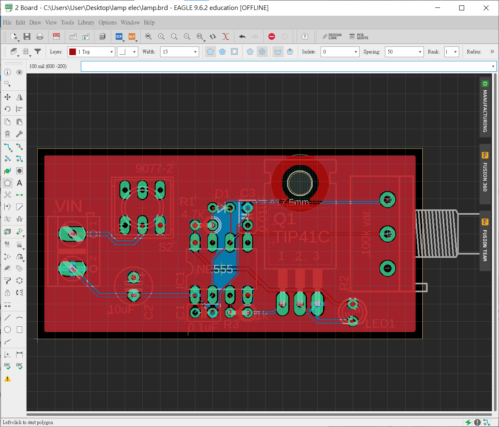

重覆上面的步驟，今次在頂層鋪上polygon，signal連接去`+12V`。之後再按多一次`ratsnest`鍵，頂層就會覆上連接著`+12V`的覆銅。


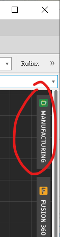

完成後按一下右邊的MANUFACTURING按鍵，就會彈出一個視窗預覽PCB的效果。


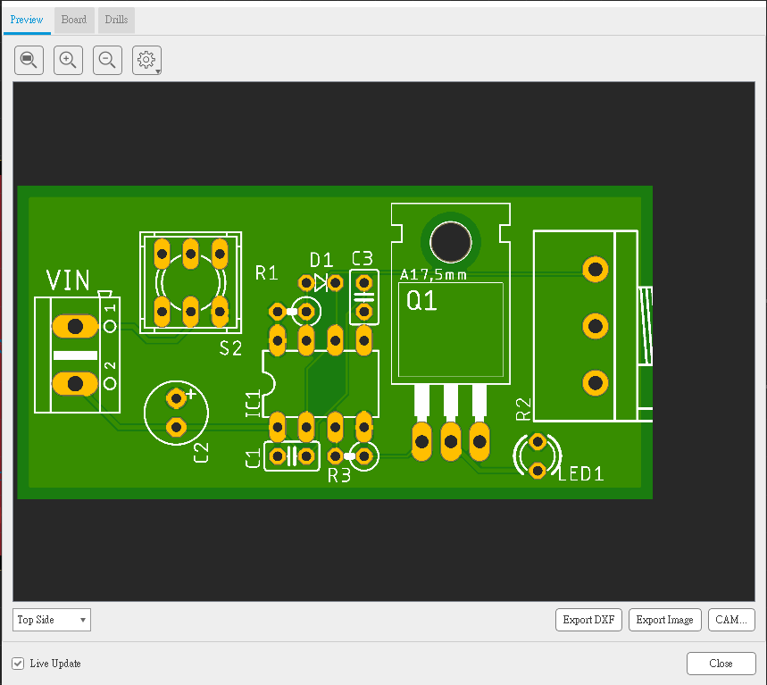

==但這邊要注意，預覽是沒有tValue和bValue層的，即是沒有零件的值，但你的PCB板一般是需要的，所以要用`move`指令將所有名稱和數值label排好，否則生產出來時所有label會重疊在一起看不到。==

## Design Rules Check(DRC)

跟ERC一樣，設計好的板記得記得要經過一次DRC，去檢查設計是否有出錯。


如果板是剛剛自動佈線完成，一般來說都應該是沒有錯誤的，在左下角會有一行細小的字跟你說沒有錯誤，否則就會出現error的視窗。

==大功告成。==


## 練習1

**555+4017 LED Roulette Circuit**[^1]

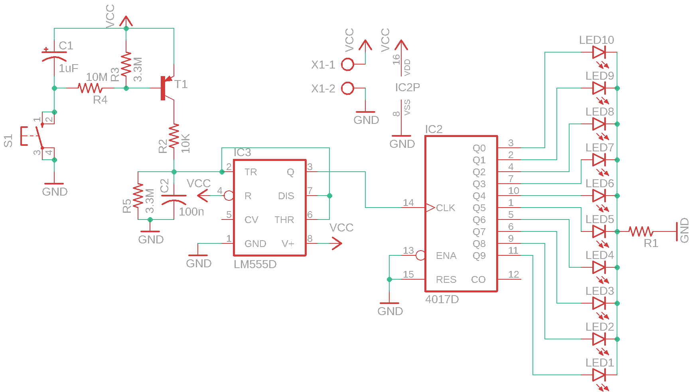

以上練習題為一個555+4017的幸運輪盤，4017的16和8腳預設會隱藏起來，要對著4017按mouse右鍵-->`invoke`，將8和16腳顯示出來。`R1`的值則可以根據`vcc`的電壓值由`330`至`1.5k`不等而其他的零件可以參考下表:

| Part | Value    | Device              | Package      | Library      |
| ---- | -------- | ------------------- | ------------ | ------------ |
| C1   | 1uF      | CPOL-USE2-5         | E2-5         | rcl          |
| C2   | 100n     | C-US025-024X044     | C025-024X044 | rcl          |
| IC3  | LM555D   | LM555D              | SO08         | linear       |
| IC2  | 4017D    | 4017D               | SO16         | 40xx         |
| LEDs |          | LED3MM              | LED3MM       | led          |
| R1   | ==適當== | R-US_0207/10        | 0207/10      | rcl          |
| R2   | 10K      | R-US_0207/10        | 0207/10      | rcl          |
| R3   | 3.3M     | R-US_0207/10        | 0207/10      | rcl          |
| R4   | 10M      | R-US_0207/10        | 0207/10      | rcl          |
| R5   | 3.3M     | R-US_0207/10        | 0207/10      | rcl          |
| S1   |          | 10-XX               | B3F-10XX     | switch-omron |
| T1   |          | BC557A-PNP-TO92-EBC | TO92-EBC     | transistor   |
| X1   |          | AK500/2             | AK500/2      | con-ptr500   |

有以點需要特別注意:

1. 在`Design Rule` 的設定裡，記得將`Annular Ring`裡的Pads 選項轉大少許，否則在焊接時很容易虛焊

   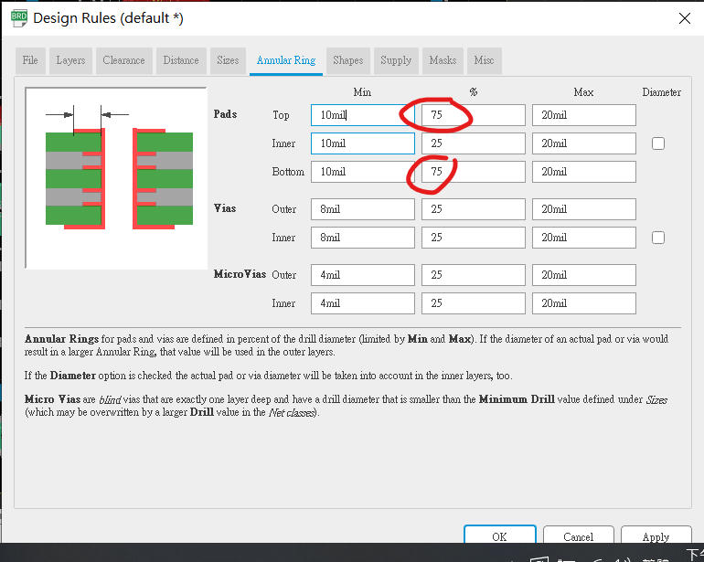
   
   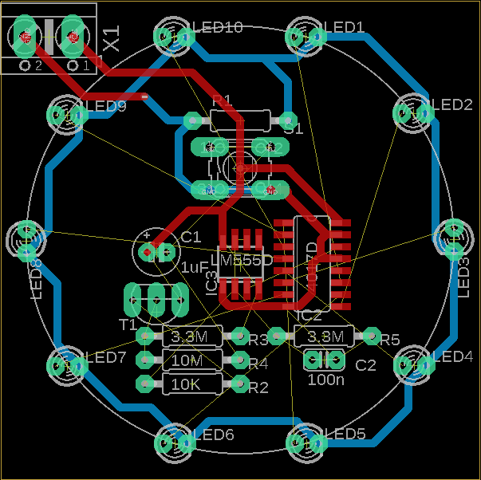

## 練習2

**555+4017 LED Dice Circuit**

將練習1的線路另存新檔做練習2，因為線路圖幾乎是一樣的。

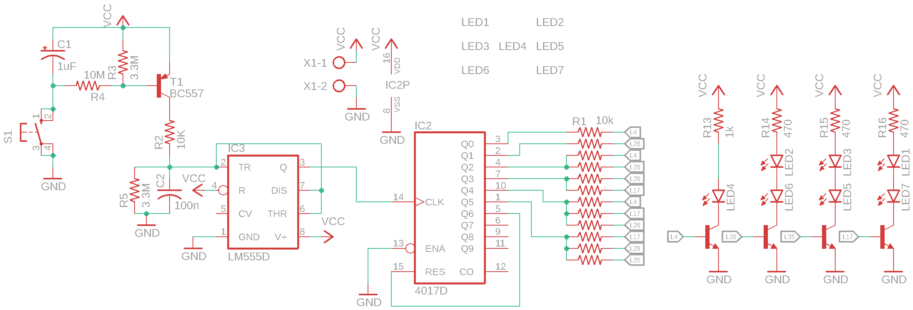

可以見到，左手邊的555線路是一樣的，改變的是右邊的4017，由10粒led燈變成7粒，模擬一粒骰子

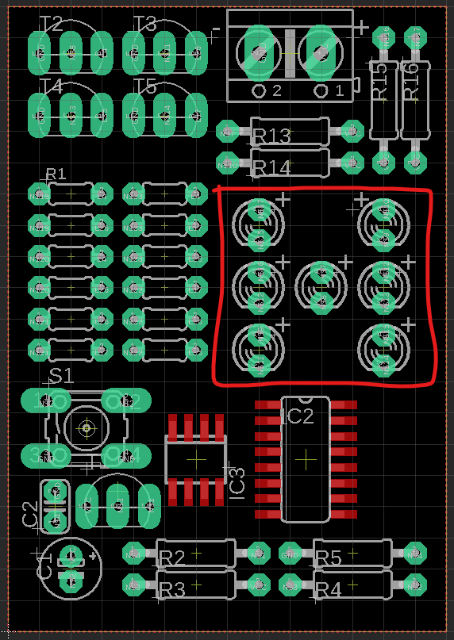

其他的零件整齊放好就可以不一定要跟我的排放，但圈著的7粒led就一定要跟著順序來排，否則就看不到骰子的效果:

```
LED1      LED2
LED3 LED4 LED5
LED6      LED7
```


[^1]: 有些IC的power線預設是接在特定的例如vcc, vdd等引腳，所以會隱藏起來, 要將其展示出來，步驟如下:
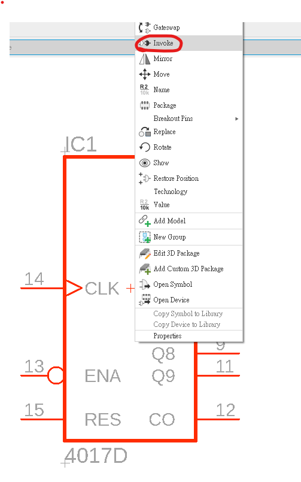 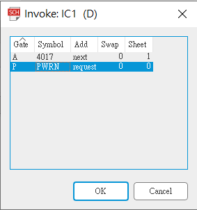 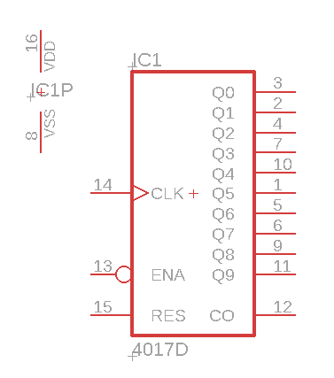  
