# 4.5 Adding library and Real world

這一章節主要是介紹怎樣找到eagle內置沒有的library和怎樣簡單去修改library。

[TOC]

##那裡可以找到零件?

首先，如果遇到一些eagle內置沒有的元件，可以在google搜尋一下，一般常見的都應該會有eagle library的。如果再找到到，可以試試到下面的網站: https://componentsearchengine.com/

這個網站集合了很多不同的元件，而且不單止有eagle檔案，如果你用其他的pcb軟件，也是支援的。但缺點是下載後的圖檔感自上都十分陽春。

舉個例子同樣是NE555，上圖是componentsearchengine.com的搜尋結果，而下圖是eagle內置的NE555，可見eagle內置的符號是有根據閱讀需要排序的，但上圖搜尋結果的符號就只是按零件的腳位排序。如果真的找不到排版更好的library，則可以先下載來使用，再打開eagle的library修改。

另外兩個比較常見和常用的資源有SparkFun和diy-modules:

1. SparkFun是一間出名的電子電路司，從元件到模組都有售，教學資料也十分充足，只要搜尋`SparkFun ealge library`就會找到他們的github page下載。

2. diy-modules則售會了十分多淘寶有售的模組的eagle library，十分實用，只可惜官網已經下了架，但仍可在其他的github 副本中下載。

以下為方便大家，已把library都打包了，下載以下幾個檔就可:

* [SparkFun-Boards.lbr](SparkFun-Boards.lbr) 
* [SparkFun-PowerIC.lbr](SparkFun-PowerIC.lbr) 
* [diy-modules.lbr](diy-modules.lbr) 

## 匯入元件庫

將下載後的元件庫檔案(*.lbr)，拖到Eagle的Control Panel頁面的`Library-->libraries`中。

預設拖入去之後，library是未啟用的，要啟用library，就要按一按右手邊的小綠燈，綠燈亮了才是啟用。

## 線路圖

以下的線路，是一塊arduino uno的shield(擴充板)，整合了一粒L298馬達驅動，整合了兩個H橋，能驅動兩個小型馬達的則都能正反轉，非常適合做一部小車。另外也整合了常見的nRF24L01模組，方便做雙向無線通訊遙控小車。灰色的線和文字，我則用了`97 Info`層，方便將電路圖分開不同的部分方便閱讀。

<a href="arduinoMotorShieldSch.png" target="_blank">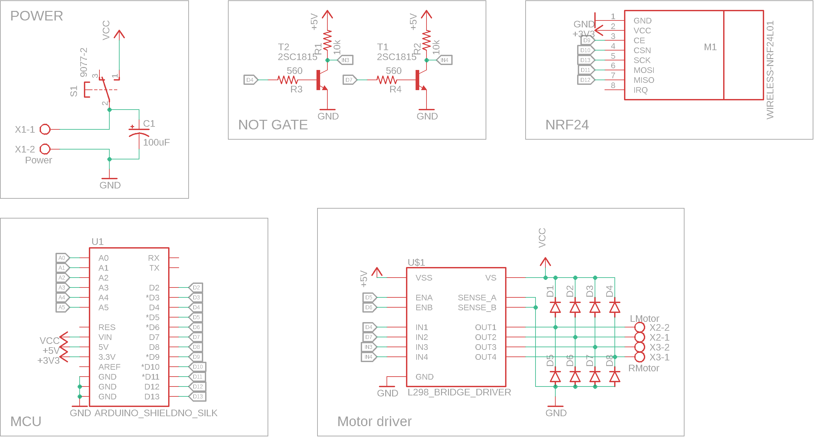</a>

零件列表可看下方，其中nRF24L01需要用到[diy-modules](diy-modules.lbr) 元件庫，L298則需要用到[SparkFun-PowerIC](SparkFun-PowerIC.lbr) 元件庫，Arduino Uno 則用到[SparkFun-Boards](SparkFun-Boards.lbr) 。完成之後記得先做ERC。

| Part | Value                 | Device                | Package           | Library          |
| ---- | --------------------- | --------------------- | ----------------- | ---------------- |
| C1   | 100uF                 | CPOL-USE2.5-7         | E2,5-7            | rcl              |
| D1   |                       | DIODE-DO214AC         | DO214AC           | diode            |
| D2   |                       | DIODE-DO214AC         | DO214AC           | diode            |
| D3   |                       | DIODE-DO214AC         | DO214AC           | diode            |
| D4   |                       | DIODE-DO214AC         | DO214AC           | diode            |
| D5   |                       | DIODE-DO214AC         | DO214AC           | diode            |
| D6   |                       | DIODE-DO214AC         | DO214AC           | diode            |
| D7   |                       | DIODE-DO214AC         | DO214AC           | diode            |
| D8   |                       | DIODE-DO214AC         | DO214AC           | diode            |
| M1   | WIRELESS-NRF24L01     | WIRELESS-NRF24L01     | WIRELESS-NRF24L01 | diy-modules      |
| R1   | 10k                   | R-US_0207/10          | 0207/10           | rcl              |
| R2   | 10k                   | R-US_0207/10          | 0207/10           | rcl              |
| R3   | 560                   | R-US_0207/10          | 0207/10           | rcl              |
| R4   | 560                   | R-US_0207/10          | 0207/10           | rcl              |
| S1   | 9077-2                | 9077-2                | 9077-2            | switch-misc      |
| T1   | 2SC1815               | 2SC1815               | TO92-ECB          | transistor       |
| T2   | 2SC1815               | 2SC1815               | TO92-ECB          | transistor       |
| U$1  | L298_BRIDGE_DRIVER    | L298_BRIDGE_DRIVER    | POWERSO20         | SparkFun-PowerIC |
| U1   | ARDUINO_SHIELDNO_SILK | ARDUINO_SHIELDNO_SILK | DUEMILANOVE_VIAS  | SparkFun-Boards  |
| X1   | Power                 | AK500/2               | AK500/2           | con-ptr500       |
| X2   | LMotor                | AK500/2               | AK500/2           | con-ptr500       |
| X3   | RMotor                | AK500/2               | AK500/2           | con-ptr500       |

## 佈線圖

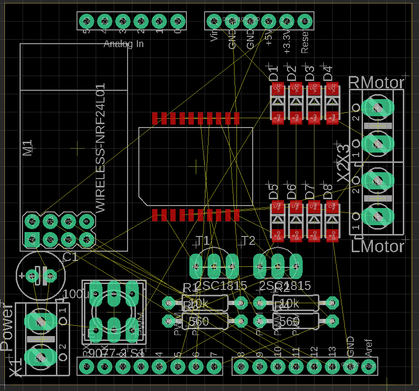

1. 先跟據上圖將佈線圖佈置好(大約就可以, 不過要注意L298和兩個motor connector的方向和位置，一會兒佈線時十分重要)

2. 先將`design rule`中的`Annular Ring`,` Pads `轉左75%，方便使用者焊接(如果忘記此步驟，不用補做, 不做也可以)

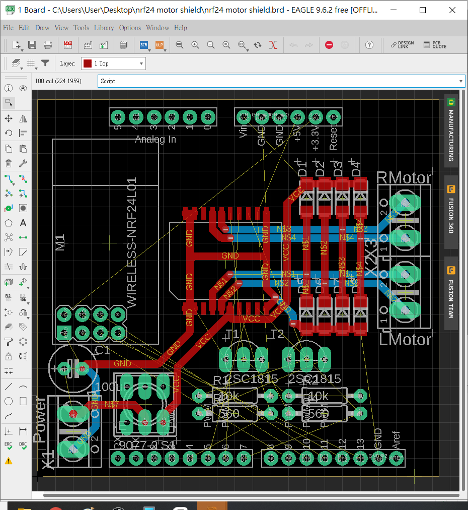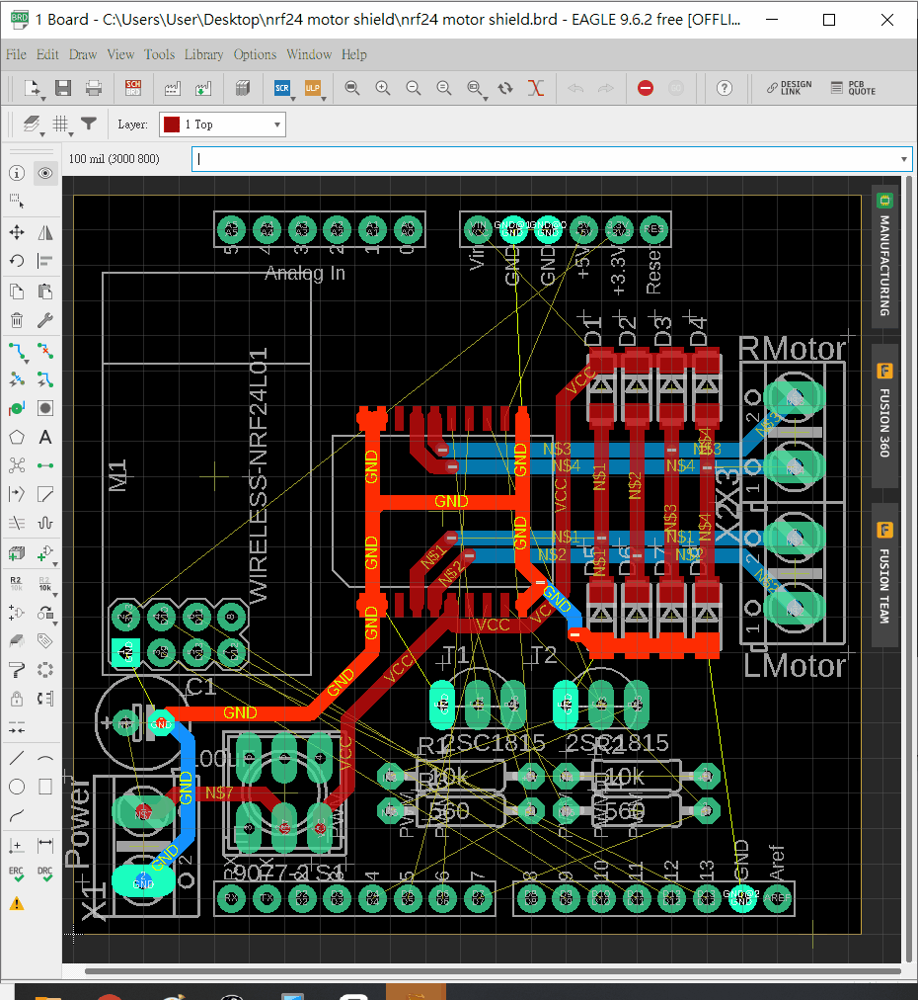

接著就要手動佈線，線寬為`40mil`，用最短的距離將電源的兩極、L298和兩個馬達輸出連接，注意攞位是否正確，四個馬達輸出腳位到頂層的二極管記得用vias連接。

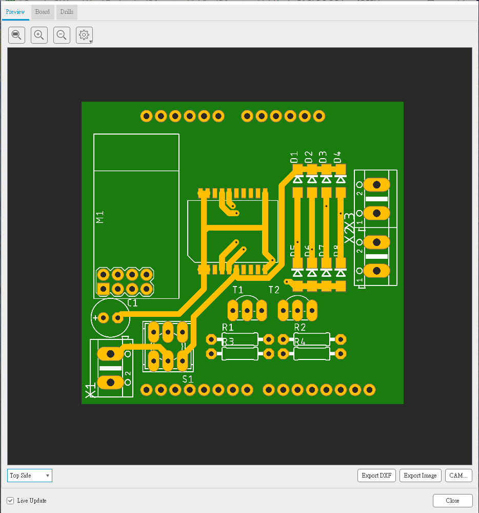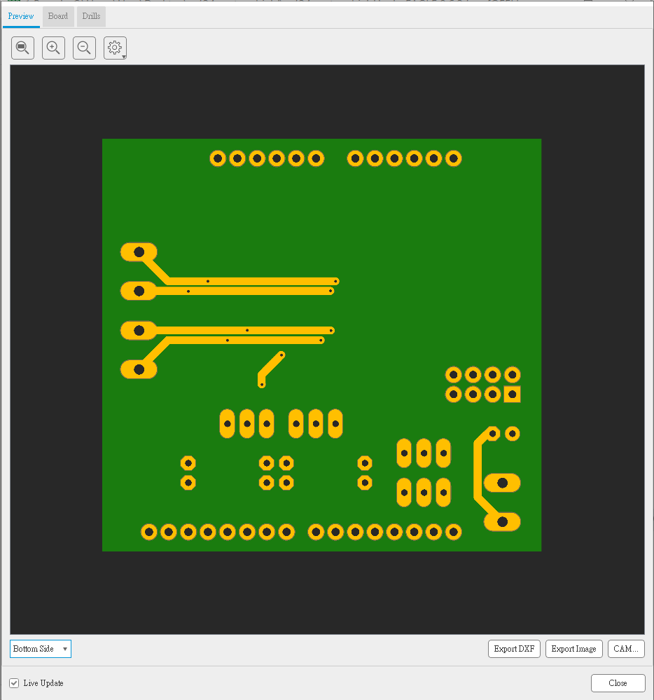

完成後，現在要佈`29: tStop` 和`30: bStop`圖層，這兩個圖層決定pcb外露金屬的地方，由於馬達電流比較大，需要預留足夠的線寬，但太寬的話會非常難佈線，如果轉用2oz覆銅板又會十分貴，所以將trace外露再額外上錫即可。

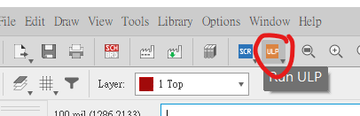

在上方找尋ULP icon，或者直接在命令列打`run`。ULP是User Language Programs的簡稱，功能強大，例如將已劃好的dxf檔匯入到佈線圖中作為deminsion、將pcb轉成gcode到cnc機中生產等等功能，而今次用到的，是將現在的trace全部複製到`tStop`和`bStop`圖層的功能。

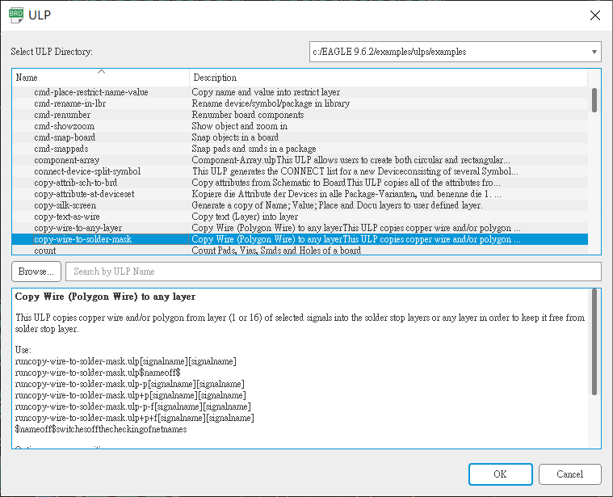

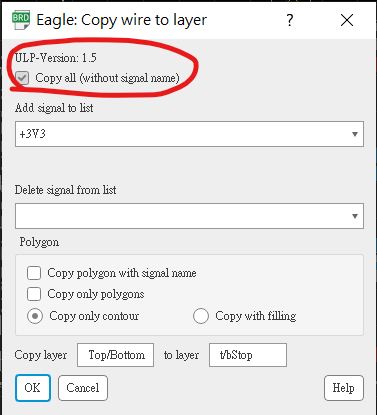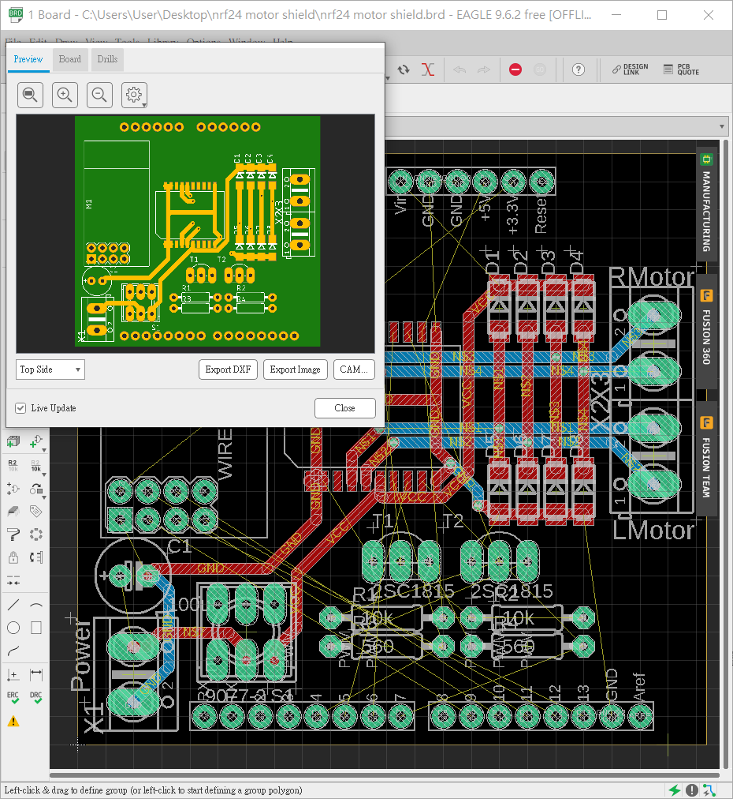

打開ULP後，找到其中一個`copy-wire-to-solder-mask`的ulp，接`OK`，它可以指定哪一個signal需要copy，或者哪一個signal排除在copy list之外。但今次我們選取`Copy all`。按下`OK`，就會見到`29: tStop`和`30:bStop`被顯示出來，而且所有的佈線都已經複製到圖層，這時可以開啟pcb實物的預覽看看效果是否正確。

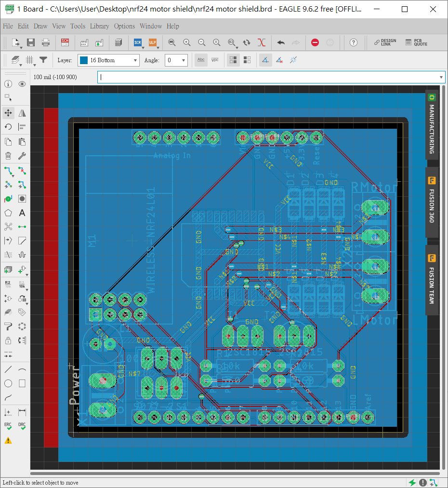

完成後，

1. 就可以使用自動佈線完成餘下部分的佈線。

2. 加入top和bottom的polygon(今次的polygon我沒有連接任何signal，但你也可以連接Vcc或GND)

3. 完成後就可以最後再做多一次DRC，沒有error的話就完成了~~~~!!!!!!!

   ==p.s. 如果真的要將pcb板生產成實物，要留意一下，L298貼片式包裝的底部一般都會有外露的散熱焊盤，而這焊盤又一般會連接到`GND`，所以通過L298底部的走線都不能外露出來，這時只要到`29: tStop`層刪除這幾個trace的外露層即可。==
