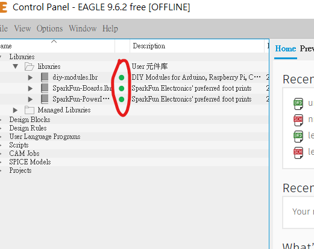
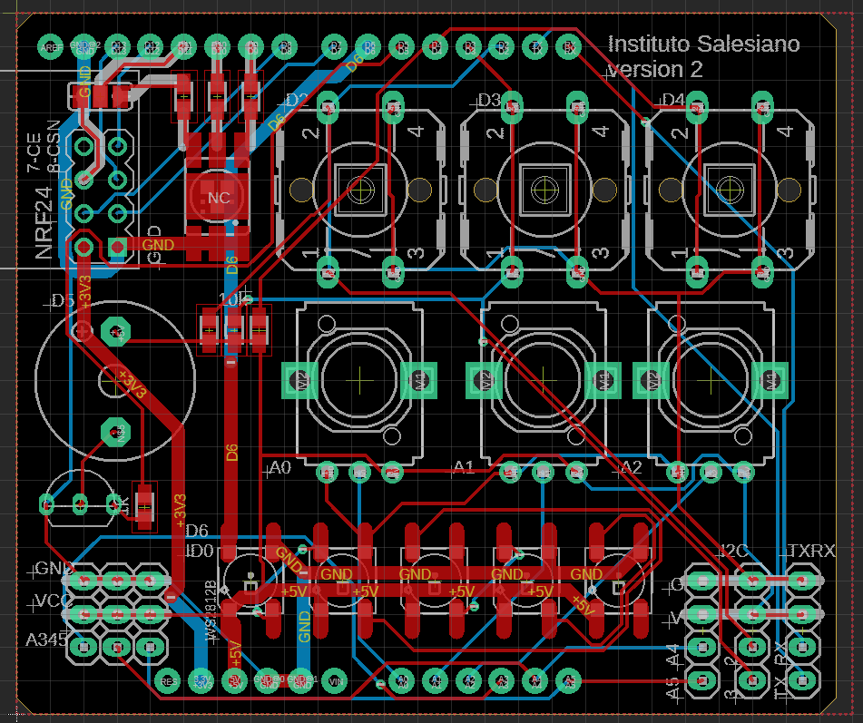

# 4.5 Adding library and Real world

這一章節主要是介紹怎樣找到eagle內置沒有的library和怎樣簡單去修改library。

[TOC]

##那裡可以找到零件?

首先，如果遇到一些eagle內置沒有的元件，可以在google搜尋一下，一般常見的都應該會有eagle library的。如果再找到到，可以試試到下面的網站: https://componentsearchengine.com/

這個網站集合了很多不同的元件，而且不單止有eagle檔案，如果你用其他的pcb軟件，也是支援的。但缺點是下載後的圖檔感自上都十分陽春。

舉個例子同樣是NE555，上圖是componentsearchengine.com的搜尋結果，而下圖是eagle內置的NE555，可見eagle內置的符號是有根據閱讀需要排序的，但上圖搜尋結果的符號就只是按零件的腳位排序。如果真的找不到排版更好的library，則可以先下載來使用，再打開eagle的library修改。

另外兩個比較常見和常用的資源有SparkFun和diy-modules:

1. SparkFun是一間出名的電子電路司，從元件到模組都有售，教學資料也十分充足，只要搜尋`SparkFun ealge library`就會找到他們的github page下載。

2. diy-modules則售會了十分多淘寶有售的模組的eagle library，十分實用，只可惜官網已經下了架，但仍可在其他的github 副本中下載。

以下為方便大家，已把library都打包了，下載以下幾個檔就可:

* [SparkFun-Boards.lbr](SparkFun-Boards.lbr) 
* [SparkFun-PowerIC.lbr](SparkFun-PowerIC.lbr) 
* [diy-modules.lbr](diy-modules.lbr) 
* [WS2812.lbr](WS2812.lbr)

## 匯入元件庫

將下載後的元件庫檔案(*.lbr)，拖到Eagle的Control Panel頁面的`Library-->libraries`中。

預設拖入去之後，library是未啟用的，要啟用library，就要按一按右手邊的小綠燈，綠燈亮了才是啟用。

## 線路圖

以下的線路，是一塊arduino uno的shield(擴充板)，這塊擴充板你們在中四時有用過，整合了常見的按鍵，RGB LED和可調電阻方便教arduino編程，另外今次的2.0版本，也整合了常見的nRF24L01模組，方便做雙向無線通訊遙控。灰色的線和文字，我則用了`97 Info`層，方便將電路圖分開不同的部分方便閱讀。

零件列表可看下方，其中nRF24L01需要用到[diy-modules](diy-modules.lbr) 元件庫，，Arduino Uno 則用到[SparkFun-Boards](SparkFun-Boards.lbr) 。W2812B 則會用到[WS2812.lbr](WS2812.lbr)來完成。其他的都是用eagle內置的library來完成。完成之後記得先做ERC。

| Part | Value                 | Device                | Package           |
| ---- | --------------------- | --------------------- | ----------------- |
| JP1  |                       | PINHD-1X3             | 1X03              |
| JP2  |                       | PINHD-1X3             | 1X03              |
| JP3  |                       | PINHD-1X4             | 1X04              |
| JP4  |                       | PINHD-1X4             | 1X04              |
| JP5  |                       | PINHD-1X4             | 1X04              |
| JP13 |                       | PINHD-1X3             | 1X03              |
| LED1 | F50360                | F50360                | F50360            |
| LED2 | WS2812B               | WS2812B               | WS2812B           |
| LED3 | WS2812B               | WS2812B               | WS2812B           |
| LED4 | WS2812B               | WS2812B               | WS2812B           |
| LED5 | WS2812B               | WS2812B               | WS2812B           |
| LED6 | WS2812B               | WS2812B               | WS2812B           |
| M1   | NRF24                 | WIRELESS-NRF24L01     | WIRELESS-NRF24L01 |
| R1   | US-EVUF3M             | US-EVUF3M             | EVUFXM            |
| R2   | 470                   | R-US_R0805W           | R0805W            |
| R3   | 270                   | R-US_R0805W           | R0805W            |
| R4   | 270                   | R-US_R0805W           | R0805W            |
| R5   | 10k                   | R-US_R0805W           | R0805W            |
| R6   | 10k                   | R-US_R0805W           | R0805W            |
| R7   | 10k                   | R-US_R0805W           | R0805W            |
| R11  | US-EVUF3M             | US-EVUF3M             | EVUFXM            |
| R12  | US-EVUF3M             | US-EVUF3M             | EVUFXM            |
| R14  | 1k                    | R-US_R0805W           | R0805W            |
| S1   |                       | 40-XX                 | B3F-40XX          |
| S2   |                       | 40-XX                 | B3F-40XX          |
| S3   |                       | 40-XX                 | B3F-40XX          |
| SG1  | F/TMB                 | F/TMB                 | F/TMB             |
| SJ1  |                       | SJ2W                  | SJ_2              |
| T1   | 2SC1815               | 2SC1815               | TO92-ECB          |
| U1   | ARDUINO_SHIELDNO_SILK | ARDUINO_SHIELDNO_SILK | DUEMILANOVE_VIAS  |

## 佈線圖

