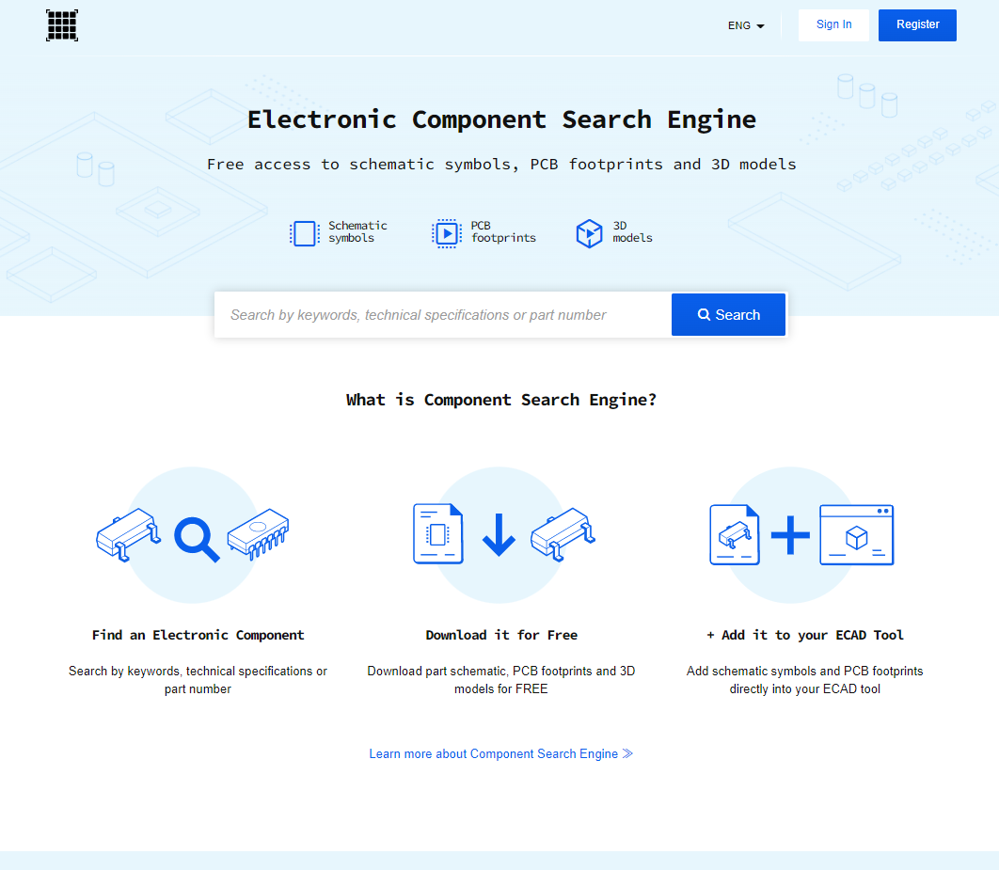
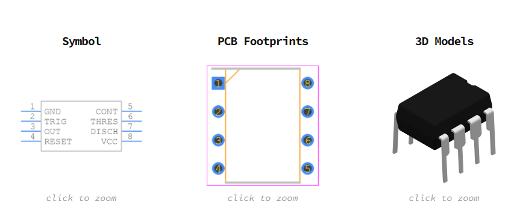
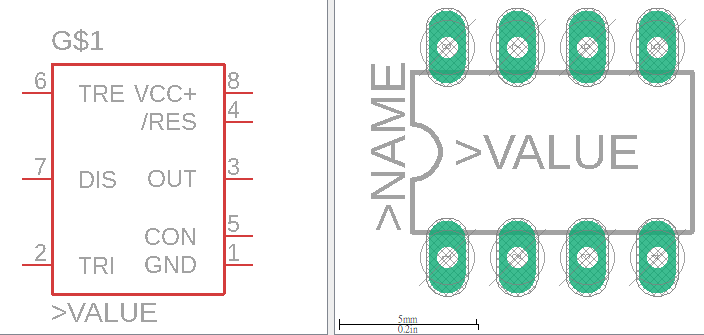
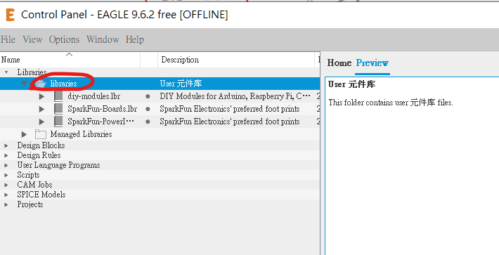

# 4.5 Adding library and Real world

這一章節主要是介紹怎樣找到eagle內置沒有的library和怎樣簡單去修改library。

[TOC]

##那裡可以找到零件?

首先，如果遇到一些eagle內置沒有的元件，可以在google搜尋一下，一般常見的都應該會有eagle library的。如果再找到到，可以試試到下面的網站: https://componentsearchengine.com/

這個網站集合了很多不同的元件，而且不單止有eagle檔案，如果你用其他的pcb軟件，也是支援的。但缺點是下載後的圖檔感自上都十分陽春。

舉個例子同樣是NE555，上圖是componentsearchengine.com的搜尋結果，而下圖是eagle內置的NE555，可見eagle內置的符號是有根據閱讀需要排序的，但上圖搜尋結果的符號就只是按零件的腳位排序。如果真的找不到排版更好的library，那下面會教怎麼打開eagle的library修改。

另外兩個比較常見和常用的資源有SparkFun和diy-modules。SparkFun是一間出名的電子電路司，從元件到模組都有售，教學資料也十分充足，只要搜尋`SparkFun ealge library`就會找到他們的github page下載。而diy-modules則售會了十分多淘寶有售的模組的eagle library，十分實用，只可惜官網已經下了架，但仍可在其他的github 副本中下載，以下為方便大家，已把library都打包了，下載以下幾個檔就可。

* [SparkFun-Boards.lbr](SparkFun-Boards.lbr) 
* [SparkFun-PowerIC.lbr](SparkFun-PowerIC.lbr) 
* [diy-modules.lbr](diy-modules.lbr) 

## 匯入元件庫

將下載後的元件庫檔案(*.lbr)，拖到Eagle的Control Panel頁面的`Library-->libraries`中

| Part | Value                 | Device                | Package           | Library          |
| ---- | --------------------- | --------------------- | ----------------- | ---------------- |
| C1   | 100uF                 | CPOL-USE2.5-7         | E2,5-7            | rcl              |
| D1   |                       | DIODE-DO214AC         | DO214AC           | diode            |
| D2   |                       | DIODE-DO214AC         | DO214AC           | diode            |
| D3   |                       | DIODE-DO214AC         | DO214AC           | diode            |
| D4   |                       | DIODE-DO214AC         | DO214AC           | diode            |
| D5   |                       | DIODE-DO214AC         | DO214AC           | diode            |
| D6   |                       | DIODE-DO214AC         | DO214AC           | diode            |
| D7   |                       | DIODE-DO214AC         | DO214AC           | diode            |
| D8   |                       | DIODE-DO214AC         | DO214AC           | diode            |
| M1   | WIRELESS-NRF24L01     | WIRELESS-NRF24L01     | WIRELESS-NRF24L01 | diy-modules      |
| R1   | 10k                   | R-US_0207/10          | 0207/10           | rcl              |
| R2   | 10k                   | R-US_0207/10          | 0207/10           | rcl              |
| R3   | 560                   | R-US_0207/10          | 0207/10           | rcl              |
| R4   | 560                   | R-US_0207/10          | 0207/10           | rcl              |
| S1   | 9077-2                | 9077-2                | 9077-2            | switch-misc      |
| T1   | 2SC1815               | 2SC1815               | TO92-ECB          | transistor       |
| T2   | 2SC1815               | 2SC1815               | TO92-ECB          | transistor       |
| U$1  | L298_BRIDGE_DRIVER    | L298_BRIDGE_DRIVER    | POWERSO20         | SparkFun-PowerIC |
| U1   | ARDUINO_SHIELDNO_SILK | ARDUINO_SHIELDNO_SILK | DUEMILANOVE_VIAS  | SparkFun-Boards  |
| X1   | Power                 | AK500/2               | AK500/2           | con-ptr500       |
| X2   | LMotor                | AK500/2               | AK500/2           | con-ptr500       |
| X3   | RMotor                | AK500/2               | AK500/2           | con-ptr500       |